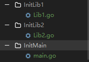

#### 函数返回多个值


Go 函数可以返回多个值，例如：

```go
package main


import "fmt"


func swap(x, y string) (string, string) {
   return y, x
}


func main() {
   a, b := swap("Mahesh", "Kumar")
   fmt.Println(a, b)
}
```

以上实例执行结果为：


Kumar Mahesh


#### init函数与import


首先我们看一个例子：init函数：


init 函数可在package main中，可在其他package中，可在同一个package中出现多次。


**main函数**


main 函数只能在package main中。


**执行顺序**


golang里面有两个保留的函数：init函数（能够应用于所有的package）和main函数（只能应用于package main）。这两个函数在定义时不能有任何的参数和返回值。


虽然一个package里面可以写任意多个init函数，但这无论是对于可读性还是以后的可维护性来说，我们都强烈建议用户在一个package中每个文件只写一个init函数。


go程序会自动调用init()和main()，所以你不需要在任何地方调用这两个函数。每个package中的init函数都是可选的，但package main就必须包含一个main函数。


程序的初始化和执行都起始于main包。


如果main包还导入了其它的包，那么就会在编译时将它们依次导入。有时一个包会被多个包同时导入，那么它只会被导入一次（例如很多包可能都会用到fmt包，但它只会被导入一次，因为没有必要导入多次）。


当一个包被导入时，如果该包还导入了其它的包，那么会先将其它包导入进来，然后再对这些包中的包级常量和变量进行初始化，接着执行init函数（如果有的话），依次类推。


等所有被导入的包都加载完毕了，就会开始对main包中的包级常量和变量进行初始化，然后执行main包中的init函数（如果存在的话），最后执行main函数。下图详细地解释了整个执行过程：


首先我们看一个例子：


代码结构：





Lib1.go

```go
package InitLib1

import "fmt"

func init() {
    fmt.Println("lib1")
}
```

Lib2.go

```go
package InitLib2

import "fmt"

func init() {
    fmt.Println("lib2")
}
```

main.go

```go
package main

import (
    "fmt"
    _ "GolangTraining/InitLib1"
    _ "GolangTraining/InitLib2"
)

func init() {
    fmt.Println("libmain init")
}

func main() {
    fmt.Println("libmian main")
}
```

代码很简单，只是一些简单的输出

```go
lib1
lib2
libmain init
libmian main
```

输出的顺序与我们上面图给出的顺序是一致的


**那我们现在就改动一个地方，Lib1包导入Lib2，main包不管**

```go
package InitLib1

import (
    "fmt"
    _ "GolangTraining/InitLib2"
)

func init() {
    fmt.Println("lib1")
}
```

输出：

```go
lib2
lib1
libmain init
libmian main
```

main包以及Lib1包都导入了Lib2，但是只出现一次，并且最先输出，


**说明如果一个包会被多个包同时导入，那么它只会被导入一次，而先输出lib2是因为main包中导入Lib1时，Lib1又导入了Lib2，会首先初始化Lib2包的东西**

------

#### 函数参数


函数如果使用参数，该变量可称为函数的形参。


形参就像定义在函数体内的局部变量。


调用函数，可以通过两种方式来传递参数：


##### 值传递


值传递是指在调用函数时将实际参数复制一份传递到函数中，这样在函数中如果对参数进行修改，将不会影响到实际参数。


默认情况下，Go 语言使用的是值传递，即在调用过程中不会影响到实际参数。


以下定义了 swap() 函数：

```go
/* 定义相互交换值的函数 */
func swap(x, y int) int {
   var temp int


   temp = x /* 保存 x 的值 */
   x = y    /* 将 y 值赋给 x */
   y = temp /* 将 temp 值赋给 y*/


   return temp;
}
```

接下来，让我们使用值传递来调用 swap() 函数：

```go
package main


import "fmt"


func main() {
   /* 定义局部变量 */
   var a int = 100
   var b int = 200


   fmt.Printf("交换前 a 的值为 : %d\n", a )
   fmt.Printf("交换前 b 的值为 : %d\n", b )


   /* 通过调用函数来交换值 */
   swap(a, b)


   fmt.Printf("交换后 a 的值 : %d\n", a )
   fmt.Printf("交换后 b 的值 : %d\n", b )
}


/* 定义相互交换值的函数 */
func swap(x, y int) int {
   var temp int


   temp = x /* 保存 x 的值 */
   x = y    /* 将 y 值赋给 x */
   y = temp /* 将 temp 值赋给 y*/


   return temp;
}
```

以下代码执行结果为：

交换前 a 的值为 : 100

交换前 b 的值为 : 200

交换后 a 的值 : 100

交换后 b 的值 : 200
**引用传递(指针传递)**

**指针**

Go 语言中指针是很容易学习的，Go 语言中使用指针可以更简单的执行一些任务。

接下来让我们来一步步学习 Go 语言指针。

我们都知道，变量是一种使用方便的占位符，用于引用计算机内存地址。

Go 语言的取地址符是 &，放到一个变量前使用就会返回相应变量的内存地址。

以下实例演示了变量在内存中地址：


```go
package main


import "fmt"


func main() {
   var a int = 10   


   fmt.Printf("变量的地址: %x\n", &a  )
}
```

执行以上代码输出结果为：

```go
变量的地址: 20818a220
```

现在我们已经了解了什么是内存地址和如何去访问它。接下来我们将具体介绍指针。


引用传递是指在调用函数时将实际参数的地址传递到函数中，那么在函数中对参数所进行的修改，将影响到实际参数。


引用传递指针参数传递到函数内，以下是交换函数 swap() 使用了引用传递：

```go
/* 定义交换值函数*/
func swap(x *int, y *int) {
   var temp int
   temp = *x    /* 保持 x 地址上的值 */
   *x = *y      /* 将 y 值赋给 x */
   *y = temp    /* 将 temp 值赋给 y */
}
```

以下我们通过使用引用传递来调用 swap() 函数：

```go
package main


import "fmt"


func main() {
   /* 定义局部变量 */
   var a int = 100
   var b int= 200


   fmt.Printf("交换前，a 的值 : %d\n", a )
   fmt.Printf("交换前，b 的值 : %d\n", b )


   /* 调用 swap() 函数
   * &a 指向 a 指针，a 变量的地址
   * &b 指向 b 指针，b 变量的地址
   */
   swap(&a, &b)


   fmt.Printf("交换后，a 的值 : %d\n", a )
   fmt.Printf("交换后，b 的值 : %d\n", b )
}


func swap(x *int, y *int) {
   var temp int
   temp = *x    /* 保存 x 地址上的值 */
   *x = *y      /* 将 y 值赋给 x */
   *y = temp    /* 将 temp 值赋给 y */
}
```

以上代码执行结果为：


交换前，a 的值 : 100


交换前，b 的值 : 200


交换后，a 的值 : 200


交换后，b 的值 : 100