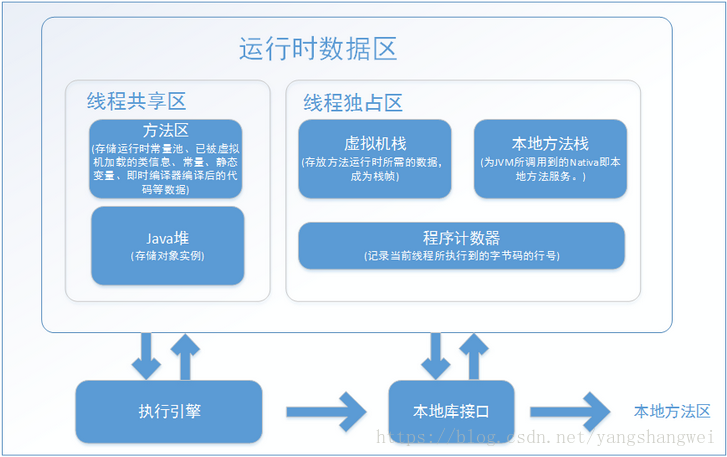

## 思维导图

## 概述

在内存管理领域 ，C/C++内存管理由开发人员管理，既拥有每一个对象的所有权，还必须负责维护每一个对象生命从开始到终结的责任 

对于Java开发人员来讲，在虚拟机自动内存管理机制的帮助下，Java由虚拟机管理内存,不容易出现内存泄露和内存溢出,一旦出现如果不了解JVM很难排查。

这里我们主要介绍虚拟机内存的各个区域，讲解这些区域的作用、服务对象以及可能产生的问题。

Java虚拟机（JVM）在Java程序运行的过程中，会将它所管理的内存划分为若干个不同的数据区域，这些区域**有的随着JVM的启动而创建**，**有的随着用户线程的启动和结束而建立和销毁**。

一个基本的JVM运行时内存模型如下

**上图是基于“JAVA SE7”的JVM虚拟机规范。**虚拟机规范并非一成不变，比如在JDK8的版本中，方法区被移除，取而代之的是元数据空间metaspace。

## 运行时数据区域

### 程序计数器 （Program Counter Register）

#### 概念

程序计数器 （Program Counter Register）是当前线程所执行的字节码的行号指示器。

**JAVA代码编译后的字节码在未经过JIT（实时****编译器****）编译前，其执行方式是通过“字节码****解释器****”进行解释执行**。简单的工作原理为解释器读取装载入内存的字节码，按照顺序读取字节码指令。读取一个指令后，将该指令“翻译”成固定的操作，并根据这些操作进行分支、循环、跳转等流程。

假设程序永远只有一个线程，并不需要程序计数器。但实际上程序是通过多个线程协同合作执行的.

Java虚拟机的多线程是通过线程轮流切换并分配处理器执行时间的方式实现的。

>  JVM的多线程是通过CPU时间片轮转（即线程轮流切换并分配处理器执行时间）算法来实现的。 也就是说，某个线程在执行过程中可能会因为时间片耗尽而被挂起，而另一个线程获取到时间片开始执行。 当被挂起的线程重新获取到时间片的时候，它要想从被挂起的地方继续执行，就必须知道它上次执行到哪个位置，在JVM中，通过程序计数器来记录某个线程的字节码执行位置。 因此，程序计数器是具备线程隔离的特性，也就是说，每个线程工作时都有属于自己的独立计数器。 

------

#### 特征

- **线程隔离性**，每个线程工作时都有属于自己的独立计数器。
- 执行java方法时，程序计数器是有值的，且记录的是正在执行的字节码指令的地址
- 执行native本地方法时，程序计数器的值为空（Undefined）。因为native方法是java通过JNI直接调用本地C/C++库，由于该方法是通过C/C++而不是java进行实现。所以无法产生相应的字节码，并且C/C++执行时的内存分配是由自己语言决定的，而不是由JVM决定的。
- 程序计数器占用内存很小，在进行JVM内存计算时，可以忽略不计
- 程序计数器是唯一一个在java虚拟机规范中没有规定任何OutOfMemoryError的区域。

------

#### 可能抛出的异常

程序计数器是唯一一个在java虚拟机规范中没有规定任何OutOfMemoryError的区域。

------

#### 知识扩展：JIT即时编译

许多主流的商用虚拟机（如HotSpot），都同时包含解释器和编译器。

Java程序最初是仅仅通过解释器解释执行的，即对字节码逐条解释执行，这种方式的执行速度相对会比较慢，

尤其当某个方法或代码块运行的特别频繁时，这种方式的执行效率就显得很低。

于是后来在虚拟机中引入了JIT编译器（即时编译器），当虚拟机发现某个方法或代码块运行特别频繁时，就会把这些代码认定为“Hot Spot Code”（热点代码），为了提高热点代码的执行效率，在运行时，虚拟机将会把这些代码编译成与本地平台相关的机器码，并进行各层次的优化，完成这项任务的正是JIT编译器。

- 当程序需要迅速启动和执行时，解释器可以首先发挥作用，省去编译的时间，立即执行；
- 当程序运行后，随着时间的推移，编译器逐渐会失去作用，把越来越多的代码编译成本地代码后，可以获取更高的执行效率。
- 解释执行可以节约内存，而编译执行可以提升效率。

### Java虚拟机栈 （Java Virtual Machine Stacks）

#### 概念

同程序计数器一样，虚拟机栈也是线程私有的，生命周期同线程相同。

虚拟机栈描述的是java方法执行的内存模型: 每个java方法在执行时，会创建一个“栈帧（stack frame）”，栈帧的结构分为“局部变量表、操作数栈、动态链接、方法出口”几个部分。

我们常说的“堆内存、栈内存”中的**“栈内存”指的便是虚拟机栈，确切地说，指的是虚拟机栈的栈帧中的局部变量表，因为这里存放了一个方法的所有局部变量。**

局部变量表所需的内存空间在编译期间完成分配。在方法运行的阶段是不会改变局部变量表的大小的。

方法调用时，创建栈帧，并压入虚拟机栈；方法执行完毕，栈帧出栈并被销毁

------

#### 特性

虚拟机栈是线程隔离的，即每个线程都有自己独立的虚拟机栈。

后进先出（LIFO）栈

存储栈帧，支撑java方法的调用执行和退出

可能出现OutOfMemoryError异常和StackOverflowError异常

------

#### 可能抛出的异常

##### 虚拟机栈的StackOverflowError

若单个线程请求的栈深度大于虚拟机允许的深度，则会抛出StackOverflowError（栈溢出错误）。

JVM会为每个线程的虚拟机栈分配一定的内存大小（-Xss参数），因此虚拟机栈能够容纳的栈帧数量是有限的，若栈帧不断进栈而不出栈，最终会导致当前线程虚拟机栈的内存空间耗尽，典型如一个无结束条件的递归函数调用

------

##### 虚拟机栈的OutOfMemoryError

不同于StackOverflowError，OutOfMemoryError指的是当整个虚拟机栈内存耗尽，并且无法再申请到新的内存时抛出的异常。

JVM未提供设置整个虚拟机栈占用内存的配置参数。虚拟机栈的最大内存大致上等于“JVM进程能占用的最大内存（依赖于具体操作系统） - 最大堆内存 - 最大方法区内存 - 程序计数器内存（可以忽略不计） - JVM进程本身消耗内存”。当虚拟机栈能够使用的最大内存被耗尽后，便会抛出OutOfMemoryError，可以通过不断开启新的线程来模拟这种异常

------

### 本地方法栈

#### 和虚拟机栈的区别

**本地方法栈（Native Method Stack）与虚拟机栈所发挥的作用非常相似，它们之间的区别是虚拟机栈为虚拟机执行Java方法服务，而本地方法栈则为虚拟机使用到的Native方法服务**。

在虚拟机规范中对本地方法栈中方法使用的语言，使用方法与数据结构没有强制规定，因此具体的虚拟机可以自由的实现它。甚至有的虚拟机（比如Sun HotSpot虚拟机）直接把本地方法栈和虚拟机合二为一。

本地方法：该方法的实现由非java语言实现，比如C语言实现

与虚拟机一样，本地方法栈区域也会抛出StackOverflowError和OutOfMemoryErrory异常。

------

#### 特性

线程私有

后进先出（LIFO）栈

存储栈帧，支撑本地方法的调用执行和退出

可能出现OutOfMemoryError异常和StackOverflowError异常

有一些虚拟机（如HotSpot）将java虚拟机栈和本地方法栈合并实现

------

### Java堆

Java堆是Java虚拟机所管理的内存中最大的一块数据区域，**在虚拟机启动时创建并被所有线程共享**。

**此内存区域唯一的目的就是存放对象实例**，几乎所有的对象实例都在这里分配内存，例如对象实例和数组。

但随着其他技术的成熟（如JIT），对象分配在堆上慢慢地变得又没那么“绝对”了。

Java堆同样是**垃圾收集器管理的主要区域**，由于现在的收集器基本都采用分代收集算法，所以Java堆中还可以细分为**新生代和老年代。**

当前主流的虚拟机都是按照可扩展来实现的（**通过-Xmx和-Xms控制**）。如果堆中没有内存完成实例分配，并且对也无法再扩展时，将会抛出OutOfMemoryError异常。

#### 堆的分层

 HotSpot JVM中的堆，一般分为：新生代、老年代

默认的，新生代 ( Young ) 与老年代 ( Old ) 的比例的值为 1:2 ( 该值可以通过参数 –XX:NewRatio 来指定 )，即：新生代 ( Young ) = 1/3 的堆空间大小。老年代 ( Old ) = 2/3 的堆空间大小。

#### 新生代

 新生代又分为 Eden区、SurvivorFrom、SurvivorTo三个区

默认的，Edem : from : to = 8 : 1 : 1 ( 可以通过参数 –XX:SurvivorRatio 来设定 )，即： Eden = 8/10 的新生代空间大小，from = to = 1/10 的新生代空间大小。

JVM 每次只会使用 Eden 和其中的一块 Survivor 区域来为对象服务，所以无论什么时候，总是有一块 Survivor 区域是空闲着的。

因此，新生代实际可用的内存空间为 9/10 ( 即90% )的新生代空间,只有10%的内存被“浪费”,最大限度的节约资源。 

1. Eden区：Java新对象的出生地（如果新创建的对象占用内存很大，则直接分配到老年代）。当Eden区内存不够的时候就会触发MinorGC，对新生代区进行一次垃圾回收。
2. SurvivorFrom：保留了一次MinorGC过程中的幸存者。
3. SurvivorTo：上一次GC的幸存者，作为这一次GC的被扫描者。

------

#### 老年代 （主要存放应用程序中生命周期长的内存对象。）

老年代的对象比较稳定，所以MajorGC不会频繁执行。在进行MajorGC前一般都先进行了一次MinorGC，使得有新生代的对象晋身入老年代，导致空间不够用时才触发。当无法找到足够大的连续空间分配给新创建的较大对象时也会提前触发一次MajorGC进行垃圾回收腾出空间。

MajorGC采用标记—清除算法：首先扫描一次所有老年代，标记出存活的对象，然后回收没有标记的对象。MajorGC的耗时比较长，因为要扫描再回收。MajorGC会产生内存碎片，为了减少内存损耗，我们一般需要进行合并或者标记出来方便下次直接分配。

当老年代也满了装不下的时候，就会抛出OOM（Out of Memory）异常。

------

#### GC 回收机制

Java 中的堆也是 GC 收集垃圾的主要区域。GC 分为两种：Minor GC、Full GC ( 或称为 Major GC )。

------

##### 新生代Minor GC

Minor GC 是发生在新生代中的垃圾收集动作，所采用的是**复制算法。**

新生代几乎是所有 Java 对象出生的地方，即 Java 对象申请的内存以及存放都是在这个地方。Java 中的大部分对象通常不需长久存活，具有朝生夕灭的性质。

当对象在 Eden ( 包括一个 Survivor 区域，这里假设是 from 区域 ) 出生后，在经过一次 Minor GC 后，如果对象还存活，并且能够被另外一块 Survivor 区域所容纳( 上面已经假设为 from 区域，这里应为 to 区域，即 to 区域有足够的内存空间来存储 Eden 和 from 区域中存活的对象 )，则使用复制算法将这些仍然还存活的对象复制到另外一块 Survivor 区域 ( 即 to 区域 ) 中，然后清理所使用过的 Eden 以及 Survivor 区域 ( 即 from 区域 )，并且将这些对象的年龄设置为1，以后对象在 Survivor 区每熬过一次 Minor GC，就将对象的年龄 + 1，当对象的年龄达到某个值时 ( **默认是 15 岁**，可以通过参数 -XX:MaxTenuringThreshold 来设定 )，这些对象就会成为老年代。

但这也不是一定的，对于一些较大的对象 ( 即需要分配一块较大的连续内存空间 ) 则是直接进入到老年代。

------

##### 老年代Full GC（或者叫Major GC）

Full GC 是发生在老年代的垃圾收集动作，所采用的是**标记-清除算法。**

堆内存中的老年代(Old)不同于这个，老年代里面的对象几乎个个都是在 Survivor 区域中熬过来的，它们是不会那么容易就 “死掉” 了的。因此，Full GC 发生的次数不会有 Minor GC 那么频繁，并且做一次 Full GC 要比进行一次 Minor GC 的时间更长。

另外，**标记-清除算法收集垃圾的时候会产生许多的内存碎片** ( 即不连续的内存空间 )，此后需要为较大的对象分配内存空间时，若无法找到足够的连续的内存空间，就会提前触发一次 GC 的收集动作。

#### JVM参数

官网 ：[http://www.oracle.com/technetwork/java/javase/tech/vmoptions-jsp-140102.html](https://cloud.tencent.com/developer/tools/blog-entry?target=http%3A%2F%2Fwww.oracle.com%2Ftechnetwork%2Fjava%2Fjavase%2Ftech%2Fvmoptions-jsp-140102.html&objectId=1861742&objectType=1&isNewArticle=undefined)

如下仅列举几个常用的

| 参数名                          | 含义及示例                                                   |
| :------------------------------ | :----------------------------------------------------------- |
| -Xms                            | 初始堆大小。如：-Xms256m                                     |
| -Xmx                            | 最大堆大小。如：-Xmx512m                                     |
| -Xmn                            | 新生代大小。通常为 Xmx 的 1/3 或 1/4。新生代 = Eden + 2 个 Survivor 空间。实际可用空间为 = Eden + 1 个 Survivor，即 90% |
| -Xss                            | JDK1.5+ 每个线程堆栈大小为 1M，一般来说如果栈不是很深的话， 1M 是绝对够用了的。 |
| -XX:NewRatio                    | 新生代与老年代的比例，如 –XX:NewRatio=2，则新生代占整个堆空间的1/3，老年代占2/3 |
| -XX:SurvivorRatio               | 新生代中 Eden 与 Survivor 的比值。默认值为 8。即 Eden 占新生代空间的 8/10，另外两个 Survivor 各占 1/10 |
| -XX:PermSize                    | 永久代(方法区)的初始大小                                     |
| -XX:MaxPermSize                 | 永久代(方法区)的最大值                                       |
| -XX:+PrintGCDetails             | 打印 GC 信息                                                 |
| -XX:+HeapDumpOnOutOfMemoryError | 让虚拟机在发生内存溢出时 Dump 出当前的内存堆转储快照，以便分析用 |

### 方法区（永久代）

方法区（Method Area）与Java堆一样，是各个线程共享的内存区域，它用于存储已被虚拟机加载的类信息、常量、静态变量、即时编译器编译后的代码等数据。

方法区也称Non-Heap（非堆），目的是与Java堆区分开来，可通过-XX:MaxPermSize设置内存大小。

从JVM运行时区域内存模型来看，堆和方法区是两块独立的内存块。但从垃圾收集器来看，HotSpot虚拟机的设计团队选择把GC分代收集扩展至方法区，或者说使用永久代来实现方法区，所以很多人都更愿意把方法区称为“**永久代**”

指内存的永久保存区域，主要存放Class和Meta（元数据）的信息,Class在被加载的时候被放入永久区域. 它和和存放实例的区域不同,GC不会在主程序运行期对永久区域进行清理。所以这也导致了永久代的区域会随着加载的Class的增多而胀满，最终抛出OOM异常。

在Java8中，永久代已经被移除，被一个称为“元数据区”（元空间）的区域所取代。

元空间的本质和永久代类似，都是对JVM规范中方法区的实现。不过元空间与永久代之间最大的区别在于：**元空间并不在虚拟机中，而是使用本地内存**。

因此，默认情况下，元空间的大小仅受本地内存限制。类的元数据放入 native memory, 字符串池和类的静态变量放入java堆中. 这样可以加载多少类的元数据就不再由MaxPermSize控制, 而由系统的实际可用空间来控制.

------

### 运行时常量池(属于方法区)

运行时常量池（Runtime Constant Pool）**是方法区的一部分**，用于**存放Class文件在编译期生成的各种字面量和符号引用.**

因为Class文件除了有类的版本、字段、方法、接口等描述信息外，还有一项信息是常量池（Constant Pool Table）。这部分内容将在类加载后进入方法区的运行时常量池中存放。同时运行时常量池具备动态性，并非预置入Class文件中常量池的内存才能进入方法区运行时常量池，运行期间也可能将新的常量放入池中，例如String类的inter()方法。既然运行时常量池是方法区的一部分，自然受到方法区内存限制，当常量池无法再申请到内存时会抛出OutOfMemoryError异常。

------

### 直接内存

直接内存（Direct Memory）并不是虚拟机运行时数据的一部分，也不是Java虚拟机规范中定义的内存区域。但是这部分内存也被频繁的使用，而且也可能导致OutOfMemoryError异常出现。

在JDK1.4中新加入了NIO(New Input/Output)类，引入了一种基于通道（channel）与缓冲区（Buffer）的I/O方式，它可以使用Native函数库直接分配堆外内存，然后通过一个存储在Java堆中的DirectByteBuffer对象作为这块内存区域的引用进行操作。这样能在一些场景中显著的提高性能，因为避免了在Java堆和Native堆之间来回复制数据。

本机直接内存不会受Java堆大小的限制，但是，既然是内存，那么还是会受到本机总的内存（包块RAM以及SWAP区或者分页文件）大小以及处理器寻址空间的限制。

[服务器](https://cloud.tencent.com/product/cvm/?from_column=20065&from=20065)管理人员在配置虚拟机参数时，会根据实际内存设置-Xmx等信息参数信息，但经常忽略直接内存，使的各个内存区域总和大于物理内存限制从而导致动态扩展时出现OutOfMemoryError异常。