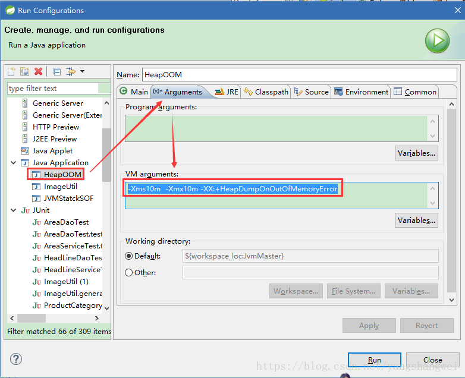
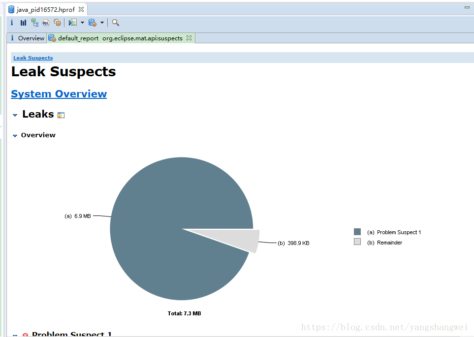
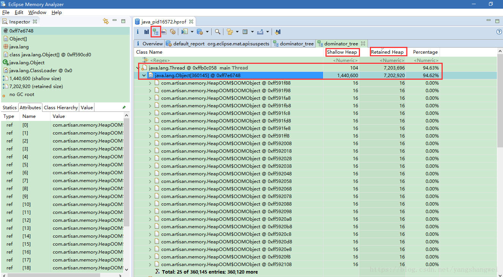
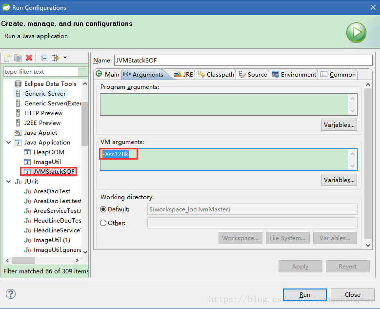

## Java堆溢出

### 前置操作

为了更加方便的制造出内存溢出的错误，我们**需要通过JVM提供的参数来设置****虚拟机****启动参数**，因为我们是使用的IDE，设置如下


```javascript
-Xms10m  -Xmx10m -XX:+HeapDumpOnOutOfMemoryError
```

- -Xms 初始堆大小。-Xmx 最大堆大小。 设置成一样即是不可扩展的意思
- -XX:+HeapDumpOnOutOfMemoryError 让虚拟机在发生内存溢出时 Dump 出当前的内存堆转储快照，以便分析用




如果Java Application 下没有对应的类，选中要测试的类，右键Run Configuratons ,然后在Java Application处，右键New即可。

### 测试类


```javascript
package com.artisan.memory;

import java.util.ArrayList;
import java.util.List;

public class HeapOOM {

	static class OOMObject {

	}

	// 如果堆中没有内存完成实例分配，并且对也无法再扩展时，将会抛出OutOfMemoryError异常。
	public static void main(String[] args) {
		List<OOMObject> list = new ArrayList<OOMObject>();
		while (true) {
			list.add(new OOMObject());
		}
	}
}
```

------

### 结果

运行日志输出如下：

java.lang.OutOfMemoryError: Java heap space


```javascript
java.lang.OutOfMemoryError: Java heap space
Dumping heap to java_pid16572.hprof ...
Heap dump file created [13008837 bytes in 0.079 secs]
Exception in thread "main" java.lang.OutOfMemoryError: Java heap space
	at java.util.Arrays.copyOf(Arrays.java:2245)
	at java.util.Arrays.copyOf(Arrays.java:2219)
	at java.util.ArrayList.grow(ArrayList.java:242)
	at java.util.ArrayList.ensureExplicitCapacity(ArrayList.java:216)
	at java.util.ArrayList.ensureCapacityInternal(ArrayList.java:208)
	at java.util.ArrayList.add(ArrayList.java:440)
	at com.artisan.memory.HeapOOM.main(HeapOOM.java:16)
```

当java应用程序出现堆内存溢出的时候，异常堆栈信息为java.lang.OutOfMemoryError 后面会跟着 Java heap space

------

### 使用mat分析

要解决这个区域的异常，一般的手段是先通过内存映射分析工具比如Eclipse Memory Analyzer 对dump出来的**堆转储快照**进行分析，重点是确认内存中的对象是否是必要的，就是**要分先分清到底是出现了内存泄露（Memory Leak） 还是 内存溢出（Memory Overflow）**.

我们使用mat来分析下刚才产生的dump文件






Shallow Size ：对象自身占用的内存大小，不包括它引用的对象。 针对非数组类型的对象，它的大小就是对象与它所有的成员变量大小的总和。当然这里面还会包括一些java语言特性的[数据存储](https://cloud.tencent.com/product/cdcs?from_column=20065&from=20065)单元。 针对数组类型的对象，它的大小是数组元素对象的大小总和。

Retained Size=当前对象大小+当前对象可直接或间接引用到的对象的大小总和。(间接引用的含义：A->B->C, C就是间接引用) 换句话说，Retained Size就是当前对象被GC后，从Heap上总共能释放掉的内存。 不过，释放的时候还要排除被GC Roots直接或间接引用的对象。他们暂时不会被被当做Garbage

------

#### 内存泄露Memory Leak

如果是内存泄露，可进一步通过工具排查看看泄露对象到GC Roots的引用链。于是就能找到泄露对象是通过怎样的路径与GC Roots相关联并导致垃圾收集器无法自动回收他们的，从而比较准确的定位到泄漏代码的位置

------

#### 内存溢出Memory Overflow

如果不存在泄露，换句话说就是内存中的对象确实都还必须存活着，那就应该检查虚拟机的堆参数（-Xms 和 -Xms）,与物理机器内存对比存看下是否可以调大，从代码是否存在某些生命周期过长，持有状态时间工厂的情况，尝试减少程序运行期的内存消耗。

------

## 虚拟机栈和本地方法栈溢出

### 概述

由于在Hotspot虚拟机中并不区分虚拟机栈和本地方法栈，因此对于Hotspot来说，虽然-Xoss参数（设置本地方法栈大小）存在，但是无效的。 栈容量只由-Xss参数设定。

关于虚拟机栈和本地方法栈，在Java虚拟机规范中描述了两种异常

- 如果线程请求的栈深度大于虚拟机所允许的最大深度，将抛出StackOverflowError异常
- 如果虚拟机在扩展栈时无法申请到最够的内存空间，则抛出OutOfMemoryError异常

虽然把异常分成两种情况，看起来很严谨，其实却存在一些重叠的地方： 当栈空间无法继续分配时，是内存太小 还是已经使用的栈空间过大，本质上只是对同一件事情的两种描述而已。

### StackOverflowError

**单线程**， 通过调整-Xss参数减少栈内存容量 ----> StackOverflowError **单线程**，定义了大量的本地变量，增大此方法帧中本地变量表的长度----> StackOverflowError




```javascript
package com.artisan.memory;

/**
 * 
 * 
 * @ClassName: JVMStatckSOF
 * 
 * @Description: VM Args: -Xss128k
 * 
 * 
 *               JVM会为每个线程的虚拟机栈分配一定的内存大小（-Xss参数），
 *               因此虚拟机栈能够容纳的栈帧数量是有限的，若栈帧不断进栈而不出栈 ，
 *               最终会导致当前线程虚拟机栈的内存空间耗尽，典型如一个无结束条件的递归函数调用
 * 
 * @author: Mr.Yang
 * 
 * @date: 2018年7月26日 下午3:17:25
 */
public class JVMStatckSOF {

	private int stackLength = -1;

	// 递归调用，使其不断的进栈
	public void statckLeak() {
		stackLength++;
		statckLeak();
	}

	public static void main(String[] args) {
		JVMStatckSOF jvmStatckSOF = new JVMStatckSOF();
		try {
			jvmStatckSOF.statckLeak();
		} catch (Throwable e) {
			System.out.println("Stack length:" + jvmStatckSOF.stackLength + "\n");
			throw e;
		}
	}

}
```

输出日志：


```javascript
Stack length:987

Exception in thread "main" java.lang.StackOverflowError
	at com.artisan.memory.JVMStatckSOF.statckLeak(JVMStatckSOF.java:25)
	at com.artisan.memory.JVMStatckSOF.statckLeak(JVMStatckSOF.java:26)
	at com.artisan.memory.JVMStatckSOF.statckLeak(JVMStatckSOF.java:26)
	at com.artisan.memory.JVMStatckSOF.statckLeak(JVMStatckSOF.java:26)
	at com.artisan.memory.JVMStatckSOF.statckLeak(JVMStatckSOF.java:26)
```

 试验结果表明，在单线程先，无论是由于帧栈太大还是由于虚拟机栈容量太小，当内存无法分配的时候，虚拟机抛出的都是StackOverflowError异常。

------

### OutofMemoryError

如果不限制单线程，通过不断的建立线程的方式倒是可以产生内存溢出 的场景（谨慎使用，如果是windows会使电脑卡死）


```javascript
package com.artisan.memory;

/**
 * 
 * 
 * @ClassName: JVMStackOOM
 * 
 * @Description: VM Args -Xss20m(这时候不妨设置大一些)
 * 
 * @author: Mr.Yang
 * 
 * @date: 2018年7月27日 下午9:41:51
 */
public class JVMStackOOM {

	private void doSomething() {
		while (true) {

		}
	}

	public void stackLeakbyThread(){
		while (true) {
			Thread thread = new Thread(new Runnable() {
				@Override
				public void run() {
					doSomething();
				}
			});
			thread.start();
		}
	}
	 
	public static void main(String[] args) {
		JVMStackOOM jvmStackOOM = new JVMStackOOM();
		jvmStackOOM.stackLeakbyThread();
	}

}
```

如上述代码产生的内存溢出异常和栈空间是否足够大不存在任何联系，或者准确的说，在这种情况下，为每个线程的栈分配的内存越大，反而越容易产生内存溢出。

操作系统分配给每个进程的内存是有限制的，虚拟机提供了参数来控制Java堆和方法区的这两部分内存的最大值。 剩余内存为操作系统总内存-Xmx(最大堆容量)-MaxPermSize(最大方法区容量)-程序计数器消耗的内存（很小可忽略不计）如果虚拟机进程本身消耗的内存不计算在内，剩下的内存就由虚拟机栈和本地方法栈瓜分了。 每个线程分配到的栈容量越大（-Xss设置），可以建立的线程数自然越少，建立线程的时候就越容易把剩下的内存耗尽。

异常信息


```javascript
Exception in thread "main" java.lang.OutOfMemoryError: unable to create new native thread
```

------

## 方法区和运行时常量池溢出

由于运行时常量池是方法区（永久代）的一部分，因此将这两个区域的移除测试放到一起。

我们知道JDK1.7开始逐步“去永久代”，所以我们这个案例是在JDK1.6中的版本测试的。

String.intern()是一个Native方法，它的作用是：如果字符串常量池中包含一个等于此String对象的字符串，则返回代表池中这个字符串的String对象，否则将此String对象包含的字符串添加到常量池中，并且返回此String对象的引用。

------

### 测试


```javascript
package com.artisan.memory;

import java.util.ArrayList;
import java.util.List;

/**
 * 
 * 
 * @ClassName: RuntimeConstantPoolOOM
 * 
 * @Description: JDK1.6中运行
 * 
 *               VM Args -XX:PermSize=10M -XX:MaxPermSize=10M
 * 
 * @author: Mr.Yang
 * 
 * @date: 2018年7月27日 下午9:57:43
 */
public class RuntimeConstantPoolOOM {

	public static void main(String[] args) {
		// 使用List保持常量池引用，避免Full GC回收常量池行为
		List<String> list = new ArrayList<String>();
		// 10M的PermSize在integer范围内最够产生OOM了
		int i = 1 ;
		while (true) {
			list.add(String.valueOf(i++).intern());
		}
	}
}
```

输出


```javascript
Exception in thread "main" java.lang.OutOfMemoryError: PermGen space
	at java.lang.String.intern(Native Method)
	at com.artisan.memory.RuntimeConstantPoolOOM.main(RuntimeConstantPoolOOM.java:27)
```

如果在JDK1.7中会得到不同的结果，该程序会一直运行下去。

------

## 本机直接内存溢出

DirectMemory容量可通过 `-XX:MaxDirectorySize`指定，如果不指定，这默认和Java堆最大内存（-Xmx指定）一样。

由于DirectMemory导致的内存溢出，一个明显的特征是在Heap Dump文件中不会看见明显的异常，如果发现OOM之后Dump很小，而程序中又直接或者间接的使用了NIO，那就可以考虑下是不是这个方面的原因。