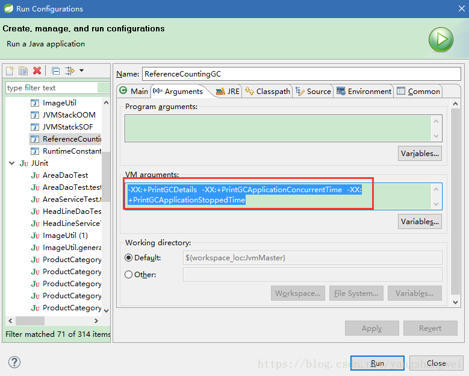
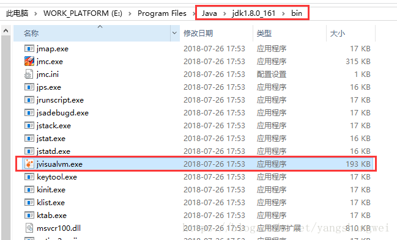
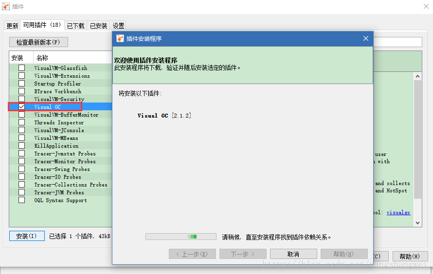
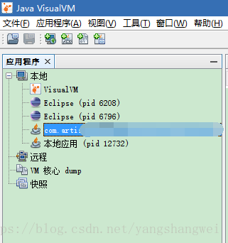
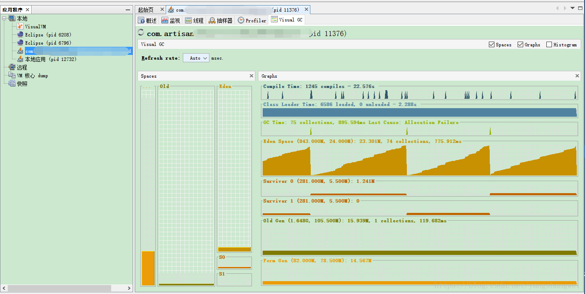
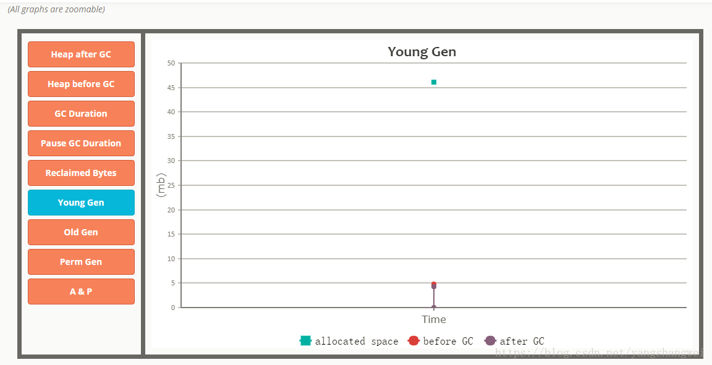
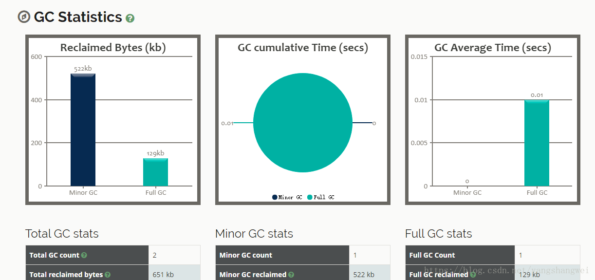

## 概述

每一种收集器的日志形式都是由他们自身的实现决定的，也就是说每个收集器的日志格式都可能不一样。

------

## GC格式

一般来说，常见的格式如下：


```javascript
[GC [<collector>: <starting occupancy1> -> <ending occupancy1>, <pause time1> secs] <starting occupancy3> -> <ending occupancy3>, <pause time3> secs]
```

-  GC为minor收集过程中使用的垃圾收集器起的内部名称.
-  young generation 在进行垃圾收集前被对象使用的存储空间.
-  young generation 在进行垃圾收集后被对象使用的存储空间
-  minor收集使应用暂停的时间长短(秒)
-  整个堆(Heap Size)在进行垃圾收集前被对象使用的存储空间
-  整个堆(Heap Size)在进行垃圾收集后被对象使用的存储空间
-  整个垃圾收集使应用暂停的时间长短(秒),包括major收集使应用暂停的时间(如果发生了major收集).

------

## 实例

我们用前面博文中的例子来打印下GC日志，然后分析解读下

VM Args :




- `-XX:+PrintGCDetails` 显示GC的详细信息 
-  `-XX:+PrintGCApplicationConcurrentTime` 打印应用执行的时间 
-  `-XX:+PrintGCApplicationStoppedTime` 打印应用被暂停的时间


```javascript
package com.artisan.gc;

/**
 * 
 * 
 * @ClassName: ReferenceCountingGC
 * 
 * @Description: VM Args
 * 
 * @author: Mr.Yang
 * 
 * @date: 2018年7月29日 上午10:31:32
 */
public class ReferenceCountingGC {

	private Object instance;

	private static final int _1M = 1024 * 1024;

	// 设置个成员变量，在堆中占点内存，以便观察GC是否回收相互引用的情况
	private byte[] bigByte = new byte[2 * _1M];

	public static void main(String[] args) {

		ReferenceCountingGC rc = new ReferenceCountingGC();
		ReferenceCountingGC rc2 = new ReferenceCountingGC();
		// 设置相互引用
		rc.instance = rc2;
		rc2.instance = rc;

		// 将对象置为空
		rc.instance = null;
		rc2.instance = null;

		// 垃圾回收,观察rc 和 rc2能否被回收
		System.gc();
	}

}
```

 设置完虚拟机参数后，执行main方法，输入如下


```javascript
Application time: 0.0087943 seconds
[GC [PSYoungGen: 4906K->4400K(47232K)] 4906K->4400K(155264K), 0.0020510 secs] [Times: user=0.00 sys=0.00, real=0.00 secs] 
[Full GC (System) [PSYoungGen: 4400K->0K(47232K)] [PSOldGen: 0K->4255K(108032K)] 4400K->4255K(155264K) [PSPermGen: 2977K->2977K(21248K)], 0.0076827 secs] [Times: user=0.01 sys=0.00, real=0.01 secs] 
Total time for which application threads were stopped: 0.0098759 seconds
Heap
 PSYoungGen      total 47232K, used 1620K [0x00000007cb400000, 0x00000007ce8b0000, 0x0000000800000000)
  eden space 40512K, 4% used [0x00000007cb400000,0x00000007cb5952b8,0x00000007cdb90000)
  from space 6720K, 0% used [0x00000007cdb90000,0x00000007cdb90000,0x00000007ce220000)
  to   space 6720K, 0% used [0x00000007ce220000,0x00000007ce220000,0x00000007ce8b0000)
 PSOldGen        total 108032K, used 4255K [0x0000000761c00000, 0x0000000768580000, 0x00000007cb400000)
  object space 108032K, 3% used [0x0000000761c00000,0x0000000762027c80,0x0000000768580000)
 PSPermGen       total 21248K, used 2995K [0x000000075ca00000, 0x000000075dec0000, 0x0000000761c00000)
  object space 21248K, 14% used [0x000000075ca00000,0x000000075ccecc30,0x000000075dec0000)
Application time: 0.0006608 seconds
```

 我们重点来说下 `-XX:+PrintGCDetails` 虚拟机参数输出的数据

GC日志开头的 `[GC` 和 `[Full GC` 说明了这次垃圾收集器的停顿类型，而不是用来区分新生代GC还是老年GC的。

**如果有 Full ，说明了这次GC发生了Stop-The-World.**

如果是调用了System.gc()方法所触发的收集，那么将显示`[Full GC (System)`，如上日志所示。

接下来的“[DefNew” 或者 “[Tenured” 或者“[Perm” 表示GC发生的区域，这里显示的区[域名](https://dnspod.cloud.tencent.com/?from_column=20065&from=20065)称和使用的GC收集器密切相关。

- 如果是用的Serial收集器，新生代名为“Default New Generation”,所以显示“[DefNew”。
- 如果是用的ParNew收集器，新生代名为“Parallel New Generation”,所以显示“[ParNew”。
- 如果是用的Parallel Scavenge收集器，新生代名则显示为“[PSYongGen”,如日志中显示。

老年代和永久代同理，名称也是由收集器决定的。

后面方括号内部的 `4906K->4400K(47232K)`含义是 “GC前该内存区域已经使用的容量->GC后该内存区域已使用的容量（该内存区域中容量）”

方括号之外的 `4906K->4400K(155264K)` 表示“GC前Java堆已使用容量->GC后Java堆已使用容量（Java堆中容量）”

再往后 `0.0020510 secs`表示该内存区域GC所占用的时间，单位为秒。


```javascript
 [Times: user=0.00 sys=0.00, real=0.00 secs] 
```

是更具体的时间数据，取决于收集器，有些收集器可能不打印。

这里面的user、sys、real和Linux的time命令输出的时间含义是一致的，分别代表用户态消耗的CPU时间、内核态消耗的CPU时间和操作从开始到结束锁经理的墙钟时间（Wall Clock Time）.

CPU时间和墙钟时间的区别是： 墙钟时间包括各种费运算的等待耗时，比如磁盘I/O、等待线程阻塞。 而CPU时间则不包含这些耗时，但当系统有多CPU或者多核的话，多线程操作会叠加CPU时间，所以读者看到user或者sys时间超过real时间是完全正常的。

------

## GC监控

\##打开 Java VisualVM 市面上有很多GC监控和分析工具，这里我们使用JDK自带的Java VisualVM，位于JDK的bin目录下



Java VisualVM的作用不止于此：

- 生成和分析堆内存转储
- 查看和操作MBean
- 监控垃圾回收
- 内存和CPU分析

------

### 安装GC可视化插件

工具–插件



### 启动本地进程，监控和分析GC情况





还有些其他功能，这里不再阐述了，如何分析观察，另开篇找个案例介绍。

------

## GC日志分析工具

如果GC日志比较多，一般情况我们不直接阅读，都是通过GC[日志分析](https://cloud.tencent.com/product/es?from_column=20065&from=20065)工具提供的图形化页面来查看。

这里省略，后续开篇单独介绍

有个网页版的 [http://gceasy.io/](https://cloud.tencent.com/developer/tools/blog-entry?target=http%3A%2F%2Fgceasy.io%2F&objectId=1862927&objectType=1&isNewArticle=undefined)



