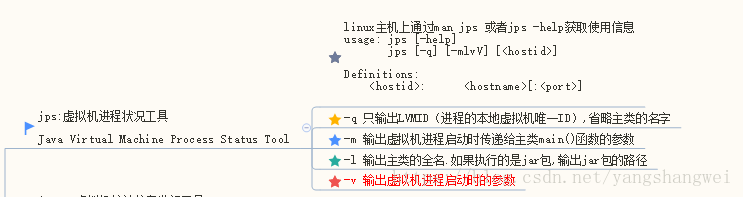
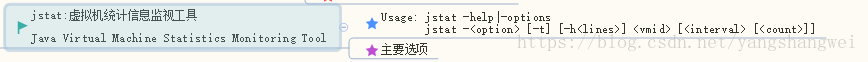
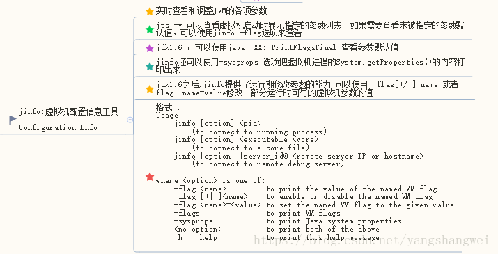
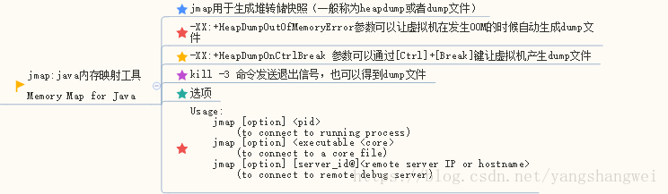
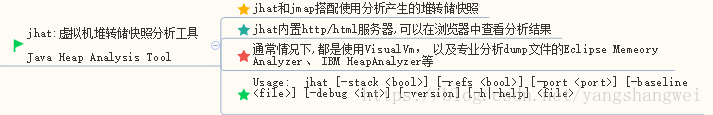
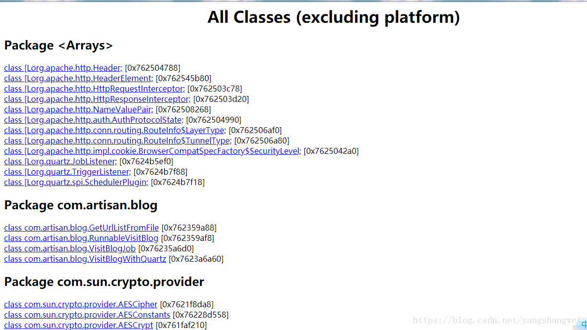
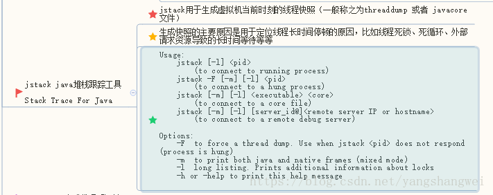

## 概述

前面介绍了虚拟机的内存分配和回收，大致有了一些理论基础，接下来我们从实践的角度去了解虚拟机内存管理。定位问题的时候，知识、经验是关键基础，数据是依据，工具是运用知识处理数据的手段。

这里我们说的数据主要包括

-  运行日志 
-  异常堆栈 
-  GC日志 
-  线程快照(thread dump / javacore文件) 
-  堆转储快照(heapdump/hprof文件)等 

------

## 命令行工具

Java安装目录 bin目录下有很多官方提供的命令行程序，今天我们俩了解下虚拟机[性能监控](https://cloud.tencent.com/product/apm?from_column=20065&from=20065)与故障处理工具

| 名称   | 英文全称                       | 作用                                    |
| :----- | :----------------------------- | :-------------------------------------- |
| jps    | JVM Process Status Tool        | 显示指定系统内所有的HotSPot虚拟机进程   |
| jstat  | JVM Statistics Monitoring Tool | 用于手机HotSpot虚拟机个方面的运行数据   |
| jinfo  | Configuration Info for Java    | 显示虚拟机配置信息                      |
| jmap   | Memory Map for Java            | 生成虚拟机的内存转储快照（headump文件） |
| jhat   | Java Heap Analysis Tool        | 虚拟机堆转储快照分析工具                |
| jstack | Stack Trace For Java           | java堆栈跟踪工具,，显示线程快照         |

------

### jps 虚拟机进程状况工具

#### 概述

Java Virtual Machine Process Status Tool




不仅名字像unix主机的ps命令，功能也相似，可以列举出正在运行的虚拟机进程，并显示虚拟机执行主类（Main Class,main函数所在的类）名称以及这些进程的本地虚拟机唯一ID（Local Virtual Machine Identifier ，LVMID）。.

使用频率最高的JDK[命令行工具](https://cloud.tencent.com/product/cli?from_column=20065&from=20065)，以为内其他的JDK工具大多需要输入它查询到LVMID来确定要监控的是哪一个虚拟机进程。 对于本地虚拟机进程来讲，LVMID和操作系统的进程ID(Process Identifer ,PID) 一致。


#### 语法及使用

```javascript
usage: jps [-help]
       jps [-q] [-mlvV] [<hostid>]

Definitions:
    <hostid>:      <hostname>[:<port>]
```

jps可以通过RMI协议查看开启了RMI服务的远程虚拟机进程状态。，hostid为RMI注册表中注册的主机名。

jps的其他常用选项

| 选项 | 作用                                           |
| :--- | :--------------------------------------------- |
| -q   | 只输出LVMID，省略主类的名称                    |
| -m   | 输出虚拟机进程启动时传递给主类main函数的参数   |
| -l   | 输出主类的全名，如果执行的是jar包，输出jar路径 |
| -v   | 输出虚拟机进程启动时jvm参数                    |

------


### jstat 虚拟机统计信息监视工具

#### 概述



#### 语法及使用


```javascript
Usage: jstat -help|-options
       jstat -<option> [-t] [-h<lines>] <vmid> [<interval> [<count>]]

Definitions:
  <option>      An option reported by the -options option
  <vmid>        Virtual Machine Identifier. A vmid takes the following form:
                     <lvmid>[@<hostname>[:<port>]]
                Where <lvmid> is the local vm identifier for the target
                Java virtual machine, typically a process id; <hostname> is
                the name of the host running the target Java virtual machine;
                and <port> is the port number for the rmiregistry on the
                target host. See the jvmstat documentation for a more complete
                description of the Virtual Machine Identifier.
  <lines>       Number of samples between header lines.
  <interval>    Sampling interval. The following forms are allowed:
                    <n>["ms"|"s"]
                Where <n> is an integer and the suffix specifies the units as
                milliseconds("ms") or seconds("s"). The default units are "ms".
  <count>       Number of samples to take before terminating.
  -J<flag>      Pass <flag> directly to the runtime system.
```

-   对于命令格式中的VMID和LVMID，如果是本地虚拟机进程，两者一致。如果是远程虚拟机进程，则VMID的格式为 `[protocol:][//]lvmind[@hostname[:port]/servername]` 
-   interval : 查询间隔 
-   count：查询次数 如果省略interval和count，则只查询一次 

假设需要250毫秒查询一次进程3245的垃圾收集状况，一共查询20次


```javascript
jstat -gc 3245 250 20
```

- 选项option代表用户希望查询的虚拟机信息，主要分为3类：类装载、垃圾收集、运行期编译状况。

jstat的主要选项

| 选项              | 作用                                                         |
| :---------------- | :----------------------------------------------------------- |
| -class            | 监视类装载、卸载数量，总空间以及类装载锁耗费的时间           |
| -gc               | 监视Java堆状况，包括eden区、两个Survivor区、老年代、永久代等的容量、已使用空间、GC时间合计等信息 |
| -gccapacity       | 监视内容与-gc基本相同，但输出主要关注Java堆各个区域使用的最大、最小空间 |
| -gcutil           | 监视内容与-gc基本相同，但输出主要关注已使用空间占总空间的百分比 |
| -gccause          | 与-gcutil功能一样，但是会额外输出导致上一次GC产生的原因      |
| -gcnew            | 监视新生代GC状况                                             |
| -gcnewcapacity    | 监视内容与-gcnew 基本相同，但输出主要关注Java堆各个区域使用的最大、最小空间 |
| -gcold            | 监视老年代代GC状况                                           |
| -gcoldcapacity    | 监视内容与-gcold 基本相同，但输出主要关注Java堆各个区域使用的最大、最小空间 |
| -gcpermcapacity   | 输出永久代使用的最大、最小空间                               |
| -compiler         | 输出JIT编译器编译过的方法、耗时等信息                        |
| -printcompilation | 输出已经被JIT编译的方法                                      |

使用举例


```javascript
E:\Program Files\Java\jdk1.8.0_161\bin>jstat -gcutil 12888  1000  10
Warning: Unresolved Symbol: sun.gc.metaspace.capacity substituted NaN
Warning: Unresolved Symbol: sun.gc.metaspace.used substituted NaN
Warning: Unresolved Symbol: sun.gc.metaspace.capacity substituted NaN
Warning: Unresolved Symbol: sun.gc.compressedclassspace.capacity substituted NaN
Warning: Unresolved Symbol: sun.gc.compressedclassspace.used substituted NaN
Warning: Unresolved Symbol: sun.gc.compressedclassspace.capacity substituted NaN
  S0     S1     E      O      M     CCS    YGC     YGCT    FGC    FGCT     GCT
  0.00  91.47  46.39   9.12      -      -      9    0.215     0    0.000    0.215
  0.00  91.47  48.39   9.12      -      -      9    0.215     0    0.000    0.215
  0.00  91.47  48.39   9.12      -      -      9    0.215     0    0.000    0.215
  0.00  91.47  48.39   9.12      -      -      9    0.215     0    0.000    0.215
  0.00  91.47  48.39   9.12      -      -      9    0.215     0    0.000    0.215
  0.00  91.47  48.39   9.12      -      -      9    0.215     0    0.000    0.215
  0.00  91.47  48.39   9.12      -      -      9    0.215     0    0.000    0.215
  0.00  91.47  48.39   9.12      -      -      9    0.215     0    0.000    0.215
  0.00  91.47  48.39   9.12      -      -      9    0.215     0    0.000    0.215
  0.00  91.47  48.39   9.12      -      -      9    0.215     0    0.000    0.215
```

-  S0: Survivor0是空的 
-  S1:Survivor1使用了91.47的空间 
-  E：Eden 使用了 48.39%的空间 
-  O: 老年代使用了 9.12%的空间 
-  M： 因为我这里是使用了JDK8 ，没有了永久代的概念，这里是元数据区 
-  YGC: Minor GC表示程序启动以来，发生了9次Minor GC 
-  YGCT：Young GC Time 耗时为0.215秒 
-  FGC：Full GC 表示程序启动以来，发生了0次Minor GC 
-  FGCT：Full GC Time 耗时为0秒 
-  GCT：表示GC Time ，所有的GC总耗时 0.215秒 

纯文本状态下监视虚拟机的变化确实不如后面提到的VisualVM等可视化的建施工局直接用图形的方式展现直观，但直接在主机上使用jstat命令仍然是一种常用的监控方式。

------


### jinfo Java配置信息工具

#### 概述



#### 语法及使用


```javascript
Usage:
    jinfo [option] <pid>
        (to connect to running process)
    jinfo [option] <executable <core>
        (to connect to a core file)
    jinfo [option] [server_id@]<remote server IP or hostname>
        (to connect to remote debug server)

where <option> is one of:
    -flag <name>         to print the value of the named VM flag
    -flag [+|-]<name>    to enable or disable the named VM flag
    -flag <name>=<value> to set the named VM flag to the given value
    -flags               to print VM flags
    -sysprops            to print Java system properties
    <no option>          to print both of the above
    -h | -help           to print this help message
```

使用举例


```javascript
E:\Program Files\Java\jdk1.8.0_161\bin>jinfo -flag MaxPermSize 12888
-XX:MaxPermSize=85983232
```

------

### jmap Java 内存映射工具

#### 概述




#### 语法及使用


```javascript
Usage:
    jmap [option] <pid>
        (to connect to running process)
    jmap [option] <executable <core>
        (to connect to a core file)
    jmap [option] [server_id@]<remote server IP or hostname>
        (to connect to remote debug server)

where <option> is one of:
    <none>               to print same info as Solaris pmap
    -heap                to print java heap summary
    -histo[:live]        to print histogram of java object heap; if the "live"
                         suboption is specified, only count live objects
    -clstats             to print class loader statistics
    -finalizerinfo       to print information on objects awaiting finalization
    -dump:<dump-options> to dump java heap in hprof binary format
                         dump-options:
                           live         dump only live objects; if not specified,
                                        all objects in the heap are dumped.
                           format=b     binary format
                           file=<file>  dump heap to <file>
                         Example: jmap -dump:live,format=b,file=heap.bin <pid>
    -F                   force. Use with -dump:<dump-options> <pid> or -histo
                         to force a heap dump or histogram when <pid> does not
                         respond. The "live" suboption is not supported
                         in this mode.
    -h | -help           to print this help message
    -J<flag>             to pass <flag> directly to the runtime system
```

jmap的主要选项

| 选项          | 作用                                                         |
| :------------ | :----------------------------------------------------------- |
| -dump         | 生成java堆转储快照。 格式为 -dump:[live,] format=b,file= 其中live子参数说明是否只dump出存活的对象 |
| -finalizeinfo | 显示在F-Queue中等待Finalizer线程执行finalize方法的对象。 只在linux/solaris平台有效 |
| -heap         | 只显示Java堆详细信息。如使用脑胀回收器、参数配置、分代状况等。只在linux/solaris平台有效 |
| -histo        | 显示堆中对象统计信息，包括类、实例数量、合计容量             |
| -permstat     | 以ClassLoader为统计口径显示永久代内存状态。 只在linux/solaris平台有效 |
| -F            | 当虚拟机进程对-dump选项没有响应时，可以使用这个选项强制生成dump快照。只在linux/solaris平台有效 |

使用举例， 对pid=12888的进程输出dump信息


```javascript
E:\Program Files\Java\jdk1.8.0_161\bin>jmap -dump:format=b,file=test.bin 12888
Dumping heap to E:\Program Files\Java\jdk1.8.0_161\bin\test.bin ...
Heap dump file created
```

------

### jhat 虚拟机堆转储快照分析工具

#### 概述



#### 语法及使用


```javascript
Usage:  jhat [-stack <bool>] [-refs <bool>] [-port <port>] [-baseline <file>] [-debug <int>] [-version] [-h|-help] <file>

        -J<flag>          Pass <flag> directly to the runtime system. For
                          example, -J-mx512m to use a maximum heap size of 512MB
        -stack false:     Turn off tracking object allocation call stack.
        -refs false:      Turn off tracking of references to objects
        -port <port>:     Set the port for the HTTP server.  Defaults to 7000
        -exclude <file>:  Specify a file that lists data members that should
                          be excluded from the reachableFrom query.
        -baseline <file>: Specify a baseline object dump.  Objects in
                          both heap dumps with the same ID and same class will
                          be marked as not being "new".
        -debug <int>:     Set debug level.
                            0:  No debug output
                            1:  Debug hprof file parsing
                            2:  Debug hprof file parsing, no server
        -version          Report version number
        -h|-help          Print this help and exit
        <file>            The file to read

For a dump file that contains multiple heap dumps,
you may specify which dump in the file
by appending "#" to the file name, i.e. "foo.hprof#3".

All boolean options default to "true"
```

用法举例


```javascript
E:\Program Files\Java\jdk1.8.0_161\bin>jmap -dump:format=b,file=test.bin 12888
Dumping heap to E:\Program Files\Java\jdk1.8.0_161\bin\test.bin ...
File exists

E:\Program Files\Java\jdk1.8.0_161\bin>jhat test.bin
Reading from test.bin...
Dump file created Mon Aug 06 20:49:25 CST 2018
Snapshot read, resolving...
Resolving 244224 objects...
Chasing references, expect 48 dots................................................
Eliminating duplicate references................................................
Snapshot resolved.
Started HTTP server on port 7000
Server is ready.
```

浏览器输入 http://localhost:7000/




### jstack Java堆栈跟踪工具

#### 概述



#### 语法及使用


```javascript
Usage:
    jstack [-l] <pid>
        (to connect to running process)
    jstack -F [-m] [-l] <pid>
        (to connect to a hung process)
    jstack [-m] [-l] <executable> <core>
        (to connect to a core file)
    jstack [-m] [-l] [server_id@]<remote server IP or hostname>
        (to connect to a remote debug server)

Options:
    -F  to force a thread dump. Use when jstack <pid> does not respond (process is hung)
    -m  to print both java and native frames (mixed mode)
    -l  long listing. Prints additional information about locks
    -h or -help to print this help message
```

jstack的主要选项

| 选项 | 作用                                         |
| :--- | :------------------------------------------- |
| -F   | 当正常输出的请求不被响应时，强制输出线程堆栈 |
| -m   | 如果调用到本地方法的话，可以显示C/C++的堆栈  |
| -l   | 除了堆栈信息，显示关于锁的附件信息           |

用法举例


```javascript
E:\Program Files\Java\jdk1.8.0_161\bin>jstack -l 12888
2018-08-06 21:01:10
Full thread dump Java HotSpot(TM) 64-Bit Server VM (24.51-b03 mixed mode):

"DestroyJavaVM" prio=6 tid=0x000000000e1ab800 nid=0x2f80 waiting on condition [0x0000000000000000]
   java.lang.Thread.State: RUNNABLE

   Locked ownable synchronizers:
        - None

"DefaultQuartzScheduler_QuartzSchedulerThread" prio=6 tid=0x000000000e1a9800 nid=0xb5c in Object.wait() [0x000000000f59f000]
   java.lang.Thread.State: TIMED_WAITING (on object monitor)
        at java.lang.Object.wait(Native Method)
        at org.quartz.core.QuartzSchedulerThread.run(QuartzSchedulerThread.java:410)
        - locked <0x0000000762395018> (a java.lang.Object)

   Locked ownable synchronizers:
        - None
......
.......
..........
```

------

### hsdis:jit生成代码反汇编

Sun官方推荐的HotSpot虚拟机JIT编译代码的反汇编插件。了解即可。