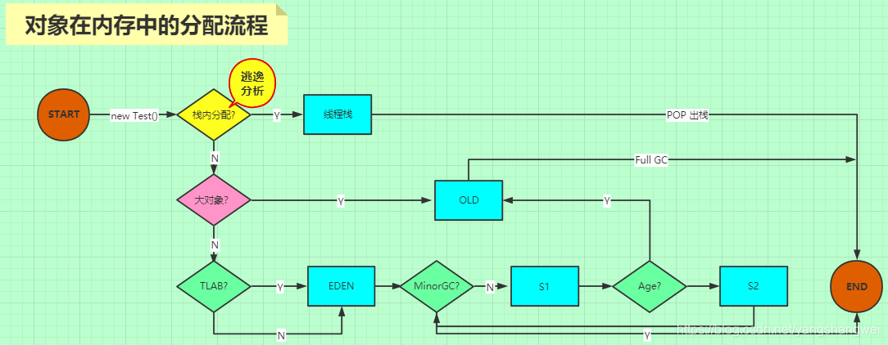
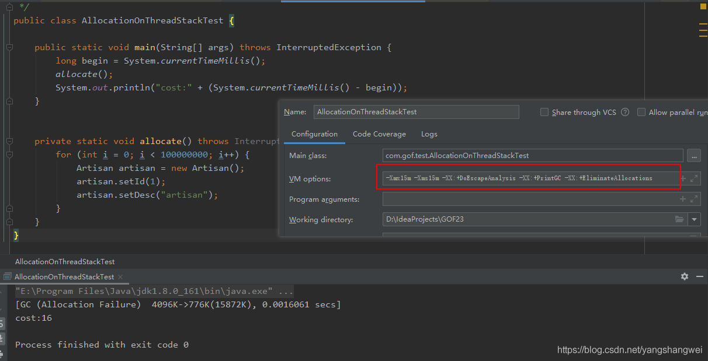
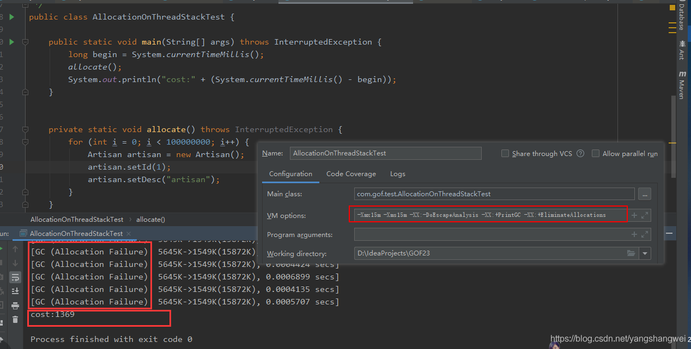
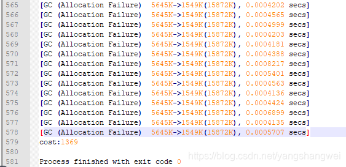
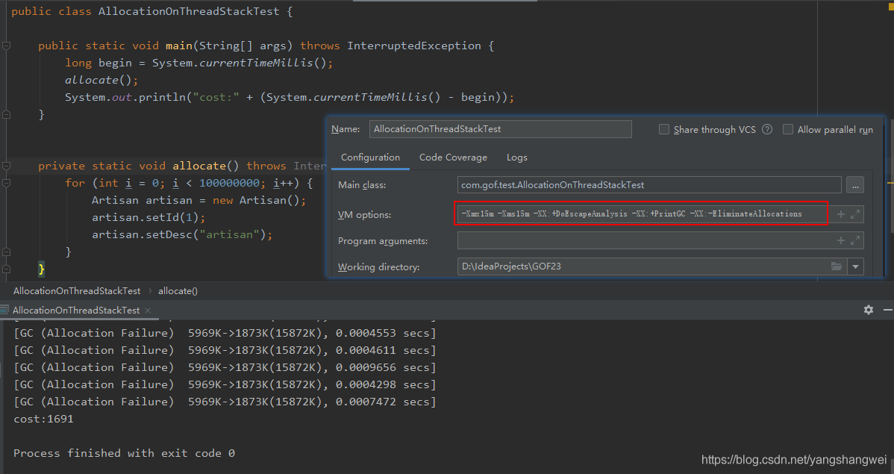

## Pre

[JVM-剖析对象内存分配流程](https://cloud.tencent.com/developer/tools/blog-entry?target=https%3A%2F%2Fartisan.blog.csdn.net%2Farticle%2Fdetails%2F106977301&objectId=1863058&objectType=1&isNewArticle=undefined)

------

## 对象分配流程总览




## 逃逸分析所处的阶段

通过上图的对象分配流程，我们可以知道逃逸分析是发生在第一步判断对象是否可以在栈上分配的时候， 在栈上分配的目的是为了减少将对象分配到堆上的概率，节约堆内存，减少GC压力。

逃逸分析是JVM为了优化对象分配而做的一种优化措施。

------


## 示例说明逃逸分析的含义

那逃逸分析的标准是什么呢？ 经过逃逸分析以后什么样的对象可以在栈上分配，什么样的对象不可以在栈上分配呢？

JVM通过逃逸分析确定该对象不会被外部访问。如果不会逃逸可以将该对象在栈上分配内存，这样该对象所占用的内存空间就可以随栈帧出栈而销毁，减轻GC的压力。

 对象逃逸分析就是分析对象动态作用域 。 当一个对象在方法中被定义后，它可能被外部方法所引用。

举个例子


```java
public User doSomething1() {
   Artisan artisan1= new Artisan();
   artisan1.setId(1);
   artisan1.setDesc("artisan1");
   // ......
   return user;
}

public void doSomething2() {
   Artisan artisan2= new Artisan();
   artisan2.setId(2);
   artisan2.setDesc("artisan2");
   // ...... 
}
```

doSomething1返回对象，在方法结束之后被返回了，那这个对象的作用域范围是不确定的。

doSomething2方法可以非常确定的是当方法结束以后，artisan2这个对象就失效了，因为它的作用域范围是当前方法。 那对于这样的对象，JVM会把这样的对象分配到线程栈中，让它随着方法结束时跟随线程栈内存一起被回收掉。

------

## 逃逸分析的对象分配的方式【标量替换】

### 标量替换的含义

 通过逃逸分析确定该对象不会被外部访问，并且对象可以被进一步分解时，JVM不会创建该对象，而是将该对象成员变量分解若干个被这个方法使用的成员变量所代替，这些代替的成员变量在栈帧或寄存器上分配空间，这样就不会因为没有一大块连续空间导致对象内存不够分配。

开启标量替换参数(-XX:+EliminateAllocations)，**JDK7之后默认开启**

------

### 标量 VS 聚合量

标量替换 ？ 那什么是标量 ？

-  标量： 不可被进一步分解的量，而JAVA的基本数据类型就是标量（比如int，long等基本数据类型以及reference类型等） 。 
-  聚合量： 标量的对立就是可以被进一步分解的量，称之为聚合量。 在JAVA中对象就是可以被进一步分解的聚合量。 

------

## JVM 参数 -XX:+DoEscapeAnalysis & -XX:+EliminateAllocations

JDK7之后默认开启逃逸分析 .

如果需要关闭逃逸分析 `-XX:-DoEscapeAnalysis` 即可，不推荐修改该参数。

`-XX:+EliminateAllocations` 开启标量替换参数 . 该参数的前提是开启了逃逸分析，如果没有开启逃逸分析，仅开启该参数无效。

------

## 栈上分配Demo

### Code

```java
public class Artisan {
    private int id ;
    private String desc ;
    // set get
    
}
```


```java
/**
 * 栈上分配，标量替换
 *
 * 示例代码调用了1亿次alloc()，如果是分配到堆上，大概需要1GB以上堆空间，如果堆空间小于该值，必然会触发GC。
 *
 * 使用如下参数不会发生GC
 * -Xmx15m -Xms15m -XX:+DoEscapeAnalysis -XX:+PrintGC -XX:+EliminateAllocations
 *
 * 使用如下参数都会发生大量GC
 * -Xmx15m -Xms15m -XX:-DoEscapeAnalysis -XX:+PrintGC -XX:+EliminateAllocations
 * -Xmx15m -Xms15m -XX:+DoEscapeAnalysis -XX:+PrintGC -XX:-EliminateAllocations
 */
public class AllocationOnThreadStackTest {

    public static void main(String[] args) throws InterruptedException {
        long begin = System.currentTimeMillis();
        allocate();
        System.out.println("cost:" + (System.currentTimeMillis() - begin));
    }


    private static void allocate() throws InterruptedException {
        for (int i = 0; i < 100000000; i++) {
            Artisan artisan = new Artisan();
            artisan.setId(1);
            artisan.setDesc("artisan");
        }
    }
}
```

### 【默认开启逃逸分析】

```java
-Xmx15m -Xms15m -XX:+DoEscapeAnalysis -XX:+PrintGC -XX:+EliminateAllocations
```

-XX:+DoEscapeAnalysis -XX:+EliminateAllocations JDK8 默认开启，可以不设置。 这里只是显式设置，让读者更容易理解。




只有在程序开始之前GC了一次 （这是JVM内部复杂的机制决定的）， 运行过程中，并没有发生Minor GC .

------

### 【关闭逃逸分析】

看下关闭逃逸分析的效果

- -DoEscapeAnalysis +EliminateAllocations


```java
-Xmx15m -Xms15m -XX:-DoEscapeAnalysis -XX:+PrintGC -XX:+EliminateAllocations
```






发生了578次 Minor GC , 耗时 1369毫秒。 可见GC过多，对性能的影响是非常大的。

------

- +DoEscapeAnalysis -EliminateAllocations

再看看 `-Xmx15m -Xms15m -XX:+DoEscapeAnalysis -XX:+PrintGC -XX:-EliminateAllocations`



综上所述，开启了逃逸分析，对堆内存的节省，减少GC压力，提高程序性能大有裨益。

最后说一句， 栈上空间不足，那一定会往堆上分配。