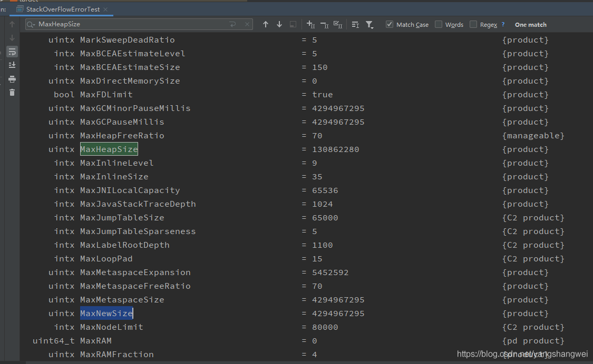
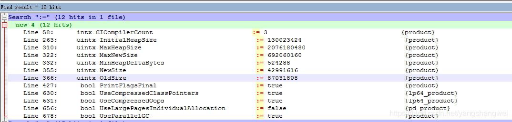
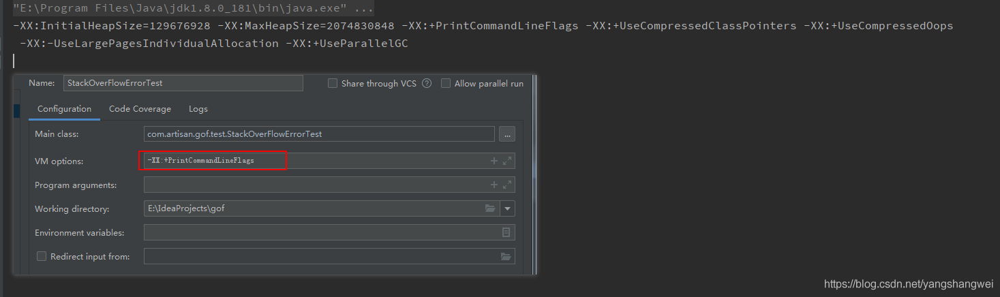

## Pre

有的时候，想看下自己没有设置的JVM参数的值， 或者有的时候想看下JVM某个参数的默认值 ，亦或想看下用户或者JVM修改的JVM参数 ？

咋办 ？

JVM在1.6.0_14以后提供了几个参数可以打印出来所有XX参数和对应的值


```javascript
 -XX:+PrintFlagsInitial 表示打印出所有参数选项的默认值
 -XX:+PrintFlagsFinal 表示打印出所有参数选项在运行程序时生效的值
```

执行的话


```javascript
java -XX:+PrintFlagsInitial
java -XX:+PrintFlagsFinal 
```

------

## -XX:+PrintFlagsInitial 列出JVM参数的默认值

Java诞生了25年+， N多个参数 ，鬼记得住~

我们只需要直到常用的，会找就可以了。

我这用的1.8.0_181 列举出了 866个

部分截图如下



- 第一列表示参数的数据类型
- 第二列是名称
-  第三列”=”表示第四列是参数的默认值，如果是”:=” 表明了参数被用户或者JVM赋值了
- 第四列为值
- 第五列是参数的类别

------

## -XX:+PrintFlagsFinal 列出运行程序时生效的值


 ”:=” 表明了参数被用户或者JVM赋值了， 也间接证明了Java8默认的垃圾回收器是Parallel + Parallel Old .



## -XX:+PrintCommandLineFlags 列出被用户或者JVM优化设置过的详细的XX参数的名称和值

这一步其实就是列出 `-XX:+PrintFlagsFinal`的结果中第三列有":="的参数 。



也可以理解为打印命令行参数

------

## 列举附加隐藏参数


```javascript
-XX:+UnlockDiagnosticVMOptions  解锁诊断参数

-XX:+UnlockExperimentalVMOptions   解锁实验参数

-XX:+UnlockInternalVMOptions 解锁内部参数 
```

这个就是隐藏副本了 ，愿君多留意~

------

## jinfo 查看正在运行的Java应用程序的扩展参数

当然了 还有其他参数 也可以看


```javascript
jps + jinfo  
```

------

### jps


```javascript
[root@artisan ~]# jps --help
illegal argument: --help
usage: jps [-help]
       jps [-q] [-mlvV] [<hostid>]

Definitions:
    <hostid>:      <hostname>[:<port>]
```

最常用的jps , 查看PID

输出更多信息


```javascript
jps -v 
```

【demo】


```javascript
[root@artisan ~]# jps
5811 kooteam.jar
6043 Jps
[root@artisan ~]# jps -v
5811 kooteam.jar -Xms1024m -Xmx1024m
6054 Jps -Denv.class.path=.:/usr/java/jdk1.8.0_221-amd64/jre/lib:/usr/java/jdk1.8.0_221-amd64/lib:/usr/java/jdk1.8.0_221-amd64/lib/tools.jar -Dapplication.home=/usr/java/jdk1.8.0_221-amd64 -Xms8m
[root@artisan ~]# 
```

------

### jinfo


```javascript
[root@artisan ~]# jinfo --help
Usage:
    jinfo [option] <pid>
        (to connect to running process)
    jinfo [option] <executable <core>
        (to connect to a core file)
    jinfo [option] [server_id@]<remote server IP or hostname>
        (to connect to remote debug server)

where <option> is one of:
    -flag <name>         to print the value of the named VM flag
    -flag [+|-]<name>    to enable or disable the named VM flag
    -flag <name>=<value> to set the named VM flag to the given value
    -flags               to print VM flags
    -sysprops            to print Java system properties
    <no option>          to print both of the above
    -h | -help           to print this help message
[root@artisan ~]# 
```

【查看jvm的参数】


```javascript
[root@artisan ~]# jinfo -flags 5811
Attaching to process ID 5811, please wait...
Debugger attached successfully.
Server compiler detected.
JVM version is 25.221-b11
Non-default VM flags: -XX:CICompilerCount=2 -XX:InitialHeapSize=1073741824 -XX:MaxHeapSize=1073741824 -XX:MaxNewSize=357892096 -XX:MinHeapDeltaBytes=196608 -XX:NewSize=357892096 -XX:OldSize=715849728 -XX:+UseCompressedClassPointers -XX:+UseCompressedOops -XX:+UseFastUnorderedTimeStamps 
Command line:  -Xms1024m -Xmx1024m
[root@artisan ~]# 
```

【查看java系统参数】


```javascript
[root@artisan ~]# jinfo -sysprops  5811
Attaching to process ID 5811, please wait...
Debugger attached successfully.
Server compiler detected.
JVM version is 25.221-b11
java.runtime.name = Java(TM) SE Runtime Environment
java.vm.version = 25.221-b11
sun.boot.library.path = /usr/java/jdk1.8.0_221-amd64/jre/lib/amd64
java.vendor.url = http://java.oracle.com/
java.vm.vendor = Oracle Corporation
path.separator = :
file.encoding.pkg = sun.io
java.vm.name = Java HotSpot(TM) 64-Bit Server VM
sun.os.patch.level = unknown
sun.java.launcher = SUN_STANDARD
user.country = US
user.dir = /root
java.vm.specification.name = Java Virtual Machine Specification
java.runtime.version = 1.8.0_221-b11
java.awt.graphicsenv = sun.awt.X11GraphicsEnvironment
os.arch = amd64
java.endorsed.dirs = /usr/java/jdk1.8.0_221-amd64/jre/lib/endorsed
line.separator = 

java.io.tmpdir = /tmp
java.vm.specification.vendor = Oracle Corporation
os.name = Linux
sun.jnu.encoding = UTF-8
java.library.path = /usr/java/packages/lib/amd64:/usr/lib64:/lib64:/lib:/usr/lib
sun.nio.ch.bugLevel = 
java.specification.name = Java Platform API Specification
java.class.version = 52.0
sun.management.compiler = HotSpot 64-Bit Tiered Compilers
os.version = 3.10.0-123.el7.x86_64
user.home = /root
user.timezone = Asia/Shanghai
java.awt.printerjob = sun.print.PSPrinterJob
file.encoding = UTF-8
java.specification.version = 1.8
user.name = root
java.class.path = ./kooteam.jar
java.vm.specification.version = 1.8
sun.arch.data.model = 64
sun.java.command = ./kooteam.jar
java.home = /usr/java/jdk1.8.0_221-amd64/jre
user.language = en
java.specification.vendor = Oracle Corporation
awt.toolkit = sun.awt.X11.XToolkit
java.vm.info = mixed mode
java.version = 1.8.0_221
java.ext.dirs = /usr/java/jdk1.8.0_221-amd64/jre/lib/ext:/usr/java/packages/lib/ext
sun.boot.class.path = /usr/java/jdk1.8.0_221-amd64/jre/lib/resources.jar:/usr/java/jdk1.8.0_221-amd64/jre/lib/rt.jar:/usr/java/jdk1.8.0_221-amd64/jre/lib/sunrsasign.jar:/usr/java/jdk1.8.0_221-amd64/jre/lib/jsse.jar:/usr/java/jdk1.8.0_221-amd64/jre/lib/jce.jar:/usr/java/jdk1.8.0_221-amd64/jre/lib/charsets.jar:/usr/java/jdk1.8.0_221-amd64/jre/lib/jfr.jar:/usr/java/jdk1.8.0_221-amd64/jre/classes
java.vendor = Oracle Corporation
com.zaxxer.hikari.pool_number = 1
file.separator = /
java.vendor.url.bug = http://bugreport.sun.com/bugreport/
sun.io.unicode.encoding = UnicodeLittle
sun.cpu.endian = little
sun.cpu.isalist = 
[root@artisan ~]# 
```