# 类加载机制

## 困惑

目前JVM的书籍大部分都是站在理论知识总结和梳理的角度，构建一个完整的理论知识体系 ，但是很少会涉及生产故障的实践经验和解决方案。

对JVM生产环境中的优化很少有机会去接触… 突然遇到线上JVM生产事故,依然毫无头绪。

------

 接下来几篇文章，主要是高屋建瓴的把JVM运行机制的整体脉络梳理清楚。

## 代码是如何运行起来的（粗流程）

要研究JVM技术，先得搞明白一个问题：

我们平时写的Java代码，到底是怎么运行起来的？

我们来一步一步的分析

1.  当我们写好这些“.java”后缀的代码文件之后，接下来你要部署到线上的机器上去运行，你会怎么做？  一般来说，都是把代码给打成“.jar”后缀的jar包，或者是“.war”后缀的war包，是不是？  
2.  然后呢，就是把你打包好的jar包或者是war包给放到线上机器去部署。  部署就有很多种途径了 : 比如通过Tomcat这类[容器](https://cloud.tencent.com/product/tke?from_column=20065&from=20065)来部署代码，或者编写一个shell 调用“java”命令来运行一个jar包中的代码。  

先用下面这张图，回忆一下这个顺序

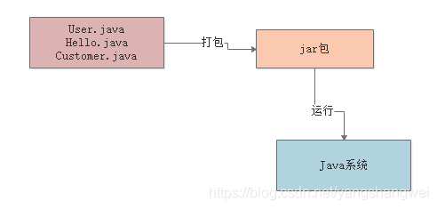

### 类装载子系统

接着下一步，JVM要运行这些“.class”字节码文件中的代码，那是不是首先得把这些“.class”文件中包含的各种类给加载进来？

这些“.class”文件不就是我们写好的一个一个的类吗？对不对？

此时就会有一个“类加载器”

此时会采用类加载器把编译好的那些“.class”字节码文件给加载到JVM中，然后供后续代码运行来使用。

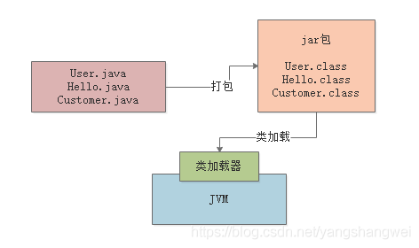

### 字节码执行引擎

接着，最后一步，JVM就会基于自己的**字节码执行引擎**，来执行加载到内存里的我们写好的那些类了

比如你的代码中有一个“main()”方法，那么JVM就会从这个“main()”方法开始执行里面的代码。

需要哪个类的时候，就会使用类加载器来加载对应的类，反正对应的类就在“.class”文件中。

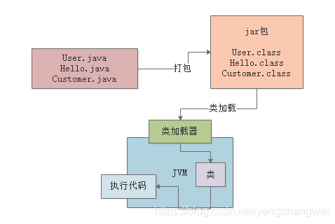

## 类装载子系统

类加载过程非常的琐碎复杂，但是对于平时从工作中实用的角度来说，主要是把握他的核心工作原理就可以。

### JVM在什么情况下会加载一个类

一个类从加载到使用，一般会经历下面的这个过程：

加载 -> 验证 -> 准备 -> 解析 -> 初始化 -> 使用 -> 卸载

所以首先要搞明白的第一个问题，就是JVM在执行我们写好的代码的过程中，一般在什么情况下会去加载一个类呢？

也就是说，啥时候会从“.class”字节码文件中加载这个类到JVM内存里来。

>  在你的代码中用到这个类的时候。 

举个简单的例子，比如下面你有一个类（Kafka.class），里面有一个“main()”方法作为主入口。

那么一旦你的JVM进程启动之后，它一定会先把你的这个类（Kafka.cass）加载到内存里，然后从“main()”方法的入口代码开始执行。

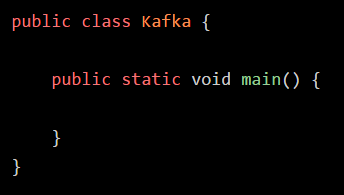

画个图，感受下

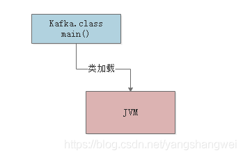

接着假设上面的代码中，出现了如下的这么一行代码：

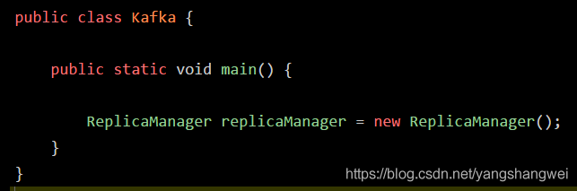

这时可能大家就想了，你的代码中明显需要使用“ReplicaManager”这个类去实例化一个对象，此时必须得把“ReplicaManager.class”字节码文件中的这个类加载到内存里来啊！是不是？

所以这个时候就会触发JVM通过类加载器，从“ReplicaManager.class”字节码文件中加载对应的类到内存里来使用，这样代码才能跑起来。

我们来看下面的图：

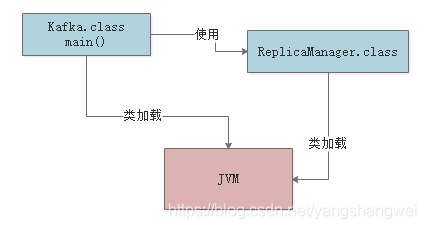

### 验证、准备和初始化的过程

这三个概念 ，这里的细节很多很繁琐，我们先简单了解下

#### 验证阶段

简单来说，这一步就是根据Java虚拟机规范，来校验你加载进来的“.class”文件中的内容，是否符合指定的规范。

这个相信很好理解，假如说，你的“.class”文件被人篡改了，里面的字节码压根儿不符合规范，那么JVM是没法去执行这个字节码的！

所以把“.class”加载到内存里之后，必须先验证一下，校验他必须完全符合JVM规范，后续才能交给JVM来运行。

下面用一张图，展示了这个过程：

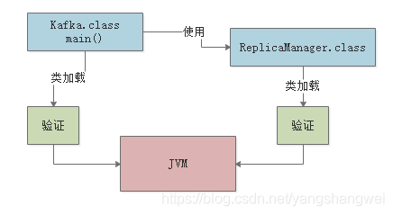

#### 准备阶段

这个阶段其实也很好理解，咱们都知道，我们写好的那些类，其实都有一些类变量

比如下面的这个“ReplicaManager”类：

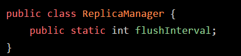

假设你有这么一个“ReplicaManager”类，他的“ReplicaManager.class”文件内容刚刚被加载到内存之后，会进行验证，确认这个字节码文件的内容是规范的

接着就会进行准备工作。

这个准备工作，其实就是**给这个“ReplicaManager”类分配一定的内存空间**

然后**给他里面的类变量（也就是static修饰的变量）分配内存空间，来一个默认的初始值**

比如上面的示例里，就会给“flushInterval”这个类变量分配内容空间，给一个“0”这个初始值。

整个过程，如下图所示：

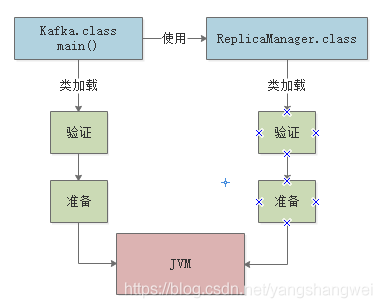

#### 解析阶段

这个阶段干的事儿，实际上是把**符号引用替换为直接引用的过程**，其实这个部分的内容很复杂，涉及到JVM的底层, 暂时不展开。

从实用角度而言，对很多同学在工作中实践JVM技术其实也用不到，所以这里大家就暂时知道有这么一个阶段就可以了。

如下图

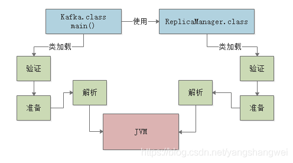

> 其实这三个阶段里，最核心的就是“准备阶段” ，因为这个阶段是给加载进来的类分配好了内存空间，类变量也分配好了内存空间，并且给了默认的初始值，这个概念，大家心里一定要牢记。

### 核心阶段：初始化

#### 主要职责

之前说过，在准备阶段时，就会把我们的“ReplicaManager”类给分配好内存空间

另外他的一个类变量“flushInterval”也会给一个默认的初始值“0”，那么接下来，在初始化阶段，就会正式执行我们的类初始化的代码了。

那么什么是类初始化的代码呢？我们来看看下面这段代码：

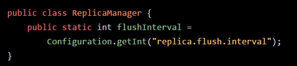

大家可以看到，对于“flushInterval”这个类变量，我们是打算通过Configuration.getInt(“replica.flush.interval”)这段代码来获取一个值，并且赋值给他的

但是在准备阶段会执行这个赋值逻辑吗？

NO！在**准备阶段**，仅仅是给“flushInterval”类变量**开辟一个内存空**间，然后给个**初始值0** 罢了。

那么这段赋值的代码什么时候执行呢？答案是在**初始化 阶段来执行**。

------

在这个阶段，就会执行类的初始化代码，比如上面的 `Configuration.getInt("replica.flush.interval")` 代码就会在这里执行，完成一个配置项的读取，然后**赋值给这个类变量**“flushInterval”。

另外比如下图的static静态代码块，也会在这个阶段来执行。

类似下面的代码语义，可以理解为类初始化的时候，调用“loadReplicaFromDish()”方法从磁盘中加载数据副本，并且放在静态变量“replicas”中：

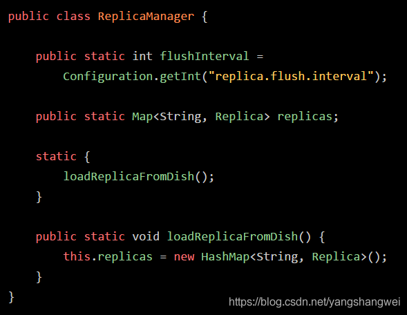

那么搞明白了类的初始化是什么，就得来看看类的初始化的规则了。

#### 什么时候会初始化一个类？

一般来说有以下一些时机：比如“new ReplicaManager()”来实例化类的对象了，此时就会触发类的加载到初始化的全过程，把这个类准备好，然后再实例化一个对象出来；

或者是包含“main()”方法的主类，必须是立马初始化的。

此外，这里还有一个非常重要的规则，就是**如果初始化一个类的时候，发现他的父类还没初始化，那么必须先初始化他的父类**

如下

如果你要“new ReplicaManager()”初始化这个类的实例，那么会加载这个类，然后初始化这个类

但是初始化这个类之前，发现AbstractDataManager作为父类还没加载和初始化，那么必须先加载这个父类，并且初始化这个父类。

这个规则，大家必须得牢记，再来一张图，借助图片来进行理解：

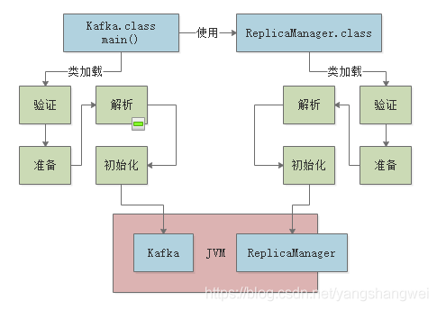

## 类加载器

现在相信大家都搞明白了整个类加载从触发时机到初始化的过程了，接着给大家说一下类加载器的概念

因为实现上述过程，那必须是依靠类加载器来实现的

那么Java里有哪些类加载器呢？简单来说有下面几种：

------

### 启动类加载器 Bootstrap ClassLoader

>  Bootstrap ClassLoader，他主要是负责加载我们在机器上安装的Java目录下的核心类的 

在你的Java安装目录下，就有一个“lib”目录， Java最核心的一些类库，支撑你的Java系统的运行。

所以一旦你的JVM启动，那么首先就会依托启动类加载器，去加载你的Java安装目录下的“lib”目录中的核心类库。

------

### 扩展类加载器 Extension ClassLoader

>  Extension ClassLoader，这个类加载器其实也是类似的，就是你的Java安装目录下，有一个“lib\ext”目录 

大致就理解为去加载你写好的Java代码吧，这个类加载器就负责加载你写好的那些类到内存里。

------

### 应用程序类加载器 Application ClassLoader

>  Application ClassLoader，这类加载器就负责去加载“ClassPath”环境变量所指定的路径中的类 

------

### 自定义类加载器

>  除了上面那几种之外，还可以自定义类加载器，去根据你自己的需求加载你的类。 

------

## 双亲委派机制

JVM的类加载器是有亲子层级结构的，就是说启动类加载器是最上层的，扩展类加载器在第二层，第三层是应用程序类加载器，最后一层是自定义类加载器。

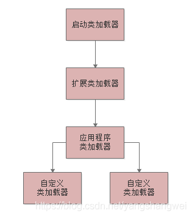

 然后，基于这个亲子层级结构，就有一个**双亲委派的机制**

什么意思呢？

>  就是假设你的应用程序类加载器需要加载一个类，他首先会委派给自己的父类加载器去加载，最终传导到顶层的类加载器去加载 
>
>  但是如果父类加载器在自己负责加载的范围内，没找到这个类，那么就会下推加载权利给自己的子类加载器。 

用一个例子来说明一下:

比如你的JVM现在需要加载“ReplicaManager”类，此时应用程序类加载器会问问自己的爸爸，也就是扩展类加载器，你能加载到这个类吗？

然后扩展类加载器直接问自己的爸爸，启动类加载器，你能加载到这个类吗？

启动类加载器心想，我在Java安装目录下，没找到这个类啊，自己找去！

然后，就下推加载权利给扩展类加载器这个儿子，结果扩展类加载器找了半天，也没找到自己负责的目录中有这个类。

这时他很生气，说：明明就是你应用程序加载器自己负责的，你自己找去。

然后应用程序类加载器在自己负责的范围内，比如就是你写好的那个系统打包成的jar包吧，一下子发现，就在这里！然后就自己把这个类加载到内存里去了。

这就是所谓的双亲委派模型：先找父亲去加载，不行的话再由儿子来加载。

这样的话，可**以避免多层级的加载器结构重复加载某些类。**

最后，给大家来一张图图，感受一下类加载器的双亲委派模型。

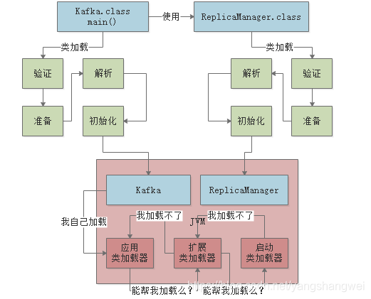

## 思考

1. 如何对“.class”文件处理保证不被人拿到以后反编译获取公司源代码？

>  首先你编译时，就可以采用一些小工具对字节码加密，或者做混淆等处理 

现在有很多第三方公司，都是专门做商业级的字节码文件加密的，所以可以付费购买他们的产品。

>  然后在类加载的时候，对加密的类，考虑采用自定义的类加载器来解密文件即可，这样就可以保证你的源代码不被人窃取。 

------

1. Tomcat的类加载机制应该怎么设计，才能把我们动态部署进去的war包中的类，加载到Tomcat自身运行的JVM中，然后去执行那些我们写好的代码呢？

首先Tomcat的 类加载器体系如下图所示，他是自定义了很多类加载器的。

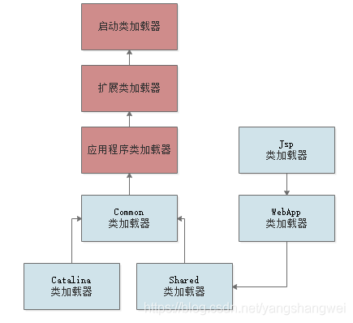

Tomcat自定义了Common、Catalina、Shared等类加载器，其实就是用来加载Tomcat自己的一些核心基础类库的。

然后Tomcat为每个部署在里面的Web应用都有一个对应的WebApp类加载器，负责加载我们部署的这个Web应用的类

至于Jsp类加载器，则是给每个JSP都准备了一个Jsp类加载器。

而且大家一定要记得，Tomcat是打破了双亲委派机制的

每个WebApp负责加载自己对应的那个Web应用的class文件，也就是我们写好的某个系统打包好的war包中的所有class文件，不会传导给上层类加载器去加载

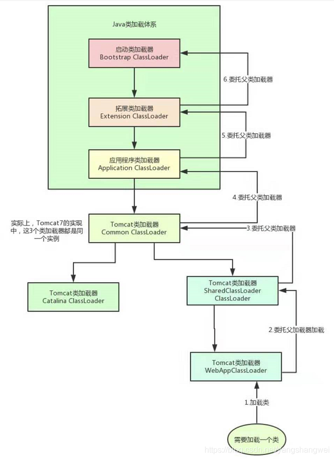