# JVM分代模型

## 背景引入

介绍一下JVM内存的一个分代模型：年轻代、老年代、永久代。

们在代码里创建的对象，都会进入到Java堆内存中，比如下面的代码：

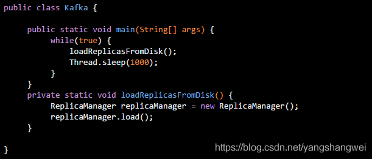

这段代码，我们稍微做了点改动，在main()方法里，会周期新的执行loadReplicasFromDisk()方法，加载副本数据。

首先一旦执行main()方法，那么就会把main()方法的栈帧压入main线程的Java虚拟机栈

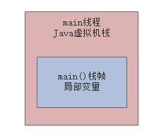

然后每次在while循环里，调用loadReplicasFromDisk()方法，就会把loadReplicasFromDisk()方法的栈帧压入自己的Java虚拟机栈

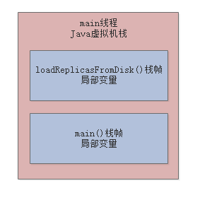

接着在执行loadReplicasFromDisk()方法的时候，会在Java堆内存里会创建一个ReplicaManager对象实例

而且loadReplicasFromDisk()方法的栈帧里会有“replicaManager”局部变量去引用Java堆内存里的ReplicaManager对象实例

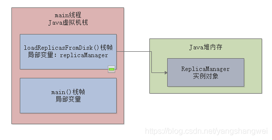

然后就会执行ReplicaManager对象的load()方法。

------

## 大部分对象其实存活周期极短

现在有一个问题，在上面代码中，那个ReplicaManager对象，实际上属于短暂存活的这么一个对象

大家可以观察一下，在loadReplicasFromDisk()方法中创建这个对象，然后执行ReplicaManager对象的load()方法，然后执行完毕之后，loadReplicasFromDisk()方法就会结束。

一旦方法结束，那么loadReplicasFromDisk()方法的栈帧就会出栈，如下图。

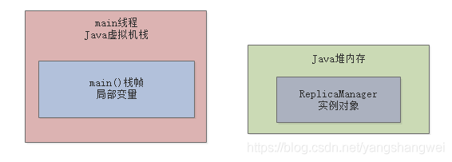

然后接着上篇文章已经说过，此时一旦没人引用这个ReplicaManager对象了，就会被JVM的垃圾回收线程给回收掉，释放内存空间，如下图。

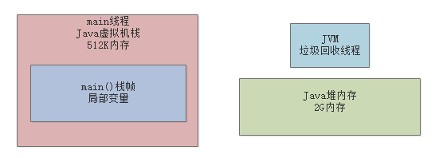

然后在main()方法的while循环里，下一次循环再次执行loadReplicasFromDisk()方法的时候，又会走一遍上面那个过程，把loadReplicasFromDisk()方法的栈帧压入Java虚拟机栈，然后构造一个ReplicaManager实例对象放在Java堆里。

一旦执行完ReplicaManager对象的load()方法之后，loadReplicasFromDisk()方法又会结束，再次出栈，然后垃圾回收释放掉Java堆内存里的ReplicaManager对象。

所以其实这个ReplicaManager对象，在上面的代码中，是一个存活周期极为短暂的对象

可能每次执行loadReplicasFromDisk()方法的时候，被创建出来，然后执行他的load()方法，接着可能1毫秒之后，就被垃圾回收掉了。

所以从这段代码就可以明显看出来，大部分在我们代码里创建的对象，其实都是存活周期很短的。这种对象，其实在我们写的Java代码中，占到绝大部分的比例。

------

## 少数对象是长期存活的

但是我们来看另外一段代码，假如说咱们用下面的这种方式来实现同样的功能：

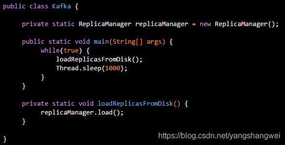

上面那段代码的意思，就是给Kafka这个类定义一个静态变量，也就是“replicaManager”，这个Kafka类是在JVM的方法区里的

然后让“replicaManager”引用了一个在Java堆内存里创建的ReplicaManager实例对象，如下图。

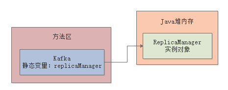

接着在main()方法中，就会在一个while循环里，不停的调用ReplicaManager对象的load()方法，做成一个周期性运行的模式。

这个时候，我们就要来思考一下，这个ReplicaManager实例对象，他是会一直被Kafka的静态变量引用的，然后会一直驻留在Java堆内存里，是不会被垃圾回收掉的。

因为这个实例对象他需要长期被使用，周期新的被调用load()方法，所以他就成为了一个长时间存在的对象。

那么类似这种被类的静态变量长期引用的对象，他需要长期停留在Java堆内存里，这这种对象就是生存周期很长的对象，他是轻易不会被垃圾回收的，他需要长期存在，不停的去使用他。

------

## JVM分代模型：年轻代和老年代

接下来就要进入今天的核心主题了，就是JVM的分代模型，年轻代和老年代。

现在大家已经看到，其实根据你写代码方式的不同，采用不同的方式来创建和使用对象，其实对象的生存周期是不同的。

所以JVM将Java堆内存划分为了两个区域，一个是年轻代，一个是老年代。

其中年轻代，顾名思义，就是把第一种代码示例中的那种，创建和使用完之后立马就要回收的对象放在里面

然后老年代呢，就是把第二种代码示例中的那种，创建之后需要一直长期存在的对象放在里面，大家看下图

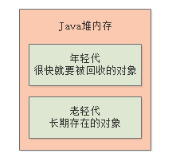

比如下面的代码，我们再次来改造一下，再结合图，大家会看的更加的明确一些。

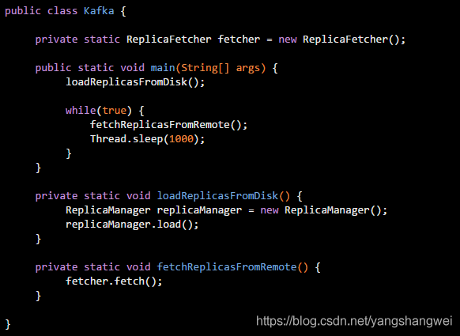

上面那段代码稍微复杂了点，我们解释一下

Kafka的静态变量“fetcher”引用了ReplicaFetcher对象，这是长期需要驻留在内存里使用的

这个对象会在年轻代里停留一会儿，但是最终会进入老年代，大家看下图。

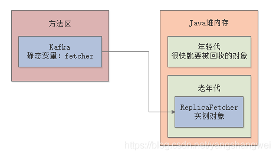

进入main()方法之后，会先调用loadReplicasFromDisk()方法，业务含义是系统启动就从磁盘加载一次副本数据，这个方法的栈帧会入栈

然后在这个方法里面创建了一个ReplicaManager对象，这个对象他是用完就会回收，所以是会放在年轻代里的，由栈帧里的局部变量来引用

此时对应着下图：

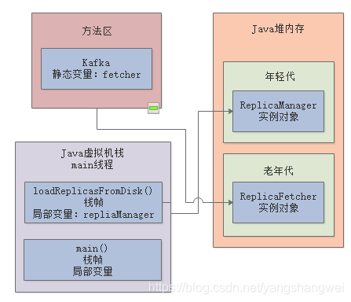

 然后一旦loadReplicasFromDisk()方法执行完毕了，方法的栈帧就会出栈，对应的年轻代里的ReplicaManager对象也会被回收掉，如下图：

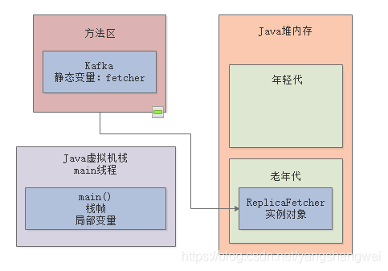

但是接着会执行一段while循环代码，他会周期性的调用ReplicaFetcher的fetch()方法，去从远程加载副本数据。

所以ReplicaFetcher这个对象因为被Kafka类的静态变量fetcher给引用了，所以他会长期存在于老年代里的，持续被使用。

------

## 为什么要分成年轻代和老年代？

相信看完这篇文章，大家就一定看明白了，什么样的对象是短期存活的对象，什么样的对象是长期存在的对象，然后如何分别存在于年轻代和老年代里。

那么为什么需要这么区分呢？

因为这跟垃圾回收有关，对于年轻代里的对象，他们的特点是创建之后很快就会被回收，所以需要用一种垃圾回收算法

对于老年代里的对象，他们的特点是需要长期存在，所以需要另外一种垃圾回收算法，所以需要分成两个区域来放不同的对象。

很多人又会问了，你不是说“ReplicaFetcher”这个长期存在的对象，刚开始也在年轻代，后来才会进入老年代么？那他到底什么时候进入老年代？

别急，后面娓娓道来

然后还有人还会问了，那么年轻代和老年代分别怎么进行垃圾回收呢？

别急， 我们先主要关注JVM的内存划分的细节，搞明白对象是如何在不同的内存区域里分配的就可以了，学习要循序渐进。 后面娓娓道来

------

## 什么是永久代？

很简单，JVM里的永久代其实就是我们之前说的方法区

上面那个图里的方法区，其实就是所谓的永久代，你可以认为永久代就是放一些类信息的。

这个话题现在不用过多考虑，后续涉及到的时候，我们会讲到的。

------

## 思考题

每个线程都有Java虚拟机栈，里面也有方法的局部变量等数据，这个Java虚拟机栈需要进行垃圾回收吗？为什么？

>  其实这是一个偏题，JVM里垃圾回收针对的是新生代，老年代，还有方法区（永久代），不会针对方法的栈帧。 
>
>  方法一旦执行完毕，栈帧出栈，里面的局部变量直接就从内存里清理掉了。