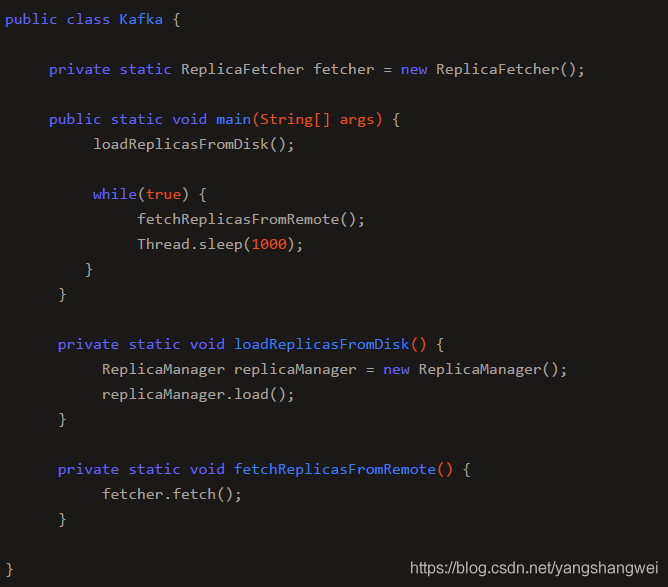
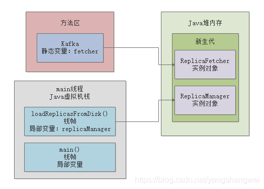
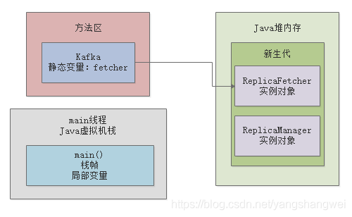
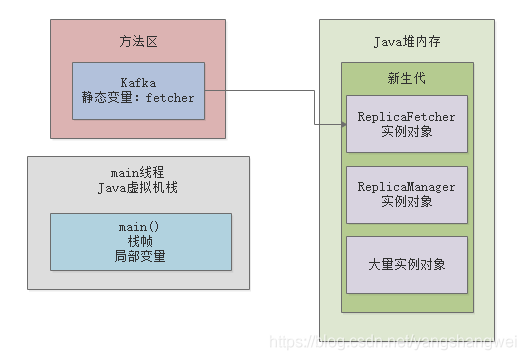
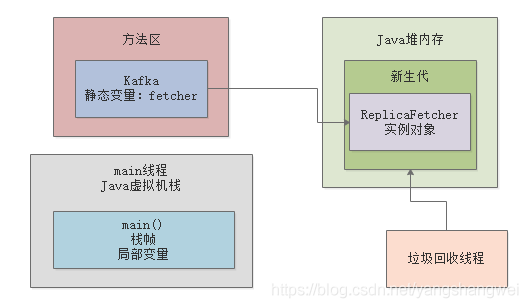
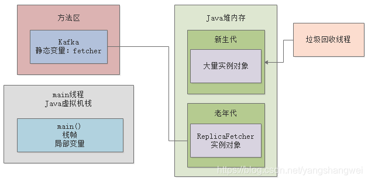

# 对象在JVM内存中的分配和流转

## 前文回顾

经过上一篇文章铺垫了一些对象分配的基础知识后，想必大家现在都心里非常有数了，咱们平时代码里创建出来的对象，一般就是两种：

-  一种是短期存活的，分配在Java堆内存之后，迅速使用完就会被垃圾回收 
-  另外一种是长期存活的，需要一直生存在Java堆内存里，让程序后续不停的去使用 

第一种短期存活的对象，是在Java堆内存的新生代里的。第二种长期存活的对象，是在Java堆内存的老年代里的。这个结论，想必大家都已经理解了

好，那么接下来我们就来聊聊，对象到底什么时候进入新生代？然后什么情况下会进入老年代？

------

## 大部分正常对象都优先在新生代分配内存

首先我们先来看上篇文章中的一段代码，稍微带着大家来理解一个概念：大部分的正常对象，都是优先在新生代分配内存的。

虽然我们看代码知道，类静态变量“fetcher”引用的那个“ReplicaFetcher”对象，是会长期存活在内存里的

但是哪怕是这种对象，其实刚开始你通过“new ReplicaFetcher()”代码来实例化一个对象时，他也是分配在新生代里的。

包括在“loadReplicasFromDisk()”方法中创建的“ReplicaManager”实例对象，也都是一样分配在新生代里的

同样，我们以一张图，来展示一下：

## 到底什么情况下会触发新生代的垃圾回收？

现在咱们来假设一个场景，大家应该都知道，一旦“loadReplicasFromDisk()”方法执行完毕之后，这个方法的栈帧出栈，会导致没有任何局部变量引用那个“ReplicaManager”实例对象了。

此时可能会如下图所示：

那么此时就一定会立即发生垃圾回收，去回收掉Java堆内存里那个没人使用的“ReplicaManager”实例对象吗？

**NO**！

大家别想的那么简单了，实际上垃圾回收他也得有点触发的条件。

其中一个比较常见的场景可能是这样的，假设我们写的代码中创建了N多对象，然后导致Java堆内存里囤积了大量的对象。

然后这些对象都是之前有人引用，比如各种各样的方法中的局部变量，但是现在也都没人引用了。

如下图所示

这个时候，如果新生代我们预先分配的内存空间，几乎都被全部对象给占满了！此时假设我们代码继续运行，他需要在新生代里去分配一个对象，怎么办？发现新生代里内存空间都不够了！

这个时候，就会触发一次新生代内存空间的垃圾回收，新生代内存空间的垃圾回收，也称之为“Minor GC”，有的时候我们也叫“Young GC”，他会尝试把新生代里那些没有人引用的垃圾对象，都给回收掉。

比如上图中，那个“ReplicaManager”实例对象，其实就是没有人引用的垃圾对象

此时就会当机立断，把“ReplicaManager”实例对象给回收掉，腾出更多的内存空间，然后放一个新的对象到新生代里去。

包括上图中那大量的实例对象，其实也都没人引用，在这个新生代垃圾回收的过程中，就会把这些垃圾对象也都回收掉。

其实话说回来，大家自己仔细回忆一下，我们**在代码中创建的大部分对象，其实都是这种使用之后立马就可以回收掉的生存周期极短的对象，是不是？**

可能我们会在新生代里分配大量的对象，但是使用完之后立马就没人引用了，此时新生代差不多满了

然后要分配新的对象的时候，发现新生代内存空间不足，就会触发一次垃圾回收，然后就把所有垃圾对象给干掉，腾出大量的内存空间

如下图所示：

## 长期存活的对象会躲过多次垃圾回收？

接着我们来看下一个问题，上图中大家都注意到了“ReplicaFetcher”实例对象，他是一个长期被“Kafka”类的静态变量“fetcher”引用的长期存活的对象。

所以虽然你的新生代可能随着系统的运行，不停的创建对象，然后让新生代变满，接着垃圾回收一次，大量对象被回收掉

但是你的这个“ReplicaFetcher”对象，他确是一直会存活在新生代里的。

因为他一直被“Kafka”类的静态变量给引用了，所以他不会被回收。那么此时JVM就有一条规定了

如果一个实例对象在新生代中，成功的在15次垃圾回收之后，还是没被回收掉，就说明他已经15岁了。

这是对象的年龄，每垃圾回收一次，如果一个对象没被回收掉，他的年龄就会增加1。

所以如果上图中的那个“ReplicaFetcher”对象在新生代中成功躲过10多次垃圾回收，成为一个“老年人”，那么就会被认为是会长期存活在内存里的对象。

然后他会被转移到Java堆内存的老年代中去，顾名思义，老年代就是放这些年龄很大的对象。

我们再来看一张图：

## 老年代会垃圾回收吗？

接着下一个问题就是，老年代里的那些对象会被垃圾回收吗？

答案是肯定的，因为老年代里的对象也有可能随着代码的运行，不再被任何人引用了，就需要被垃圾回收。

大家可以思考一下，如果随着类似上面的情况，越来越多的对象进入老年代，一旦老年代也满了，是不是就要对老年代垃圾回收了？

没错，这是肯定的，但是暂时我们先不用过多的去考虑这里的细节，后面我们会进行深入剖析。

------

## 关于新生代和老年代的对象分配，这就完了吗？

还有人会说，关于新生代和老年代的对象分配，这就结束了吗？

当然不是，我们这里仅仅是相较于之前的文章，更进一步给大家分析了一下对象分配的一些机制。

但是其实在对象分配这块，还有很多其他的复杂机制，比如：

-  新生代垃圾回收之后，因为存活对象太多，导致大量对象直接进入老年代 
-  特别大的超大对象直接不经过新生代就进入老年代 
-  动态对象年龄判断机制 
-  空间担保机制 
- - …

这部分内容结合案例，结合真实生产问题，把JVM各种底层细节带出来。

到这里 ，大家对对象内存分配，了解到这个程度就行了，给大家总结一下：

-  先理解对象优先分配在新生代 
-  新生代如果对象满了，会触发Minor GC回收掉没有人引用的垃圾对象 
-  如果有对象躲过了十多次垃圾回收，就会放入老年代里 
-  如果老年代也满了，那么也会触发垃圾回收，把老年代里没人引用的垃圾对象清理掉