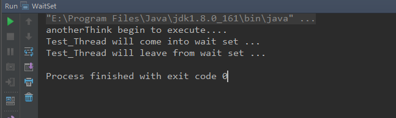

## 概述

官方指导： https://docs.oracle.com/javase/specs/jls/se7/html/jls-17.html

或者：

https://learning.oreilly.com/library/view/the-java-language/9780133260335/ch17lev1sec2.htm

## 关于wait set

1. Every object, in addition to having an associated monitor, has an associated wait set. A wait set is a set of threads.
2. A wait set is a set of threads.
3. When an object is first created, its wait set is empty. Elementary actions that add threads to and remove threads from wait sets are atomic. Wait sets are manipulated solely through the methods Object.wait, Object.notify, and Object.notifyAll.
4. Wait set manipulations can also be affected by the interruption status of a thread, and by the Thread class’s methods dealing with interruption. Additionally, the Thread class’s methods for sleeping and joining other threads have properties derived from those of wait and notification actions.

意思是说

1. 每个对象除具有关联的监视器外，还具有关联wait set。
2. wait set是一组线程
3. 首次创建对象时，其wait set为空。将线程添加到wait set中或从wait set中删除线程的基本操作是原子的。wait set完全通过方法操作Object.wait，Object.notify和Object.notifyAll
4. wait set操作也可能受线程的中断状态以及Thread处理中断的类的方法的影响。此外，Thread该类用于休眠和加入其他线程的方法具有从等待和通知操作的属性派生的属性。


## 示例

代码语言：javascript

复制

```javascript
package com.artisan.test;

import java.util.Optional;
import java.util.stream.IntStream;

public class WaitSet {

    // 显示定义一个锁
    private static final Object LOCK = new Object();

    public static void main(String[] args) throws InterruptedException {
        IntStream.rangeClosed(1, 10).forEach(i ->
                new Thread(String.valueOf("T_" + i)) {
                    @Override
                    public void run() {
                        synchronized (LOCK) {
                            try {
                                Optional.of(Thread.currentThread().getName() + " will come into wait set ..").ifPresent(System.out::println);
                                LOCK.wait();
                                Optional.of(Thread.currentThread().getName() + " will leave from wait set ...").ifPresent(System.out::println);
                            } catch (InterruptedException e) {
                                e.printStackTrace();
                            }
                        }
                    }
                }.start());

        // 主线程休眠一秒，确保上面的10个线程都start  ，不然的话 有可能 线程已经进入wait set ,10个线程还没都启动，就已经有线程离开 wait set了
        Thread.sleep(1_000);

        System.out.println("=====================10个线程启动完毕=======================");


        // 主线程中 每次notify 1个
        IntStream.rangeClosed(1, 10).forEach(i -> {
                    synchronized (LOCK) {
                        LOCK.notify();
                        try {
                            // 为了方便观察 休眠1秒
                            Thread.sleep(1_000);
                        } catch (InterruptedException e) {
                            e.printStackTrace();
                        }
                    }
                }
        );

        Thread.sleep(1_000);
        System.out.println("=====================OVER=======================");

    }

}
```

运行结果：


```javascript
T_1 will come into wait set ..
T_8 will come into wait set ..
T_7 will come into wait set ..
T_6 will come into wait set ..
T_5 will come into wait set ..
T_4 will come into wait set ..
T_3 will come into wait set ..
T_2 will come into wait set ..
T_10 will come into wait set ..
T_9 will come into wait set ..
=====================10个线程启动完毕=======================
T_1 will leave from wait set ...
T_8 will leave from wait set ...
T_7 will leave from wait set ...
T_4 will leave from wait set ...
T_5 will leave from wait set ...
T_6 will leave from wait set ...
T_10 will leave from wait set ...
T_2 will leave from wait set ...
T_3 will leave from wait set ...
T_9 will leave from wait set ...
=====================OVER=======================

Process finished with exit code 0
```

根据官网和我们的验证，总结一下

1. 所有的对象都会有一个wait set,用来存放调用了该对象wait方法之后进入block状态线程
2. 线程被notify之后，不一定立即得到执行
3. 线程从wait set中被唤醒顺序不一定是FIFO,啥顺序，JVM规范中并没有给出，各个虚拟机的厂商有各自的实现

------

## 思考

有个方法如下：


```javascript
 private static void anotherThink() {

        synchronized (LOCK) {
            System.out.println("anotherThink begin to execute....");
            try {
                Optional.of(Thread.currentThread().getName() + " will come into wait set ...").ifPresent(System.out::println);
                LOCK.wait();
            } catch (InterruptedException e) {
                e.printStackTrace();
            }

            Optional.of(Thread.currentThread().getName() + " will leave from wait set ...").ifPresent(System.out::println);

        }
    }
```

Q: 拿到锁后的第一件事情 是输出一行日志 `anotherThink begin to execute....` 当线程1，抢到锁后 ，调用wait，放弃了执行权。 如果线程1被唤醒时，肯定要先获取到锁才能够执行，那我们刚才说的 抢到锁后打印日志会不会被执行呢？

我们来验证下

main方法中 测试代码如下


```javascript
 public static void main(String[] args) throws InterruptedException {


        /**  
		new Thread("Test_Thread") {
	            @Override
	            public void run() {
	                anotherThink();
	            }
	        }.start() 
	    **/
        

        new Thread(() ->  anotherThink()  ,"Test Thread").start();


        Thread.sleep(1000);

        synchronized (LOCK) {
            LOCK.notify();
        }


    }
```

运行日志



根据测试结论可知，是不会打印第一行的。 而是紧接着wait后面的代码执行，主要是源于JVM内部会记录上次代码的执行地址，进行地址恢复，继续执行。

A： 所以线程被唤醒后，必须重新获取锁，但是JVM内部会进行地址恢复，直接继续上次线程后续的逻辑