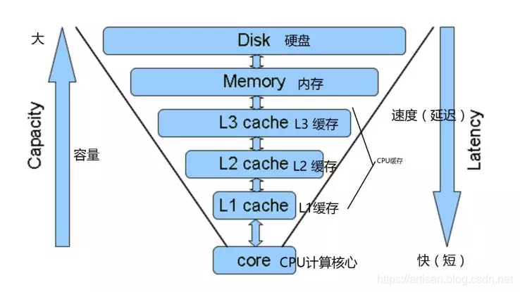
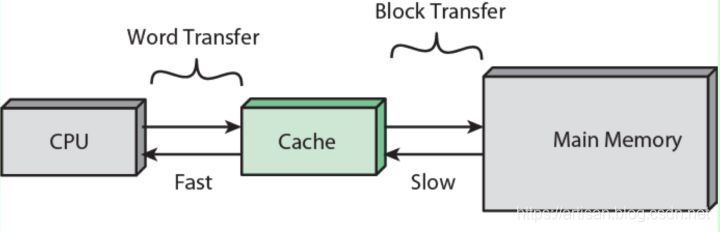
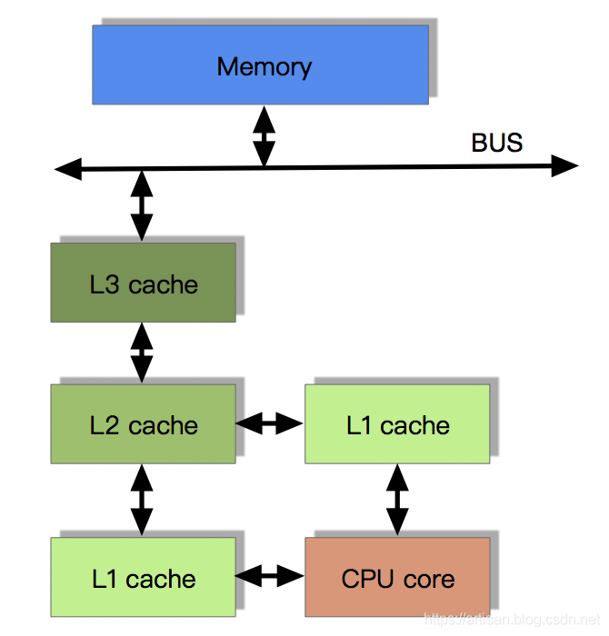
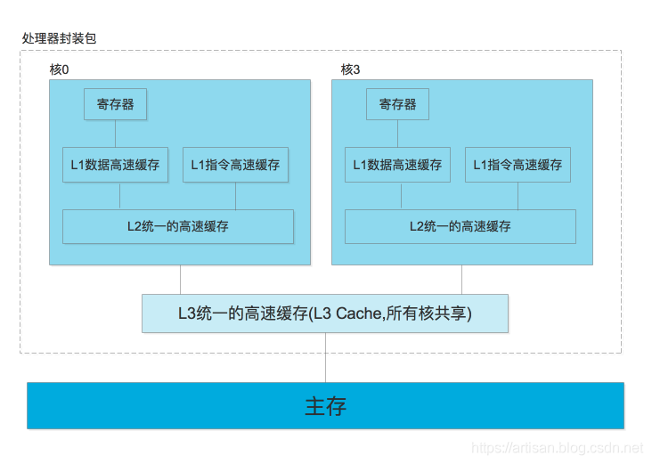
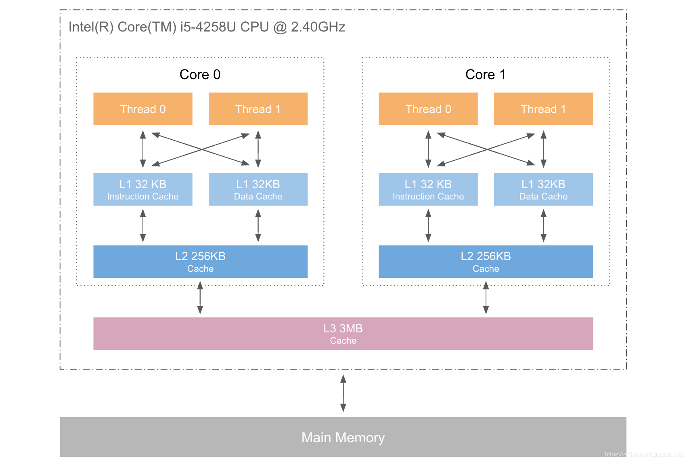
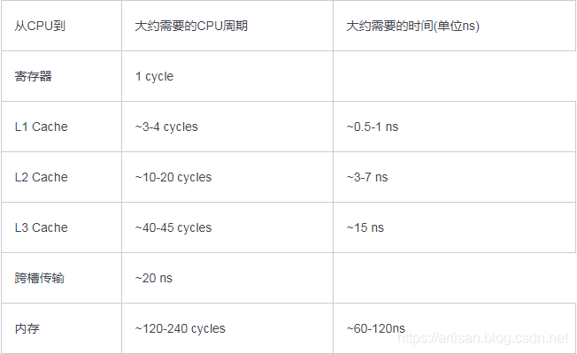
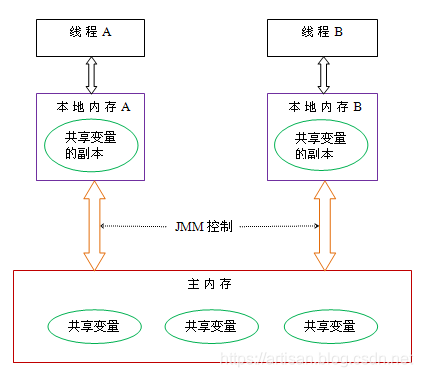

## 从CPU到内存模型

[高并发编程-通过volatile重新认识CPU缓存 和 Java内存模型（JMM）](https://cloud.tencent.com/developer/article/1862628?from_column=20421&from=20421)

说到java内存模型， 我们先探讨下 内存模型（Memory Model） ， 内存模型是和计算机硬件相关的一个概念。

先简单来了解下 计算机内存模型，然后再来引出 Java内存模型和计算机内存模型的关联关系。

计算机在执行程序的时候，每条指令都是在CPU中执行的，而执行的时候，不可避免的要和数据进行交互。 数据存在哪里呢 ？--------->存放在主存当中的，即计算机的物理内存。 （存在内存中对于提高计算机的执行效率必不可少）

最开始， CPU和内存相安无事，内存的速度还能匹配的上CPU的运行速度。 随着CPU技术的发展，CPU的执行速度越来越快。但内存的技术并没有质的提高，所以从内存中读取和写入数据的过程和CPU的执行速度比起来差距越来越大,导致CPU每次操作内存都要耗时很长。

所以为了解决这个问题，引入了高速缓存

所以程序的执行过程变为：

1. 程序以及数据被加载到主内存
2. 指令和数据被加载到CPU的高速缓存
3. CPU执行指令，把结果写到高速缓存
4. 高速缓存中的数据写回主内存

随着CPU能力的不断提升， CPU的运算速度超越了1级缓存的数据I\O能力，CPU厂商又引入了多级的缓存结构。

按照数据读取顺序和与CPU结合的紧密程度，CPU缓存可以分为一级缓存（L1），二级缓存（L3），部分高端CPU还具有三级缓存（L3），每一级缓存中所储存的全部数据都是下一级缓存的一部分。

在有了多级缓存之后，程序的执行就变成了：

当CPU要读取一个数据时，首先从一级缓存中查找，如果没有找到再从二级缓存中查找，如果还是没有就从三级缓存或内存中查找。

单核CPU只含有一套L1，L2，L3缓存；

多核CPU，则每个核心都含有一套L1（甚至和L2）缓存，而 共享L3（或者和L2）缓存。

- L1是最接近CPU的，它容量最小、例如32K、速度最快，每个核上都有一个L1 Cache（准确地说每个核上有两个L1 Cache，一个存数据 L1d Cache，一个存指令 L1i Cache）。
- L2 Cache 容量更大一些、例如256K、速度要稍慢一些，一般情况下每个核上都有一个独立的L2 Cache；
- L3 Cache是三级缓存中最大的一级、例如12MB、同时也是最慢的一级，在同一个CPU插槽之间的核共享一个L3 Cache。

为了高效地存取缓存，不是简单随意地将单条数据写入缓存的。

缓存是由缓存行组成的，典型的一行是64字节。**CPU存取缓存都是按行为最小单位操作的**。一个Java long型占8字节，所以从一条缓存行上可以获取到8个long型变量。那么如果要访问一个long类型数组，当有一个long元素对象被加载到cache中，将会无消耗地加载了另外7个，所以可以非常快地遍历数组。

由于多核是可以并行的，可能会出现多个线程同时写各自的缓存的情况，而各自的cache之间的数据就有可能不同。

还有一种硬件问题 ： 为了使处理器内部的运算单元能够尽量的被充分利用，处理器可能会对输入代码进行乱序执行处理。这就是处理器优化。

除了处理器会对代码进行优化乱序处理，编程语言的编译器也会有类似的优化，比如Java虚拟机的即时编译器（JIT）也会做指令重排。

可想而知，如果任由处理器优化和编译器对指令重排的话，就可能导致各种各样的问题。

如何解决呢？ 为了解决这个问题 ------------------------> 引入了 内存模型

------

## 内存模型如何确保缓存一致性

内存模型到底是怎么保证缓存一致性的呢 ，通常有如下了两种方案

1、通过在总线加LOCK#锁的方式

2、通过缓存一致性协议（Cache Coherence Protocol）

早期的CPU，通过在总线上加LOCK#锁的形式来解决缓存不一致的问题，但是在锁住总线期间，其他CPU无法访问内存，会导致效率低下。 所以引入了第二种 缓存一致性协议（Cache Coherence Protocol）。

缓存一致性协议 ， 最出名的就是Intel 的MESI协议，MESI协议保证了每个缓存中使用的共享变量的副本是一致的。

MESI的核心的思想：**当CPU写数据时，如果发现操作的变量是共享变量，即在其他CPU中也存在该变量的副本，会发出信号通知其他CPU将该变量的缓存行置为无效状态，因此当其他CPU需要读取这个变量时，发现自己缓存中缓存该变量的缓存行是无效的，那么它就会从内存重新读取**。

在MESI协议中，每个缓存可能有有4个状态，它们分别是：

- M(Modified)：这行数据有效，数据被修改了，和内存中的数据不一致，数据只存在于本Cache中。
- E(Exclusive)：这行数据有效，数据和内存中的数据一致，数据只存在于本Cache中。
- S(Shared)：这行数据有效，数据和内存中的数据一致，数据存在于很多Cache中。
- I(Invalid)：这行数据无效。

MESI协议，可以保证缓存的一致性，但是无法保证实时性。

------

## 并发变成需要解决的问题 （原子性、可见性、有序性）

原子性是指在一个操作中就是cpu不可以在中途暂停然后再调度，既不被中断操作，要不执行完成，要不就不执行。

 可见性是指当多个线程访问同一个变量时，一个线程修改了这个变量的值，其他线程能够立即看得到修改的值。

 有序性即程序执行的顺序按照代码的先后顺序执行。

结合上面所说的，可以理解为： 缓存一致性问题—>可见性问题。处理器优化会导致原子性问题的。指令重排即会导致有序性问题

------

## 内存模型需要解决的问题

为了保证共享内存的正确性（**可见性、有序性、原子性**），内存模型定义了共享内存系统中多线程程序读写操作行为的规范。通过这些规则来规范对内存的读写操作，从而保证指令执行的正确性。它与处理器有关、与缓存有关、与并发有关、与编译器也有关。他解决了CPU多级缓存、处理器优化、指令重排等导致的内存访问问题，保证了并发场景下的一致性、原子性和有序性。

内存模型解决并发问题主要采用两种方式：**限制处理器优化和使用内存屏障。**

------

## Java内存模型

计算机内存模型，这是解决多线程场景下并发问题的一个重要规范。那么实现上，不同的编程语言，可能有所不同。

Java内存模型（Java Memory Model ,JMM）就是一种符合内存模型规范的，屏蔽了各种硬件和操作系统的访问差异的，保证了Java程序在各种平台下对内存的访问都能保证效果一致的机制及规范。

 我们这里指的是 JDK 5 开始使用的新的内存模型JSR-133: [JavaTM Memory Model and Thread Specification](https://cloud.tencent.com/developer/tools/blog-entry?target=http%3A%2F%2Fwww.cs.umd.edu%2F~pugh%2Fjava%2FmemoryModel%2Fjsr133.pdf&objectId=1862630&objectType=1&isNewArticle=undefined)

Java内存模型规定了所有的共享变量都存储在主内存中，每条线程还有自己的工作内存，线程的工作内存中保存了该线程中是用到的变量的主内存副本拷贝，线程对变量的所有操作都必须在工作内存中进行，而不能直接读写主内存。不同的线程之间也无法直接访问对方工作内存中的变量，线程间变量的传递均需要自己的工作内存和主存之间进行[数据同步](https://cloud.tencent.com/product/datainlong?from_column=20065&from=20065)进行。

JMM就作用于工作内存和主存之间数据同步过程。JMM规定了如何做数据同步以及什么时候做数据同步。

故： JMM是一种规范，目的是解决由于多线程通过共享内存进行通信时，存在的本地内存数据不一致、编译器会对代码指令重排序、处理器会对代码乱序执行等带来的问题。

------

## JMM的API实现

Java中提供了很多和并发处理相关的关键字，比如volatile、synchronized、final、j.u.c包 等 ，这些关键字或者包就是Java内存模型封装了底层实现后，供开发者直接使用

------

### 原子性 synchronized

在Java中可以使用synchronized来保证方法和代码块内的操作是原子性的。 为了保证原子性，synchronized提供了两个高级的字节码指令monitorenter和monitorexit 。 具体细节另外开篇讨论。

------

### 可见性 volatile 、 synchronized 、 final

Java内存模型是通过在变量修改后将新值同步回主内存，在变量读取前从主内存刷新变量值的这种依赖主内存作为传递媒介的方式来实现的。

Java中的volatile关键字提供了一个功能，那就是被其修饰的变量在被修改后可以立即同步到主内存，被其修饰的变量在每次是用之前都从主内存刷新。因此，可以使用volatile来保证多线程操作时变量的可见性。

除了volatile，Java中的synchronized和final两个关键字也可以实现可见性 。

------

### 有序性 synchronized 、volatile

在Java中，可以使用synchronized和volatile来保证多线程之间操作的有序性。实现方式有所区别：

volatile关键字会禁止指令重排。synchronized关键字保证同一时刻只允许一条线程操作。