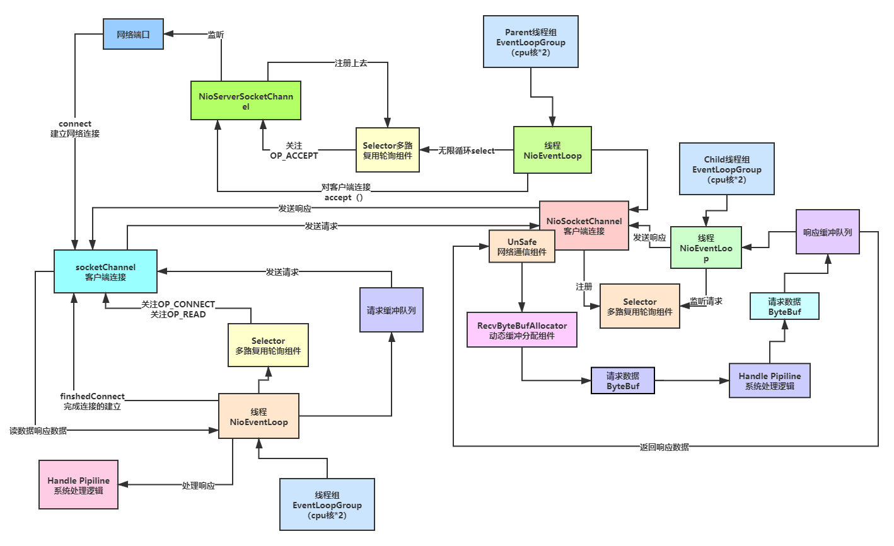
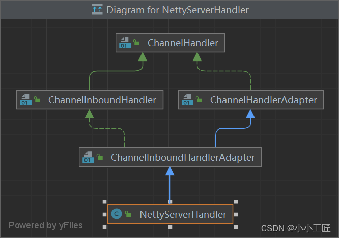
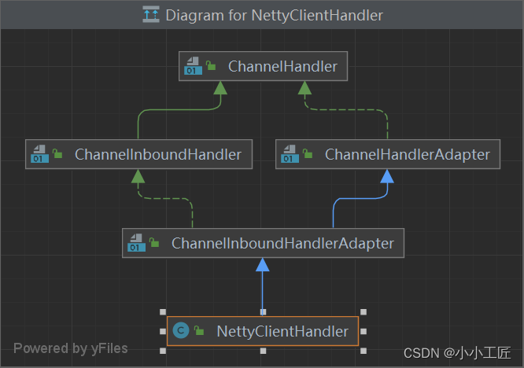
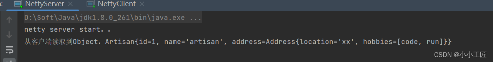

# Netty与Protostuff：打造高效的网络通信



### Pom

```java
    	<dependency>
            <groupId>com.dyuproject.protostuff</groupId>
            <artifactId>protostuff-api</artifactId>
            <version>1.2.2</version>
        </dependency>
        <dependency>
            <groupId>com.dyuproject.protostuff</groupId>
            <artifactId>protostuff-core</artifactId>
            <version>1.2.2</version>
        </dependency>
        <dependency>
            <groupId>com.dyuproject.protostuff</groupId>
            <artifactId>protostuff-runtime</artifactId>
            <version>1.2.2</version>
        </dependency>
```

### Server & Client

```java
package com.artisan.codec.protostuff;
 
import io.netty.bootstrap.ServerBootstrap;
import io.netty.channel.ChannelFuture;
import io.netty.channel.ChannelInitializer;
import io.netty.channel.ChannelPipeline;
import io.netty.channel.EventLoopGroup;
import io.netty.channel.nio.NioEventLoopGroup;
import io.netty.channel.socket.SocketChannel;
import io.netty.channel.socket.nio.NioServerSocketChannel;

/**
 * @author 小工匠
 * @version 1.0
 * @mark: show me the code , change the world
 */
// 定义Netty服务器类
public class NettyServer {
    // main方法为程序入口点
    public static void main(String[] args) throws Exception {
        // 创建主从线程组，用于处理Netty的事件循环
        EventLoopGroup bossGroup = new NioEventLoopGroup(1);
        EventLoopGroup workerGroup = new NioEventLoopGroup();

        try {
            // 创建ServerBootstrap实例，用于设置服务器参数
            ServerBootstrap serverBootstrap = new ServerBootstrap();
            // 配置服务器线程组
            serverBootstrap.group(bossGroup, workerGroup)
                    // 设置使用的Channel类型
                    .channel(NioServerSocketChannel.class)
                    // 设置Channel初始化处理器
                    .childHandler(new ChannelInitializer<SocketChannel>() {
                        @Override
                        protected void initChannel(SocketChannel ch) throws Exception {
                            // 获取Channel的Pipeline
                            ChannelPipeline pipeline = ch.pipeline();
                            // 添加自定义的处理器
                            pipeline.addLast(new NettyServerHandler());
                        }
                    });

            // 打印启动信息
            System.out.println("netty server start。。");
            // 绑定端口并启动服务器
            ChannelFuture channelFuture = serverBootstrap.bind(9876).sync();
            // 等待服务器Channel关闭
            channelFuture.channel().closeFuture().sync();
        } finally {
            // 优雅地关闭主从线程组
            bossGroup.shutdownGracefully();
            workerGroup.shutdownGracefully();
        }
    }
}
```

这段代码首先设置了两个`EventLoopGroup`，一个用于接受连接（boss），另一个用于处理已接受连接的IO操作（worker）。然后创建了一个`ServerBootstrap`实例来配置和启动[服务器](https://cloud.tencent.com/product/cvm/?from_column=20065&from=20065)。在`ServerBootstrap`中指定了使用的`EventLoopGroup`、`Channel`类型以及子`Channel`的初始化处理器。初始化处理器中添加了一个自定义的`NettyServerHandler`，这应该是处理网络事件和业务逻辑的地方。

服务器启动后，会绑定到本地端口9876，并等待连接。程序最后会优雅地关闭线程组，释放资源。

需要注意的是，这段代码缺少了`NettyServerHandler`类的定义，这应该是处理网络事件和业务逻辑的具体实现。同时，这段代码没有异常处理和资源管理的健壮性考虑，例如可能需要捕获并处理`Exception`等。

------

`NettyServerHandler`的类，该类继承了`ChannelInboundHandlerAdapter`，表示一个自定义的Netty通道入站处理器。处理器中重写了`channelRead`和`exceptionCaught`方法，分别用于处理通道读取事件和异常事件。




```java
package com.artisan.codec.protostuff;
// 引入Netty相关类
import io.netty.buffer.ByteBuf;
import io.netty.channel.ChannelHandlerContext;
import io.netty.channel.ChannelInboundHandlerAdapter;
/**
 * @author 小工匠
 * @version 1.0
 * @mark: show me the code , change the world
 */
// 定义Netty服务器处理器类
public class NettyServerHandler extends ChannelInboundHandlerAdapter {
    // 重写channelRead方法，处理通道读取事件
    @Override
    public void channelRead(ChannelHandlerContext ctx, Object msg) throws Exception {
        // 获取客户端发送的ByteBuf数据
        ByteBuf buf = (ByteBuf) msg;
        // 将ByteBuf数据转换为字节数组
        byte[] bytes = new byte[buf.readableBytes()];
        buf.readBytes(bytes);
        // 使用ProtostuffUtil工具类对字节数组进行反序列化操作
        System.out.println("从客户端读取到Object：" + ProtostuffUtil.deserializer(bytes, Artisan.class));
    }
    // 重写exceptionCaught方法，处理异常事件
    @Override
    public void exceptionCaught(ChannelHandlerContext ctx, Throwable cause) throws Exception {
        // 打印异常堆栈信息
        cause.printStackTrace();
        // 关闭通道
        ctx.close();
    }
}
```


在`channelRead`方法中，当通道读取到数据时，会将接收到的`ByteBuf`对象转换为字节数组，并使用`ProtostuffUtil`工具类的`deserializer`方法进行反序列化操作，将字节数组还原为`Artisan`对象。`Artisan`类是客户端发送的数据对应的Java对象。

在`exceptionCaught`方法中，当发生异常时，会打印异常堆栈信息，并关闭通道。这有助于及时发现并处理异常，避免程序出现异常无法处理的情况。

------

这段代码是一个使用Netty框架的简单客户端程序。客户端程序的主要作用是连接到服务器，并发送或接收数据。下面是对这段代码的解读和增加的中文注释：

```java
package com.artisan.codec.protostuff;
// 引入Netty相关类
import io.netty.bootstrap.Bootstrap;
import io.netty.channel.ChannelFuture;
import io.netty.channel.ChannelInitializer;
import io.netty.channel.ChannelPipeline;
import io.netty.channel.EventLoopGroup;
import io.netty.channel.nio.NioEventLoopGroup;
import io.netty.channel.socket.SocketChannel;
import io.netty.channel.socket.nio.NioSocketChannel;
/**
 * @author 小工匠
 * @version 1.0
 * @mark: show me the code , change the world
 */
// 定义Netty客户端类
public class NettyClient {
    // main方法为程序入口点
    public static void main(String[] args) throws Exception {
        // 创建事件循环组
        EventLoopGroup group = new NioEventLoopGroup();
        try {
            // 创建Bootstrap实例，用于设置客户端参数
            Bootstrap bootstrap = new Bootstrap();
            // 配置客户端事件循环组
            bootstrap.group(group).channel(NioSocketChannel.class)
                    // 设置客户端Channel初始化处理器
                    .handler(new ChannelInitializer<SocketChannel>() {
                        @Override
                        protected void initChannel(SocketChannel ch) throws Exception {
                            // 获取Channel的Pipeline
                            ChannelPipeline pipeline = ch.pipeline();
                            // 添加自定义的处理器
                            pipeline.addLast(new NettyClientHandler());
                        }
                    });
            // 打印启动信息
            System.out.println("netty client start。。");
            // 连接到服务器
            ChannelFuture channelFuture = bootstrap.connect("127.0.0.1", 9876).sync();
            // 等待客户端Channel关闭
            channelFuture.channel().closeFuture().sync();
        } finally {
            // 优雅地关闭事件循环组
            group.shutdownGracefully();
        }
    }
}
```

这段代码首先创建了一个`NioEventLoopGroup`，用于处理Netty的事件循环。然后创建了一个`Bootstrap`实例来配置和启动客户端。在`Bootstrap`中指定了使用的事件循环组、`Channel`类型以及子`Channel`的初始化处理器。初始化处理器中添加了一个自定义的`NettyClientHandler`，这是处理网络事件和业务逻辑的地方。

客户端启动后，会连接到服务器`127.0.0.1`的端口`9876`。程序最后会优雅地关闭事件循环组，释放资源。

------

`NettyClientHandler`的类，该类继承了`ChannelInboundHandlerAdapter`，表示一个自定义的Netty通道入站处理器。处理器中重写了`channelRead`和`channelActive`方法，分别用于处理通道读取事件和通道激活事件。




```java
package com.artisan.codec.protostuff;
 
import io.netty.buffer.ByteBuf;
import io.netty.buffer.Unpooled;
import io.netty.channel.ChannelHandlerContext;
import io.netty.channel.ChannelInboundHandlerAdapter;
import java.util.Arrays;
/**
 * @author 小工匠
 * @version 1.0
 * @mark: show me the code , change the world
 */
// 定义Netty客户端处理器类
public class NettyClientHandler extends ChannelInboundHandlerAdapter {
    // 重写channelRead方法，处理通道读取事件
    @Override
    public void channelRead(ChannelHandlerContext ctx, Object msg) throws Exception {
        // 打印服务器发送的消息
        System.out.println("收到服务器消息：" + msg);
    }
    // 重写channelActive方法，处理通道激活事件
    @Override
    public void channelActive(ChannelHandlerContext ctx) throws Exception {
        // 打印客户端处理器发送数据信息
        System.out.println("NettyClientHandler发送数据");
        // 使用ProtostuffUtil工具类对对象进行序列化操作
        Artisan artisan = new Artisan(1, "artisan", new Address("xx", Arrays.asList("code", "run")));
        ByteBuf buf = Unpooled.copiedBuffer(ProtostuffUtil.serializer(artisan));
        // 向服务器发送序列化后的数据
        ctx.writeAndFlush(buf);
    }
}
```


这段代码定义了一个名为`NettyClientHandler`的Netty通道入站处理器，主要用于处理通道读取事件和通道激活事件。具体功能如下：

1. 重写`channelRead`方法：当通道读取到数据时，该方法会被调用，并打印服务器发送的消息。
2. 重写`channelActive`方法：当通道激活时（即成功连接到服务器），该方法会被调用。在该方法中，使用`ProtostuffUtil`工具类对`Artisan`对象进行序列化操作，并将序列化后的数据发送给服务器。

注意：在实际使用中，建议在`channelActive`方法最后添加`buf.release();`来释放`ByteBuf`对象，避免内存泄漏。


```java
package com.artisan.codec.protostuff;

import java.io.Serializable;

/**
 * @author 小工匠
 * @version 1.0
 * @mark: show me the code , change the world
 */
public class Artisan implements Serializable {

    private int id;
    private String name;

    private Address address;

    public Artisan() {
    }

    public Artisan(int id, String name) {
        super();
        this.id = id;
        this.name = name;
    }

    public Artisan(int id, String name, Address address) {
        this.id = id;
        this.name = name;
        this.address = address;
    }

    public int getId() {
        return id;
    }

    public void setId(int id) {
        this.id = id;
    }

    public String getName() {
        return name;
    }

    public void setName(String name) {
        this.name = name;
    }

    public Address getAddress() {
        return address;
    }

    public void setAddress(Address address) {
        this.address = address;
    }


    @Override
    public String toString() {
        return "Artisan{" +
                "id=" + id +
                ", name='" + name + '\'' +
                ", address=" + address +
                '}';
    }
}
```


```java
package com.artisan.codec.protostuff;

import java.util.List;

/**
 * @author 小工匠
 * @version 1.0
 * @mark: show me the code , change the world
 */
public class Address {

    private String location;

    private List<String> hobbies;

    public String getLocation() {
        return location;
    }

    public void setLocation(String location) {
        this.location = location;
    }
    public List<String> getHobbiies() {
        return hobbies;
    }

    public void setHobbies(List<String> hobbies) {
        this.hobbies = hobbies;
    }


    public Address() {
    }

    public Address(String location) {
        this.location = location;
    }

    public Address(String location, List<String> hobbies) {
        this.location = location;
        this.hobbies = hobbies;
    }

    @Override
    public String toString() {
        return "Address{" +
                "location='" + location + '\'' +
                ", hobbies=" + hobbies +
                '}';
    }
}
```


### ProtostuffUtil 解读

```java
package com.artisan.codec.protostuff;

import com.dyuproject.protostuff.LinkedBuffer;
import com.dyuproject.protostuff.ProtostuffIOUtil;
import com.dyuproject.protostuff.Schema;
import com.dyuproject.protostuff.runtime.RuntimeSchema;

import java.util.Arrays;
import java.util.Map;
import java.util.concurrent.ConcurrentHashMap;

/**
 * @author 小工匠
 * @version 1.0
 * @mark: show me the code , change the world
 * @desc: protostuff 序列化工具类，基于protobuf封装
 */
public class ProtostuffUtil {

    // 使用ConcurrentHashMap缓存Schema，提高性能
    private static Map<Class<?>, Schema<?>> cachedSchema = new ConcurrentHashMap<Class<?>, Schema<?>>(); // 定义一个ConcurrentHashMap，用于缓存Schema

    // 获取类的Schema，如果缓存中没有则创建一个新的Schema并缓存起来
    private static <T> Schema<T> getSchema(Class<T> clazz) { // 定义一个泛型方法，用于获取类的Schema
        Schema<T> schema = (Schema<T>) cachedSchema.get(clazz); // 从缓存中获取Schema
        if (schema == null) { // 如果Schema为空
            schema = RuntimeSchema.getSchema(clazz); // 创建一个新的Schema
            if (schema != null) { // 如果新的Schema不为空
                cachedSchema.put(clazz, schema); // 将新的Schema添加到缓存中
            }
        }
        return schema; // 返回Schema
    }

    /**
     * 序列化
     *
     * @param obj 要序列化的对象
     * @return 序列化后的字节流
     */
    public static <T> byte[] serializer(T obj) { // 定义一个泛型方法，用于序列化对象
        @SuppressWarnings("unchecked")
        Class<T> clazz = (Class<T>) obj.getClass(); // 获取对象的类类型
        LinkedBuffer buffer = LinkedBuffer.allocate(LinkedBuffer.DEFAULT_BUFFER_SIZE); // 分配一个LinkedBuffer缓冲区
        try {
            Schema<T> schema = getSchema(clazz); // 获取对象的Schema
            return ProtostuffIOUtil.toByteArray(obj, schema, buffer); // 将对象序列化为字节流
        } catch (Exception e) {
            throw new IllegalStateException(e.getMessage(), e); // 如果出现异常，则抛出自定义异常
        } finally {
            buffer.clear(); // 清理LinkedBuffer缓冲区
        }
    }

    /**
     * 反序列化
     *
     * @param data  序列化的字节流
     * @param clazz 对象的类类型
     * @return 反序列化后的对象
     */
    public static <T> T deserializer(byte[] data, Class<T> clazz) { // 定义一个泛型方法，用于反序列化字节流
        try {
            T obj = clazz.newInstance(); // 创建一个新的对象实例
            Schema<T> schema = getSchema(clazz); // 获取对象的Schema
            ProtostuffIOUtil.mergeFrom(data, obj, schema); // 将字节流反序列化为对象
            return obj; // 返回反序列化后的对象
        } catch (Exception e) {
            throw new IllegalStateException(e.getMessage(), e); // 如果出现异常，则抛出自定义异常
        }
    }

    public static void main(String[] args) {
        byte[] userBytes = ProtostuffUtil.serializer(new Artisan(1, "artisan", new Address("ssss", Arrays.asList("code", "run"))));
        Artisan artisan = ProtostuffUtil.deserializer(userBytes, Artisan.class);
        System.out.println(artisan);
    }
}
```

`ProtostuffUtil`提供了对Google的Protocol Buffers（protobuf）序列化格式的封装。该工具类使用`com.dyuproject.protostuff`库，这是一个Google protobuf的Java扩展库，提供了更简单、更灵活的API。

**缓存Schema**: `ProtostuffUtil`使用一个`ConcurrentHashMap`来缓存不同类的Schema。这样做可以避免在每次序列化或反序列化时都创建新的Schema，从而提高性能。

```java
private static Map<Class<?>, Schema<?>> cachedSchema = new ConcurrentHashMap<>();
```

**获取Schema**: 工具类提供了一个泛型方法`getSchema(Class<T> clazz)`来获取某个类的Schema。如果Schema已经在缓存中，就直接返回；否则，创建一个新的Schema并将其添加到缓存中。

```java
private static <T> Schema<T> getSchema(Class<T> clazz) {
    Schema<T> schema = cachedSchema.get(clazz);
    if (schema == null) {
        schema = RuntimeSchema.getSchema(clazz);
        if (schema != null) {
            cachedSchema.put(clazz, schema);
        }
    }
    return schema;
}
```

**序列化**: `serializer(T obj)`方法用于将对象序列化为字节流。这个方法使用`ProtostuffIOUtil.toByteArray`方法完成序列化，并返回序列化后的字节流。

```java
public static <T> byte[] serializer(T obj) {
    @SuppressWarnings("unchecked")
    Class<T> clazz = (Class<T>) obj.getClass();
    LinkedBuffer buffer = LinkedBuffer.allocate(LinkedBuffer.DEFAULT_BUFFER_SIZE);
    try {
        Schema<T> schema = getSchema(clazz);
        return ProtostuffIOUtil.toByteArray(obj, schema, buffer);
    } catch (Exception e) {
        throw new IllegalStateException(e.getMessage(), e);
    } finally {
        buffer.clear();
    }
}
```

**反序列化**: `deserializer(byte[] data, Class<T> clazz)`方法用于将字节流反序列化为对象。这个方法使用`ProtostuffIOUtil.mergeFrom`方法完成反序列化，并返回反序列化后的对象。

```
public static <T> T deserializer(byte[] data, Class<T> clazz) {
    try {
        T obj = clazz.newInstance();
        Schema<T> schema = getSchema(clazz);
        ProtostuffIOUtil.mergeFrom(data, obj, schema);
        return obj;
    } catch (Exception e) {
        throw new IllegalStateException(e.getMessage(), e);
    }
}
```

总体而言，该工具类简化了protobuf的序列化和反序列化操作，并提供了Schema的缓存机制以提高性能。


### 测试

启动Server和Client后



### 小结

Protostuff是一个用于Java对象的序列化和反序列化的库，它的主要特点和功能如下：

1. 高性能：Protostuff的序列化和反序列化操作非常快，对于大量数据的处理具有较高的性能优势。
2. 简单易用：Protostuff的API设计简单明了，使用起来非常方便，可以快速实现对象的序列化和反序列化操作。
3. 可扩展性：Protostuff允许用户自定义序列化和反序列化的逻辑，提供了丰富的扩展点，满足不同场景的需求。

总的来说，Protostuff是一个高效、简单、可扩展的Java序列化库，适用于多种场景，特别是对于大量数据和高性能要求的应用场景有较好的表现。