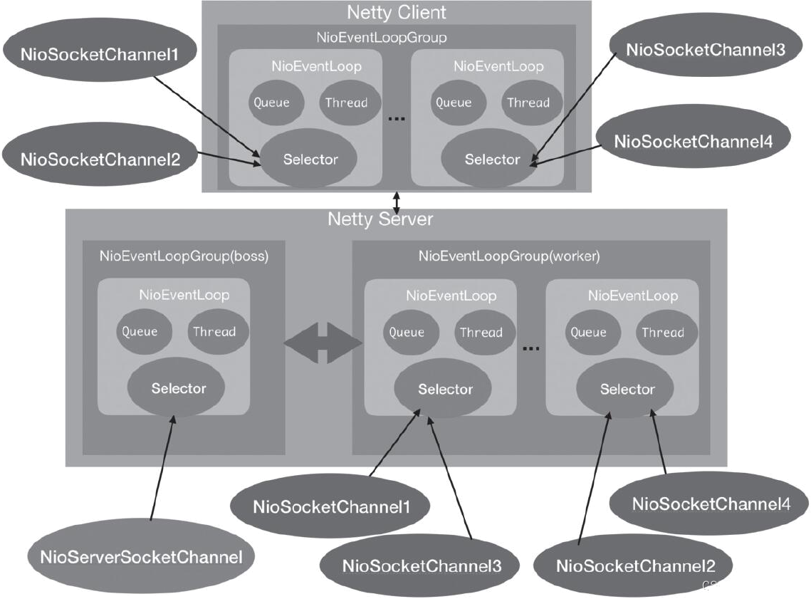
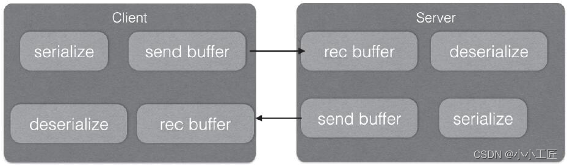

# 异步、基于事件驱动的网络编程框架 Netty

## Netty概述

Netty是一个异步、基于事件驱动的网络应用程序框架，其对Java NIO进行了封装，大大简化了TCP或者UDP[服务器](https://cloud.tencent.com/product/cvm/?from_column=20065&from=20065)的网络编程开发。

Netty框架将网络编程逻辑与业务逻辑处理分离开来，其内部会自动处理好网络与异步处理逻辑，让我们专心写自己的业务处理逻辑。同时，Netty的异步非阻塞能力与CompletableFuture结合可以让我们轻松实现网络请求的异步调用。

Netty的应用还是比较广泛的，Apache Dubbo、Apache RocketMq、Zuul 2.0服务网关、Spring WebFlux、Sofa-Bolt底层网络通信等都是基于Netty来实现的。


## Netty中的一些概念

-  Channel：是通道的意思。这是在JDK NIO类库里面提供的一个概念，JDK里面的通道是`java.nio.channels.Channel`，JDK中的实现类有客户端套接字通道`java.nio.channels.SocketChannel`和服务端监听套接字通道`java.nio.channels.ServerSocketChannel`。Channel的出现是为了支持异步IO操作。`io.netty.channel.Channel`是Netty框架自己定义的一个通道接口。Netty实现的客户端NIO套接字通道是`io.netty.channel.socket.nio.NioSocketChannel`，提供的服务器端NIO套接字通道是`io.netty.channel.socket.nio.NioServerSocketChannel`。 

  

-  NioSocketChannel：Netty中客户端套接字通道。内部管理了一个Java NIO中的`java.nio.channels.SocketChannel`实例，其被用来创建`java.nio.channels.SocketChannel`的实例和设置该实例的属性，并调用其connect方法向服务端发起TCP链接。 

  

-  NioServerSocketChannel：服务器端监听套接字通道。内部管理了一个Java NIO中的`java.nio.channels.ServerSocketChannel`实例，用来创建`ServerSocketChannel`实例和设置该实例属性，并调用该实例的bind方法在指定端口监听客户端的链接。 

  

-  EventLoopGroup：Netty之所以能提供高性能网络通信，其中一个原因是它使用Reactor线程模型。在Netty中，每个EventLoopGroup本身都是一个线程池，其中包含了自定义个数的NioEventLoop，每个NioEventLoop是一个线程，并且每个NioEventLoop里面持有自己的NIO Selector选择器。在Netty中，客户端持有一个EventLoopGroup用来处理网络IO操作；在服务器端持有两个EventLoopGroup，其中boss组是专门用来接收客户端发来的TCP链接请求的，worker组是专门用来处理完成三次握手的链接套接字的网络IO请求的。 

  

-  Channel与EventLoop的关系：在Netty中，NioEventLoop是EventLoop的一个实现，每个NioEventLoop中会管理自己的一个selector选择器和监控选择器就绪事件的线程；每个Channel在整个生命周期中固定关联到某一个NioEventLoop；但是，每个NioEventLoop中可以关联多个Channel。 

  

-  ChannelPipeline：Netty中的ChannelPipeline类似于Tomcat[容器](https://cloud.tencent.com/product/tke?from_column=20065&from=20065)中的Filter链，属于设计模式中的责任链模式，其中链上的每个节点就是一个ChannelHandler。在Netty中，每个Channel有属于自己的ChannelPipeline，管线中的处理器会对从Channel中读取或者要写入Channel中的数据进行依次处理。下图是Netty源码里面的一个图。


【Netty框架数据流图】

如图所示，当有数据从连接套接字被读取后，数据会被依次传递到Channel Pipeline中的每个ChannelHandler进行处理；当通过Channel或者ChannelHandlerContext向连接套接字写入数据时，数据会先依次被ChannelPipeline中的每个Channel Handler处理，处理完毕后才会最终通过原生连接套接字写入TCP发送缓存。

需要注意的是，虽然每个Channel（更底层说是每个Socket）有自己的Channel Pipeline，但是每个ChannelPipeline里面可以复用同一个ChannelHandler的实例（当ChannelHandler使用@shared注解修饰时）。


## Netty的线程模型

Netty的线程模型，因为其模型实现与Netty的异步处理能力紧密相关，其线程模型如下图所示




【Netty线程模型】


### Netty Server端

图下侧所示为Netty Server端，

-  当NettyServer启动时会创建两个NioEventLoop Group线程池组，其中**boss组用来接收客户端发来的连接，worker组则负责对完成TCP三次握手的连接进行处理**； 
-  图中每个NioEventLoopGroup里面包含了多个Nio EventLoop，每个NioEventLoop中包含了一个NIO Selector、一个队列、一个线程；其中线程用来做轮询注册到Selector上的Channel的读写事件和对投递到队列里面的事件进行处理。 

当NettyServer启动时会注册监听套接字通道NioServerSocketChannel到boss线程池组中的某一个NioEventLoop管理的Selector上，与其对应的线程会负责轮询该监听套接字上的连接请求；

当客户端发来一个连接请求时，boss线程池组中注册了监听套接字的NioEventLoop中的Selector会读取TCP三次握手的请求，然后创建对应的连接套接字通道NioSocketChannel，接着把其注册到worker线程池组的某一个NioEventLoop中管理的一个NIO Selector上，该连接套接字通道NioSocketChannel上的所有读写事件都由该NioEventLoop管理。

当客户端发来多个连接时，NettyServer端会创建多个NioSocketChannel，而worker线程池组中的NioEventLoop是有个数限制的，所以Netty有一定的策略把很多NioSocketChannel注册到不同的NioEventLoop上，也就是每个NioEventLoop中会管理好多客户端发来的连接，并通过循环轮询处理每个连接的读写事件。

------


### Netty Netty 端

图上侧部分所示为Netty Client部分，当NettyClient启动时会创建一个NioEventLoopGroup，用来发起请求并对建立TCP三次连接的套接字的读写事件进行处理。当调用Bootstrap的connect方法发起连接请求后内部会创建一个NioSocketChannel用来代表该请求，并且会把该NioSocketChannel注册到NioSocketChannel管理的某个NioEventLoop的Selector上，该NioEventLoop的读写事件都由该NioEventLoop负责处理。

Netty之所以说是异步非阻塞网络框架，是因为通过NioSocketChannel的write系列方法向连接里面写入数据时是非阻塞的，是可以马上返回的（即使调用写入的线程是我们的业务线程）。这是Netty通过在ChannelPipeline中判断调用NioSocketChannel的write的调用线程是不是其对应的NioEventLoop中的线程来实现的：

```java
private void write(Object msg, boolean flush, ChannelPromise promise) {
    ...
    //1.如果调用线程是IO线程
    EventExecutor executor = next.executor();
    if (executor.inEventLoop()) {
        if (flush) {
            next.invokeWriteAndFlush(m, promise);
        } else {
            next.invokeWrite(m, promise);
        }
    } else {//2.如果调用线程不是IO线程
        AbstractWriteTask task;
        if (flush) {
            task = WriteAndFlushTask.newInstance(next, m, promise);
        }  else {
            task = WriteTask.newInstance(next, m, promise);
        }
        safeExecute(executor, task, promise, m);
    }
}
```

如上代码1所示，如果调用线程是IO线程，则会在IO线程上执行写入；


如代码2所示，如果发现调用线程不是IO线程，则会把写入请求封装为WriteTask并投递到与其对应的NioEventLoop中的队列里面，然后等其对应的NioEventLoop中的线程轮询连接套接字的读写事件时捎带从队列里面取出来并执行。


也就是说，与每个NioSocketChannel对应的读写事件都是在与其对应的NioEvent Loop管理的单线程内执行的，不存在并发，所以无须加锁处理。


另外当从NioSocketChannel中读取数据时，并不是使用业务线程来阻塞等待，而是等NioEventLoop中的IO轮询线程发现Selector上有数据就绪时，通过事件通知方式来通知我们业务数据已经就绪，可以来读取并处理了。


使用Netty框架进行网络通信时，当我们发起请求后请求会马上返回，而不会阻塞我们的业务调用线程；如果我们想要获取请求的响应结果，也不需要业务调用线程使用阻塞的方式来等待，而是当响应结果出来时使用IO线程异步通知业务，由此可知，在整个请求–响应过程中，业务线程不会由于阻塞等待而不能干其他事情。


下面我们讨论几个细节：

第一，完成TCP三次握手的套接字应该注册到worker线程池中的哪一个NioEventLoop的Selector上；

第二，如果NioEventLoop中的线程负责监听注册到Selector上的所有连接的读写事件和处理队列里面的消息，那么会不会导致由于处理队列里面任务耗时太长导致来不及处理连接的读写事件；

第三，多个套接字注册到同一个NioEventLoop的Selector上，使用单线程轮询处理每个套接字上的事件，如果某一个套接字网络请求比较频繁，轮询线程是不是会一直处理该套接字的请求，而使其他套接字请求得不到及时处理。


对于第一个问题，关于NioEventLoop的分配，Netty默认使用的是PowerOfTwoEvent ExecutorChooser，其代码如下：

```java
private final class PowerOfTwoEventExecutorChooser implements EventExecutorChooser {
    @Override
    public EventExecutor next() {
        return children[childIndex.getAndIncrement() & children.length - 1];
    }
}
```

可知是采用轮询取模的方式来进行分配。


对于第二个问题，Netty默认是采用时间均分策略来避免某一方处于饥饿状态，可以参见NioEventLoop的run方法内的代码片段：

```java
//1.记录开始处理时间
final long ioStartTime = System.nanoTime();
try {//1.1处理连接套接字的读写事件
    processSelectedKeys();
} finally {
    // 1.2计算连接套接字处理耗时，ioRatio默认为50
    final long ioTime = System.nanoTime() - ioStartTime;
    //1.3运行队列里面任务
    runAllTasks(ioTime * (100 - ioRatio) / ioRatio);
}
```

代码1.1处理所有注册到当前NioEventLoop的Selector上的所有连接套接字的读写事件，代码1.2用来统计其耗时，由于默认情况下ioRatio为50，所以代码1.3尝试使用与代码1.2执行相同的时间来运行队列里面的任务，也就是处理套接字读写事件与运行队列里面任务是使用时间片轮转方式轮询执行。


针对第三个问题，我们可以看NioEventLoop的processSelectedKeysOptimized方法，该方法内会轮询注册到自己的Selector上的所有连接套接字的读写事件：

```java
private void processSelectedKeysOptimized() {
    //3轮询处理所有套接字的读写事件
    for (int i = 0; i < selectedKeys.size; ++i) {
        final SelectionKey k = selectedKeys.keys[i];
        selectedKeys.keys[i] = null;

        final Object a = k.attachment();
        //如果是AbstractNioChannel子类实例
        if (a instanceof AbstractNioChannel) {
            processSelectedKey(k, (AbstractNioChannel) a);
        } else {
            @SuppressWarnings("unchecked")
            NioTask<SelectableChannel> task = (NioTask<SelectableChannel>) a;
            processSelectedKey(k, task);
        }

        if (needsToSelectAgain) {
            selectedKeys.reset(i + 1);

            selectAgain();
            i = -1;
        }
    }
}
```


在上述代码中，processSelectedKeysOptimized内会轮询处理所有套接字的读写事件，具体是调用processSelectedKey处理每个NioSocketChannel的读写事件，其代码如下：

```java
 private void processSelectedKey(SelectionKey k, AbstractNioChannel ch) {
        final AbstractNioChannel.NioUnsafe unsafe = ch.unsafe();
            ...
            //AbstractNioByteChannel的read方法
            if ((readyOps & (SelectionKey.OP_READ | SelectionKey.OP_ACCEPT)) != 0 || readyOps == 0) {
                unsafe.read();
            }
        } catch (CancelledKeyException ignored) {
            unsafe.close(unsafe.voidPromise());
        }
 }
```


如上代码如果是读事件或者套接字接收事件则会调用AbstractNioByteChannel的read方法读取数据，这里我们只关心读事件，其代码如下：

```java
public final void read() {
    ...
    try {
        //4循环读取套接字中的数据
        do {
            byteBuf = allocHandle.allocate(allocator);
            allocHandle.lastBytesRead(doReadBytes(byteBuf));
            if (allocHandle.lastBytesRead() <= 0) {
                byteBuf.release();
                byteBuf = null;
                close = allocHandle.lastBytesRead() < 0;
                if (close) {
                    readPending = false;
                }
                break;
            }
            //4.1增加读取的包数量
            allocHandle.incMessagesRead(1);
            readPending = false;
            pipeline.fireChannelRead(byteBuf);
            byteBuf = null;
        //4.2判断是否继续读取
        } while (allocHandle.continueReading());

        allocHandle.readComplete();
        pipeline.fireChannelReadComplete();

        if (close) {
            closeOnRead(pipeline);
        }
    } catch (Throwable t) {
        handleReadException(pipeline, byteBuf, t, close, allocHandle);
    } finally {
       ...
    }
}
```


代码4循环读取当前连接套接字中的数据，代码4.1表示每当从套接字读取一批数据就让读取的消息数量加一，代码如下：

```java
public final void incMessagesRead(int amt) {
 totalMessages += amt;
}
```


代码4.2则判断是继续读取数据，还是退出读取循环，allocHandle的continueReading代码如下：

```Java
public boolean continueReading() {
    return continueReading(defaultMaybeMoreSupplier);
}

public boolean continueReading(UncheckedBooleanSupplier maybeMoreDataSupplier) {
    return config.isAutoRead() &&
           (!respectMaybeMoreData || maybeMoreDataSupplier.get()) &&
           totalMessages < maxMessagePerRead &&//最大读取消息个数？
           totalBytesRead > 0;
}
```

默认情况下maxMessagePerRead为16，所以对应NioEventLoop管理的每个NioSocketChannel中的数据，在一次事件循环内最多连续读取16次数据，并不会一直读取，这就有效避免了其他NioSocketChannel的请求事件得不到及时处理的情况。

------


## TCP半包与粘包问题

大家都知道在客户端与服务端进行网络通信时，客户端会通过socket把需要发送的内容序列化为二进制流后发送出去，当二进制流通过网络流向服务器端后，服务端会接收该请求并解析该请求包，然后反序列化后对请求进行处理。

这看似是一个很简单的过程，但是细细想来却发现没有那么简单。使用TCP进行通信时客户端与服务端之间持有一个长连接，客户端多次发送请求都是复用该连接的，下图展示了客户端与服务端的交互流程。



【客户端与服务器交互图】

如图所示，在客户端发送数据时，实际是把数据写入TCP发送缓存里面的，如果发送的包的大小比TCP发送缓存的容量大，那么这个数据包就会被分成多个包，通过socket多次发送到服务端。而服务端获取数据是从接收缓存里面获取的，假设服务端第一次从接收缓存里面获取的数据是整个包的一部分，这时候就产生了半包现象，半包不是说只收到了全包的一半，而是说只收到了全包的一部分。


服务器读取到半包数据后，会对读取的二进制流进行解析，一般会把二进制流反序列化为对象，这里由于服务器只读取了客户端序列化对象后的一部分，所以反序列会报错。


同理，如果发送的数据包大小比TCP发送缓存容量小，并且假设TCP缓存可以存放多个包，那么客户端和服务端的一次通信就可能传递了多个包，这时候服务端从接收缓存就可能一下读取了多个包，出现粘包现象，由于服务端从接收缓存获取的二进制流是多个对象转换来的，所以在后续的反序列化时肯定也会出错。


其实出现粘包和半包的原因是TCP层不知道上层业务的包的概念，它只是简单地传递流，所以需要上层应用层协议来识别读取的数据是不是一个完整的包。

一般有三种常用的解决半包与粘包问题的方案：


【Dubbo协议帧】

-  比较常见的方案是应用层设计协议时，把协议包分为header和body（比如Dubbo协议帧格式），header里面记录body长度，当服务端从接收缓冲区读取数据后，如果发现数据大小小于包的长度则说明出现了半包，这时候就回退读取缓存的指针，等待下次读事件到来时再次测试。如果发现数据大小大于包长度则看大小是否是包长度的整数倍，如果是则循环读取多个包，否则就是出现了多个整包+半包（粘包）。 
-  第二种方案是在多个包之间添加分隔符，使用分隔符来判断一个包的结束。


 【帧分隔符】 

如图 所示，每个包中间使用“|”作为分隔符，此时每个包的大小可以不固定，当服务器端读取时，若遇到分隔符就知道当前包结束了，但是包的消息体内不能含有分隔符，Netty中提供了DelimiterBasedFrameDecoder用来实现该功能。

- 还有一种方案是包定长，就是每个包大小固定长度，如下图所示。


【 包大小固定长度】

使用这种方案时每个包的大小必须一致，Netty中提供了FixedLengthFrameDecoder来实现该功能。


## 基于Netty与CompletableFuture实现RPC异步调用

我们来基于CompletableFuture与Netty来模拟下如何异步发起远程调用，为简化设计，这里我们将应用层协议帧格式定义为文本格式，如下图所示。


【 协议帧格式】

​	如图所示，

- 帧格式的第一部分为消息体，也就是业务需要传递的内容；
- 第二部分为“:”号；
- 第三部分为请求id，这里使用“：”把消息体与请求id分开，以便服务端提取这两部分内容，需要注意消息体内不能含有“：”号；
- 第四部分“|”标识一个协议帧的结束，因为本文使用Netty的DelimiterBasedFrameDecoder来解决半包粘包问题，所以需要注意消息体内不能含有“|”号。

首先我们基于Netty开发一个简单的demo来模拟RpcServer，也就是服务提供方程序，RpcServer的代码如下：

```java
public final class RpcServer {
    public static void main(String[] args) throws Exception {
        // 0.配置创建两级线程池
        EventLoopGroup bossGroup = new NioEventLoopGroup(1);// boss
        EventLoopGroup workerGroup = new NioEventLoopGroup();// worker
        // 1.创建业务处理hander
        NettyServerHandler servrHandler = new NettyServerHandler();
        try {
            ServerBootstrap b = new ServerBootstrap();
            b.group(bossGroup, workerGroup).channel(NioServerSocketChannel.class).option(ChannelOption.SO_BACKLOG, 100)
                    .handler(new LoggingHandler(LogLevel.INFO)).childHandler(new ChannelInitializer<SocketChannel>() {
                        @Override
                        public void initChannel(SocketChannel ch) throws Exception {
                            ChannelPipeline p = ch.pipeline();
                            // 1.1设置帧分隔符解码器
                            ByteBuf delimiter = Unpooled.copiedBuffer("|".getBytes());
                            p.addLast(new DelimiterBasedFrameDecoder(1000, delimiter));
                            // 1.2设置消息内容自动转换为String的解码器到管线
                            p.addLast(new StringDecoder());
                            // 1.3设置字符串消息自动进行编码的编码器到管线
                            p.addLast(new StringEncoder());
                            // 1.4添加业务hander到管线
                            p.addLast(servrHandler);
                        }
                    });

            // 2.启动服务，并且在12800端口监听
            ChannelFuture f = b.bind(12800).sync();

            // 3. 等待服务监听套接字关闭
            f.channel().closeFuture().sync();
        } finally {
            // 4.优雅关闭两级线程池，以便释放线程
            bossGroup.shutdownGracefully();
            workerGroup.shutdownGracefully();
        }
    }
}
```

如上代码是一个典型的NettyServer启动程序，首先代码0创建了NettyServer的boss与worker线程池，然后代码1创建了业务NettyServerHandler，这个我们后面具体讲解。

代码1.1添加DelimiterBasedFrameDecoder解码器到链接channel的管道以便使用“|”分隔符来确定一个协议帧的边界（避免半包粘包问题）；

代码1.2添加字符串解码器，它在服务端链接channel接收到客户端发来的消息后会自动把消息内容转换为字符串；代码1.3设置字符串编码器，它会在服务端链接channel向客户端写入数据时，对数据进行编码；代码1.3添加业务handler到管线。

代码2启动服务，并且在端口12800监听客户端发来的链接；代码3同步等待服务监听套接字关闭；代码4优雅关闭两级线程池，以便释放线程。

这里我们主要看下业务handler的实现，服务端在接收客户端消息，且消息内容经过代码1.1、代码1.2的hanlder处理后，流转到NettyServerHandler的就是一个完整的协议帧的字符串了。NettyServerHandler代码如下：

```java
@Sharable
public class NettyServerHandler extends ChannelInboundHandlerAdapter {

    //5. 根据消息内容和请求id，拼接消息帧
    public String generatorFrame(String msg, String reqId) {
        return msg + ":" + reqId + "|";
    }

    @Override
    public void channelRead(ChannelHandlerContext ctx, Object msg) {

        //6.处理请求
        try {
                System.out.println(msg);
                // 6.1.获取消息体，并且解析出请求id
                String str = (String) msg;
                String reqId = str.split(":")[1];

                // 6.2.拼接结果，请求id,协议帧分隔符(模拟服务端执行服务产生结果)
                String resp =  generatorFrame("im jiaduo ", reqId);

                try {
                    Thread.sleep(2000);
                } catch (InterruptedException e) {
                    e.printStackTrace();
                }
                
                // 6.3.写回结果
                ctx.channel().writeAndFlush(Unpooled.copiedBuffer(resp.getBytes()));
            } catch (Exception e) {
                e.printStackTrace();
            }
    }

   ...

}
```

由上述代码可知，@Sharable注解是让服务端所有接收的链接对应的channel复用同一个NettyServerHandler实例，这里可以使用@Sharable方式是因为NettyServer Handler内的处理是无状态的，不会存在线程安全问题。

当数据流程到NettyServerHandler时，会调用其channelRead方法进行处理，这里msg已经是一个完整的本文的协议帧了。

异步任务内代码6.1首先获取消息体的内容，然后根据协议格式，从中截取出请求id，然后调用代码6.2拼接返回给客户端的协议帧，注意这里需要把请求id带回去；然后休眠2s模拟服务端任务处理，最后代码6.3把拼接好的协议帧写回客户端。

下面我们基于Netty开发一个简单的demo来模拟RpcClient，也就是服务消费方程序，RpcClient的代码如下：

```java
public class RpcClient {
    // 连接通道
    private volatile Channel channel;
    // 请求id生成器
    private static final AtomicLong INVOKE_ID = new AtomicLong(0);
    // 启动器
    private Bootstrap b;

    public RpcClient() {
        // 1. 配置客户端.
        EventLoopGroup group = new NioEventLoopGroup();
        NettyClientHandler clientHandler = new NettyClientHandler();
        try {
            b = new Bootstrap();
            b.group(group).channel(NioSocketChannel.class).option(ChannelOption.TCP_NODELAY, true)
                    .handler(new ChannelInitializer<SocketChannel>() {
                        @Override
                        public void initChannel(SocketChannel ch) throws Exception {
                            ChannelPipeline p = ch.pipeline();
                            // 1.1设置帧分隔符解码器
                            ByteBuf delimiter = Unpooled.copiedBuffer("|".getBytes());
                            p.addLast(new DelimiterBasedFrameDecoder(1000, delimiter));
                            // 1.2设置消息内容自动转换为String的解码器到管线
                            p.addLast(new StringDecoder());
                            // 1.3设置字符串消息自动进行编码的编码器到管线
                            p.addLast(new StringEncoder());
                            // 1.4添加业务Handler到管线
                            p.addLast(clientHandler);

                        }
                    });
            // 2.发起链接请求，并同步等待链接完成
            ChannelFuture f = b.connect("127.0.0.1", 12800).sync();
            if (f.isDone() && f.isSuccess()) {
                this.channel = f.channel();
            }

        } catch (Exception e) {
            e.printStackTrace();
        }
    }

    private void sendMsg(String msg) {
        channel.writeAndFlush(msg);
    }

    public void close() {

        if (null != b) {
            b.group().shutdownGracefully();
        }
        if (null != channel) {
            channel.close();
        }
    }

    // 根据消息内容和请求id，拼接消息帧
    private String generatorFrame(String msg, String reqId) {
        return msg + ":" + reqId + "|";
    }

    public CompletableFuture rpcAsyncCall(String msg) {
        // 1. 创建future
        CompletableFuture<String> future = new CompletableFuture<>();

        // 2.创建消息id
        String reqId = INVOKE_ID.getAndIncrement() + "";

        // 3.根据消息，请求id创建协议帧
        msg = generatorFrame(msg, reqId);

        // 4.nio异步发起网络请求，马上返回
        this.sendMsg(msg);

        // 5.保存future对象
        FutureMapUtil.put(reqId, future);

        return future;
    }

    public String rpcSyncCall(String msg) throws InterruptedException, ExecutionException {
        // 1. 创建future
        CompletableFuture<String> future = new CompletableFuture<>();
        // 2.创建消息id
        String reqId = INVOKE_ID.getAndIncrement()  + "";

        // 3.消息体后追加消息id和帧分隔符
        msg = generatorFrame(msg, reqId);

        // 4.nio异步发起网络请求，马上返回
        this.sendMsg(msg);

        // 5.保存future
        FutureMapUtil.put(reqId, future);

        // 6.同步等待结果
        String result = future.get();
        return result;
    }
}
```

如上代码RpcClient的构造函数创建了一个NettyClient，其使用方法与NettyServer类似，这里不再赘述。需要注意的是，这里注册了业务的NettyClientHandler处理器到链接channel的管线里面，并且在与服务端完成TCP三次握手后把对应的channel对象保存了下来。

下面先来看rpcSyncCall方法，该方法意在模拟同步远程调用，其中代码1创建了一个CompletableFuture对象；代码2使用原子变量生成一个请求id，代码3则把业务传递的msg消息体和请求id组成协议帧；代码4则调用sendMsg方法通过保存的channel对象把协议帧异步发送出去，该方法是非阻塞的，会马上返回，所以不会阻塞业务线程；代码5把代码1创建的future对象保存到FutureMapUtil中管理并发缓存，其中key为请求id，value为创建的future。FutureMapUtil代码如下，可知就是管理并发缓存的一个工具类：

```java
public class FutureMapUtil {
    // <请求id，对应的future>
    private static final ConcurrentHashMap<String, CompletableFuture> futureMap = new ConcurrentHashMap<String, CompletableFuture>();

    public static void put(String id, CompletableFuture future) {
        futureMap.put(id, future);
    }
    public static CompletableFuture remove(String id) {
        return futureMap.remove(id);
    }
}
```

然后代码6调用future的get()方法，同步等待future的complete()方法设置结果完成，调用get()方法会阻塞业务线程，直到future的结果被设置了。

现在我们再来看rpcAsyncCall异步调用，其代码实现与同步的rpcSyncCall类似，只不过其没有同步等待future有结果值，而是直接将future返回给调用方，然后就直接返回了，该方法不会阻塞业务线程。

到这里我们讲解了业务调用时发起远程调用，接下来我们看服务端写回结果到客户端后。关于客户端是如何把接入写回对应的future的，这里我们需要看注册的NettyClientHandler，其代码如下：

```java
@Sharable
public class NettyClientHandler extends ChannelInboundHandlerAdapter {
   ...
    @Override
    public void channelRead(ChannelHandlerContext ctx, Object msg) {
        // 1.根据请求id，获取对应future
        CompletableFuture future = FutureMapUtil.remove(((String) msg).split(":")[1]);
        // 2.如果存在，则设置future结果
        if (null != future) {
            future.complete(((String) msg).split(":")[0]);
        }
    }
...
}
```

如上代码所示，当NettyClientHandler的channelRead方法被调用时，其中msg已经是一个完整的本文的协议帧了（因为DelimiterBasedFrameDecoder与StringDecoder已经做过解析）。

异步任务内代码1首先根据协议帧格式，从消息msg内获取到请求id，然后从FutureMapUtil管理的缓存内获取请求id对应的future对象，并移除；如果存在，代码2则从协议帧内获取服务端写回的数据，并调用future的complete方法把结果设置到future，这时候由于调用future的get()方法而被阻塞的线程就返回结果了。

上面我们讲解了RpcClient与RpcServer的实现，下面我们从两个例子看如何使用，首先看TestModelAsyncRpc的代码：

```java
public class TestModelAsyncRpc {

    private static final RpcClient rpcClient = new RpcClient();

    public static void main(String[] args) throws InterruptedException, ExecutionException {

        // 1.同步调用
        System.out.println(rpcClient.rpcSyncCall("who are you"));

        // 2.发起远程调用异步，并注册回调，马上返回
        CompletableFuture<String> future = rpcClient.rpcAsyncCall("who are you");
        future.whenComplete((v, t) -> {
            if (t != null) {
                t.printStackTrace();
            } else {
                System.out.println(v);
            }

        });

        System.out.println("---async rpc call over");
    }
}
```

如上main函数内首先创建了一个rpcClient对象，然后代码1同步调用了其rpcSyncCall方法，由于是同步调用，所以在服务端执行返回结果前，当前调用线程会被阻塞，直到服务端把结果写回客户端，并且客户端把结果写回到对应的future对象后才会返回。

代码2调用了异步方法rpcAsyncCall，其不会阻塞业务调用线程，而是马上返回一个CompletableFuture对象，然后我们在其上设置了一个回调函数，意在等future对象的结果被设置后进行回调，这个实现了真正意义上的异步。

我们再看一个使用实例，演示如何基于CompletableFuture的能力，并发发起多次调用，然后对返回的多个CompletableFuture进行运算，首先看TestModelAsyncRpc2类：

```java
public class TestModelAsyncRpc2 {

    private static final RpcClient rpcClient = new RpcClient();

    public static void main(String[] args) throws InterruptedException, ExecutionException {

        // 1.发起远程调用异步，马上返回
        CompletableFuture<String> future1 = rpcClient.rpcAsyncCall("who are you");
        // 2.发起远程调用异步，马上返回
        CompletableFuture<String> future2 = rpcClient.rpcAsyncCall("who are you");

        // 3.等两个请求都返回结果时候，使用结果做些事情
        CompletableFuture<String> future = future1.thenCombine(future2, (u, v) -> {

            return u + v;
        });

        // 4.等待最终结果
        future.whenComplete((v, t) -> {
            if (t != null) {
                t.printStackTrace();
            } else {
                System.out.println(v);
            }

        });
        System.out.println("---async rpc call over---");
        // rpcClient.close();

    }

}
```

代码1首先发起一次远程调用，该调用马上返回future1；然后代码2又发起一次远程调用，该调用也马上返回future2对象；代码3则基于CompletableFuture的能力，意在让future1和future2都有结果后再基于两者的结果做一件事情（这里是拼接两者结果返回），并返回一个获取回调结果的新的future。

代码4基于新的future，等其结果产生后，执行新的回调函数，进行结果打印或者异常打印。

最后我们看如何把异步调用改造为Reactive编程风格，这里基于RxJava让异步调用返回结果为Flowable，其实我们只需要把返回的CompletableFuture转换为Flowable即可，可以在RpcClient里面新增一个方法：

```java
// 异步转反应式
public Flowable<String> rpcAsyncCallFlowable(String msg) {
    // 1.1 使用defer操作，当订阅时候在执行rpc调用
    return Flowable.defer(() -> {
        // 1.2创建含有一个元素的流
        final ReplayProcessor<String> flowable = ReplayProcessor.createWithSize(1);
        // 1.3具体执行RPC调用
        CompletableFuture<String> future = rpcAsyncCall(msg);
        // 1.4等rpc结果返回后设置结果到流对象
        future.whenComplete((v, t) -> {
            if (t != null) {// 1.4.1结果异常则发射错误信息
                flowable.onError(t);
            } else {// 1.4.2结果OK，则发射出rpc返回结果
                flowable.onNext(v);
                // 1.4.3结束流
                flowable.onComplete();
            }
        });
        return flowable;
    });
}
```

如上代码由于CompletableFuture是可以设置回调函数的，所以把其转换为Reactive风格编程很容易。

然后我们可以使用下面代码进行测试：

```java
public class TestModelAsyncRpcReactive {
    // 1.创建rpc客户端
    private static final RpcClient rpcClient = new RpcClient();

    public static void main(String[] args) throws InterruptedException, ExecutionException {
        // 2.发起远程调用异步，并注册回调，马上返回
        Flowable<String> result = rpcClient.rpcAsyncCallFlowable("who are you");
        //3.订阅流对象
        result.subscribe(/* onNext */r -> {
            System.out.println(Thread.currentThread().getName() + ":" + r);
        }, /* onError */error -> {
            System.out.println(Thread.currentThread().getName() + "error:" + error.getLocalizedMessage());
        });

        System.out.println("---async rpc call over");
    }
}
```

如上代码，发起rpc调用后马上返回了一个Flowable流对象，但这时真正的rpc调用还没有发出去，等代码3订阅了流对象时才真正发起rpc调用。