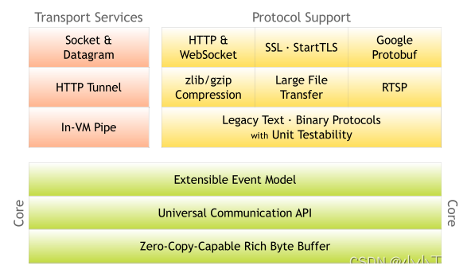
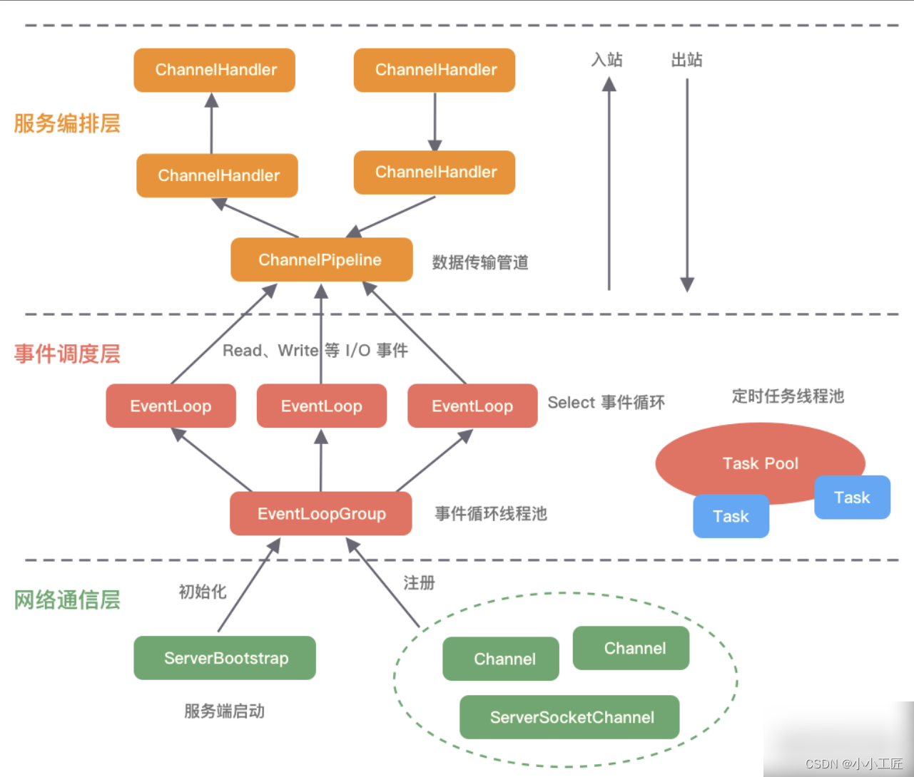
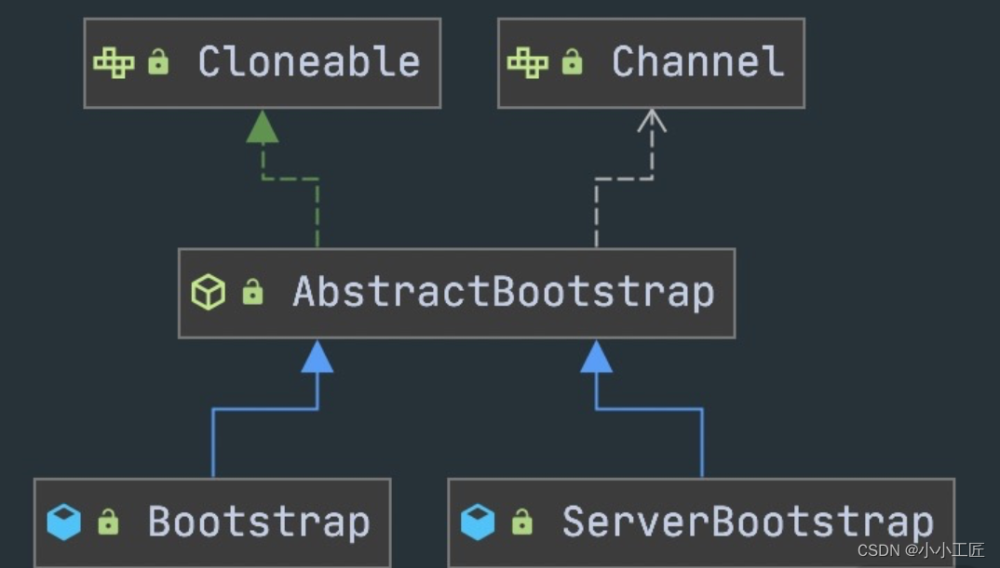
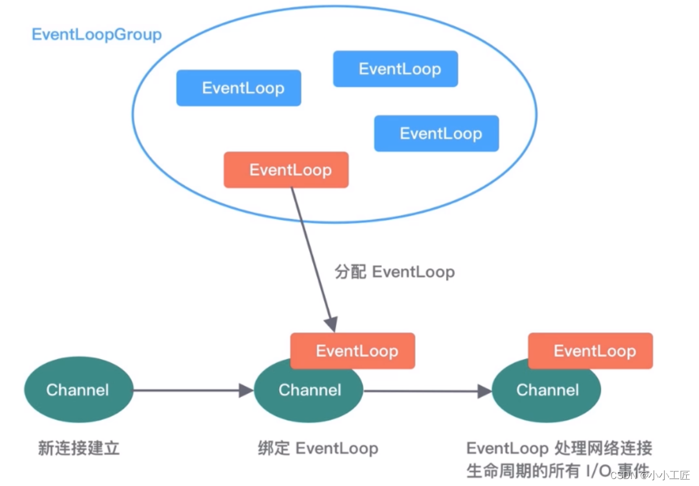
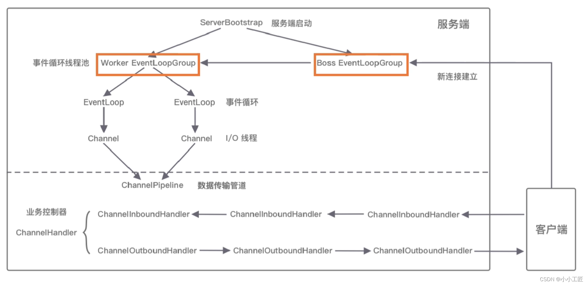

# 掌握Netty 整体架构脉络

### Netty 整体结构

#### Core 核心层

1.  **可扩展的事件模型：** Netty的核心层提供了一个可扩展的事件模型，这使得开发者能够方便地处理各种网络事件，如连接建立、数据接收、数据发送等。 
2.  **通用的通信****API****：** Netty的核心层提供了通用的通信API，简化了网络编程的复杂性。开发者可以使用这些API来构建各种类型的网络应用，如TCP、UDP等。 
3.  **支持零拷贝的ByteBuf：** ByteBuf是Netty中用于数据传输的缓冲区抽象，支持零拷贝的ByteBuf能够在数据传输过程中最大程度地减少内存复制的开销，提高了性能和效率。

#### Protocol Support 协议支持层

协议支持层提供了对主流协议的编解码实现，包括但不限于HTTP、SSL、Protobuf、压缩、大文件传输、WebSocket、文本、二进制等。

1.  **覆盖主流协议：** Netty的协议支持层涵盖了许多主流协议的编解码实现，这包括了常见的HTTP、WebSocket等协议，以及诸如SSL、Protobuf等协议，使得开发者能够在Netty的基础上快速地构建支持这些协议的网络应用。 
2.  **支持自定义应用层协议：** 除了主流协议外，Netty还支持开发者自定义应用层协议。这意味着开发者可以根据自己的需求定义和实现特定的应用层协议，并在Netty的支持下进行编解码，从而实现定制化的网络通信。 
3.  **降低开发成本：** Netty的协议支持层极大地降低了开发者构建网络应用的成本。通过利用Netty提供的丰富协议支持，开发者可以避免重复实现常见协议的编解码逻辑，从而加快开发速度，提高效率。

#### Transport Service 传输服务层

1.  **支持多种传输方式：** 传输服务层支持多种网络传输方式，包括Socket、HTTP隧道、虚拟机管道等。这些传输方式能够满足不同场景下的需求，使得Netty框架更加灵活和适用于各种网络应用。 
2.  **对TCP、UDP等数据传输进行抽象和封装：** Netty对TCP、UDP等数据传输进行了抽象和封装，使得用户在编写网络应用时可以更加聚焦于业务逻辑的实现，而不必关心底层数据传输的细节。这种抽象和封装提高了开发效率，并且使得网络应用更加易于维护和扩展。 

传输服务层的存在使得Netty框架具备了强大的网络传输能力，为开发者提供了简洁、高效的网络编程接口，帮助他们快速构建可靠的网络应用。

### Netty 逻辑架构

#### 网络通信层

网络通信层其主要职责是执行网络I/O操作，支持多种网络协议和I/O模型的连接操作。一旦网络数据被读取到内核缓冲区，就会触发各种网络事件，这些事件随后会被传递给事件调度层进行处理。

核心组件包括`BootStrap`、`ServerBootStrap`和`Channel`，它们的作用如下：

1.  **BootStrap：** `BootStrap`是用于客户端引导的类，用于配置和启动客户端应用程序的网络通信。通过`BootStrap`，可以设置客户端的连接参数、指定连接的协议、选择I/O模型等。 
2.  **ServerBootStrap：** `ServerBootStrap`是用于[服务器](https://cloud.tencent.com/product/cvm/?from_column=20065&from=20065)引导的类，用于配置和启动服务器端应用程序的网络通信。通过`ServerBootStrap`，可以设置服务器的监听端口、指定处理客户端连接的处理器、选择I/O模型等。

>  Bootstrap 和 ServerBootStrap 十分相似，两者非常重要的区别在于 Bootstrap 可用于连接远端服务器，只绑定一个 EventLoopGroup。而 ServerBootStrap 则用于服务端启动绑定本地端口，会绑定两个 EventLoopGroup，这两个 EventLoopGroup 通常称为 Boss 和 Worker。 

1. **Channel：** `Channel`表示一个网络连接的抽象，它可以是客户端与服务器端之间的通信管道。`Channel`提供了对网络I/O操作的封装，包括读取数据、写入数据、关闭连接等操作。

#### 事件调度层

事件调度层其主要职责是通过 Reactor 线程模型对各类事件进行聚合处理，并通过 Selector 主循环线程集成多种事件，包括 I/O 事件、信号事件、定时事件等。实际的业务处理逻辑通常是由服务编排层中相关的 Handler 完成。

核心组件包括 `EventLoopGroup` 和 `EventLoop`：

1.  **EventLoopGroup：** `EventLoopGroup` 是一组 `EventLoop` 的集合，它负责管理和调度 `EventLoop` 的生命周期。在大多数情况下，一个 `EventLoopGroup` 会包含多个 `EventLoop`，每个 `EventLoop` 在单独的线程中运行，负责处理特定的 I/O 事件。 
2.  **EventLoop：** `EventLoop` 是事件循环，它负责处理特定线程中发生的事件。每个 `EventLoop` 包含一个 Selector 主循环线程，通过它来监听和处理各种事件。在 Reactor 线程模型中，`EventLoop` 负责接收事件、调度事件处理、执行事件处理器等工作。 

通过事件调度层，网络应用程序能够高效地处理各种事件，包括网络 I/O 事件、信号事件和定时事件等，从而实现并发处理和高性能的网络通信。

我们可以总结出 `EventLoopGroup、EventLoop、Channel` 的几点关系。

-  一个 `EventLoopGroup` 往往包含一个或者多个 `EventLoop`。`EventLoop` 用于处理 Channel 生命周期内的所有 I/O 事件，如 `accept、connect、read、write` 等 I/O 事件。 
-  `EventLoop` 同一时间会与一个线程绑定，每个 `EventLoop` 负责处理多个 `Channel`。 
-  每新建一个 `Channel`，`EventLoopGroup` 会选择一个 `EventLoop` 与其绑定。该 `Channel` 在生命周期内都可以对 `EventLoop` 进行多次绑定和解绑。

在Netty框架中，EventLoopGroup是Netty Reactor线程模型的具体实现方式之一。Reactor线程模型是一种并发模式，用于处理多个客户端连接的网络I/O事件。

在Reactor线程模型中，有一个或多个线程负责监听并接收事件，然后将这些事件分发给对应的事件处理器进行处理。

具体来说，EventLoopGroup在Netty中对应着Reactor线程模型中的Reactors。根据EventLoopGroup的配置不同，Netty可以支持不同类型的Reactor线程模型，包括单线程模型、多线程模型和主从多线程模型。

1.  `单线程模型`：在单线程模型中，EventLoopGroup只包含一个EventLoop。在Netty中，Boss和Worker都使用同一个EventLoopGroup，这意味着所有的网络I/O事件都由同一个EventLoop来处理。这种模型适用于并发连接较少的场景，能够简化并发控制和线程同步。 
2.  `多线程模型`：在多线程模型中，EventLoopGroup包含多个EventLoop。Boss和Worker仍然使用同一个EventLoopGroup，但是有多个EventLoop来处理不同的连接。这种模型适用于并发连接较多的场景，能够提高并发处理能力。 
3.  `主从多线程模型`：在主从多线程模型中，EventLoopGroup包含多个EventLoop，但是Boss和Worker分别使用不同的EventLoopGroup。主Reactor负责新的网络连接Channel的创建，并将Channel注册到从Reactor上。这种模型适用于高并发的网络应用，能够更好地分离连接接受和事件处理的责任。 

因此，EventLoopGroup作为Netty框架中的核心处理引擎，通过创建不同配置的EventLoopGroup，实现了不同类型的Reactor线程模型，以满足不同场景下的性能需求和并发处理能力。

------

#### 服务编排层

服务编排层其主要职责是负责组装各类服务，并实现网络事件的动态编排和有序传播。服务编排层的核心组件包括`ChannelPipeline`、`ChannelHandler`和`ChannelHandlerContext`。

1.  **ChannelPipeline：** `ChannelPipeline`是Netty的核心编排组件，用于组装各种`ChannelHandler`。实际的数据编解码和加工处理操作都由`ChannelHandler`完成。`ChannelPipeline`可以理解为`ChannelHandler`的实例列表，内部通过双向链表将不同的`ChannelHandler`连接在一起。当I/O读写事件触发时，`ChannelPipeline`会依次调用`ChannelHandler`列表对`Channel`的数据进行拦截和处理。 
2.  **ChannelHandler：** `ChannelHandler`是处理I/O事件或者拦截I/O操作的处理器。它可以通过`ChannelPipeline`实现对网络数据的编解码、加工处理以及其他业务逻辑的实现。每个`ChannelHandler`都会被添加到`ChannelPipeline`中，以便在特定的事件发生时被调用。 
3.  **ChannelHandlerContext：** `ChannelHandlerContext`提供了`ChannelHandler`和`ChannelPipeline`之间的通信桥梁。它包含了当前`ChannelHandler`和`ChannelPipeline`的信息，并提供了操作`ChannelPipeline`的方法。`ChannelHandlerContext`可以用于获取`Channel`、触发事件以及动态修改`ChannelPipeline`等操作。 

需要注意的是，`ChannelPipeline`是线程安全的，因为每个新的`Channel`都会绑定一个新的`ChannelPipeline`，而每个`ChannelPipeline`关联一个`EventLoop`，而`EventLoop`仅会绑定一个线程。这种设计保证了在多线程环境下的线程安全性。

通过这些核心组件，服务编排层实现了对网络事件的动态编排和有序传播，为Netty应用程序提供了高效、灵活的网络通信处理能力。

------

#### 组件关系梳理

1. 服务端启动初始化：
   - 在服务端启动初始化时，会创建两个核心组件：Boss EventLoopGroup和Worker EventLoopGroup。
   - Boss EventLoopGroup负责监听网络连接事件。
   - 当有新的网络连接事件到达时，Boss EventLoopGroup会将对应的Channel注册到Worker EventLoopGroup。
2. Worker EventLoopGroup和EventLoop：
   - Worker EventLoopGroup会被分配一个EventLoop来处理每个注册的Channel的读写事件。
   - 每个EventLoop都是单线程的，通过Selector进行事件循环。
3. 客户端发起I/O读写事件：
   - 当客户端发起I/O读写事件时，服务端的EventLoop会进行数据的读取。
4. 数据处理过程：
   - 数据被传递到ChannelPipeline的第一个ChannelInboundHandler中。
   - ChannelPipeline会依次调用每个ChannelInboundHandler对数据进行处理，并将处理结果传递给下一个ChannelInboundHandler。
   - 数据处理完成后，如果需要将数据写回客户端，则会经过ChannelPipeline的ChannelOutboundHandler进行处理。
5. 数据写回客户端：
   - 处理结果在ChannelPipeline的ChannelOutboundHandler中传播，最终写回到客户端。

总体来说，Netty内部的逻辑流程是由EventLoopGroup、EventLoop和ChannelPipeline等核心组件共同协作完成的。EventLoopGroup负责管理多个EventLoop，每个EventLoop负责处理一个或多个Channel的读写事件。ChannelPipeline负责管理ChannelHandler，并通过它们对数据进行加工处理和传递。整个过程保证了网络事件的有序处理和高效传输。

------

### Netty 源码结构

#### Core 核心层模块

1. netty-common模块：
   - 核心基础包，为Netty提供丰富的工具类。
   - 包括通用工具类和自定义并发包。
   - 通用工具类如定时器工具TimerTask、时间轮HashedWheelTimer等。
   - 自定义并发包包括异步模型Future & Promise、FastThreadLocal等。
2. netty-buffer模块：
   - 实现了更加完备的ByteBuf工具类，用于网络通信中的数据载体。
   - 提供了人性化的Buffer API设计，成为Java ByteBuffer的完美替代品。
   - 解决了ByteBuffer长度固定造成的内存浪费问题，更安全地更改了Buffer的容量。
   - 做了许多优化，例如缓存池化、减少数据拷贝的CompositeByteBuf等。
3. netty-resolver模块：
   - 主要提供了一些有关基础设施的解析工具，包括IP地址、主机名、DNS等。

------

#### Protocol Support 协议支持层模块

1. netty-codec模块：
   - 主要负责编解码工作，实现原始字节数据与业务实体对象之间的相互转化。
   - 支持了大多数业界主流协议的编解码器，如HTTP、HTTP2、[Redis](https://cloud.tencent.com/product/crs?from_column=20065&from=20065)、XML等，为开发者节省了大量的精力。
   - 提供了抽象的编解码类ByteToMessageDecoder和MessageToByteEncoder，开发者可以通过继承这两个类轻松实现自定义的编解码逻辑。
2. netty-handler模块：
   - 主要负责数据处理工作，是一串有序handler的集合。
   - 提供了开箱即用的ChannelHandler实现类，包括日志、IP过滤、流量整形等。
   - 开发者只需在pipeline中加入相应的ChannelHandler即可使用这些功能。

通过netty-codec和netty-handler模块，Netty框架为开发者提供了强大而灵活的工具，帮助他们轻松实现数据的编解码和处理，从而构建高性能、可靠的网络应用程序。

------

#### Transport Service 传输服务层模块

1. netty-transport模块：
   - 是Netty提供数据处理和传输的核心模块。
   - 提供了许多重要的接口，包括Bootstrap、Channel、ChannelHandler、EventLoop、EventLoopGroup、ChannelPipeline等。
   - Bootstrap负责客户端或服务端的启动工作，包括创建、初始化Channel等。
   - EventLoop负责向注册的Channel发起I/O读写操作。
   - ChannelPipeline负责ChannelHandler的有序编排。

这些组件在Netty的逻辑架构中扮演着重要的角色，共同协作实现了网络数据的传输和处理。通过netty-transport模块，开发者可以方便地启动客户端或服务端，管理事件循环、通道和通道处理器，并确保它们之间的有序传输和处理。