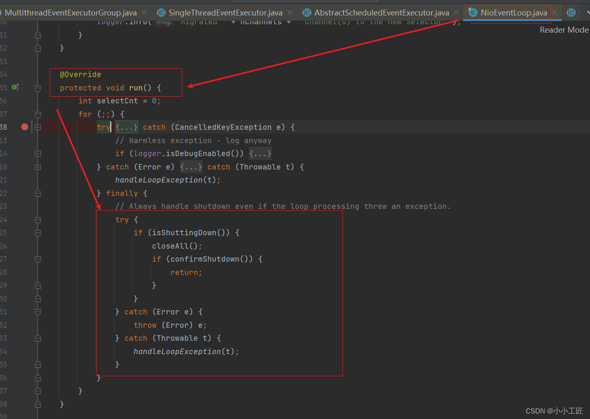

# 探究Netty优雅退出原理和源码解读

### 概述

在实际项目中，Netty作为高性能的异步NIO通信框架，承担着各种协议的接入、解析和调度等任务，例如在RPC和分布式服务框架中，Netty常常被用作内部私有协议的基础通信框架。因此，在应用进程优雅退出时，Netty作为通信框架也需要进行优雅退出，以保证系统的稳定性和可靠性。


主要原因如下：

1.  **尽快释放NIO线程和句柄等资源：** 优雅退出时，需要尽快释放NIO线程和句柄等底层资源，以确保资源的及时回收和释放，避免资源泄漏和性能问题。 
2.  **发送队列中待发送消息的处理：** 如果使用flush进行批量消息发送，需要确保将发送队列中积压的待发送消息发送完成，避免数据丢失和通信中断。 
3.  **正在写或读的消息的处理：** 正在进行读或写操作的消息需要继续处理，确保已接收到的消息能够正确处理完毕，避免数据丢失和通信异常。 
4.  **定时任务的执行或清理：** 如果在NioEventLoop线程调度器中设置了定时任务，需要在优雅退出时执行或清理这些定时任务，以确保系统状态的正确转换和资源的正确释放。 


综上所述，Netty作为通信框架，在应用进程优雅退出时需要做好资源释放、消息处理和定时任务的执行或清理工作，以确保系统能够正确、稳定地退出，保证数据的完整性和通信的可靠性。


### Netty 退出涉及的主要操作和资源对象

1. 预处理操作：
   - **通信队列中尚未发送的消息：** 在优雅退出之前，需要确保将通信队列中尚未发送的消息发送完成，避免数据丢失。
   - **NIO线程中待处理的定时任务：** 如果在NIO线程中有待处理的定时任务，需要确保这些任务能够执行或者进行相应的清理操作。
   - **注册到NIO线程中的ShutdownHook任务：** 如果有注册到NIO线程中的ShutdownHook任务，需要确保这些任务能够执行或者进行相应的清理操作。
2. 资源释放：
   - **关闭所有的Channel：** 遍历所有的Channel，并调用它们的`close()`方法来关闭所有的Channel。
   
   - **从Selector上注销：** 如果Netty使用了Selector来进行IO事件的监听，需要从Selector上注销所有的Channel。
   
   - **清空所有的队列：** 清空所有的[消息队列](https://cloud.tencent.com/product/message-queue-catalog?from_column=20065&from=20065)，确保所有待发送的消息都已经发送完成或者丢弃。
   
   - **NIO线程退出：** 调用EventLoopGroup的`shutdownGracefully()`方法来优雅地关闭NIO线程池，释放NIO线程和句柄等资源。
   
     

>  通过以上操作，可以确保Netty在应用进程优雅退出时能够进行优雅退出，保证资源得到正确释放，避免数据丢失和资源泄露等问题。在实现过程中，需要仔细考虑各种场景下的异常情况，并进行适当的处理，以确保系统的稳定性和可靠性。 


总的来说，Netty的优雅退出可以总结为以下三大类操作：

1.  **NIO线程状态设置：** 将NIO线程的状态位设置为`ST_SHUTTING_DOWN`，表示不再处理新的消息，不允许再对外发送消息。 
2. 退出前的预处理操作：
   - 发送队列中尚未发送或正在发送的消息尽量发送完毕（不保证完全发送）。
   - 执行已经到期或在退出超时之前到期的定时任务。
   - 执行用户注册到NIO线程的退出Hook任务。
3. 资源的释放操作：
   - 释放所有Channel。
   - 将多路复用器（Selector）的所有Channel去注册和关闭。
   - 清空和取消所有队列和定时任务。
   - 最后，退出EventLoop线程。


Netty优雅退出的接口和总入口是EventLoopGroup，可以调用它的`shutdownGracefully()`方法来执行优雅退出操作。具体代码示例如下：

```java
bossGroup.shutdownGracefully();
workerGroup.shutdownGracefully();
```


其中，强制退出已经被标注为废弃，在实际项目中尽量不要使用。当JVM的ShutdownHook 被触发之后，调用所有 `EventLoopGroup` 实例的 `shutdownGracefully` 方法进行优雅退出。由于Netty自身对优雅退出有较完善的支持，所以实现起来相对比较简单。


### 原理 & 源码分析

#### NioEventLoopGroup

`NioEventLoopGroup` 实际上是 `NioEventLoop` 线程组，它的优雅退出比较简单，可直接 遍历 `EventLoop`数组,循环调用它们的 `shutdownGracefully` 方法


源码如下(`MultithreadEvent-ExecutorGroup#shutdownGracefully`方法):

>  io.netty.util.concurrent.MultithreadEventExecutorGroup#shutdownGracefully 


```java
    @Override
    public Future<?> shutdownGracefully(long quietPeriod, long timeout, TimeUnit unit) {
        for (EventExecutor l: children) {
            l.shutdownGracefully(quietPeriod, timeout, unit);
        }
        return terminationFuture();
    }
```


该方法是在`EventLoopGroup`接口的实现类`MultithreadEventExecutorGroup`中覆盖的，用于实现优雅退出的逻辑。具体来说，该方法会遍历该`EventLoopGroup`管理的所有`EventExecutor`（通常是`NioEventLoop`），并调用它们的`shutdownGracefully()`方法来执行优雅退出操作。然后，该方法返回一个Future对象，表示优雅退出操作的结果。


这个方法被调用时会传入两个参数：`quietPeriod`和`timeout`，分别表示优雅退出的安静期和超时时间。

- 在`quietPeriod`内，Netty会等待所有任务和消息处理完毕，然后开始执行优雅退出的逻辑。
- 如果超过了超时时间，Netty会强制退出，不再等待任务和消息处理完毕。

通过调用这个方法，Netty可以在应用退出时优雅地释放资源，确保所有任务和消息都得到处理，同时避免资源泄漏和数据丢失。

------


#### NioEventLoop


1. **修改线程状态：** 在调用 `NioEventLoop` 的 `shutdownGracefully` 方法时，首先要修改线程状态为正在关闭状态。这个修改操作需要考虑并发调用的情况，因为可能会有多个线程同时调用该方法。在 Netty 4 中，采用了原子操作的方式进行状态的修改，使用 `AtomicIntegerFieldUpdater` 的 `compareAndSet` 方法来修改线程状态，如果发现状态已经被其他线程修改，则继续自旋等待或者直到修改成功。

```java
public Future<?> shutdownGracefully(long quietPeriod, long timeout, TimeUnit unit) {
    // 检查 quietPeriod 是否为正数或零
    ObjectUtil.checkPositiveOrZero(quietPeriod, "quietPeriod");
    // 检查 timeout 是否大于等于 quietPeriod
    if (timeout < quietPeriod) {
        throw new IllegalArgumentException(
                "timeout: " + timeout + " (expected >= quietPeriod (" + quietPeriod + "))");
    }
    // 检查时间单位是否为空
    ObjectUtil.checkNotNull(unit, "unit");

    // 如果已经在关闭中，则返回终止状态的 Future
    if (isShuttingDown()) {
        return terminationFuture();
    }

    // 是否在事件循环中
    boolean inEventLoop = inEventLoop();
    boolean wakeup;
    int oldState;
    for (;;) {
        // 如果已经在关闭中，则返回终止状态的 Future
        if (isShuttingDown()) {
            return terminationFuture();
        }
        int newState;
        wakeup = true;
        oldState = state;
        // 如果当前线程在事件循环中
        if (inEventLoop) {
            // 设置新的状态为 ST_SHUTTING_DOWN
            newState = ST_SHUTTING_DOWN;
        } else {
            // 如果当前线程不在事件循环中，则根据旧的状态设置新的状态
            switch (oldState) {
                case ST_NOT_STARTED:
                case ST_STARTED:
                    newState = ST_SHUTTING_DOWN;
                    break;
                default:
                    newState = oldState;
                    wakeup = false;
            }
        }
        // 使用 CAS 更新状态
        if (STATE_UPDATER.compareAndSet(this, oldState, newState)) {
            break;
        }
    }
    // 将 quietPeriod 和 timeout 转换为纳秒
    gracefulShutdownQuietPeriod = unit.toNanos(quietPeriod);
    gracefulShutdownTimeout = unit.toNanos(timeout);

    // 确保线程已启动
    if (ensureThreadStarted(oldState)) {
        return terminationFuture;
    }

    // 如果需要唤醒事件循环
    if (wakeup) {
        // 将 WAKEUP_TASK 任务加入到任务队列中
        taskQueue.offer(WAKEUP_TASK);
        // 如果不是通过添加任务唤醒事件循环的，则手动唤醒事件循环
        if (!addTaskWakesUp) {
            wakeup(inEventLoop);
        }
    }

    // 返回终止状态的 Future
    return terminationFuture();
}
```

> 主要逻辑是根据当前线程的状态和调用方式来执行优雅退出操作。它会根据当前线程是否在事件循环中，以及当前状态来确定新的状态，并使用 CAS 更新状态。然后，根据需要设置优雅退出的超时时间，并确保线程已启动。最后，如果需要唤醒事件循环，则将任务加入任务队列，并唤醒事件循环 
>
>  从上述代码可以看出，采用AtomicIntegerFieldUpdater的compareAndSet 对新老线程 状态进行修改，如果在修改当前线程时发现状态已经被别的线程修改过，则继续自旋，直 到发现线程状态已经处于ST SHUTTING DOWN、ST SHUTDOWN和ST TERMINATED 状态，或者自己的更新操作成功，才会退出循环。 

1. **执行优雅退出操作：** 当线程状态被修改为正在关闭状态后，接下来就是执行优雅退出操作。在 `NioEventLoop` 中，会先检查线程是否正在关闭，如果是，则执行关闭操作。然后，通过 `confirmShutdown` 方法确认是否已经完成了优雅退出的操作，如果是，则返回。



```java
  @Override
    public boolean isShuttingDown() {
        return state >= ST_SHUTTING_DOWN;
    }
```

1. **关闭操作：** 关闭操作主要包括关闭所有的资源和清理工作。在 `NioEventLoop` 中，会调用 `closeAll` 方法来关闭所有的资源，确保所有的任务和消息都得到处理和释放，然后将线程状态设置为终止状态。

closeAll的原理是把注册在selector上的所有 Channel 都关闭


```java
private void closeAll() {
    // 重新选择一次，以确保所有事件被处理
    selectAgain();
    
    // 获取当前 Selector 中所有的 SelectionKey
    Set<SelectionKey> keys = selector.keys();
    
    // 创建一个集合用于保存需要关闭的通道
    Collection<AbstractNioChannel> channels = new ArrayList<AbstractNioChannel>(keys.size());
    
    // 遍历所有的 SelectionKey
    for (SelectionKey k : keys) {
        // 获取当前 SelectionKey 的附加对象
        Object a = k.attachment();
        
        // 如果附加对象是 AbstractNioChannel 类型的实例，则加入到 channels 集合中
        if (a instanceof AbstractNioChannel) {
            channels.add((AbstractNioChannel) a);
        } else {
            // 如果附加对象不是 AbstractNioChannel 类型的实例，则取消该 SelectionKey，并调用相应的处理方法
            k.cancel();
            @SuppressWarnings("unchecked")
            NioTask<SelectableChannel> task = (NioTask<SelectableChannel>) a;
            invokeChannelUnregistered(task, k, null);
        }
    }

    // 关闭所有需要关闭的通道
    for (AbstractNioChannel ch : channels) {
        ch.unsafe().close(ch.unsafe().voidPromise());
    }
}
```


关闭 NioEventLoop 中所有的通道。它会遍历当前 Selector 中所有的 SelectionKey，将附加对象是 AbstractNioChannel 类型的通道加入到集合中，然后逐个关闭这些通道。同时，如果附加对象不是 AbstractNioChannel 类型的实例，则取消对应的 SelectionKey，并调用相应的处理方法

```java
protected boolean confirmShutdown() {
    // 如果没有在关闭中，则返回 false
    if (!isShuttingDown()) {
        return false;
    }

    // 如果不是在事件循环中调用该方法，则抛出异常
    if (!inEventLoop()) {
        throw new IllegalStateException("must be invoked from an event loop");
    }

    // 取消所有已调度的任务
    cancelScheduledTasks();

    // 如果优雅关闭的起始时间为 0，则设置当前时间为优雅关闭的起始时间
    if (gracefulShutdownStartTime == 0) {
        gracefulShutdownStartTime = ScheduledFutureTask.nanoTime();
    }

    // 运行所有任务和关闭钩子
    if (runAllTasks() || runShutdownHooks()) {
        if (isShutdown()) {
            // 执行器已关闭 - 不再有新的任务
            return true;
        }

        // 如果队列中有任务，则等待一段时间直到安静期间内没有任务或者安静期间为 0 时终止
        if (gracefulShutdownQuietPeriod == 0) {
            return true;
        }
        taskQueue.offer(WAKEUP_TASK);
        return false;
    }

    // 获取当前时间
    final long nanoTime = ScheduledFutureTask.nanoTime();

    // 如果已关闭，或者当前时间与优雅关闭的起始时间超过了优雅关闭的超时时间，则返回 true
    if (isShutdown() || nanoTime - gracefulShutdownStartTime > gracefulShutdownTimeout) {
        return true;
    }

    // 如果距上次执行时间不超过安静期间，则等待一段时间再继续检查
    if (nanoTime - lastExecutionTime <= gracefulShutdownQuietPeriod) {
        taskQueue.offer(WAKEUP_TASK);
        try {
            Thread.sleep(100);
        } catch (InterruptedException e) {
            // Ignore
        }

        return false;
    }

    // 上一个安静期间内没有添加任务，则可以安全关闭
    return true;
}
```

>  确认是否可以安全地关闭 NioEventLoop。它会取消所有已调度的任务，并在一定条件下运行所有任务和关闭钩子。然后，根据一系列条件判断是否可以安全关闭。如果可以安全关闭，则返回 true，否则返回 false，并可能继续等待一段时间。 


#### AbstractUnsafe

继续

```java
 ch.unsafe().close(ch.unsafe().voidPromise());
```

核心逻辑如下：

```java
// (1) 判断当前链路是否有消息正在发送，如果有则将 SelectionKey 的去注册操作封装成 Task 放到 eventLoop 中稍后再执行

if (inFlush0) {
    invokeLater(new Runnable() {
          @Override
          public void run() {
              fireChannelInactiveAndDeregister(wasActive);
          }
      });
  } else {
      fireChannelInactiveAndDeregister(wasActive);
  }
 
// (2) 将发送队列清空，不再允许发送新的消息
final boolean wasActive = isActive();
final ChannelOutboundBuffer outboundBuffer = this.outboundBuffer;
this.outboundBuffer = null;

// (3) 调用 NioSocketChannel 的 doClose 方法，关闭链路
super.doClose();
javaChannel().close();

// (4) 调用 pipeline 的 fireChannelInactive，触发链路关闭通知事件
fireChannelInactiveAndDeregister(wasActive);

// (5) 调用 AbstractNioChannel 的 Deregister，从多路复用器上取消 selectionKey
protected void doDeregister() throws Exception {
    eventLoop().cancel(selectionKey());
}

// (6) 调用 ChannelOutboundBuffer 的 close 方法，释放发送队列中所有尚未完成发送的 ByteBuf，等待 GC
if (!e.cancelled) {
    ReferenceCountUtil.safeRelease(e.msg);
    safeFail(e.promise, cause);
    // 代码省略
    clearNioBuffers();
}
```

> 主要完成了关闭通道的一系列操作，包括清空发送队列、关闭通道、触发通道关闭事件、从多路复用器上取消注册以及释放发送队列中所有尚未完成发送的消息 


详细的源码如下：

```java
 @Override
public void close(final ChannelPromise promise) {
    // 确保当前线程在事件循环中执行
    assertEventLoop();

    // 创建一个 ClosedChannelException 异常
    ClosedChannelException closedChannelException =
            StacklessClosedChannelException.newInstance(AbstractChannel.class, "close(ChannelPromise)");
    
    // 调用 close 方法关闭通道，传入关闭异常和 false 表示不强制关闭
    close(promise, closedChannelException, closedChannelException, false);
}
```

我们继续看一下 close方法

```java
private void close(final ChannelPromise promise, final Throwable cause,
                   final ClosedChannelException closeCause, final boolean notify) {
    // 如果 Promise 已经被设置为不可取消，则直接返回，表示已经关闭。
    if (!promise.setUncancellable()) {
        return;
    }

    // 如果通道已经被关闭，则设置 Promise 为成功，并返回。
    if (closeInitiated) {
        if (closeFuture.isDone()) {
            // 已经关闭。
            safeSetSuccess(promise);
        } else if (!(promise instanceof VoidChannelPromise)) { // 如果不是 VoidChannelPromise。
            // 如果通道已经被关闭，则添加监听器，以在完成时设置 Promise 为成功。
            closeFuture.addListener(new ChannelFutureListener() {
                @Override
                public void operationComplete(ChannelFuture future) throws Exception {
                    promise.setSuccess();
                }
            });
        }
        return;
    }

    // 标记通道已经开始关闭。
    closeInitiated = true;

    // 记录通道关闭前是否处于活动状态，并获取通道的出站缓冲区。
    final boolean wasActive = isActive();
    final ChannelOutboundBuffer outboundBuffer = this.outboundBuffer;
    this.outboundBuffer = null; // 禁止向出站缓冲区添加任何消息和刷新操作。

    // 准备关闭通道的执行器，并执行关闭操作。
    Executor closeExecutor = prepareToClose();
    if (closeExecutor != null) {
        // 如果有关闭执行器，则通过它来执行关闭操作。
        closeExecutor.execute(new Runnable() {
            @Override
            public void run() {
                try {
                    // 执行关闭操作。
                    doClose0(promise);
                } finally {
                    // 使用 invokeLater 方法调用 closeAndDeregister 方法，以便在事件循环中再次执行。
                    invokeLater(new Runnable() {
                        @Override
                        public void run() {
                            if (outboundBuffer != null) {
                                // 失败所有队列中的消息。
                                outboundBuffer.failFlushed(cause, notify);
                                outboundBuffer.close(closeCause);
                            }
                            // 触发通道不活动事件和注销事件。
                            fireChannelInactiveAndDeregister(wasActive);
                        }
                    });
                }
            }
        });
    } else {
        try {
            // 如果没有关闭执行器，则直接关闭通道。
            doClose0(promise);
        } finally {
            if (outboundBuffer != null) {
                // 失败所有队列中的消息。
                outboundBuffer.failFlushed(cause, notify);
                outboundBuffer.close(closeCause);
            }
        }
        // 如果在刷新状态中，则使用 invokeLater 方法触发通道不活动事件和注销事件。
        if (inFlush0) {
            invokeLater(new Runnable() {
                @Override
                public void run() {
                    fireChannelInactiveAndDeregister(wasActive);
                }
            });
        } else {
            // 否则直接触发通道不活动事件和注销事件。
            fireChannelInactiveAndDeregister(wasActive);
        }
    }
}
```

>首先检查 Promise 是否可以被取消，如果不可取消则表示已经关闭，直接返回。然后检查通道是否已经开始关闭，如果是，则设置 Promise 为成功，如果不是，则标记通道已经开始关闭，并执行相应的关闭操作。关闭操作分为两种情况：一种是有关闭执行器的情况下，另一种是没有关闭执行器的情况下。在执行完关闭操作后，会触发通道不活动事件和注销事件。


#### TaskQueue

```java
protected boolean confirmShutdown() {
    // 如果不是正在关闭状态，则返回false，表示不可以进行优雅关闭
    if (!isShuttingDown()) {
        return false;
    }

    // 如果不在事件循环中调用该方法，则抛出异常
    if (!inEventLoop()) {
        throw new IllegalStateException("must be invoked from an event loop");
    }

    // 取消所有已调度的任务
    cancelScheduledTasks();

    // 如果优雅关闭的开始时间为0，则设置当前时间为优雅关闭的开始时间
    if (gracefulShutdownStartTime == 0) {
        gracefulShutdownStartTime = ScheduledFutureTask.nanoTime();
    }

    // 执行所有排队的任务和注册的ShutdownHook
    if (runAllTasks() || runShutdownHooks()) {
        // 如果已经关闭，则表示Executor已经关闭，不再接受新的任务，可以退出
        if (isShutdown()) {
            return true;
        }

        // 如果队列中有任务，则继续等待一段时间，直到队列中没有任务或者静默期为0
        if (gracefulShutdownQuietPeriod == 0) {
            return true;
        }
        // 将WAKEUP_TASK任务放入队列，唤醒事件循环继续执行任务
        taskQueue.offer(WAKEUP_TASK);
        return false;
    }

    // 获取当前时间
    final long nanoTime = ScheduledFutureTask.nanoTime();

    // 如果已经关闭或者已经超过了优雅关闭的超时时间，则可以退出
    if (isShutdown() || nanoTime - gracefulShutdownStartTime > gracefulShutdownTimeout) {
        return true;
    }

    // 如果在静默期间内没有添加新的任务，则可以退出
    if (nanoTime - lastExecutionTime <= gracefulShutdownQuietPeriod) {
        // 每100ms检查一次是否有新的任务添加到队列中，如果有则继续等待
        taskQueue.offer(WAKEUP_TASK);
        try {
            Thread.sleep(100);
        } catch (InterruptedException e) {
            // Ignore
        }
        return false;
    }

    // 在最后一个静默期内没有添加新的任务，则可以安全关闭
    return true;
}
```

> 主要目的是确保在进行优雅关闭时，所有的任务都已经执行完毕，并且没有新的任务被添加到队列中。 


说几个关键点，如下

1. 执行尚在 TaskQueue 中排队的 Task：    
   - 从 TaskQueue 中获取所有排队的任务，确保所有的任务都被执行。
   - 如果从 ScheduledTaskQueue 中获取了所有任务，并且成功执行了 TaskQueue 中的所有任务，则返回 true。

```java
do {
    fetchedAll = fetchFromScheduledTaskQueue();
    if (runAllTasksFrom(taskQueue)) {
        ranAtLeastOne = true;
    }
} while (!fetchedAll);
```

1. 执行注册到 NioEventLoop 中的 ShutdownHook：    
   - 运行在 NioEventLoop 中注册的所有 ShutdownHook。
   - 如果执行任何一个 ShutdownHook 出现异常，则记录异常，但仍然继续执行其他 ShutdownHook。


```javascript
private boolean runShutdownHooks() {
    boolean ran = false;
    while (!shutdownHooks.isEmpty()) {
        List<Runnable> copy = new ArrayList<>(shutdownHooks);
        shutdownHooks.clear();
        for (Runnable task : copy) {
            try {
                task.run();
            } catch (Throwable t) {
                logger.warn("Shutdown hook raised an exception.", t);
            } finally {
                ran = true;
            }
        }
    }
    return ran;
}
```

1. 判断是否到达优雅退出的指定超时时间：    
   - 如果已经超过了指定的优雅退出超时时间，则立即返回 true，表示可以退出。
   - 判断逻辑为比较当前时间和优雅退出开始时间加上优雅退出超时时间。


```javascript
if (isShutdown() && nanoTime - gracefulShutdownStartTime > gracefulShutdownTimeout) {
    return true;
}
```

1. 如果尚未到达指定的超时时间，则继续等待：    
   - 如果在静默期间内没有添加新的任务到 TaskQueue 中，则说明可以安全退出。
   - 如果在静默期间内有新的任务添加到 TaskQueue 中，则继续等待执行，每隔100ms检测一次。


```javascript
if (nanoTime - lastExecutionTime <= gracefulShutdownQuietPeriod) {
    // Check if any tasks were added to the queue every 100ms.
    // TODO: Change the behavior of takeTask() so that it returns on timeout.
    taskQueue.offer(WAKEUP_TASK);
    try {
        Thread.sleep(100);
    } catch (InterruptedException e) {
        // Ignore
    }
    return false;
}
```

当 `confirmShutdown` 返回 true 时，NioEventLoop 线程正式退出，Netty 的优雅退出完成。

------


### 小结

不同版本的Netty在实现优雅退出的策略上存在一些差异，特别是在大版本之间（如Netty 3.X/4.X/5.X），但都无法保证在优雅退出时所有消息队列中排队的消息能够被处理完毕。主要原因如下：

1.  **待发送的消息：** 在调用优雅退出方法后，不会立即关闭链路。ChannelOutboundBuffer中的消息可以继续发送，直到本轮发送操作执行完成。在下一轮的Selector轮询中，链路将被关闭，而未发送完成的消息将会被释放和丢弃。 
2.  **需要发送的新消息：** 即使触发了Netty的优雅退出方法，在执行期间应用线程仍然可以继续调用Channel发送消息。这些消息将会发送失败，因为在优雅退出期间Channel已经被关闭。 
3.  **定时任务和其他任务的执行：** 应用注册在NioEventLoop线程上的任务（普通Task、Scheduled Task和ShutdownHook）也无法保证被完全执行。这取决于优雅退出的超时时间、任务的数量以及执行速度。 

因此，应用程序的正确性不能完全依赖Netty的优雅退出机制。在实际应用中，需要在应用层面做容错设计和处理。例如，客户端在接收到服务端的IO异常或超时异常时可以进行Failover重试其他可用的服务端，而不是期望服务端永远正确。Netty优雅退出更重要的是确保资源、句柄和线程的快速释放，以及相关对象的清理。

通常情况下，Netty的优雅退出用于应用进程退出时，在应用的ShutdownHook中调用EventLoopGroup的`shutdownGracefully(long quietPeriod, long timeout, TimeUnit unit)`方法，指定退出的超时时间。这样可以避免因某些任务执行被阻塞而无法正常退出。


### 最佳实践

1. 应用层面的容错设计：
   - **客户端重试机制：** 在接收到服务端的IO异常或超时异常时，客户端可以通过重试机制尝试连接其他可用的服务端，以提高系统的可用性和稳定性。
   - **服务端的异常处理：** 在服务端接收到客户端的请求后，如果在处理过程中发生异常，可以采取适当的措施进行异常处理，例如返回错误响应或者启动重试机制。
2. Netty优雅退出的实践经验和最佳实践：
   - **合理设置优雅退出的超时时间：** 在调用EventLoopGroup的`shutdownGracefully()`方法时，需要合理设置优雅退出的超时时间。通常建议设置一个适当的超时时间，以防止因某些任务执行被阻塞而无法正常退出。
   - **注意处理未发送完成的消息：** 优雅退出时，需要注意处理未发送完成的消息，可以选择将它们发送出去或者进行适当的清理操作，以确保数据的完整性和通信的可靠性。
   - **定时任务的处理：** 在优雅退出时，需要考虑定时任务的执行情况，可以选择等待定时任务执行完成或者进行适当的清理操作，以确保系统状态的正确转换和资源的正确释放。

综上所述，应用层面的容错设计和Netty优雅退出的实践经验和最佳实践对于保证系统的稳定性和可靠性非常重要。通过合理的设计和经验总结，可以提高系统的容错能力和稳定性，提升用户体验和系统可用性。