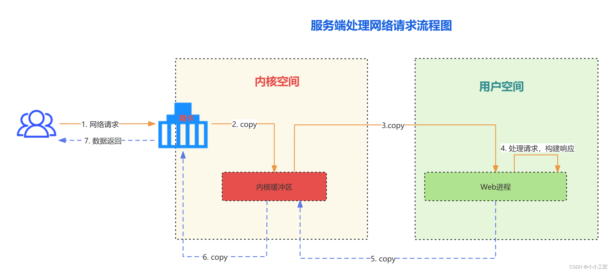
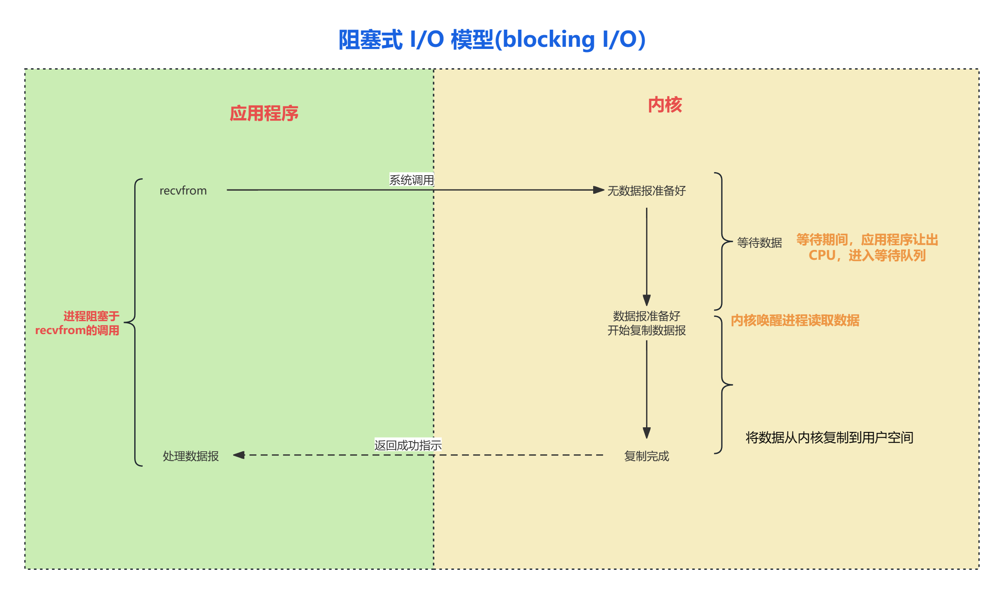
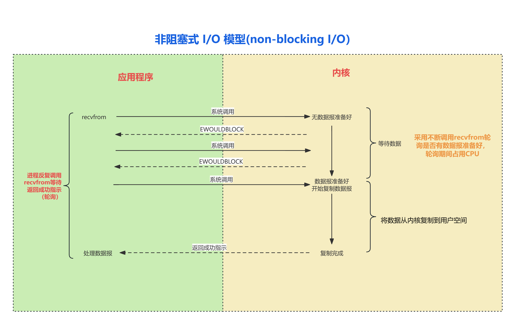
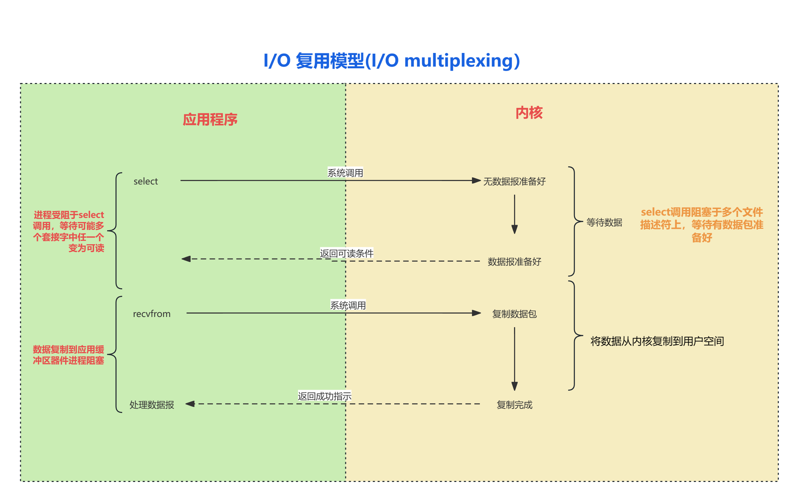
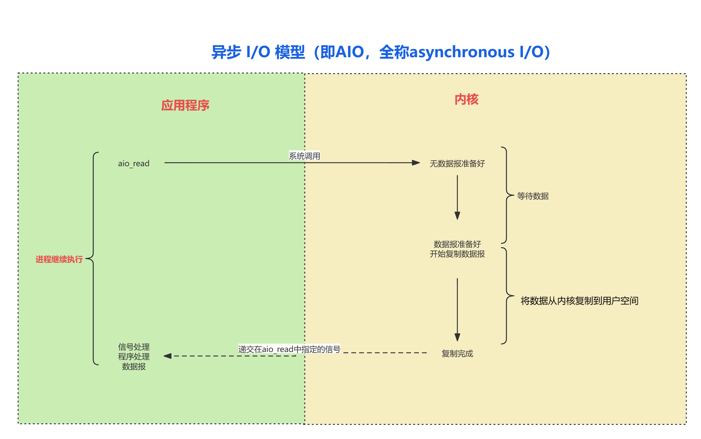

# 高性能网络编程 - 解读5种I/O模型

### 服务端处理网络请求流程图




大致流程如下：

- 1）获取请求数据，客户端与[服务器](https://cloud.tencent.com/product/cvm/?from_column=20065&from=20065)建立连接发出请求，服务器接受请求（1-3）；
- 2）构建响应，当服务器接收完请求，并在用户空间处理客户端的请求，直到构建响应完成（4）；
- 3）返回数据，服务器将已构建好的响应再通过内核空间的网络 I/O 发还给客户端（5-7）。

设计服务端并发模型时，主要有如下两个关键点：

- 1）服务器如何管理连接，获取输入数据；
- 2）服务器如何处理请求。

以上两个关键点最终都与操作系统的 I/O 模型以及线程(进程)模型相关，我们先详细看一下I/O模型 。


### 基础概念

#### 阻塞调用 vs 非阻塞调用

- 阻塞调用是指调用结果返回之前，当前线程会被挂起，调用线程只有在得到结果之后才会返回；
- 非阻塞调用指在不能立刻得到结果之前，该调用不会阻塞当前线程。

两者的最大区别在于被调用方在收到请求到返回结果之前的这段时间内，调用方是否一直在等待。

 阻塞是指调用方一直在等待而且别的事情什么都不做；非阻塞是指调用方先去忙别的事情。

------


#### 同步处理 vs 异步处理

- 同步处理是指被调用方得到最终结果之后才返回给调用方；
- 异步处理是指被调用方先返回应答，然后再计算调用结果，计算完最终结果后再通知并返回给调用方

------


#### 阻塞、非阻塞 和 同步、异步的区别

阻塞、非阻塞和同步、异步其实针对的对象是不一样的

- 1）阻塞、非阻塞的讨论对象是**调用者**；
- 2）同步、异步的讨论对象是**被调用者**。

------


#### recvfrom 函数

recvfrom 函数(经 Socket 接收数据)，这里把它视为**系统调用**

阻塞式 I/O 模型中的 `recvfrom` 是一个用于接收数据报的系统调用或函数。它通常用于网络编程中，特别是在UDP协议中。这个函数会阻塞应用程序的进程，直到有数据报准备好可以被接收。

具体来说，`recvfrom` 通常用于接收来自网络的数据报，例如从套接字（socket）中接收数据。当应用程序调用 `recvfrom` 时，如果没有数据报可用，它会等待直到有数据报到达，然后将数据报的内容复制到应用程序指定的缓冲区中，并返回成功。

在阻塞式 I/O 模型中，这个调用会导致应用程序阻塞，即应用程序的执行被暂停，直到数据可用为止。这通常意味着应用程序无法执行其他操作，直到 `recvfrom` 返回并提供接收的数据。这种模型在某些情况下非常简单，但也可能导致应用程序出现延迟，因为它必须等待数据的到达。

------

一个输入操作通常包括两个不同的阶段：

1）等待数据准备好； 2）从内核向进程复制数据。

对于一个套接字上的输入操作，

- 第一步通常涉及等待数据从网络中到达。当所等待分组到达时，它被复制到内核中的某个缓冲区。
- 第二步就是把数据从内核缓冲区复制到应用进程缓冲区。

实际应用程序在系统调用完成上面的 2 步操作时，

- 调用方式的阻塞、非阻塞，
- 操作系统在处理应用程序请求时，处理方式的同步、异步处理的不同，可以分为 5 种 I/O 模型

------


### 五种I/O模型

#### I/O模型1：阻塞式 I/O 模型(blocking I/O）




在阻塞式 I/O 模型中，应用程序在从调用 recvfrom 开始到它返回有数据报准备好这段时间是阻塞的，recvfrom 返回成功后，应用进程开始处理数据报。

- 比喻：一个人在钓鱼，当没鱼上钩时，就坐在岸边一直等。
- 优点：程序简单，在阻塞等待数据期间进程/线程挂起，基本不会占用 CPU 资源。
- 缺点：每个连接需要独立的进程/线程单独处理，当并发请求量大时为了维护程序，内存、线程切换开销较大，这种模型在实际生产中很少使用。


#### I/O模型2：非阻塞式 I/O 模型(non-blocking I/O）



在非阻塞式 I/O 模型中，应用程序把一个套接口设置为非阻塞，就是告诉内核，当所请求的 I/O 操作无法完成时，不要将进程睡眠。

而是返回一个错误，应用程序基于 I/O 操作函数将不断的轮询数据是否已经准备好，如果没有准备好，继续轮询，直到数据准备好为止

- 比喻：边钓鱼边玩手机，隔会再看看有没有鱼上钩，有的话就迅速拉杆。
- 优点：不会阻塞在内核的等待数据过程，每次发起的 I/O 请求可以立即返回，不用阻塞等待，实时性较好。
- 缺点：轮询将会不断地询问内核，这将占用大量的 CPU 时间，系统资源利用率较低，所以一般 Web 服务器不使用这种 I/O 模型。

>  `EWOULDBLOCK` 是一个错误码（或错误常量），通常在网络编程和非阻塞 I/O 中使用。它表示某个操作（通常是非阻塞的）因为当前状态而无法立即执行，但并不算是一种错误。在不同的操作系统和编程语言中，它有时也被称为 `EAGAIN`，表示 “操作再次尝试”。 
>
>  当你在非阻塞模式下进行 I/O 操作（如读取或写入数据），有时可能会遇到 `EWOULDBLOCK` 错误。这通常发生在以下情况下： 
>
>  

1. 针对非阻塞套接字的读取操作，但没有数据可供读取，因此需要稍后再次尝试。
2. 针对非阻塞套接字的写入操作，但发送缓冲区已满，因此需要稍后再次尝试。

>  这并不是一种严重的错误，而是提示应用程序需要稍后再次尝试相同的操作，因为当前条件不允许立即执行。应用程序可以通过重新调用相同的操作来处理 `EWOULDBLOCK` 错误，直到操作成功完成。 
>
>  在C语言中，通常使用 `errno` 变量来获取最后一次发生的错误码，而 `EWOULDBLOCK` 可以表示为 `EAGAIN`。例如： 


```java
if (recvfrom(socket_fd, buffer, buffer_size, 0) == -1) {
    if (errno == EWOULDBLOCK || errno == EAGAIN) {
        // 需要稍后再次尝试
    } else {
        // 处理其他错误
    }
}
```

>  这样，你可以在适当的情况下处理 `EWOULDBLOCK` 错误，以实现非阻塞的I/O操作。 


#### I/O模型3：I/O 复用模型(I/O multiplexing）




在 I/O 复用模型中，会用到 Select 或 Poll 函数或 Epoll 函数(Linux 2.6 以后的内核开始支持)，这两个函数也会使进程阻塞，但是和阻塞 I/O 有所不同。

这两个函数可以同时阻塞多个 I/O 操作，而且可以同时对多个读操作，多个写操作的 I/O 函数进行检测，直到有数据可读或可写时，才真正调用 I/O 操作函数。

- 比喻：放了一堆鱼竿，在岸边一直守着这堆鱼竿，没鱼上钩就玩手机。
- 优点：可以基于一个阻塞对象，同时在多个描述符上等待就绪，而不是使用多个线程(每个文件描述符一个线程)，这样可以大大节省系统资源。
- 缺点：当连接数较少时效率相比多线程+阻塞 I/O 模型效率较低，可能延迟更大，因为单个连接处理需要 2 次系统调用，占用时间会有增加。

**众所周之，Nginx这样的高性能互联网反向代理服务器大获成功的关键就是得益于Epoll**。

------


#### I/O模型4：信号驱动式 I/O 模型（signal-driven I/O)


在信号驱动式 I/O 模型中，应用程序使用套接口进行信号驱动 I/O，并安装一个信号处理函数，进程继续运行并不阻塞。

当数据准备好时，进程会收到一个 SIGIO 信号，可以在信号处理函数中调用 I/O 操作函数处理数据。

- 比喻：鱼竿上系了个铃铛，当铃铛响，就知道鱼上钩，然后可以专心玩手机。
- 优点：线程并没有在等待数据时被阻塞，可以提高资源的利用率。
- 缺点：信号 I/O 在大量 IO 操作时可能会因为信号队列溢出导致没法通知。

信号驱动 I/O 尽管对于处理 UDP 套接字来说有用，即这种信号通知意味着到达一个数据报，或者返回一个异步错误。

但是，**对于** **TCP** **而言，信号驱动的 I/O 方式近乎无用，因为导致这种通知的条件为数众多，每一个来进行判别会消耗很大资源，与前几种方式相比优势尽失**。


#### I/O模型5：异步 I/O 模型（即AIO，全称asynchronous I/O）



由 POSIX 规范定义，应用程序告知内核启动某个操作，并让内核在整个操作（包括将数据从内核拷贝到应用程序的缓冲区）完成后通知应用程序。

这种模型与信号驱动模型的主要区别在于：信号驱动 I/O 是由内核通知应用程序何时启动一个 I/O 操作，而异步 I/O 模型是由内核通知应用程序 I/O 操作何时完成。

- 优点：异步 I/O 能够充分利用 DMA 特性，让 I/O 操作与计算重叠。
- 缺点：要实现真正的异步 I/O，操作系统需要做大量的工作。目前 **Windows** **下通过 IOCP 实现了真正的异步 I/O**。

而在 Linux 系统下，Linux 2.6才引入，目前 AIO 并不完善，因此在 Linux 下实现高并发网络编程时都是以 IO 复用模型模式为主。


### 5 种 I/O 模型总结


从上图中我们可以看出，越往后，阻塞越少，理论上效率也是最优。

这五种 I/O 模型中，前四种属于同步 I/O，因为其中真正的 I/O 操作(recvfrom)将阻塞进程/线程，只有异步 I/O 模型才与 POSIX 定义的异步 I/O 相匹配。