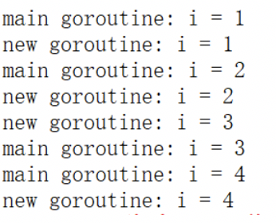

#### 协程并发


协程：coroutine。也叫轻量级线程。


与传统的系统级线程和进程相比，协程最大的优势在于“轻量级”。可以轻松创建上万个而不会导致系统资源衰竭。而线程和进程通常很难超过1万个。这也是协程别称“轻量级线程”的原因。


一个线程中可以有任意多个协程，但某一时刻只能有一个协程在运行，**多个协程分享该线程分配到的计算机资源**。


多数语言在语法层面并不直接支持协程，而是通过库的方式支持，但用库的方式支持的功能也并不完整，比如仅仅提供协程的创建、销毁与切换等能力。如果在这样的轻量级线程中调用一个同步 IO 操作，比如网络通信、本地文件读写，都会阻塞其他的并发执行轻量级线程，从而无法真正达到轻量级线程本身期望达到的目标。


   在协程中，调用一个任务就像调用一个函数一样，消耗的系统资源最少！但能达到进程、线程并发相同的效果。


在一次并发任务中，进程、线程、协程均可以实现。从系统资源消耗的角度出发来看，进程相当多，线程次之，协程最少。


#### Go并发


Go 在语言级别支持协程，叫goroutine。Go 语言标准库提供的所有系统调用操作（包括所有同步IO操作），都会出让CPU给其他goroutine。这让轻量级线程的切换管理不依赖于系统的线程和进程，也不需要依赖于CPU的核心数量。


有人把Go比作21世纪的C语言。第一是因为Go语言设计简单，第二，21世纪最重要的就是并行程序设计，而Go从语言层面就支持并发。同时，并发程序的内存管理有时候是非常复杂的，而Go语言提供了自动垃圾回收机制。


Go语言为并发编程而内置的上层API基于顺序通信进程模型CSP(communicating sequential processes)。这就意味着显式锁都是可以避免的，因为Go通过相对安全的通道发送和接受数据以实现同步，这大大地简化了并发程序的编写。


Go语言中的并发程序主要使用两种手段来实现。goroutine和channel。


#### 什么是Goroutine


goroutine是Go语言并行设计的核心，有人称之为go程。 Goroutine从量级上看很像协程，它比线程更小，十几个goroutine可能体现在底层就是五六个线程，Go语言内部帮你实现了这些goroutine之间的内存共享。执行goroutine只需极少的栈内存(大概是4~5KB)，当然会根据相应的数据伸缩。也正因为如此，可同时运行成千上万个并发任务。goroutine比thread更易用、更高效、更轻便。


一般情况下，一个普通计算机跑几十个线程就有点负载过大了，但是同样的机器却可以轻松地让成百上千个goroutine进行资源竞争。


#### 创建Goroutine


只需在函数调⽤语句前添加 **go** 关键字，就可创建并发执⾏单元。开发⼈员无需了解任何执⾏细节，调度器会自动将其安排到合适的系统线程上执行。


在并发编程中，我们通常想将一个过程切分成几块，然后让每个goroutine各自负责一块工作，当一个程序启动时，主函数在一个单独的goroutine中运行，我们叫它main goroutine。新的goroutine会用go语句来创建。而go语言的并发设计，让我们很轻松就可以达成这一目的。


示例代码：


```go
package main
 
import (
    "fmt"
    "time"
)
 
func newTask() {
    i := 0
    for {
        i++
        fmt.Printf("new goroutine: i = %d\n", i)
        time.Sleep(1*time.Second) //延时1s
    }
}
 
func main() {
    //创建一个 goroutine，启动另外一个任务
    go newTask()
    i := 0
    //main goroutine 循环打印
    for {
        i++
        fmt.Printf("main goroutine: i = %d\n", i)
        time.Sleep(1 * time.Second) //延时1s
    }
}
```


程序运行结果：





#### Goroutine特性


**主goroutine退出后，其它的工作goroutine也会自动退出：**


```go
package main
 
import (
"fmt"
"time"
)
 
func newTask() {
    i := 0
    for {
        i++
        fmt.Printf("new goroutine: i = %d\n", i)
        time.Sleep(1 * time.Second) //延时1s
    }
}
 
func main() {
    //创建一个 goroutine，启动另外一个任务
    go newTask()
 
    fmt.Println("main goroutine exit")
}
```


程序运行结果：


#### Goexit函数


调用 runtime.Goexit() 将立即终止当前 goroutine 执⾏，调度器确保所有已注册 defer 延迟调用被执行。


示例代码：


```go
package main
 
import (
"fmt"
"runtime"
)
 
func main() {
    go func() {
        defer fmt.Println("A.defer")
 
        func() {
            defer fmt.Println("B.defer")
            runtime.Goexit() // 终止当前 goroutine, import "runtime"
            fmt.Println("B") // 不会执行
        }()
 
        fmt.Println("A") // 不会执行
    }()       //不要忘记()
 
    //死循环，目的不让主goroutine结束
    for {
    }
}
```


程序运行结果：

