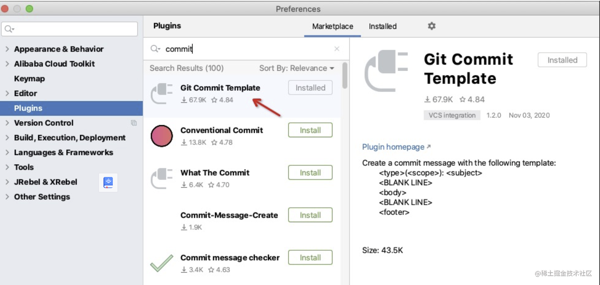
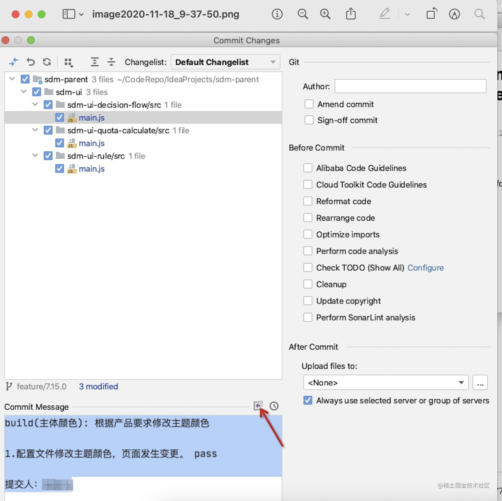
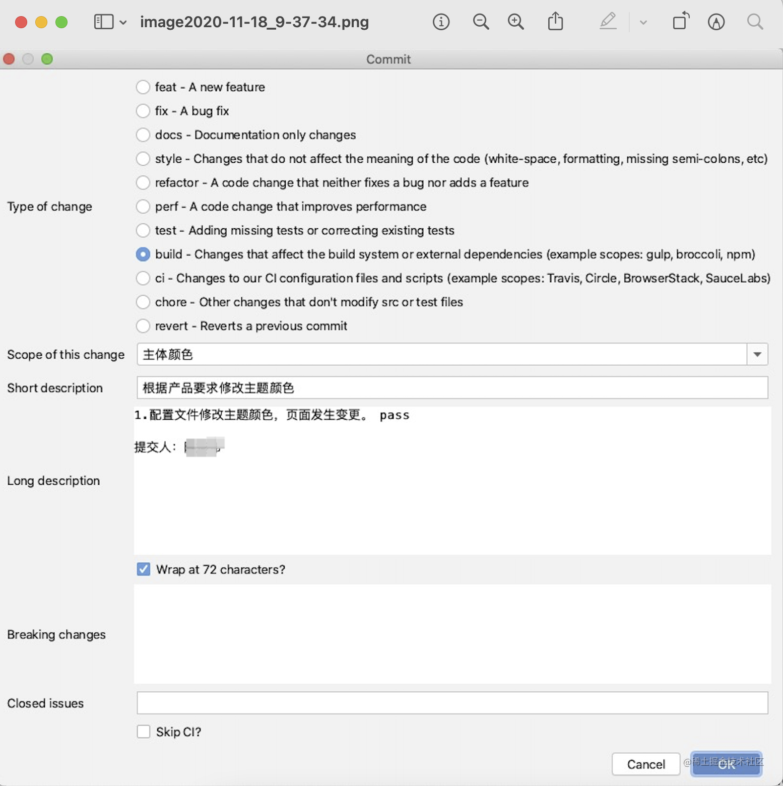

# Git Commit Message规范

## 概述


不知道大家在各自项目中是如何写提供代码的commit message, 我们项目有的同事写的很简单，压根不知道提交了什么内容，是新功能还是缺陷修复。本质上 commit message就是为了让团队成员知道这次提交的内容，为此，我们出了一个规范，约定团队的每个同事按照这个规范提交代码，达到通过message能够了解此次修改的内容。


## 一、Commit message 的格式


每次提交，Commit message 都包括三个部分：Header，Body 和 Footer。

```
<type>(<scope>): <subject>
// 空一行
<body>
```

其中，Header、针对feat和fix类型的提交内容 Body 是必需的。 不管是哪一个部分，任何一行都不得超过72个字符（或100个字符）。这是为了避免自动换行影响美观。


### 1.1 Header


Header部分只有一行，包括三个字段： type（必需）、scope（必需）和subject（必需）。

（1）type

type用于说明 commit 的类别，只允许使用下面7个标识。

```
feat：新功能（feature）
fix：修补bug
docs：文档（documentation）
style： 格式（不影响代码运行的变动）
refactor：重构（即不是新增功能，也不是修改bug的代码变动）
test：增加测试
build：构建过程或辅助工具的变动
```

（2）scope

scope用于说明 commit 影响的范围，比如指标模板、规则上下线等等，视项目不同而不同。

（3）subject

subject是 commit 目的的简短描述，不超过50个字符。

```
1. 以动词开头，使用第一人称现在时，比如change，而不是changed或changes
2. 第一个字母小写
3. 结尾不加句号（.）
```


### 1.2 Body


Body 部分是对本次 commit 的详细描述，可以分成多行。

```
1. 需要简要的列出各种正向或者反向的测试场景，测试通过，填pass。
2. 增加修改人信息
```


## 二、例子


### 2.1 feat例子


```
feat(规则上下线、构建、生效、仿真生效): 添加规则上下线功能 
1. 规则上下线主流程，引擎正常订阅，fldl生成正常。 pass
2. 规则上下线，传入不存在的规则编号，异常提示。 pass
提交人：xxx
```


### 2.2 fix例子


```
fix(模型模块): 模型测试失败
1. 导入mar模型，包含衍生字段。 pass
2. 导入mar模型，不包含衍生字段。 pass
提交人：xxx
```


## 插件推荐


idea可以安装代码提交规范的插件。

1. 安装插件

2.提交时选择插件提交



