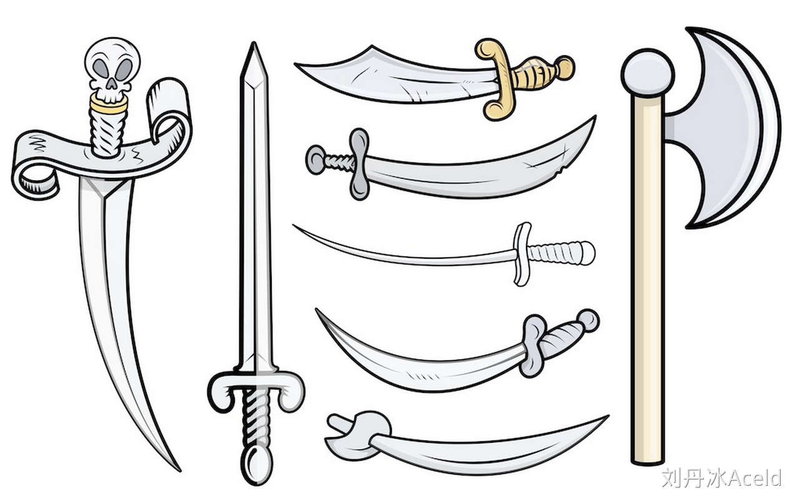
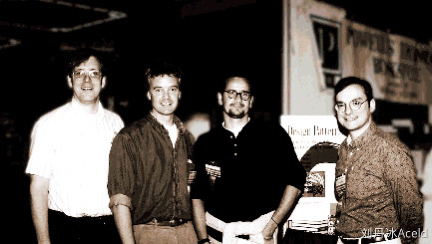

如果把修习软件开发当做武功修炼的话，那么可以分为**招式**和**内功**。   

### 招式：



- Java、C#、C++、Golang、Rust等编程语言；
-  Eclipse、Visual Studio、Goland、Vim等开发工具；
-  Struts、Hibernate、JBPM、Gin、Istio、gRPC等框架技术；


### 内功：


- 数据结构
- 算法
- 设计模式
- 架构设计
- 软件工程


注意：招式可以很快学会，但是内功的修炼需要更长的时间

## 1.1 设计模式从何而来


图1 模式之父

上图是“模式之父”，Christopher Alexander（克里斯托弗.亚历山大）———哈佛大学建筑学博士、美国加州大学伯克利分校建筑学教授、加州大学伯克利分校环境结构研究所所长、美国艺术和科学院院士。


克里斯托弗.亚历山大在作品《建筑的永恒之道》中对“模式”的描述是：

“每个模式都描述了一个在我们的环境中不断出现的问题，然后描述了该问题的解决方案的核心，通过这种方式，我们可以无数次地重用那些已有的成功的解决方案，无须再重复相同的工作。”

他给出了设计模式的定义。


我们也可以用下面这句话来理解“设计模式”的定义：

“设计模式是在特定环境下人们解决某类重复出现问题的一套成功或有效的解决方案。”


## 1.2 软件设计模式又从何而来



图2 	四人组（Gang of Four），简称GoF

左到右依次是：Ralph Johnson，Richard Helm，Erich Gamma，John Vlissides。

GoF将模式的概念引入软件工程领域，这标志着软件模式的诞生。软件模式(Software Patterns)是将模式的一般概念应用于软件开发领域，即软件开发的总体指导思路或参照样板。软件模式并非仅限于设计模式，还包括架构模式、分析模式和过程模式等，实际上，在软件开发生命周期的每一个阶段都存在着一些被认同的模式。

​	软件模式与具体的应用领域无关，也就是说无论你从事的是移动应用开发、桌面应用开发、Web应用开发还是嵌入式软件的开发，都可以使用软件模式。无论你是使用Java、C#、Objective-C、VB.net、Smalltalk等纯面向对象编程语言，还是使用C++、PHP、Delphi、JavaScript等可支持面向对象编程的语言，你都需要了解软件设计模式！
​	GoF给软件设计模式提供了定义，如下：

“软件设计模式(Design Pattern)是一套被反复使用、多数人知晓的、经过分类编目的、代码设计经验的总结，使用设计模式是为了可重用代码、让代码更容易被他人理解并且保证代码可靠性。”

一句大白话可以总结：“在一定环境下，用固定套路解决问题。”


## 1.3 软件设计模式的种类

GoF提出的设计模式有23个，包括：

（1）创建型(Creational)模式：如何创建对象；

（2）结构型(Structural )模式：如何实现类或对象的组合；

（3）行为型(Behavioral)模式：类或对象怎样交互以及怎样分配职责。


	有一个“简单工厂模式”不属于GoF 23种设计模式，但大部分的设计模式书籍都会对它进行专门的介绍。

设计模式目前种类： GoF的23种   + “简单工厂模式” = 24种。


## 1.4 软件设计模式的作用

那么对于初学者来说，学习设计模式将有助于更加深入地理解面向对象思想, 让你知道：


```plain
1. 如何将代码分散在几个不同的类中？
2. 为什么要有“接口”？
3. 何谓针对抽象编程？
4. 何时不应该使用继承？
5. 如果不修改源代码增加新功能？
6. 更好地阅读和理解现有类库与其他系统中的源代码。
```

   学习设计模式会让你早点脱离面向对象编程的“菜鸟期”。


## 1.5 如何学好设计模式

设计模式的基础是：多态。

初学者：积累案例，不要盲目的背类图。

初级开发人员：多思考，多梳理，归纳总结，尊重事物的认知规律，注意临界点的突破，不要浮躁。

中级开发人员：合适的开发环境，寻找合适的设计模式来解决问题。

多应用，对经典则组合设计模式的大量，自由的运用。要不断的追求。


## 1.6 设计模式总览表

| **模式名称**                                            | **模式名称**                                                 | **作用**                                                     |
| ------------------------------------------------------- | ------------------------------------------------------------ | ------------------------------------------------------------ |
| **创建型模式**  **Creational Pattern****（****6****）** | 单例模式★★★★☆                                                | 是保证一个类仅有一个实例，并提供一个访问它的全局访问点。     |
| 简单工厂模式★★★☆☆                                       | 通过专门定义一个类来负责创建其他类的实例，被创建的实例通常都具有共同的父类。 |                                                              |
| 工厂方法模式★★★★★                                       | 定义一个创建产品对象的工厂接口，将实际创建工作推迟到子类中。 |                                                              |
| 抽象工厂模式★★★★★                                       | 提供一个创建一系列相关或者相互依赖的接口，而无需指定它们具体的类。 |                                                              |
| 原型模式★★★☆☆                                           | 用原型实例指定创建对象的种类，并且通过拷贝这些原型创建新的对象。 |                                                              |
| 建造者模式★★☆☆☆                                         | 将一个复杂的构建与其表示相分离，使得同样的构建过程可以创建不同的表示。 |                                                              |
| **结构型模式****Structural Pattern****（****7****）**   | 适配器模式★★★★☆                                              | 将一个类的接口转换成客户希望的另外一个接口。使得原本由于接口不兼容而不能一起工作的那些类可以一起工作。 |
| 桥接模式★★★☆☆                                           | 将抽象部分与实际部分分离，使它们都可以独立的变化。           |                                                              |
| 组合模式★★☆☆☆                                           | 将对象组合成树形结构以表示“部分--整体”的层次结构。使得用户对单个对象和组合对象的使用具有一致性。 |                                                              |
| 装饰模式★★★☆☆                                           | 动态的给一个对象添加一些额外的职责。就增加功能来说，此模式比生成子类更为灵活。 |                                                              |
| 外观模式★★★★★                                           | 为子系统中的一组接口提供一个一致的界面，此模式定义了一个高层接口，这个接口使得这一子系统更加容易使用。 |                                                              |
| 享元模式★☆☆☆☆                                           | 以共享的方式高效的支持大量的细粒度的对象。                   |                                                              |
| 代理模式★★★★☆                                           | 为其他对象提供一种代理以控制对这个对象的访问。               |                                                              |
| **行为型模式****Behavioral Pattern****（****11****）**  | 职责链模式★★☆☆☆                                              | 在该模式里，很多对象由每一个对象对其下家的引用而连接起来形成一条链。请求在这个链上传递，直到链上的某一个对象决定处理此请求，这使得系统可以在不影响客户端的情况下动态地重新组织链和分配责任。 |
| 命令模式★★★★☆                                           | 将一个请求封装为一个对象，从而使你可用不同的请求对客户端进行参数化；对请求排队或记录请求日志，以及支持可撤销的操作。 |                                                              |
| 解释器模式★☆☆☆☆                                         | 如何为简单的语言定义一个语法，如何在该语言中表示一个句子，以及如何解释这些句子。 |                                                              |
| 迭代器模式★☆☆☆☆                                         | 提供了一种方法顺序来访问一个聚合对象中的各个元素，而又不需要暴露该对象的内部表示。 |                                                              |
| 中介者模式★★☆☆☆                                         | 定义一个中介对象来封装系列对象之间的交互。中介者使各个对象不需要显示的相互调用 ，从而使其耦合性松散，而且可以独立的改变他们之间的交互。 |                                                              |
| 备忘录模式★★☆☆☆                                         | 是在不破坏封装的前提下，捕获一个对象的内部状态，并在该对象之外保存这个状态。 |                                                              |
| 观察者模式★★★★★                                         | 定义对象间的一种一对多的依赖关系，当一个对象的状态发生改变时，所有依赖于它的对象都得到通知并被自动更新。 |                                                              |
| 状态模式★★☆☆☆                                           | 对象的行为，依赖于它所处的状态。                             |                                                              |
| 策略模式★★★★☆                                           | 准备一组算法，并将每一个算法封装起来，使得它们可以互换。     |                                                              |
| 模板方法模式★★★☆☆                                       | 得子类可以不改变一个算法的结构即可重定义该算法的某些特定步骤。 |                                                              |
| 访问者模式★☆☆☆☆                                         | 表示一个作用于某对象结构中的各元素的操作，它使你可以在不改变各元素的类的前提下定义作用于这些元素的新操作。 |                                                              |