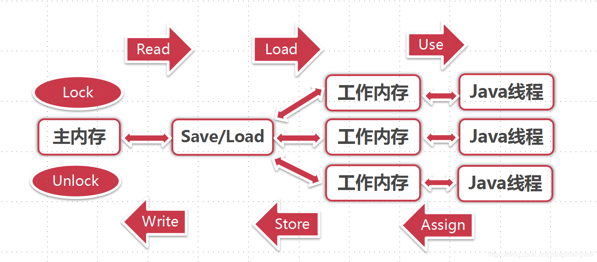

## CPU多级缓存

### CPU多级缓存概述

[为什么CPU缓存会分为一级缓存L1、L2、L3？有什么意义？](https://cloud.tencent.com/developer/tools/blog-entry?target=http%3A%2F%2Fbaijiahao.baidu.com%2Fs%3Fid%3D1598811284058671259%26wfr%3Dspider%26for%3Dpc&objectId=1863179&objectType=1&isNewArticle=undefined)

CPU的频率非常快，主存Main Memory跟不上。CPU缓存是**CPU与内存之间**的临时数据交换器，为了解决CPU运行处理速度与内存读写速度不匹配的矛盾——缓存的速度比内存的速度快多了。

上图左侧为简易的高速缓存结构，数据的读取和存储都经过高速缓存Cache，CPU核心与高速缓存有一条特殊的快速通道；主存Main Memory与高速缓存都连在系统总线上（BUS）这条总线还用于其它组件的通信。

在高速缓存出现后不久，系统变得愈加复杂，高速缓存与主存之间的速度差异被拉大，直到加入了L2 Cache ,甚至L3 Cache。它们的作用都是

- 作为CPU与主内存之间的高速数据缓冲区，L1最靠近CPU核心；L2其次；L3再次。
- 运行速度方面：L1>L2>L3
- 容量大小方面：L1

CPU会先在最快的L1中寻找需要的数据，找不到再去找次快的L2，还找不到再去找L3，L3都没有那就只能去内存找了。如上图右侧。

### CPU 多级缓存-缓存一致性协议MESI

MESI协议的作用：**用于保证多个CPU Cache之间缓存共享数据的一致**

MESI 是指4中状态的首字母。每个Cache line有4个状态，可用2个bit表示，它们分别是：

注： 缓存行（Cache line）:缓存存储数据的单元。

| 状态                     | 描述                                                         | 监听任务                                                     |
| :----------------------- | :----------------------------------------------------------- | :----------------------------------------------------------- |
| M 修改 (Modified)        | 该Cache line有效，数据被修改了，和内存中的数据不一致，数据只存在于本Cache中 | 缓存行必须时刻监听所有试图读该缓存行相对就主存的操作，这种操作必须在缓存将该缓存行写回主存并将状态变成S（共享）状态之前被延迟执行 |
| E 独享、互斥 (Exclusive) | 该Cache line有效，数据和内存中的数据一致，数据只存在于本Cache中 | 缓存行也必须监听其它缓存读主存中该缓存行的操作，一旦有这种操作，该缓存行需要变成S（共享）状态 |
| S 共享 (Shared)          | 该Cache line有效，数据和内存中的数据一致，数据存在于很多Cache中 | 缓存行也必须监听其它缓存使该缓存行无效或者独享该缓存行的请求，并将该缓存行变成无效（Invalid） |
| I 无效 (Invalid)         | 该Cache line无效                                             | 无                                                           |

触发事件：

| 触发事件                 | 描述                       |
| :----------------------- | :------------------------- |
| 本地读取（Local read）   | 本地cache读取本地cache数据 |
| 本地写入（Local write）  | 本地cache写入本地cache数据 |
| 远端读取（Remote read）  | 其它cache读取本地cache数据 |
| 远端写入（Remote write） | 其它cache写入本地cache数据 |

------

### CPU 多级缓存-乱序执行优化-重排序

处理器为提高运算速度而做出违背代码原有顺序的优化， 线程下的情况下**可见性**就会出现问题。

在正常情况下是不对结果造成影响的。在单核时代处理器对结果的优化保证不会远离预期目标，但是在多核环境下却并非如此. 因为在多核条件下会有多个核执行指令，因此每个核的指令都有可能会乱序。另外处理器还引入了L1、L2缓存机制，这就导致了逻辑上后写入的数据不一定最后写入。

在执行程序时，为了提高性能，编译器和处理器常常会对指令做重排序。重排序分为下面三种：

1. 编译器优化的重排序。编译器在不改变单线程程序语义的前提下，可以重新安排语句的执行顺序。
2. 指令级并行的重排序。现代处理器采用了指令集并行技术来将多条指令重叠执行。如果不存在数据依赖，处理器可以改变语句对应机器指令的执行顺序。
3. 内存系统的重排序。由于处理器使用缓存和读/写缓冲区，这使得加载和存储操作看上去可能可能是在乱序执行。

 编译器重排序属于编译器重排序，指令级并行重排序和内存系统重排序属于处理器重排序，这些重排序可能会导致多线程出现内存可见性问题。

------

## JAVA内存模型 （JMM）

**上面讲的是硬件CPU的多级缓存，为了屏蔽掉各种系统硬件和操作系统的内存访问差异，以实现****Java****程序在各大平台都能达到一致的并发效果，Java****虚拟机****因此定义了Java内存模型，它规范了Java虚拟机与计算机是如何协同工作的。**

接着说上面的重排序，对于JVM来讲是怎样的呢？

1. 对于编译器，JMM的编译器重排序规则会禁止特点类型的重排序。
2. 对于处理器重排序，JMM的处理器重排序规则会要求Java编译器在生成指令序列时，插入特定类型的内存屏障指令，通过内存屏障指令来禁止特点类型的处理器重排序。
3. JMM属于语言级的内存屏障，它确保在不同的编译器和不同的处理器平台上，通过禁止特点类型的编译器重排序和处理器重排序，为程序员提供一致的内存可见性保证。

那JMM（Java Memory Model）

关于JVM内存区域中的堆栈请参考 [JVM-01Java内存区域与内存溢出异常(上)【运行时区域数据】](https://cloud.tencent.com/developer/article/1861742?from_column=20421&from=20421)

存在堆上的对象，可以被持有这个对象的引用的线程访问。如果两个线程同时访问同一个对象的私有变量，此时这两个线程所拥有的是"这个对象的私有拷贝"。 比如这里的Object3

------

#### 计算机硬件架构简易图示

CPU：一个计算机一般有多个CPU，一个CPU还会有多核。因此意味着每个CPU可能都会运行一个线程，所以计算机出现多线程是很有可能的。

CPU Registers（寄存器）：每个CPU都包含一系列的寄存器，它们是CPU内存的基础，CPU在寄存器上执行的 速度远大于在主存上执行的速度，这是因为计算机访问寄存器的速度远大于主存。

CPU Cache（高速缓存）：由于计算机的存储设备与处理器的处理设备有着几个数量级的差距，所以现代计 算机都会加入一层读写速度与处理器处理速度接近相同的高级缓存来作为内存与处理器之间的缓冲，将运算使用到的数据复制到缓存中，让运算能够快速的执行，当运算结束后，再从缓存同步到内存之中，这 样，CPU就不需要等待缓慢的内存读写了主（内）存 。 一个计算机包含一个主存，所有的CPU都可以访问主存，主存比缓存容量大的多（CPU访问缓存层的速度快于访问主存的速度！但通常比访问内存寄存器的速度还是要慢点）。

------

通常情况下，当一个CPU要读取主存（RAM - Main Mernory）的时候，它首先会将主存中的数据读 取到CPU缓存中，甚至将缓存内容读到内部寄存器里面，然后再寄存器执行操作，当运行结束后，会将寄存器中的值刷新回缓存中，并在某个时间点将值刷新回主存。

------

#### JAVA内存模型与硬件架构之间的关系

右侧的硬件内存模型是没有区分线程 Stack栈 和 Heap堆，对于硬件而言，所有的栈和堆分布在主存里面，部分栈和堆也可能出现在CPU缓存以及CPU内部的寄存器中。

------

#### Java内存模型的抽象结构

 如果线程A和线程B要通信的话，必须要经历下面两个步骤

1. 线程A把本地内存A中跟新过的共享变量刷新到主内存中去
2. 线程B到主内存中去读取线程A更新过的共享变量

使用如下示意图更加清晰

假设这3个内存中x均为0，线程A执行时将更新后的值假设更新为1临时存放到自己的本地内存A中。 当线程A和B需要通信时，线程A首先会把自己本地内存中的修改后的值即1刷新到主内存中，此时主内存中x=1. 随后线程B到主内存中去读取线程A更新后的值，此时线程B的本地内存的x值也变成了1. 【正常情况 A先B后】

如果线A和线程B同时读取到主内存中的x值，均为0 ，线程A将x值更新为1，放到线程A本地内存，因为线程A和线程B它们之间的数据不可见，线程B并没有等线程A写回主内存之后做更新操作 ，此时线程B也做了同样的更新操作，这个时候线程B的本地内存中x也变成了1 ，因此当线程B操作完成将结果1写回主内存时计数就出现了错误【因为线程B并没有等线程A将更新后数据写会主内存】，正确的情况应该是线程B读取主内存中的1，然后更新为2，再次写会主内存，主内存最后的x=2. 这就引起了并发问题。这就解释了我们案例中的count为啥不总是等于1万的情况 ， 案例-> [https://blog.csdn.net/yangshangwei/article/details/87400938#_48](https://cloud.tencent.com/developer/tools/blog-entry?target=https%3A%2F%2Fblog.csdn.net%2Fyangshangwei%2Farticle%2Fdetails%2F87400938%23%5C_48&objectId=1863179&objectType=1&isNewArticle=undefined) 【异常情况 AB同时执行】

**所以需要使用同步的手段去确保程序处理的准确性。**

**从整体上看，这两个步骤实质上是线程A向线程B发送消息，而且这个通信过程必须要经过主内存。 JMM通过控制主内存与每个线程的本地内存之间的交互，来提供内存可见性保证 。**

------

#### Java内存模型的同步八种操作

1. Lock（锁定）：作用于主内存的变量，把一个变量标识变为一条线程独占状态
2. Unlock（解锁）：作用于主内存的变量，把一个处于锁定状态的变量释放出来，释放后的变量才可以被其它线程锁定
3. Read（读取）：作用于主内存的变量，把一个变量值从主内存传输到线程的工作内存中，以便随后的load动作使用
4. Load（载入）：作用于工作内存的变量，它把Read操作从主内存中得到的变量值放入工作内存的变量副本中
5. Use（使用）：作用于工作内存的变量，把工作内存中的一个变量值传递给执行引擎
6. Assign（赋值）：作用于工作内存的变量，它把一个从执行引擎接受到的值赋值给工作内存的变量
7. Store（存储）：作用于工作内存的变量，把工作内存中的一个变量的值传送到主内存中，以便随后的write的操作
8. Write（写入）：作用于主内存的变量，它把Store操作从工作内存中一个变量的值传送到主内存的变量中

------

#### Java内存模型 - 同步规则

1. 如果要把一个变量从主内存中赋值到工作内存，就需要按顺序得执行read和load操作，如果把变量从工作内 存中同步回主内存中，就要按顺序得执行store和write操作，但java内存模型只要求上述操作必须按顺序执行，没有保证必须是连续执行,也就是说Read和Load、Store和Write之间是可以插入其它指令的
2. 不允许read和load、store和write操作之一单独出现
3. 不允许一个线程丢弃它的最近assign的操作，即变量在工作内存中改变了之后必须同步到主内存中
4. 不允许一个线程无原因地（也就是说必须有assgin操作）把数据从工作内存同步到主内存中
5. 一个新的变量只能在主内存中诞生，不允许在工作内存中直接使用一个未被初始化（load或assign）的变量。即就是对一个变量实施use和store操作之前，必须先执行过了load和assign操作
6. 一个变量在同一时刻只允许一条线程对其进行lock操作，但lock操作可以同时被一条线程重复执行多次，多次执行lock后，只有执行相同次数的unlock操作，变量才会解锁，lock和unlock必须成对出现
7. 如果一个变量执行lock操作，将会清空工作内存中此变量的值，在执行引擎中使用这个变量前需要重新执行 load或assign操作初始化变量的值
8. 如果一个变量事先没有被lock操作锁定，则不允许它执行unlock操作，也不允许去unlock一个被其它线程锁定的变量
9. 对一个变量执行unlock操作之前，必须先把此变量同步到主内存中（其实就是执行store和write操作之后）

## 并发编程优缺点

## 代码

[https://github.com/yangshangwei/ConcurrencyMaster](https://cloud.tencent.com/developer/tools/blog-entry?target=https%3A%2F%2Fgithub.com%2Fyangshangwei%2FConcurrencyMaster&objectId=1863179&objectType=1&isNewArticle=undefined)