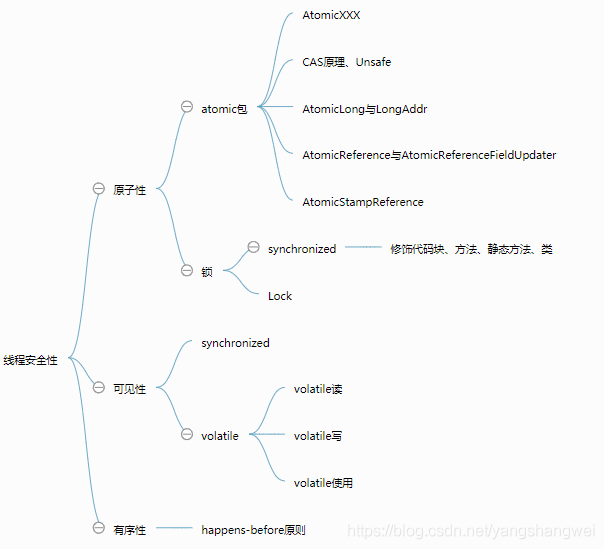
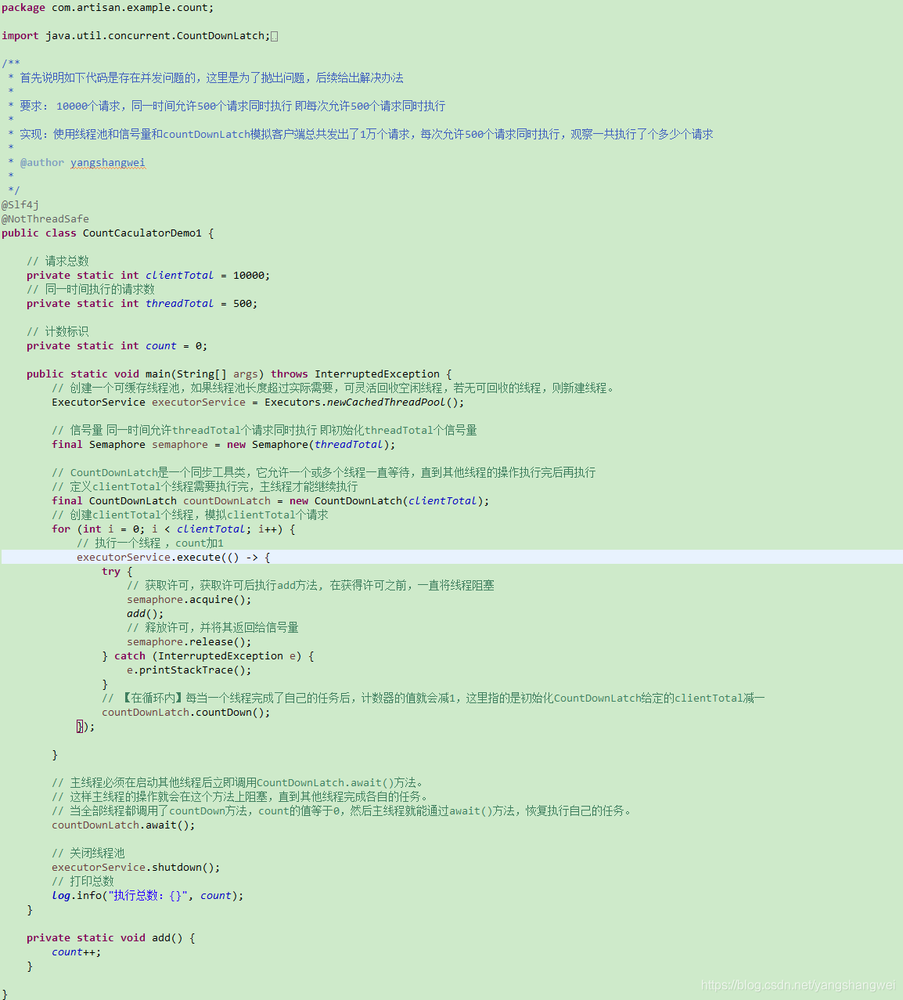
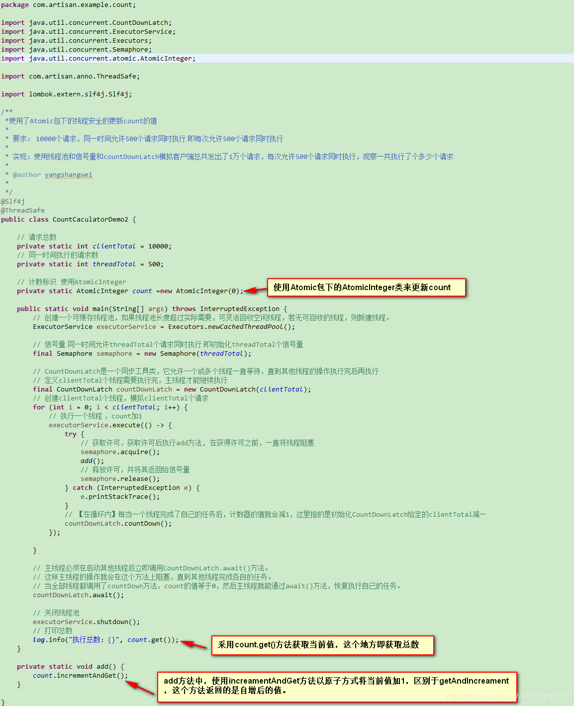
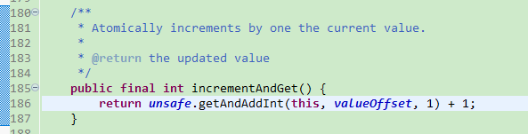
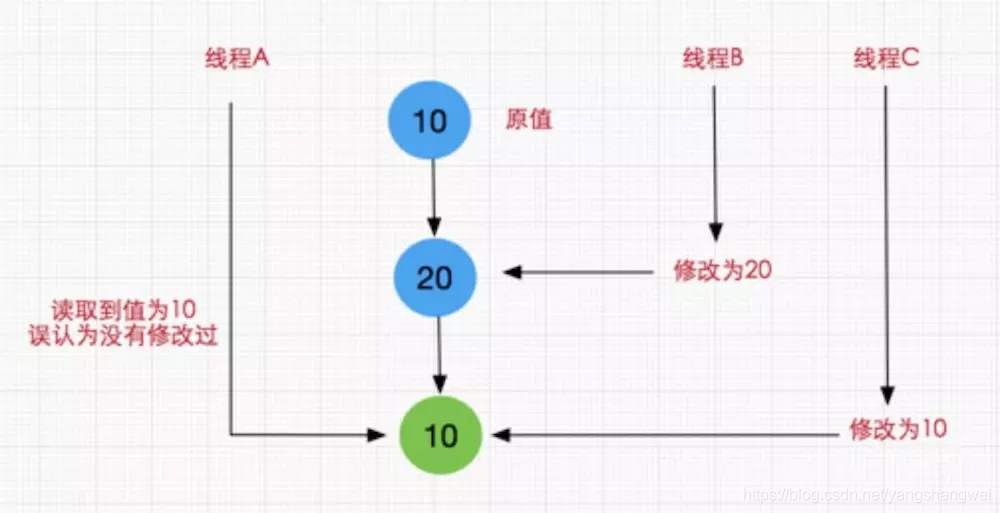
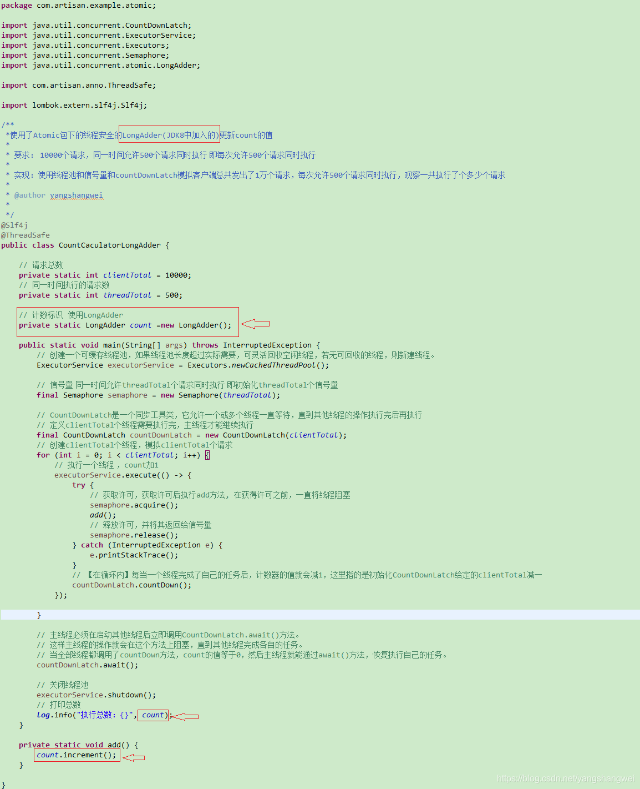
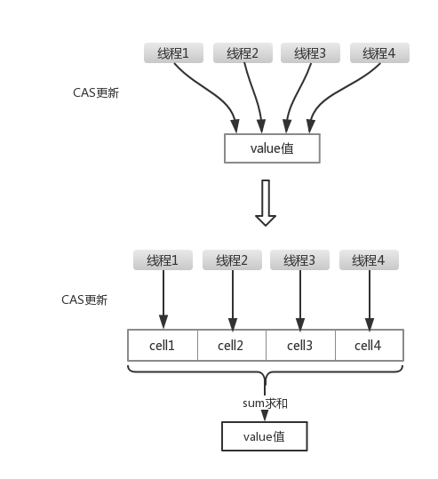

## 脑图



## 线程安全性的定义

当多个线程访问某个类时，不管运行时环境采用**何种调度方式**或者这些进程将如何进行交替，并且在主调代码中**不需要任何额外的同步或者协同**，这个类都能表现**正确的行为**，那么这个类就是线程安全的。

------

## 线程安全性的体现

线程安全性主要体现在一下三个方面

 **1. 原子性**

  **2. 可见性**

  **3. 有序性**

原子性：提供互斥访问，同一时刻只能有一个线程来对它进行操作

可见性：一个线程对主内存的修改可以及时被其他线程观察到

有序性：一个线程观察其他线程中的指令执行顺序，由于指令重排序的存在，该观察结果一般杂乱无序

我们逐个来看下这3个特性，首先来学习下线程安全的原子性JDK中提供的类以及原理。

------

## 原子性

提到原子性，就不得不提jdk1.5开始提供的juc中的Atomic包，**Atomic包中的原子操作类提供了一种用法简单、性能高效、线程安全的更新一个变量的方式。**

先回顾下线程不安全的写法



### 使用AtomicInteger改造线程不安全的变量

下面我们通过示例来演示下Atomic包中的原子类是如何线程安全的更新一个变量的方式



### incrementAndGet源码分析-UnSafe类 compareAndSwapInt （CAS）

AtomicInteger#incrementAndGet 是如何实现线程安全的呢？

看下源码 （**JDK1.8**）



**调用了Unsafe类中的getAndAddInt()方法，该方法执行一个CAS操作，保证线程安全**。

UnSafe的getAndAddInt方法实现：

代码语言：javascript

复制

```javascript
//Unsafe类中的getAndAddInt方法
public final int getAndAddInt(Object o, long offset, int delta) {        
    int v;        
    do {            
        v = getIntVolatile(o, offset);        
    } while (!compareAndSwapInt(o, offset, v, v + delta));        
    return v;
}
```

getAndAddInt通过一个while循环不断的重试更新要设置的值，直到成功为止，调用的是Unsafe类中的**compareAndSwapInt**方法，是一个**CAS操作**方法。 【CAS操作是基于系统原语的（原语的执行必须是连续的，操作期间不会被系统中断，是一条CPU的原子指令），因此是一个不需要加锁的锁，也因此不可能出现死锁的情况。】

CAS方法的主要实现逻辑

>  CAS：Compare and Swap CAS(V, E, N) V：要更新的变量 E：预期值 N：新值 **如果V值等于E值，则将V值设为N值；如果V值不等于E值，说明其他线程做了更新，那么当前线程什么也不做**。（放弃操作或重新读取数据） 

在JDK中的实现为，加入了个偏移量offset

Unsafe里的CAS 操作相关:

代码语言：javascript

复制

```javascript
//第一个参数o为给定对象，offset为对象内存的偏移量，通过这个偏移量迅速定位字段并设置或获取该字段的值，
//expected表示期望值，x表示要设置的值，下面3个方法都通过CAS原子指令执行操作。
public final native boolean compareAndSwapObject(Object o, long offset,Object expected, Object x);                                                                                                   
public final native boolean compareAndSwapInt(Object o, long offset,int expected,int x); 
public final native boolean compareAndSwapLong(Object o, long offset,long expected,long x);
```

------

上面的incrementAndGet 源码分析是基于JDK1.8的，如果是1.8之前的方法，1.8之前的方法则是通过for的死循环实现的：

代码语言：javascript

复制

```javascript
//JDK 1.7的源码，由for的死循环实现，并且直接在AtomicInteger实现该方法，
//JDK1.8后，该方法实现已移动到Unsafe类中，直接调用getAndAddInt方法即可
public final int incrementAndGet() {    
    for (;;) {        
        int current = get();        
        int next = current + 1;        
        if (compareAndSet(current, next))            
            return next;    
    }
}
```

------

### CAS操作中可能会带来的ABA问题

当第一个线程执行CAS(V,E,U)操作，在获取到当前变量V，准备修改为新值U前，另外两个线程已连续修改了两次变量V的值，使得该值又恢复为旧值。



#### ABA问题的解决办法

- AtomicStampedReference类 时间戳

>  一个带有**时间戳**的对象引用，每次修改时，不但会设置新的值，还会记录修改时间。在下一次更新时，不但会对比当前值和期望值，还会对比当前时间和期望值对应的修改时间，只有二者都相同，才会做出更新。 底层实现为：一个键值对Pair存储数据和时间戳，并构造volatile修饰的私有实例；两者都符合预期才会调用Unsafe的compareAndSwapObject方法执行数值和时间戳替换 

------

- AtomicMarkableReference类

>  一个boolean值的标识，true和false两种切换状态表示是否被修改。不推荐使用。 

原理参考：[Java中的CAS和Unsafe类](https://cloud.tencent.com/developer/tools/blog-entry?target=https%3A%2F%2Fwww.jianshu.com%2Fp%2Fdf0585b61773&objectId=1863183&objectType=1&isNewArticle=undefined)

------

#### AtomicLong 和 LongAdder

上面的AtomicInteger也可以改成AtomicLong ,其他地方都无需调整，效果是一样的。 这里我们要引出的JDK8中对AtomicLong的改进类LongAdder.



多次执行，结果总是10000.

------

#### LongAdder的优化思路

LongAdder所使用的思想就是热点分离，这一点可以类比一下ConcurrentHashMap的设计思想。就是将value值分离成一个数组，当多线程访问时，通过hash算法映射到其中的一个数字进行计数。而最终的结果，就是这些数组的求和累加。这样一来，就减小了锁的粒度



#### LongAdder的优缺点

优点：

- LongAccumulator与LongAdder在高并发环境下比AtomicLong更高效。 如果仅仅是需要做形如count++的操作，如果使用的JDK8的话，推荐使用LongAdder代替AtomicLong。

缺点：

- LongAdder在统计的时候如果有并发更新，可能导致统计的数据有误差。

------

### AtomicReference 和 AtomicIntegerFieldUpdater

因篇幅原因 AtomicReference 和 AtomicIntegerFieldUpdater 的使用见另外一篇博客

 [并发编程-04线程安全性之原子性Atomic包详解](https://cloud.tencent.com/developer/article/1863185?from_column=20421&from=20421)

原子更新引用类型: AtomicReference

原子更新字段类型： AtomicIntegerFieldUpdater

------

## 代码

[https://github.com/yangshangwei/ConcurrencyMaster](https://cloud.tencent.com/developer/tools/blog-entry?target=https%3A%2F%2Fgithub.com%2Fyangshangwei%2FConcurrencyMaster&objectId=1863183&objectType=1&isNewArticle=undefined)