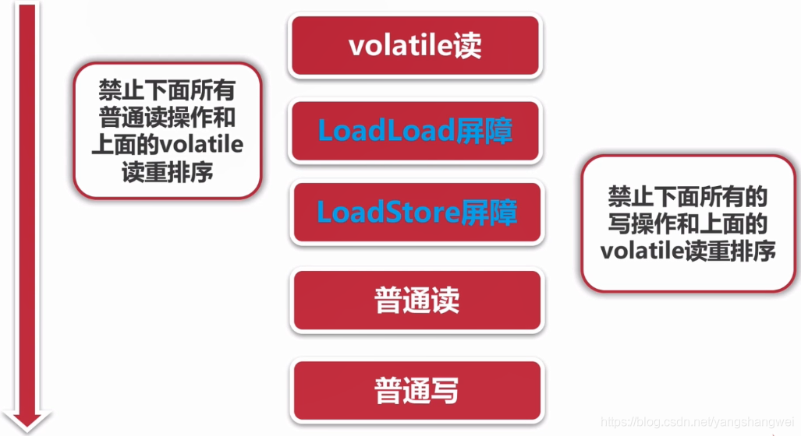
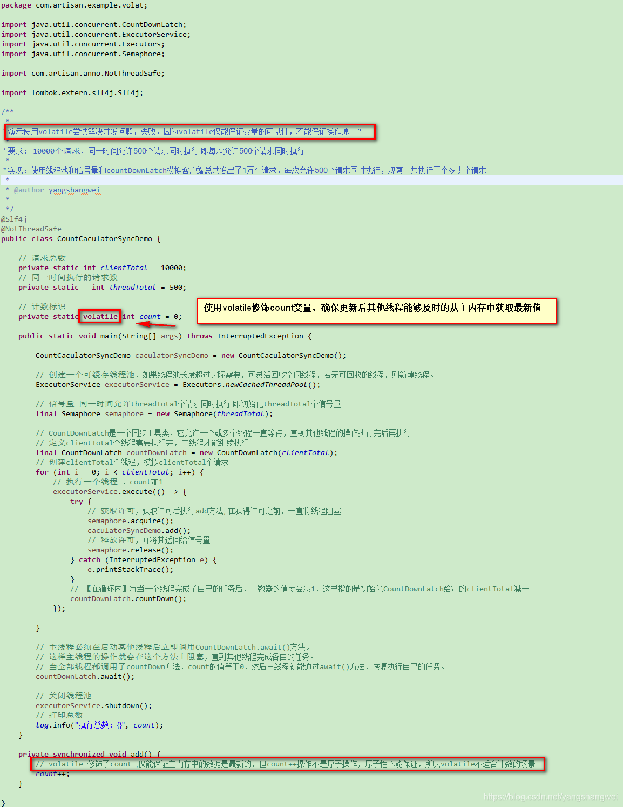

## 可见性定义

一个线程对共享变量值的修改，能够**及时**的被其他线程看到。

------

## 导致不可见的原因

- 线程交叉执行
- 重排序结合线程交叉执行
- 共享变量更新后的值没有在工作内存与主内存之间及时更新

结合我们前面说过的Java内存模型，上述三个原因我们就很容易理解了。 不清楚的童鞋可以再回顾下 [并发编程-02并发基础CPU多级缓存和Java内存模型JMM](https://cloud.tencent.com/developer/article/1863179?from_column=20421&from=20421)

------

## 可见性 -synchronized （既保证原子性又保证可见性）

**synchronized能够实现原子性和可见性 。**

JMM中关于Synchronized的规定

- 线程解锁前，必须把共享变量的最新值刷新到主内存
- 线程加锁时，必须将工作内存中的共享变量的值清空，从而使用共享变量时需要从主内存中重新读取最新的值。【注意，**加锁和解锁必须是同一把锁**】

------

## 可见性 - volatile(但不保证操作的原子性)

volatile可以保证 可见性和 有序性

 通过加入**内存屏障**和**禁止重排序**优化来实现。

- 对volatile变量写操作时，会在写操作后加入一条store屏障指令，将本地内存中的共享变量值刷新到主内存
- 对volatile变量读操作，会在读操作前加入一条load指令屏障，从主内存中读取共享变量

volatile本质是在告诉JVM当前变量在寄存器中的值是不确定的，使用前，需要先从主存中读取，因此可以实现可见性。而对n=n+1,n++等操作时，volatile关键字将失效，不能起到像synchronized一样的线程同步（原子性）的效果。

------

### volatile变量 写操作


### volatile变量 读操作




## 使用volatile尝试解决计数并发错误的问题 【volatile无法解决该问题】





即使将count用volatile修饰，每次从主存中取到的都是最新的值，可是当多个线程同时取到最新的值，执行+1操作，当刷新到主存中的时候会覆盖结果，从而丢失一些+1操作

------

## volatile使用场景

1. 多线程中使用volatile变量，**对变量的写入操作不能依赖当前变量的值**：如count++ .【 解释下： count++不是原子操作，因为其可以分为：从主内存中读取count的值，在自己线程的工作内存中将count的值+1，写入最新的count的值到主内存。 对于count++，线程A和线程B都执行一次，最后输出的count的值可能是1也可能是2】 。 **比较适合 状态标记 场景**

状态标记伪代码


```javascript
volatile  boolean inited = false;

// 线程A
context = loadContext();
inited = true;

// 线程B
while(!inited ){
	sleep();
}
doSomethingWithConfig(context);
```

将inited 标记为 volatile ， 当线程A更新inited后，因为是volatile，所以线程B可以及时从主内存中感知到inited的改变。 这样就确保了线程B中使用的contex是初始化过的。

1. double check (比较常见的比如单例模式中的double check)

------

## synchronized和volatile的比较

- synchronized保证内存可见性和操作的原子性
- volatile只能保证内存可见性
- volatile不需要加锁，比synchronized更轻量级，并不会阻塞线程
- volatile标记的变量不会被编译器优化,而synchronized标记的变量可以被编译器优化（如编译器重排序的优化）.
- volatile是变量修饰符，仅能用于变量，而synchronized是一个方法或块的修饰符。

------

## 代码

[https://github.com/yangshangwei/ConcurrencyMaster](https://cloud.tencent.com/developer/tools/blog-entry?target=https%3A%2F%2Fgithub.com%2Fyangshangwei%2FConcurrencyMaster&objectId=1863192&objectType=1&isNewArticle=undefined)