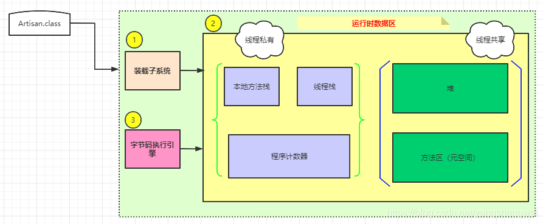
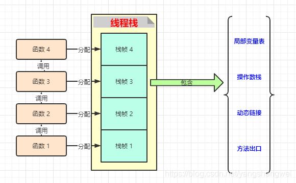
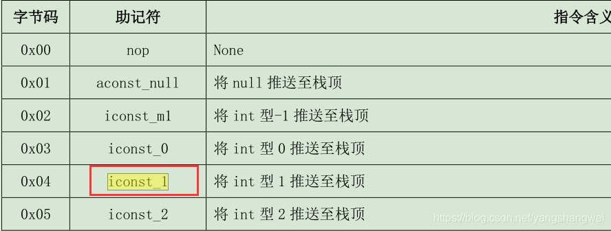
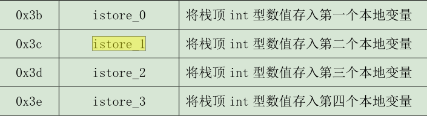
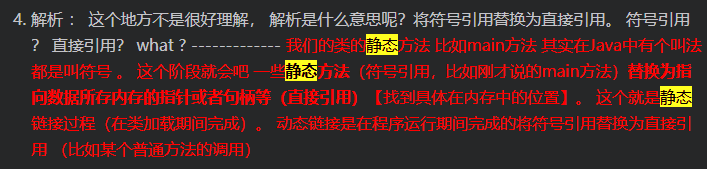
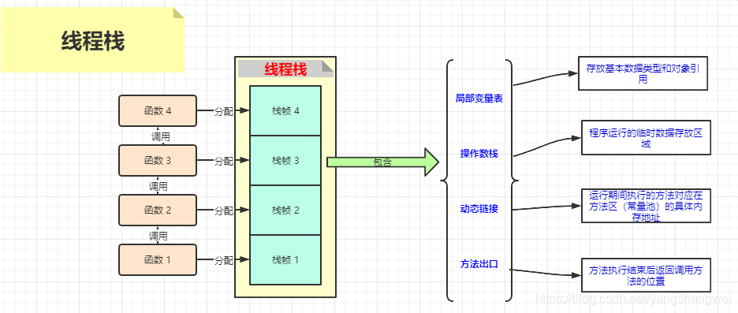
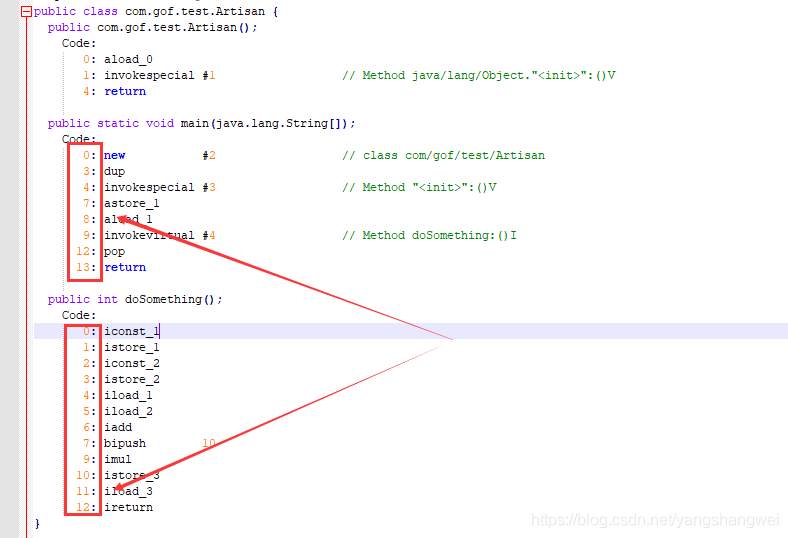

## 运行时数据区总览



字节码文件被装载子系统装载到JVM中，字节码执行引擎负责执行这些字节码文件。

 装载子系统和执行引擎都是C++的实现。

装载子系统： [JVM-白话聊一聊JVM类加载和双亲委派机制源码解析](https://cloud.tencent.com/developer/tools/blog-entry?target=https%3A%2F%2Fartisan.blog.csdn.net%2Farticle%2Fdetails%2F106677409&objectId=1863046&objectType=1&isNewArticle=undefined)

我们重点关注下运行时数据区域 ，先关注线程私有的这3个部分。

------

## 线程栈

### 概要

没给方法被执行的时候，JVM都会同步创建一个栈帧。

这个栈和数据结构的栈结构是一样的， FILO .

举个例子 ，方法A 中调用了方法B ， 代码先执行方法A ，此时方法A 入栈， 然后调用方法B，这个时候方法B入栈 。 当方法B执行结束后，方法B出栈，回到方法A执行的地方，方法A继续执行，执行结束 ，方法A出栈。



### 栈内部主要组成部分

【Java代码】

代码语言：javascript

复制

```javascript
   public int doSomething() {
        int a = 1 ;
        int b = 2 ;
        int c = (a + b) * 10 ;
        return c;
    }
```

------

【javap -c 反汇编】

如何操作的，见文末 ，JVM字节码指令集也见文末

代码语言：javascript

复制

```javascript
  public int doSomething();
    Code:
       0: iconst_1
       1: istore_1
       2: iconst_2
       3: istore_2
       4: iload_1
       5: iload_2
       6: iadd
       7: bipush        10
       9: imul
      10: istore_3
      11: iload_3
      12: ireturn
}
```

0: iconst_1

 1: istore_1 【i —> int类型】

iconst_1 是个什么鬼？ 查查操作手册




 istore_1



iconst_0 和 istore_0 是默认存放调用该方法的对象。

这里就涉及到两个组成部分 【局部变量】 + 【操作数栈】

#### 局部变量

代码语言：javascript

复制

```javascript
0x04  iconst_1  将 int 型 1 推送至栈顶
0x3c  istore_1  将栈顶 int 型数值存入第二个本地变量
0x05  iconst_2  将 int 型 2 推送至栈顶
0x3d  istore_2  将栈顶 int 型数值存入第三个本地变量
```

比对代码

代码语言：javascript

复制

```javascript
  int a = 1 ;
  int b = 2 ;
```

iconst_1 ， 将 int 1 压入操作数栈 ， istore_1 将栈顶 int 型数值存入第二个本地变量 ，这个时候 会先将 1 出栈，然后存入局部变量表。

istore_1 、istore_2 存入本地变量，就是放到了局部变量表。

------

#### 操作数栈

代码语言：javascript

复制

```javascript
0x04  iconst_1  将 int 型 1 推送至栈顶
0x05  iconst_2  将 int 型 2 推送至栈顶
```

这两步的意思 就是将代码中的 a 和 b 对应的值 1 和 2 压入 操作数栈 。

这个操作数栈 本身也是栈结构， FILO . 入栈 出栈

------

继续

代码语言：javascript

复制

```javascript
 int c = (a + b) * 10 ;
 return c;
```

代码语言：javascript

复制

```javascript
 4: iload_1    将第二个 int 型本地变量推送至栈顶  ----> a的值 1 入栈 （操作数栈）
 5: iload_2    将第三个 int 型本地变量推送至栈顶  ----> b的值 2 入栈 （操作数栈）
 6: iadd       将栈顶两 int 型数值相加并将结果压入栈顶  ---->  计算 a+b =3,结果压入栈顶 （a ,b 出栈，计算结果，然后将a+b的结果压入操作数栈）
 7: bipush        10      将单字节的常量值(-128~127)推送至栈顶  -----> 10 入栈 操作数栈）
 9: imul       将栈顶两 int 型数值相乘并将结果压入栈顶  ----> 计算乘积 3 * 10 ，将30压入操作数栈
 10: istore_3  将栈顶 int 型数值存入第四个本地变量  ------>  给 c赋值 
 11: iload_3   将第四个 int 型本地变量推送至栈顶  ----> 压入操作数栈 
 12: ireturn   从当前方法返回 int  ----> 返回
```

上面的行号 7 到9 ？ 没有9 。 我们这个常量10 也要占位置嘛 。

计算 结果肯定是CPU执行的嘛 ，只不过数据是存放在内存中的。

简言之，操作数栈，是程序运行期间需要临时存放数据的内存空间。

------

#### 动态链接

符号引用 替换为 直接引用。

我们知道在类装载的过程中，有个过程是【解析】



 [JVM-白话聊一聊JVM类加载和双亲委派机制源码解析](https://cloud.tencent.com/developer/tools/blog-entry?target=https%3A%2F%2Fartisan.blog.csdn.net%2Farticle%2Fdetails%2F106677409&objectId=1863046&objectType=1&isNewArticle=undefined)

举个例子

代码语言：javascript

复制

```javascript
 public static void main(String[] args) {
        Artisan artisan = new Artisan();
        artisan.doSomething();
    }
```

简单说当应用执行到artisan.doSomething()方法（ 非静态方法），需要找到这个方法在方法区的常量池中的具体的位置，这个过程就是动态链接

方法区#运行时常量池 ，是方法区的一部分。 Class文件中的常量池表用于存放编译期间生成的各种字面量和符号引用，这部分内容将在类加载后放到方法区的运行时常量池中。

------

#### 方法出口

代码语言：javascript

复制

```javascript
   public static void main(String[] args) {
        Artisan artisan = new Artisan();
        artisan.doSomething();
    }

    public int doSomething() {
        int a = 1 ;
        int b = 2 ;
        int c = (a + b) * 10 ;
        return c;
    }
```

doSomething方法执行完要回到main方法中，方法出口中记录的就是记录main方法中的位置，不记录的话 ，不知道回到main方法中的哪一行继续执行哇~

------

#### 小结



## 程序计数器

简单理解，可以理解为 记录程序执行的位置。

线程私有。

Java多线程，当线程A没有抢到CPU的执行权，如果没记录程序执行的位置，等下次抢到CPU执行权的时候，这尼玛咋弄？ 重新开始执行吗？

显然是不行的，所以需要程序计数器来给每个线程的执行到的行号做下标记。各个现场的程序计数器互不影响，独立存储。

我们来看看javap -c 处理的反汇编




简单理解，可以理解为上面的行号， 实际上存储的是这行代码对应在内存中的指针位置。

字节码 由谁来执行？ 肯定是字节码执行引擎嘛 ，所以 字节码执行引擎肯定知道程序的执行位置，这样 字节码执行引擎和程序计数器就关联起来了。

------

## 本地方法栈

native 方法 底层C++的

------

## 附

### 测试demo

代码语言：javascript

复制

```javascript
package com.gof.test;

 
public class Artisan {


    public static void main(String[] args) {
        Artisan artisan = new Artisan();
        artisan.doSomething();
    }

    public int doSomething() { // public 类型
        int a = 1 ;
        int b = 2 ;
        int c = (a + b) * 10 ;
        return c;
    }
}
```

### javap

代码语言：javascript

复制

```javascript
用法: javap <options> <classes>
其中, 可能的选项包括:
  -help  --help  -?        输出此用法消息
  -version                 版本信息
  -v  -verbose             输出附加信息
  -l                       输出行号和本地变量表
  -public                  仅显示公共类和成员
  -protected               显示受保护的/公共类和成员
  -package                 显示程序包/受保护的/公共类
                           和成员 (默认)
  -p  -private             显示所有类和成员
  -c                       对代码进行反汇编
  -s                       输出内部类型签名
  -sysinfo                 显示正在处理的类的
                           系统信息 (路径, 大小, 日期, MD5 散列)
  -constants               显示最终常量
  -classpath <path>        指定查找用户类文件的位置
  -cp <path>               指定查找用户类文件的位置
  -bootclasspath <path>    覆盖引导类文件的位置
```

-c 对代码进行反汇编

代码语言：javascript

复制

```javascript
 E:\Program Files\Java\jdk1.8.0_161\bin> ./javap -c D:\IdeaProjects\GOF23\target\classes\com\gof\test\Artisan.class > Artisan.txt
```

查看 Artisan.txt

代码语言：javascript

复制

```javascript
Compiled from "Artisan.java"
public class com.gof.test.Artisan {
  public com.gof.test.Artisan();
    Code:
       0: aload_0
       1: invokespecial #1                  // Method java/lang/Object."":()V
       4: return

  public static void main(java.lang.String[]);
    Code:
       0: new           #2                  // class com/gof/test/Artisan
       3: dup
       4: invokespecial #3                  // Method "":()V
       7: astore_1
       8: aload_1
       9: invokevirtual #4                  // Method doSomething:()I
      12: pop
      13: return

  public int doSomething();
    Code:
       0: iconst_1
       1: istore_1
       2: iconst_2
       3: istore_2
       4: iload_1
       5: iload_2
       6: iadd
       7: bipush        10
       9: imul
      10: istore_3
      11: iload_3
      12: ireturn
}
```

### 