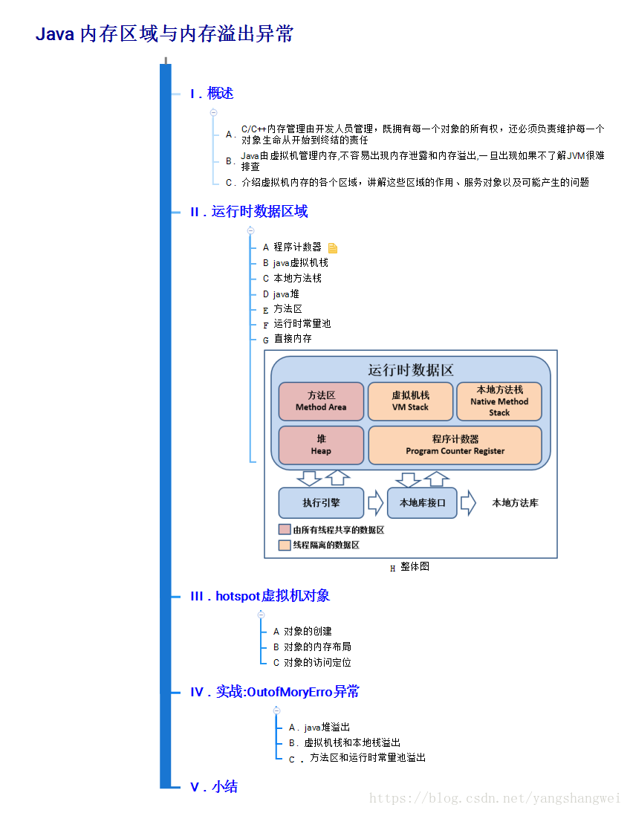
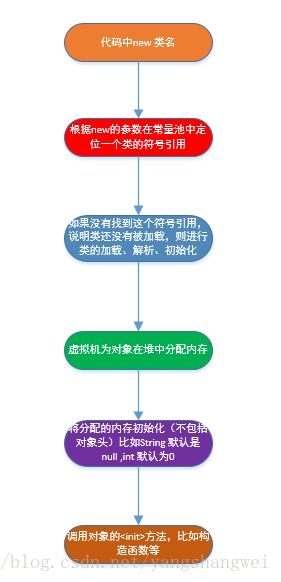
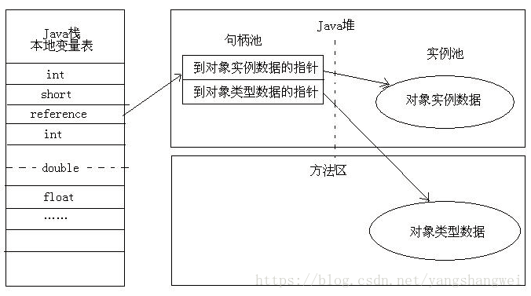
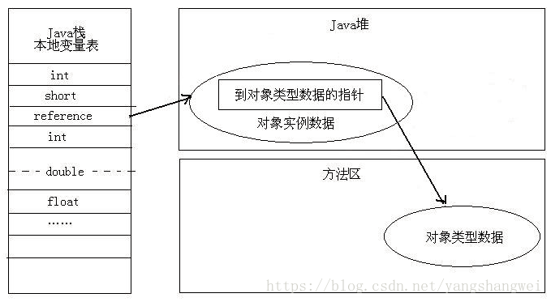

## 思维导图

在 J[VM-01自动内存管理机制之Java内存区域与内存溢出异常(上)](https://cloud.tencent.com/developer/article/1861742?from_column=20421&from=20421)中我们介绍了 运行时数据区域，这里我们来继续探讨下hotspot虚拟机对象

## 对象的创建

在语言层面上，创建对象（例如克隆、反序列化）通常仅仅是一个new 关键字而己，而在虚拟机中，对象（指普通Java 对象，非数组和Class 对象等） 的创建是一个非常复杂的过程。

虚拟机遇到一条new 指令时，首先将去检查这个指令的参数**是否能在常量池中定位到一个类的符号引用**，并且检查这个符号引用代表的类**是否已被加载、解析和初始化过**。如果没有，那必须先执行相应的类加载过程。在类加载检查通过后，接下来虚拟机将**为新生对象分配内存**。对象所需内存的大小在类加载完成后便可完全确定，为对象分配空间的任务等同于把一块确定大小的内存从Java 堆中划分出来。

假设Java **堆中内存是绝对规整的**，就仅仅是把指针向空闲空间那边挪动一段与对象大小相等的距离，这种分配方式称为**“指针碰撞**”（ Bump the Pointer）。

如果Java **堆中的内存并不是规整**的，已使用的内存和空闲的内存相互交错，**虚拟机就必须维护一个列表**，记录哪些内存块是可用的， 在分配的时候从列表中找到一块足够大的空间划分给对象实例， 并更新列表上的记录，这种分配方式称为“**空闲列表**”（ Free List ）。

选择哪种分配方式由Java 堆是否规整决定，而Java 堆是否规整是由所采用的垃圾收集器是否带有压缩整理功能决定。因此，在使用Serial、ParNew 等带Compact（紧凑）过程的收集器时，系统采用的分配算法是指针碰撞，而使用CMS 这种基于Mark-Sweep 算法的收集器时，通常采用空闲列表。

**还要考虑内存分配在多线程下同步问题**。一种解决办法是对分配内存空间的动作进行同步处理。实际上虚拟机采用CAS配上失败重试的方式保证更新操作的原子性：另一种是把内存分配的动作按照线程划分在不同的空间之中进行，每个线程在Java 堆中预先分配一小块内存，称为本地线程分配缓冲（ Thread Local Allocation Buffer）。哪个线程要分配内存，就在哪个线程的TLAB 上分配，只有TLAB 用完并分配新的于LAB 时，才需要同步锁定。

内存分配完成后，虚拟机需要将分配到的内存空间都初始化为零值（不包括对象头），接下来，虚拟机要对对象进行必要的设置。例如这个对象是哪个类的实例、如何才能找到类的元数信息、对象的哈希码、对象的GC 分代年龄等信息。这些信息存放在对象的对象头（Object Header）之中。根据虚拟机当前的运行状态的不同，如是否启用偏向锁等。

------

## 对象的内存布局

在HotSpot虚拟机中，对象在内存中存储的布局可以分为3 块区域：对象头（ Header ）、实例数据（Instance Data）和对齐填充（Padding）。

\##对象头（ Header ）

 Hot Spot 虚拟机的对象头包括两部分信息

- 第一部分用于存储对象自身的运行时数据，如哈希码（HashCode）、GC分代年龄、锁状态标志、线程持有的锁、偏向线程ID 、偏向时间戳等
- 另外一部分是类型指针，即对象指向它的类元数据的指针，虚拟机通过这个指针来确定这个对象是哪个类的实例

------

### 实例数据（Instance Data）

数据部分，是[对象存储](https://cloud.tencent.com/product/cos?from_column=20065&from=20065)的真正有效信息，也是在程序代码中所定义的各种类型字段的内容。包括父类和接口继承下来的，也包括子类中定义的。这部分的存储顺序会受到虚拟机分配策略参数和字段在Java源代码中定义顺序的影响。从分配策略中知道，相同宽度的字段总是被分配到一起。在这个前提下父类定义的变量会出现在子类之前。

------

### 对齐填充（Padding）

对齐填充，不是必须的，只起到地址对齐的作用。HotSpot自动内存管理系统要求对象起始地址必须是8字节的整数倍，也就是对象内存大小必须是8字节的整数倍。因此当对象实例数据没有对齐时，就需要通过Padding的方式来补全。

------

## 对象的访问定位

**Java程序通过栈上的reference数据来操作堆上的具体对象，由于reference类型在Java虚拟机规范中只规定了一个指向对象引用。而没有规定这个引用应该通过何种方式去定位、访问堆中的对象的具体位置，它取决于Java虚拟机实现。**

------

目前主要有如下两种实现方式

### 使用句柄（类似间接指针）

在Java堆中划分出一块内存来作为句柄池，reference中存储的就是对象的句柄地址，句柄中包含对象实例数据与类型各自具体地址信息

### 直接指针访问 （HotSpot采用这种方式）

Java堆中的对象布要考虑如何放置访问类型数据相关的信息，而reference中存储的直接就是对象地址

### 两种方式的比较

句柄的好处reference中存储的是稳定的句柄地址，在对象被移动时只会改变句柄中的实例数据指针，而reference本身不需要修改。

直接指针访问的最大好处就是速度更快，节省一次指针定位时间开销，因为对象访问在Java中非常频繁，这类开销积少成多也非常可观。