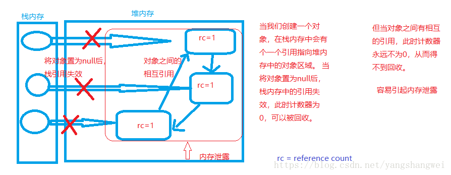
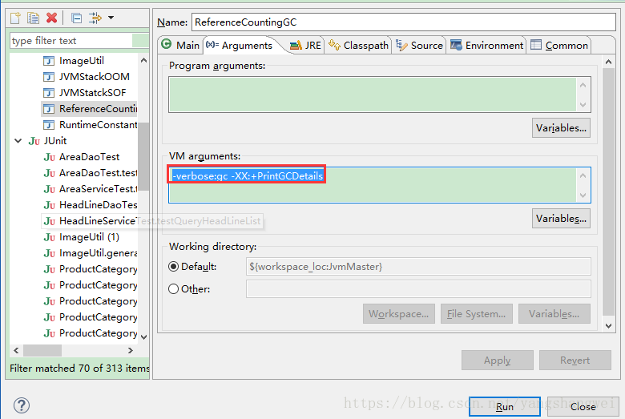
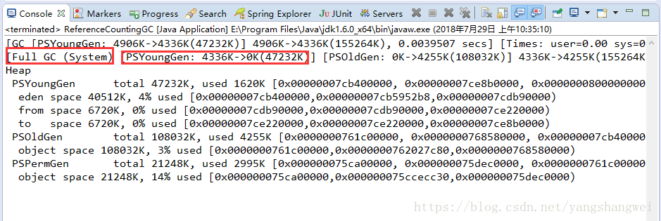
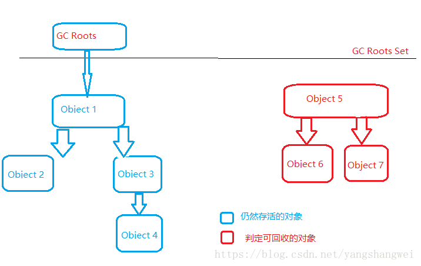
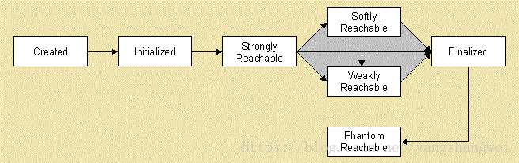
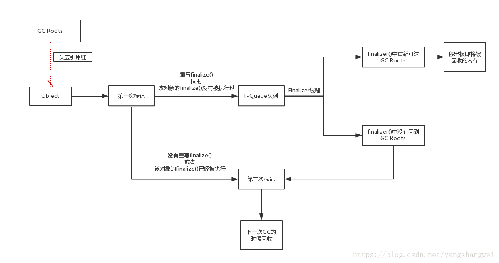
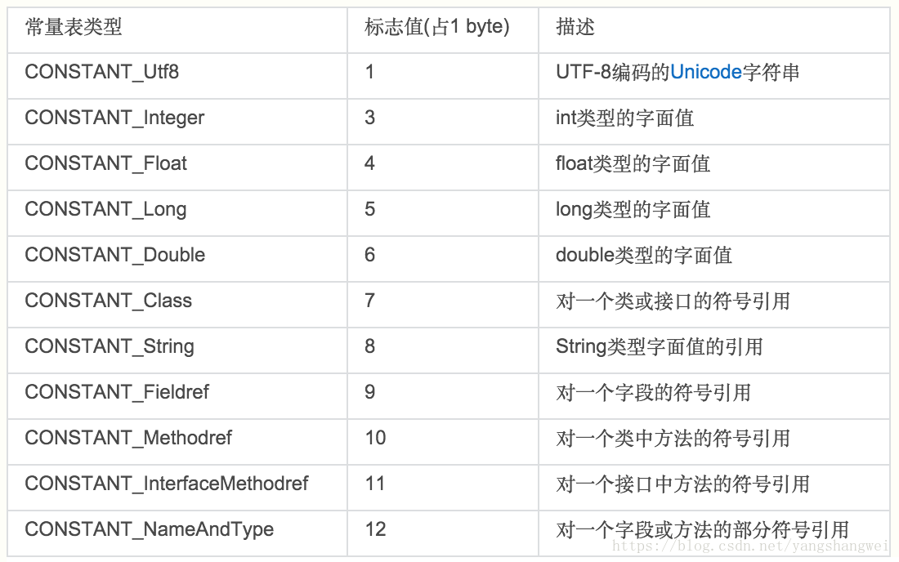

## 概述

谈起垃圾收集 (Garbage Collection ,GC)，有3个问题是无法回避的

 \1. 哪些内存需要回收

 \2. 什么时候回收

 \3. 如何回收

这就引出了我们这边博文需要讨论的话题

 \1. 如何判断对象为垃圾对象

 \2. 何时回收垃圾对象(垃圾收集算法)

 \3. 如何回收垃圾对象(垃圾收集器)

------

我们前面的博文中讨论了Java的内存自动管理机制，我们知道java内存运行时区域可以分为两大部分： 线程共享区域和线程独占区域 。


线程共享区主要包括Java堆(存储对象实例)和方法区（即我们常说的永久代【JDK7之后逐步去永久代，使用元数据区代替】）

线程独占区主要包括：程序计数器、Java虚拟机栈、本地方法栈。 这3个区域以为是线程独占区，因此生命周期同线程相同，随线程而生而灭。 栈中的帧随着方法的进入和退出有条不紊的执行着出栈和入栈操作。 每一个栈帧中分配多少内存基本上在类结构确定下来的时候就已知的，因此线程独享区的内存分配和回收都具备确定性，这几个区域就不需要过多考虑回收的问题，因为方法结束或者线程结束的时候，内存就跟着回收了。

而线程共享区（Java堆和方法区）则不一样，一个接口中的多个实现类需要的内存可能不一样，一个方法中的多个分支需要的内存也可能不一样，我们只有在程序运行期间才能知道会创建哪些对象，这部分内存的分配和回收都是动态的，**垃圾收集器所关注的也是Java堆和方法区**。我们这里讨论的内存分配与回收也指的是这一部分.

------

## 如何判断对象为垃圾对象

### 对象的存活还是死亡

Java堆内存中存放着几乎所有的对象实例。

垃圾收集器在对堆内存进行回收之前，需要确定哪些对象是存活或者死去（即不可能再被任何途径使用的对象）

------

### 判断对象死亡的算法一：引用计数算法Reference Counting

#### 原理

通过在对象头中分配一个空间来保存该对象被引用的次数。如果该对象被其它对象引用，则它的引用计数加一，如果删除对该对象的引用，那么它的引用计数就减一，当该对象的引用计数为0时，那么该对象就会被回收。

------

#### 示意图



#### 优点

- 实现简单
- 判断效率高

------

#### 缺点

- 无法解决对象之间相回循环引用的问题,易引起内存泄露

------

#### 实验

代码语言：javascript

复制

```javascript
package com.artisan.gc;

/**
 * 
 * 
 * @ClassName: ReferenceCountingGC
 * 
 * @Description: VM Args
 * 
 * @author: Mr.Yang
 * 
 * @date: 2018年7月29日 上午10:31:32
 */
public class ReferenceCountingGC {

	private Object instance;

	private static final int _1M = 1024 * 1024;

	// 设置个成员变量，在堆中占点内存，以便观察GC是否回收相互引用的情况
	private byte[] bigByte = new byte[2 * _1M];

	public static void main(String[] args) {

		ReferenceCountingGC rc = new ReferenceCountingGC();
		ReferenceCountingGC rc2 = new ReferenceCountingGC();
		// 设置相互引用
		rc.instance = rc2;
		rc2.instance = rc;

		// 将对象置为空
		rc.instance = null;
		rc2.instance = null;

		// 垃圾回收,观察rc 和 rc2能否被回收
		System.gc();
	}

}
```

虚拟机参数设置： `-verbose:gc -XX:+PrintGCDetails`



日志信息：




可以看到确实被回收了，这也侧面验证了我们现在使用的hotspot虚拟机不是采用该算法进行垃圾回收。

------

### 判断对象死亡的算法一：可达性分析算法Reachability Analysis（hotspot采用该算法）

#### 原理

通过一系列的称为“GCsRoots”的对象作为起始点，从这些节点向下开始搜索，搜索所走过的路径称为引用链（Reference Chain）。 当一个对象到GC Roots没有任何引用链相连（即从GC Roots到这个对象不可达）时，则证明该对象是不可用的。

------

#### 示意图



#### 可作为GC Roots的对象

 \1. 虚拟机栈（栈帧中的本地变量表）中引用的对象  2. 方法区中类静态属性引用的对象 3. 方法区中常量引用的对象 4. 本地方法栈中JNI（即native方法）引用的对象

------

### 对象引用的分类

JDK1.2之后，Java对引用的概念进行了扩充。

引用强度 强引用 Strong Reference > 软引用 Soft Reference > 弱引用 Weak Reference > 虚引用 Phantom Reference

一个对象的生命周期：



如果有**软引用**指向这些对象，则只有在JVM需要内存时才回收这些对象。

如果一个对象只有**弱引用**指向它，垃圾回收器会立即回收该对象，这是一种急切回收方式。

弱引用和软引用的特殊行为使得它们在某些情况下非常有用。

例如：软引用可以很好的用来实现缓存，当JVM需要内存时，垃圾回收器就会回收这些只有被软引用指向的对象。

而弱引用非常适合存储元数据，例如：存储ClassLoader引用。如果没有类被加载，那么也没有指向ClassLoader的引用。一旦上一次的强引用被去除，只有弱引用的ClassLoader就会被回收

------

#### 强引用

我们 new 出来的对象 “Object obj = new Object();”或者 String s=”abc”中变量s就是字符串对象”abc”的一个强引用，**任何被强引用指向的对象都不能被垃圾回收器回收**，这些对象都是在程序中需要的

------

#### 软引用

**如果该对象含有软引用，Counter对象不会立即被回收，除非JVM需要内存。**

Java中的软引用使用java.lang.ref.SoftReference类来表示

代码语言：javascript

复制

```javascript
Counter prime = new Counter(); // prime holds a strong reference 
SoftReference soft = new SoftReference(prime) ; //soft reference variable has SoftReference to Counter Object created at line 2
 
prime = null; // now Counter object is eligible for garbage collection but only be collected when JVM absolutely needs memory
```

强引用置空之后，代码的第二行为对象Counter创建了一个软引用，该引用同样不能阻止垃圾回收器回收对象，但是可以延迟回收，与弱引用中急切回收对象不同。

------

#### 弱引用

只需要给强引用对象counter赋空值null,该对象就可以被垃圾回收器回收。因为该对象此时不再含有其他强引用，**即使指向该对象的弱引用weakCounter也无法阻止垃圾回收器对该对象的回收。**

弱引用使用java.lang.ref.WeakReference class 类来表示

代码语言：javascript

复制

```javascript
Counter counter = new Counter(); // strong reference 
WeakReference<Counter> weakCounter = new WeakReference<Counter>(counter); //weak reference
counter = null; // now Counter object is eligible for garbage collection
```

另一个使用弱引用的例子是WeakHashMap，它是除HashMap和TreeMap之外，Map接口的另一种实现。WeakHashMap有一个特点：map中的键值(keys)都被封装成弱引用，也就是说一旦强引用被删除，WeakHashMap内部的弱引用就无法阻止该对象被垃圾回收器回收。

------

#### 虚引用

虚引用是java.lang.ref package包中第三种可用的引用，使用java.lang.ref.PhantomReference类来表示。拥有虚引用的对象可以在任何时候被垃圾回收器回收。

通过如下代码创建虚引用：

代码语言：javascript

复制

```javascript
DigitalCounter digit = new DigitalCounter(); // digit reference variable has strong reference – line 3
PhantomReference phantom = new PhantomReference(digit); // phantom reference to object created at line 3
 
digit = null;
```

一旦移除强引用，第三行的DigitalCounter对象可以在任何时候被垃圾回收器回收。因为只有一个虚引用指向该对象，而虚引用无法阻止垃圾回收器回收对象.

------

## finalize 逃逸

### 原理




在使用可达性分析算法的虚机中，比如我们常用的hotspot， 当对象不可达时，需要至少经历两次标记过程，才能确定是否要回收。

------

### 实验

代码语言：javascript

复制

```javascript
package com.artisan.gc;

public class FinalizeEscapeGC {
	public static FinalizeEscapeGC SAVE_HOOK = null;

	public void isAlive() {
		System.out.println("yes, I am still alive :) -- " + SAVE_HOOK);
	}

	// 重写finalize方法，该方法只被调用一次，但并不是调用后立刻被回收
	@Override
	protected void finalize() throws Throwable {
		super.finalize();
		System.out.println("finalize method executed!");
		FinalizeEscapeGC.SAVE_HOOK = this;
	}

	public static void main(String[] args) throws InterruptedException {
		SAVE_HOOK = new FinalizeEscapeGC();

		/*
		 * 拯救成功
		 */
		SAVE_HOOK = null;
		// 提醒虚拟机进行垃圾回收，但是虚拟机具体什么时候进行回收就不知道了
		System.gc();

		Thread.sleep(500);
		if (SAVE_HOOK != null) {
			SAVE_HOOK.isAlive();
		} else {
			System.out.println("No, I am dead :(");
		}

		/*
		 * 拯救失败
		 */
		SAVE_HOOK = null;
		System.gc();
		// finalize方法的优先级比较低所以等待它0.5秒
		Thread.sleep(500);
		if (SAVE_HOOK != null) {
			SAVE_HOOK.isAlive();
		} else {
			System.out.println("No, I am dead :(");
		}
	}
}
```

输出：

代码语言：javascript

复制

```javascript
finalize method executed!
yes, I am still alive :) -- com.artisan.gc.FinalizeEscapeGC@5d888759
No, I am dead :(
```

任何对象的finalize()方法只会被系统自动调用一次。

第一次逃脱成功，原因在于对象重写了finalize()方法，在手动调用System.gc()时触发垃圾回收，在执行finalize()方时， 在其中将 SAVE_HOOK重新用this关键字挂上和当前对象关系，所以在第二次标记时该对象已经不再“待回收”的队列中了，所以此时对象还是存活的；

但是第二次逃亡的时候，不再执行了finalize()方法了（之前执行过一次，**对象的finalize()方法必定只执行一次**），在SAVE_HOOK至为null后不再可达，finalize()方法也是没有必要执行的情况，所以它就直接为null了，没有指向任何对象，此时对象已死。

------

### 注意事项

-  避免使用finalize()，操作不慎可能导致错误。 
-  优先级低，何时被调用，不确定 
-  何时发生GC不确定，自然也就不知道finalize方法什么时候执行 
-  如果要使用finalize去释放资源，我们可以使用try-catch-finally来替代它 

------

### 回收方法区

很多人认为方法区（或者Hopspot虚机中的永久代）是没有垃圾收集的，HotSpot虚拟机的设计团队选择把GC分代收集扩展至方法区 ,主要回收

- 废弃常量
- 无用的类

------

#### 废弃常量的回收

常量池中除了包含代码中所定义的**各种基本类型（如int、long等等）和对象型（如String及数组）的常量值**外，还包含一些以文本形式出现的**符号引用**，比如：

- 类和接口的全限定名；
- 字段的名称和描述符；
- 方法和名称和描述符。



回收废弃常量和回收Java堆中的对象非常类似。 以常量池中的字面量的回收为例。

假设有一个字符串“abc”已经进入了常量池中，但当前系统中没有任何一个String对象叫做“abc”的，换就话说就是没有任何String对象引用常量池中的“abc”常量，也没有其他地方引用了这个字面量，如果这时发生了内不曾能回收，而且有必要的话，这个“abc”就会被系统清理出常量池。 常量池中的其他类（接口）、方字段的**符号引用**也与此类似。

------

#### 无用的类的回收

必须同时满足如如下3个条件才能算是“无用的类”

- 该类所有的实例都已经被回收，也就是Java堆中不存在该类的任何实例
- 加载该类的ClassLoader已经被回收
- 该类对应的java.lang.Class对象没有在任何地方被引用，无法在任何地方通过反射访问该类的方法。

即使同时满足了如上3个条件，hotspot虚机也不一定必然回收，hotspot虚机提供了-Xnoclassgc参数进行控制。 还可以使用-verbose:class 以及-XX:+TraceClassLoading 、-XX:+TraceClassUnLoading查看类加载和卸载信息。