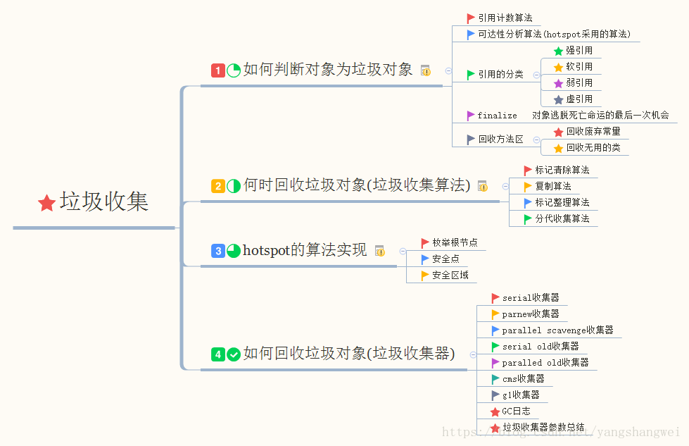
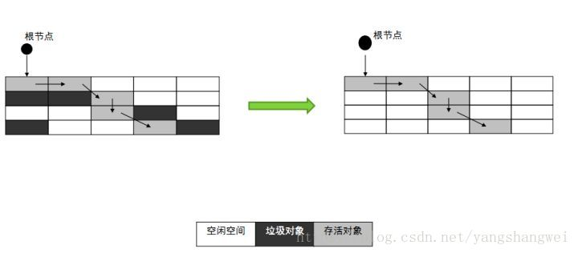
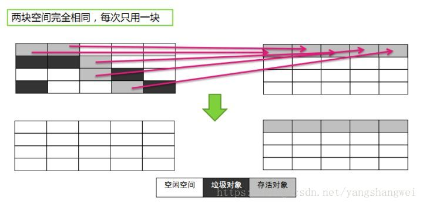
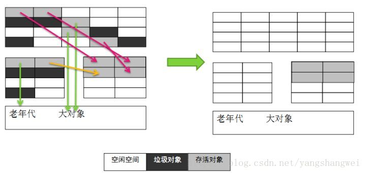
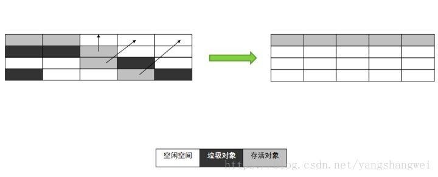

## 思维导图

[JVM-04垃圾收集Garbage Collection（上）【垃圾对象的判定】](https://cloud.tencent.com/developer/article/1862924?from_column=20421&from=20421)探讨了如何判定堆内存中的对象是否已经死亡，这里我们来继续讨论下JVM中常用的垃圾收集算法

------

## 标记清除算法（其他算法的基础）

标记-清除算法是现代垃圾回收算法的思想基础。标记-清除算法将垃圾回收分为两个阶段：标记阶段和清除阶段。一种可行的实现是，在标记阶段，首先通过根节点，标记所有从根节点开始的可达对象。因此，未被标记的对象就是未被引用的垃圾对象；然后，在清除阶段，清除所有未被标记的对象。

当堆中的有效内存空间（available memory）被耗尽的时候，就会停止整个程序（也被成为stop the world），然后进行两项工作，第一项则是标记，第二项则是清除

标记：遍历所有的GC Roots，并将从GC Roots可达的对象设置为存活对象；

清除：遍历堆中的所有对象，将没有被标记可达的对象清除；

也就是说，就是当程序运行期间，若可以使用的内存被耗尽的时候，GC线程就会被触发并将程序暂停，随后将依旧存活的对象标记一遍，最终再将堆中所有没被标记的对象全部清除掉，接下来便让程序恢复运行。

优缺点：

- 涉及大量的内存遍历工作，所以执行性能较低，这也会导致“stop the world”时间较长，java程序吞吐量降低；
- 对象被清除之后，被清除的对象留下内存的空缺位置，造成内存不连续，空间浪费。

------

------

## 复制算法（新生代的GC）

将现有的内存空间分为两快，每次只使用其中一块，在垃圾回收时将正在使用的内存中的存活对象复制到未被使用的内存块中，之后，清除正在使用的内存块中的所有对象，交换两个内存的角色，完成垃圾回收。

Java 堆内存并不需要按照1:1的比例划分内存空间，而是将内存分为一块较大的Eden空间和两块较小的Survivor空间，每次使用Eden和其中的一块Survivor。当回收时，将Eden和Survivor中还存活着的对象一次性地拷贝到另外一个Survivor空间上，最后清理掉Eden和刚才用过的Survivor的空间。

HotSpot虚拟机默认Eden:Survivor From ：:Survivor To 的大小比例是8:1:1(可以通过-SurvivorRattio来配置)，也就是每次新生代中可用内存空间为整个新生代容量的90%，只有10%的内存会被“浪费”。

当然，98%的对象可回收只是一般场景下的数据，我们没有办法保证回收都只有不多于10%的对象存活，**当Survivor空间不够用时，需要依赖其他内存（这里指老年代）进行分配担保**。

优缺点：

复制算法相对标记压缩算法来说更简洁高效，但它的缺点也显而易见，它不适合用于存活对象多的情况，因为那样需要复制的对象很多，复制性能较差，所以复制算法往往用于内存空间中新生代的垃圾回收，因为新生代中存活对象较少，复制成本较低。它另外一个缺点是内存空间占用成本高，因为它基于两份内存空间做对象复制，在非垃圾回收的周期内只用到了一份内存空间，内存利用率较低。

------

## 标记整理/压缩算法（老年代的GC）

标记：它的第一个阶段与标记/清除算法是一模一样的，均是遍历GC Roots，然后将存活的对象标记。

整理：移动所有存活的对象，且按照内存地址次序依次排列，然后将末端内存地址以后的内存全部回收。因此，第二阶段才称为整理阶段。

上图中可以看到，标记的存活对象将会被整理，按照内存地址依次排列，而未被标记的内存会被清理掉。如此一来，当我们需要给新对象分配内存时，JVM只需要持有一个内存的起始地址即可，这比维护一个空闲列表显然少了许多开销。

优点：

 因为标记清除算法会造成内存的不连续，所以标记整理（压缩）算在标记清除算法的基础上，增加了整理过程，解决了标记清除算法内存不连续的问题。同时也消除了复制算法当中，内存减半的高额代价。

缺点：

 标记整理（压缩）也会产生“stop the world”，不能和java程序并发执行。在压缩过程中一些对象内存地址会发生改变，java程序只能等待压缩完成后才能继续。

------

## 标记-清除算法、复制算法、标记整理算法总结

在GC线程开启时，或者说GC过程开始时，它们都要暂停应用程序（stop the world）。

它们的区别如下：（>表示前者要优于后者，=表示两者效果一样）

（1）效率：复制算法>标记/整理算法>标记/清除算法（此处的效率只是简单的对比时间复杂度，实际情况不一定如此）。

（2）内存整齐度：复制算法=标记/整理算法>标记/清除算法。

（3）内存利用率：标记/整理算法=标记/清除算法>复制算法。

- 可以看到标记/清除算法是比较落后的算法了，但是后两种算法却是在此基础上建立的。
- 时间与空间不可兼得。

------

## 分代收集算法（新生代的GC+老年代的GC）

当前商业虚拟机都采用分代收集算法。

分代的垃圾回收策略，是基于这样一个事实：不同的对象的生命周期是不一样的。因此，不同生命周期的对象可以采取不同的收集方式，以便提高回收效率。

在新生代，每次垃圾收集器都发现有大批对象死去，只有少量的存活，那就选择复制算法，只需要付出少量存活对象的复制成本就可以完成收集。 在老年代因为对象的存活率较高、没有额外空间对它进行分配担保，就必须使用“标记-清除”或者“标记-整理”算法进行回收。

注：老年代的对象中，有一小部分是因为在新生代回收时，老年代做担保，进来的对象；绝大部分对象是因为很多次GC都没有被回收掉而进入老年代。