## 概述

[JVM-10虚拟机性能监控与故障处理工具之【命令行】](https://cloud.tencent.com/developer/article/1862940?from_column=20421&from=20421)我们接触了JDK提供的[命令行工具](https://cloud.tencent.com/product/cli?from_column=20065&from=20065)，JDK还为我们提供了两个功能强大的可视化工具：JConsole和VisualVM。

JConsole在JDK1.5版本供就已经提供，而VisualVM是在JDK1.6 Update7中才首次发布。现在已经成为Oracle主力推动的多合一故障处理工具。

------

## JConsole: Java监视与管理平台

JConsole ( Java Monitoring and Management Console)是一种基于JMX的可视化监控、管理工具。 它管理部分的功能是针对JMX MBean进行管理。 由于MBean可以在代码、[中间件](https://cloud.tencent.com/product/message-queue-catalog?from_column=20065&from=20065)服务器的管理控制台或者所有符合JMX规范的软件进行访问。

所以我们这里重点介绍JConsole监视部分的功能。

------

### 启动jconsole

 通过JDK安装目录下的bin目录“jconsole.exe”启动JConsole后，会自动列出本机运行的所有虚拟机进程，无需通过jps来查询了。除了本地进程，也可以使用“远程进程”的共鞥来连接远程服务器。

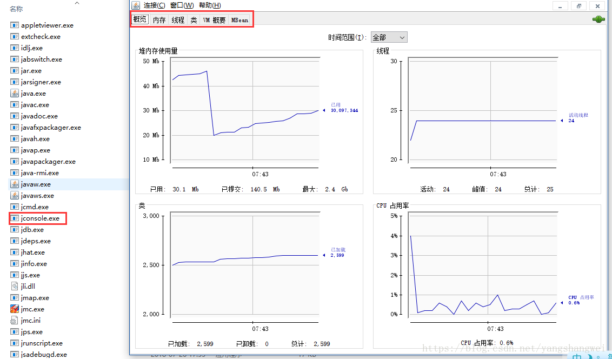

### 内存监控示例

#### VM ARGS

代码语言：javascript

复制

```javascript
-Xms100m -Xmx100m -XX:+UseSerialGC -verbose:gc -XX:+PrintGCDetails
```

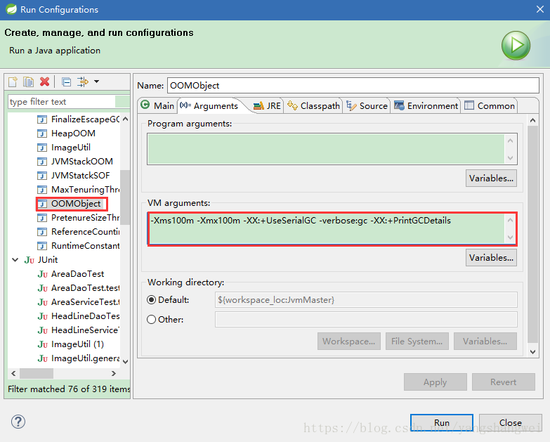

堆最小内存100M 最大内存100M， 即为不可扩展。 使用Serial垃圾收集器。同时为了方便和图形化界面展示的数据比对，我们打印GC日志以及堆信息

------

#### 代码

代码语言：javascript

复制

```javascript
package com.artisan.gc;

import java.util.ArrayList;
import java.util.List;

public class OOMObject {

	// 内存占位符对象 一个object 大约占用64kb
	public byte[] object = new byte[64 * 1024];

	public static void fillData2Heap(int number) throws InterruptedException {
		List objectList = new ArrayList();

		for (int i = 0; i < number; i++) {
			// 休眠50毫秒,使曲线变化的更加明显
			Thread.sleep(50);
			objectList.add(new OOMObject());
		}
		System.gc();
	}

	public static void main(String[] args) throws InterruptedException {
		fillData2Heap(1000);
		// 为了让JConsole上的内存变化体现在工具上，让主线程不要立刻退出，休眠10S
		Thread.sleep(10 * 1000);
	}

}
```

------

#### JConsole监控展示及说明

运行程序，执行JConsole.exe .

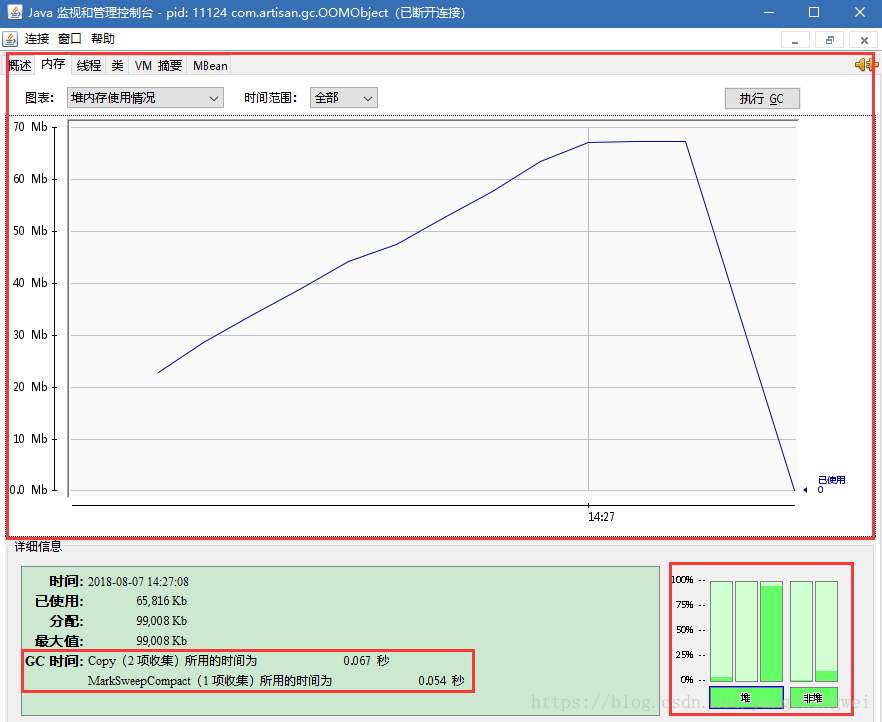

上图为整个堆内存的使用情况，可以看到随着程序的运行，整个堆中内存使用是一个平滑向上增长的曲线（平的部分为Thread.sleep(10 * 1000)造成的，）程序运行结束退出后，内存归为0。

然后我们我们来看下Eden区域的曲线变化情况，如下图。

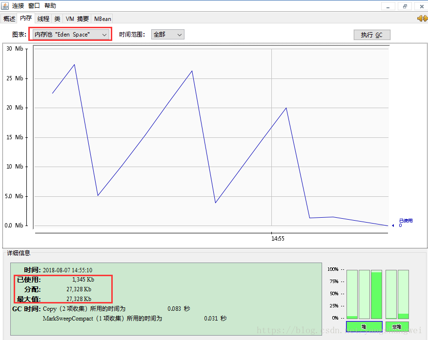

可以很明显的看到发生了2次 Minor GC. 和输出的GC日志信息一致。

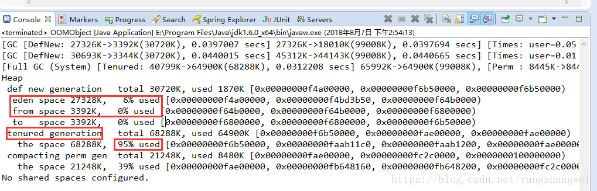

同时在这里也可以看出来

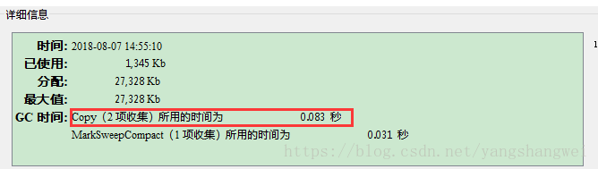

新生代主要是复制算法，这里的统计信息也是 2次收集。

#### 扩展问题

##### 没有指定-Xmn,如何确定新生代和Eden的大小

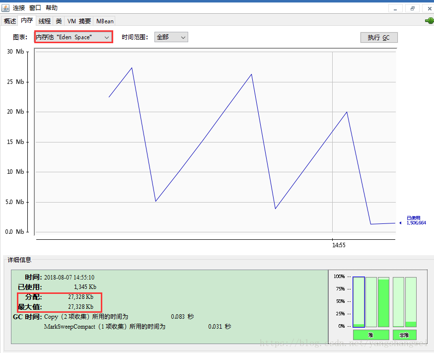

 可以从如下图中查看每个分区的内存分配情况

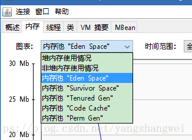

当然也可以粗略计算出来

默认的，新生代 ( Young ) 与老年代 ( Old ) 的比例的值为 1:2 ( 该值可以通过参数 `–XX:NewRatio` 来指定 )，即：新生代 ( Young ) = 1/3 的堆空间大小。老年代 ( Old ) = 2/3 的堆空间大小。

堆内存为100M，采用默认的`–XX:NewRatio`，可以推算出 新生代占用1/3 , 33M .

 没有指定`-XX:SurvivorRatio` ， 默认为8。

新生代又分为 Eden区、SurvivorFrom、SurvivorTo三个区

默认的，Edem : from : to = 8 : 1 : 1 ( 可以通过参数 –XX:SurvivorRatio 来设定 )，即： Eden = 8/10 的新生代空间大小，from = to = 1/10 的新生代空间大小。

JVM 每次只会使用 Eden 和其中的一块 Survivor 区域来为对象服务，所以无论什么时候，总是有一块 Survivor 区域是空闲着的。

因此，新生代实际可用的内存空间为 9/10 ( 即90% )的新生代空间,只有10%的内存被“浪费”,最大限度的节约资源。

Eden内存区的大小为 (33M * 9/10 ) 新生代可用的空间 * 8/9 （Eden占用新生代的比例） = 27033.6KB 。 和 图中显示的27328 KB 接近。

------

##### 为何老年代的柱状图信息仍显示峰值状态，如何调整代码回收该区域

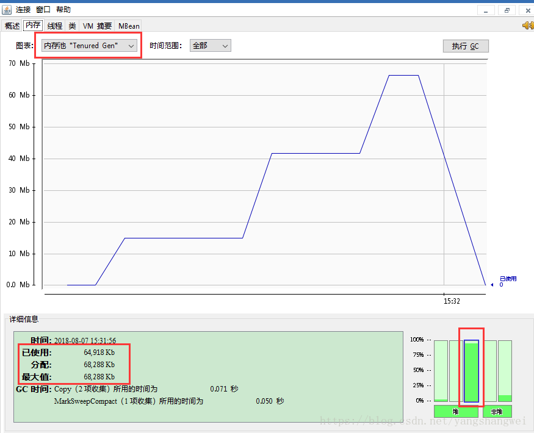

可以看到老年代仍然占据很大的内存空间，是因为 虽然执行了System.gc()。 但是是在fillData2Heap方法内执行的。 在方法内，`List`是存活的，该方法还没退出，gc无法回收。

 只要在该方法外执行GC就可以将老年代的内存回收。 我们来实践下

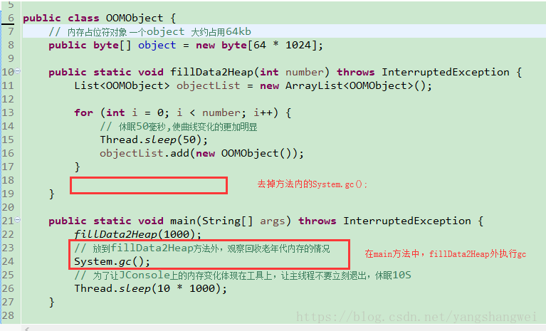

启动JConsole

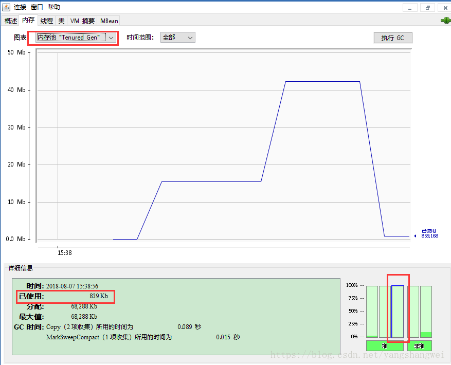


### 线程监控示例

上面的“内存”可以看做是 jstat命令的话，“线程”页签就可相当于jstack命令， 遇到**线程停顿**时可以使用这个页签进行监控分析。 用于定位线程长时间停顿的原因，比如等待外部资源（数据库连接、网络资源、设备资源等），锁等待（活锁和死锁）、死循环。

#### 活锁等待示例


```javascript
package com.artisan.gc;

import java.io.BufferedReader;
import java.io.IOException;
import java.io.InputStreamReader;

public class ThreadWaitTest {

	/**
	 * 
	 * 
	 * @Title: createBusyThread
	 * 
	 * @Description: 线程死循环演示
	 * 
	 * 
	 * @return: void
	 */
	public static void createBusyThread() {

		Thread thread  = new Thread(new Runnable() {
			@Override
			public void run() {
				while (true) {
					// do something
					// System.out.println("busyThread running");
				}

			}
		}, "busyThread");
		// 启动线程
		thread.start();
	}

	/**
	 * 
	 * 
	 * @Title: createLockThread
	 * 
	 * @Description: 线程锁等待演示
	 * 
	 * @param lock
	 * 
	 * @return: void
	 */
	public static void createLockThread(final Object lock) {
		
		Thread  thread = new Thread(new Runnable() {
			
			@Override
			public void run() {
				synchronized (lock) {
					try {
						lock.wait();
					} catch (InterruptedException e) {
						e.printStackTrace();
					}
				}
			}
		}, "lockThread");

		thread.start();
	}

	public static void main(String[] args) throws IOException {
		System.out.println("请输入");
		BufferedReader bReader = new BufferedReader(new InputStreamReader(System.in));
		bReader.readLine();
		createBusyThread();

		bReader.readLine();
		Object object = new Object();
		createLockThread(object);
	}

}
```

运行程序，启动 jconsole, 选择该进程 ，选择 “线程”页签，

首先查看main线程

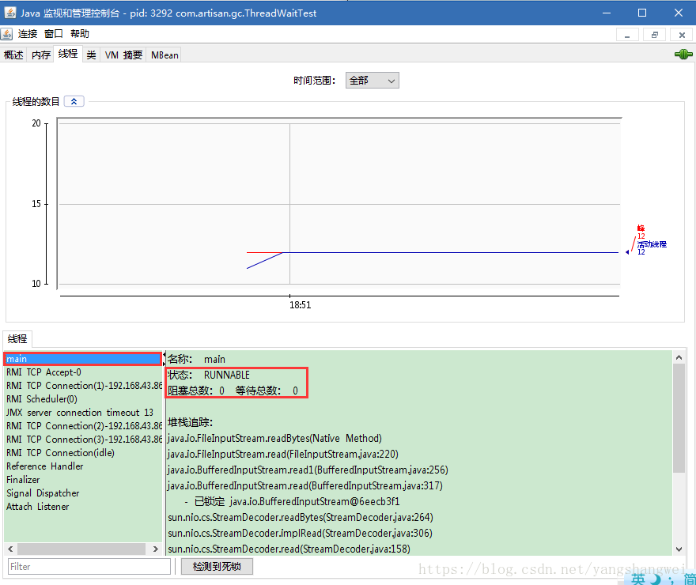

堆栈追踪显示

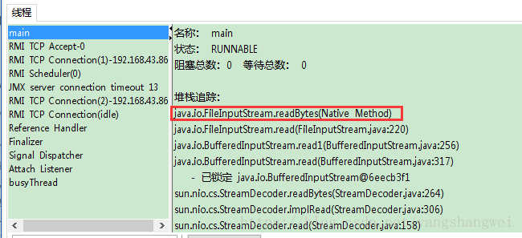

BufferedReader在readBytes方法中等待System.in的键盘输入，这时线程状态为Runnable状态，Runnable状态的线程会被分配运行时间，但readBytes方法检测到流没有更新会立刻归还执行令牌，这种等待只消耗很小的cpu资源。

输入内容后，接着监控 “busyThread”线程

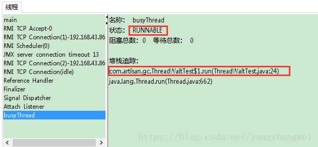

可以看出一直在ThreadWaitTest.java的 第24行停留 ，我们查看ThreadWaitTest的24行内容

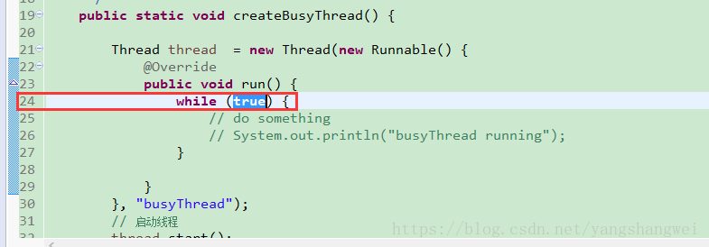


```javascript
while (true)
```

这时线程为Runnable状态，而且没有归还线程执行令牌的动作，会在空循环上用尽全部的执行时间，直到线程切换，这种等待会消耗较多的CPU资源。

接着控制台再输入内容

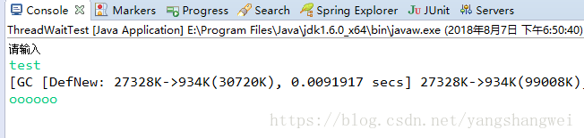

继续回到jconsole查看 “lockThread”线程

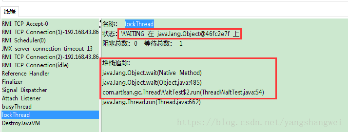

ockThread线程正在处于正常的**活锁等待**，只要lock对象的notify或者notifyAll方法被调用，这个线程便可以继续执行。

------

#### 死锁等待示例

代码语言：javascript

复制

```javascript
package com.artisan.gc;

public class ThreadLockTest {

	static class ThreadDemo implements Runnable {
		int a, b;

		public ThreadDemo(int a, int b) {
			this.a = a;
			this.b = b;
		}

		@Override
		public void run() {
			synchronized (Integer.valueOf(a)) {
				synchronized (Integer.valueOf(b)) {
					System.out.println(a + b);
				}
			}
		}

	}

	public static void main(String[] args) {
		// 加入循环，是为了更高概率的造成死锁
		for (int i = 0; i < 200; i++) {
			new Thread(new ThreadDemo(1, 2)).start();
			new Thread(new ThreadDemo(2, 1)).start();
		}
	}
}
```

先分析下造成死锁的原因： Integer.valueOf()方法基于减少对象创建次数和节省内存的考虑，【-128，127】之间的数字会被缓存，当valueOf()方法传入参数在这个范围内的时候，将直接返回缓存中的对象。 也就是说上述代码中虽然调用了200次的Integer.valueOf()方法，但是入参为1和2，一共就返回了2个不同的对象。 假如在某个线程的两个synchronized块之间发生了一次线程切换，那么就会出现线程A等着被线程B持有的Integer.valueOf(1),线程B等着被线程A持有的Integer.valueOf(2),造成死锁。

 点击“检测到死锁”按钮，如果 有死锁将会出现一个新的“死锁”页签。

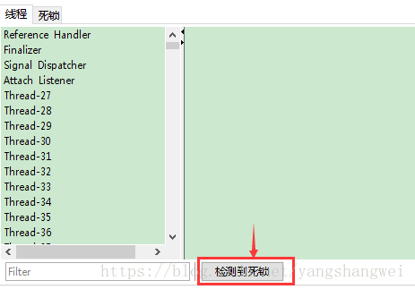

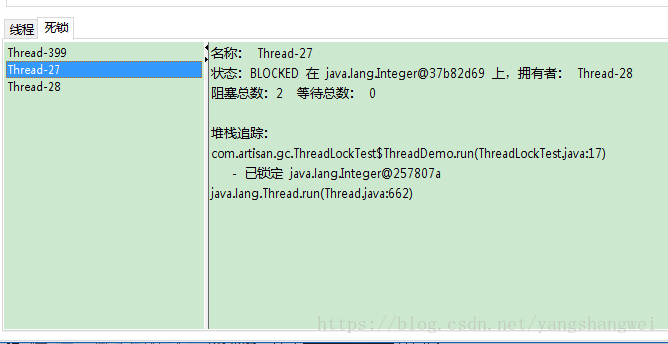

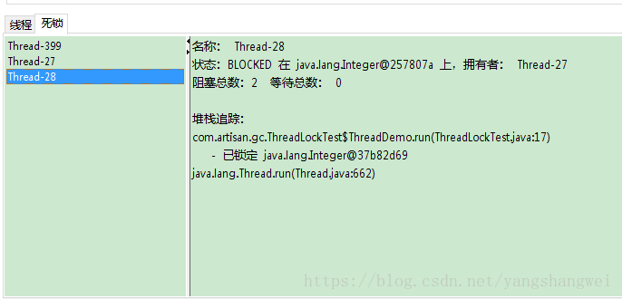

可以看到Thread-27和Thread-28互相阻塞，已经没有等到锁释放的希望了。