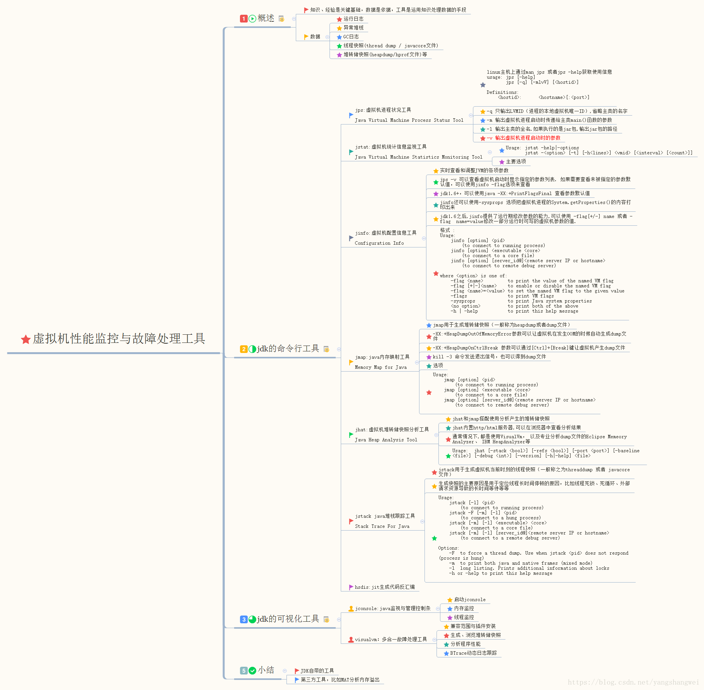
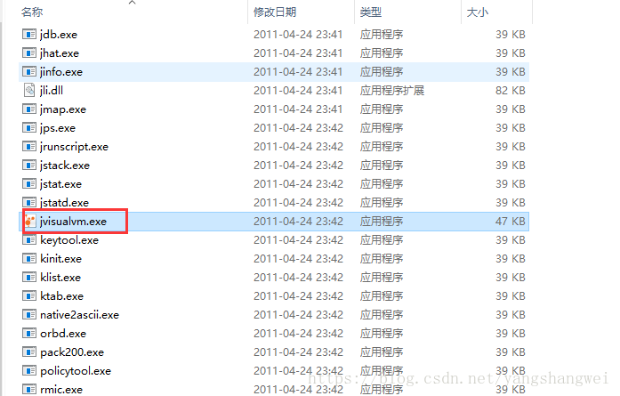
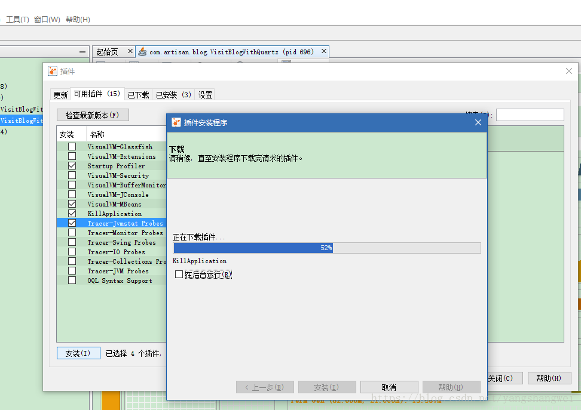
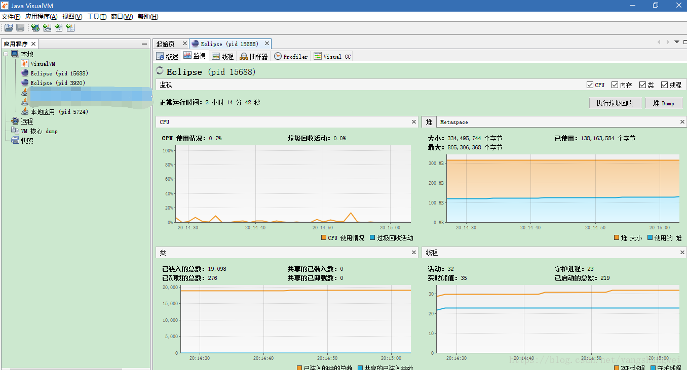
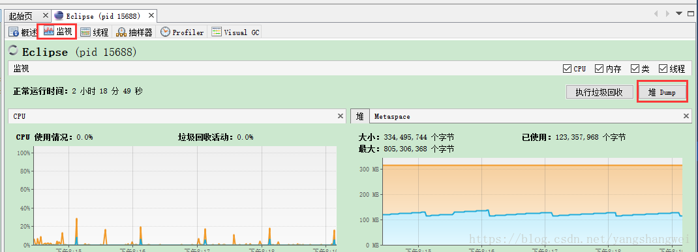
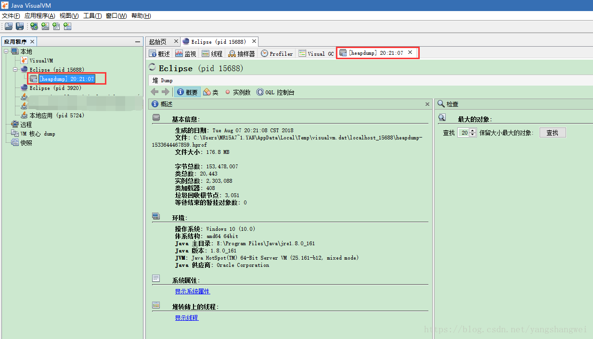
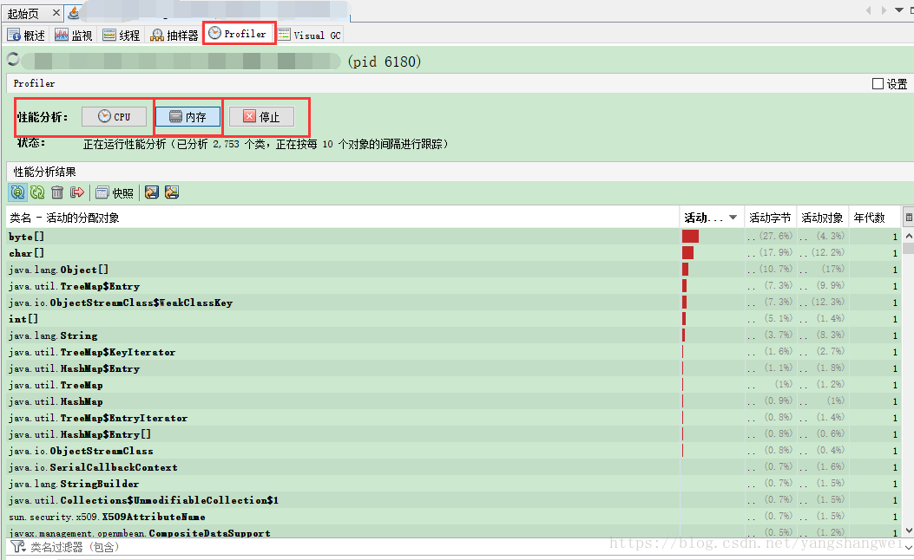
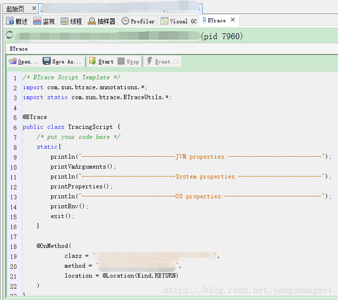

## 思维导图

Visual VM （All-in-One Java Troubleshooting Tool）是目前为止随JDK发布的功能最强大的运行监视和故障处理程序。 Visual VM除了提供运行监视、故障处理外，还提供了比如性能分析（Profiling）,对应用程序的实际性能影响很小，使得它可以直接应用在生产环境，这个优点是JProfiler、YourKit等第三方的性能分析工具无法比拟的.

VisualVM可以做到

- 显示虚拟机进程以及进程的配置、环境信息（jps 、jinfo）
- 监视应用程序的CPU、GC、堆、方法区以及线程的信息（jstat、jstack）
- dump以及分析堆转储快照（jmap、jhat）
- 方法级的程序运行性能分析，找出被调用最多、运行时间最长的而方法
- 离线程序快照：收集程序的运行配置、线程dump、内存dump等信息建立一个快照，方便分析
- 基于NetBeans平台开发，可安装各种各样的插件，功能强大，精华所在。
- 

------

\#插件安装

打开 VisualVM图形化界面工具， 工具 --插件

安装完插件后，选择一个需要监视的程序就进入程序的主页面了

## 生成、浏览堆转储快照

两种方式生成dump

- 在“应用程序”窗口中右键单击应用程序节点，然后选择“堆Dump”

- 在“应用程序”窗口中双机应用程序节点以打开应用程序内标签，然后在“监视”标签中单击“堆Dump”

生成dump文件之后，应用程序页签将在该堆的应用程序下增加一个以【heapdump】开头的子节点，并且在主页签中打开了该转储快照。

-  从堆页签中的“摘要”面案可以看到应用程序dump时运行的参数、System.getProperties()的内容、线程堆栈等信息。 
-  “类”：类面板是以类为统计口径统计类的实例数量、容量信息等 
-  “实例”：实例面板不能直接使用，因为不能确定用户想查哪个类的实例，需要通过类面板进入，在类中选择一个关心的类后双击，即可在实例中看到此类中500个实例的具体属性信息 
-  “OQL控制台”：运行OQL查询语句的 

如果想保存该dump, 右键另存为即可。 要打开一个已经存在的dump“文件–装入”即可

------

## 分析程序性能

在Profiler页签中，VisaualVM提供了程序运行期间方法级的CPU执行时间分析以及内存分析。 做Profiling分析肯定会对程序性能有比较大的影响，一般不再生产环境使用。

CPU分析会统计每个方法的执行次数、执行耗时 内存分析会统计每个方法关联的对象数以及这些对象占用的空间。

------

## BTrace

BTrace是sun公司推出的一款Java 动态、安全追踪（监控）工具，可以在不用重启的情况下监控系统运行情况，方便的获取程序运行时的数据信息，如方法参数、返回值、全局变量和堆栈信息等，并且做到最少的侵入，占用最少的系统资源。

这项功能对实际生产中的程序很有意义，比如程序出现问题，但排查错误的一些必要信息，比如方法参数、返回值等，但是开发的时候没有输出到日志中，以至于不能不加上日志后重新启动服务。 这时候BTrace插件就很方便了。

 限制比较多，并且一定要确保脚本的正确性。

在Visual VM“应用程序”中选择对应的进程，右键会看到“Trace Application”

 先了解下，后续再补充。