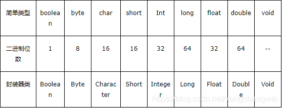

## Pre

[JVM - 深入剖析字符串常量池](https://cloud.tencent.com/developer/tools/blog-entry?target=https%3A%2F%2Fartisan.blog.csdn.net%2Farticle%2Fdetails%2F107207192&objectId=1863085&objectType=1&isNewArticle=undefined)

学习了String 字符串常量池。

接下来我们也顺便看下基本类型的包装类和起对应的对象池

**JDK1.8**

------

## 八大基本类型

Java基本类型共有八种，基本类型可以分为三类，

- 字符类型char
- 布尔类型boolean
- 数值类型byte、short、int、long、float、double



java中基本类型的包装类的大部分都实现了常量池技术(严格来说应该叫对象池，**在堆上**)，这些类是Byte,Short,Integer,Long,Character,Boolean,另外两种浮点数类型的包装类Float 、Double则没有实现。

另外Byte,Short,Integer,Long,Character这5种整型的包装类也只是在对应值小于等于127时才可使用对象池，也即对象不负责创建和管理大于127的这些类的对象。

因为一般这种比较小的数用到的概率相对较大。


## Demo

**JDK版本 1.8**

```java
public class BasicTypePoolTest {

    public static void main(String[] args) {
        //5种整形的包装类Byte,Short,Integer,Long,Character的对象，
        //在值小于127时可以使用对象池
        Integer i1 = 127;  //这种调用底层实际是执行的Integer.valueOf(127)，里面用到了IntegerCache对象池
        Integer i2 = 127;
        System.out.println(i1 == i2);//输出true

        //值大于127时，不会从对象池中取对象
        Integer i3 = 128;
        Integer i4 = 128;
        System.out.println(i3 == i4);//输出false

        //用new关键词新生成对象不会使用对象池
        Integer i5 = new Integer(127);
        Integer i6 = new Integer(127);
        System.out.println(i5 == i6);//输出false

        //Boolean类也实现了对象池技术
        Boolean bool1 = true;
        Boolean bool2 = true;
        System.out.println(bool1 == bool2);//输出true

        //浮点类型的包装类没有实现对象池技术
        Double d1 = 1.0;
        Double d2 = 1.0;
        System.out.println(d1 == d2);//输出false
    }
}
```


