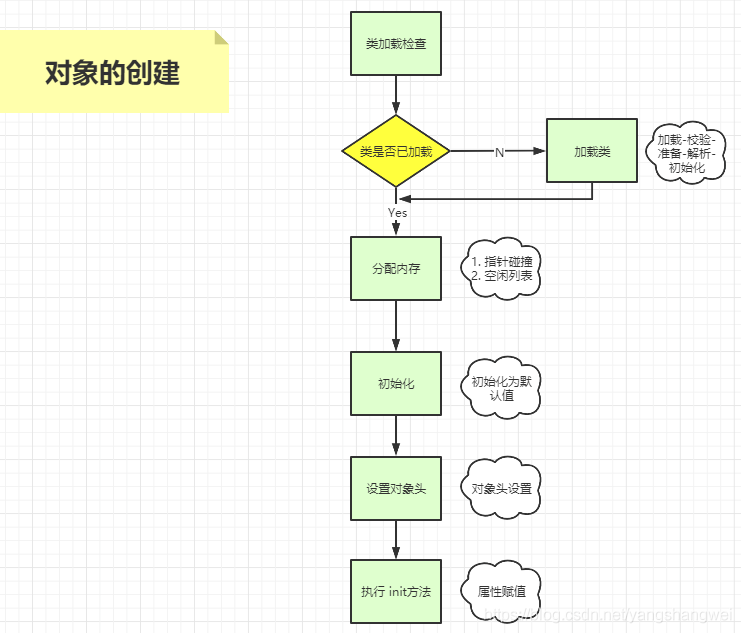
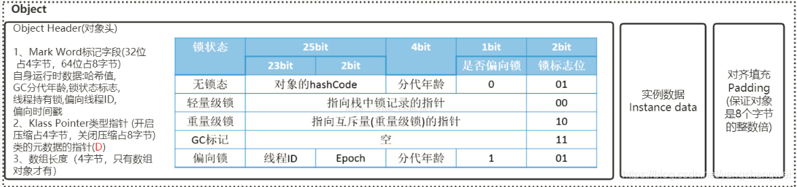
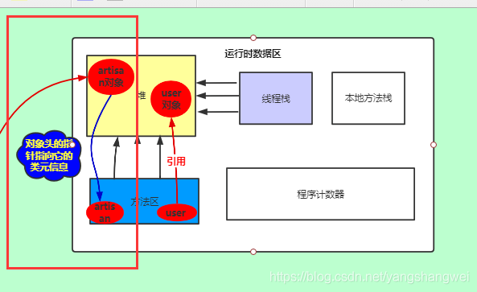
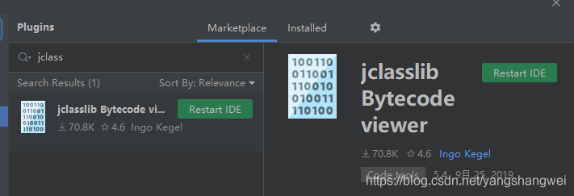
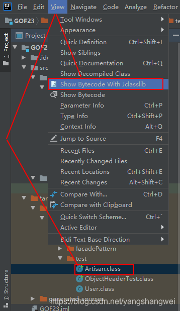
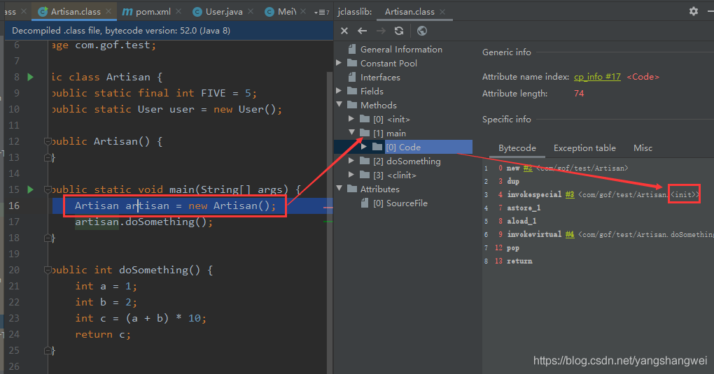
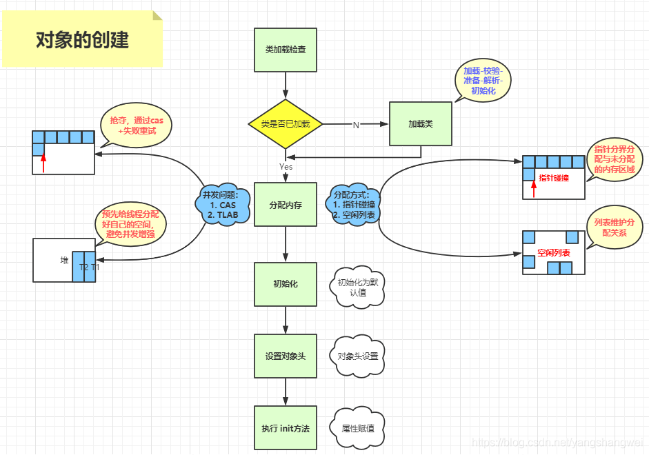

## 对象创建流程

我们知道JVM三大组成部分： 类加载子系统、运行时数据区 、字节码执行引擎。

要想new 一个对象，肯定是要绕不开JVM的机制。

### 【类加载检查】

JVM启动的时候并不是将所有的类都初始化，所以当碰到一个new指令时，JVM首先会去检查这个类有没有被加载，具体就是去常量池中看是否有这个类的符号引用，并检查这个符号引用代表的类是否已经被加载、解析和初始化过 。 若没有这必须经历【类加载子系统】的历练 （加载–校验–准备–解析–初始化）

[JVM-白话聊一聊JVM类加载和双亲委派机制源码解析](https://cloud.tencent.com/developer/article/1862866?from_column=20421&from=20421)

------

### 【分配内存】

类加载校验通过后 ，是不是该分配内存了呢？

是的， 接下来JVM将会为这个新生的对象分给内存，因为这个新生对象所需要内存大小在类加载完之后便可以完全确定，对象放哪里呢？ 通常都是放在堆中，所以所谓的分配内存实际上就是从Java堆中划分出一块固定大小的内存给这个新生对象。

虽然很简单的一件事情，但是要考虑的地方可不少

1. 采取何种方式分配内存
2. 并发问题

#### 内存划分的两种方式

JVM提供了2中划分内存的方法

- 指针碰撞（Bump the Pointer） 【**默认方式**】

如果堆中的内存是绝对规整的，大家都按顺序排放，分配过内存的对象那个在一边，未使用的内存在另外一边 ，分界线使用指针来维护。因为新生对象所需要内存大小在类加载完之后便可以完全确定，所以仅需要将指针移动对象大小的位置即可。

当然了这是一种理想的情况，JVM里还有GC，会标记清除等等

- 空闲列表（Free List） 如果堆内存中的内存并不是规整的，分配的内存和未分配的内存糅杂在一起， 如果还用上面的指针碰撞的方式， 如果移动的可用内存无法容纳这个对象，放不下啊？ 咋弄？ 继续碰么？

显然效率很低。 所以JVM采用了另外一种方式，JVM维护了一个列表，记录了堆中的可用内存，那么分配内存的时候就从JVM维护的列表中找一个足够容纳这个对象的内存区域给它，并更新列表记录。

------

#### 解决分配内存并发问题的两种方式

第二个问题 并发问题如何解决呢？

在并发的情况下，可能出现JVM正在给对象A分配内存，但是指针还没来得及修改，对象B又使用了A的内存空间的情况。

为了解决这个问题，JVM采取了

- CAS （compare and swap）

简而言之就是JVM采用【 CAS+失败重试 】保证更新操作的原子性 。

- 本地线程分配缓冲 （Thread Local Allocation Buffer , TLAB）

把内存分配的动作按照线程划分在不同的空间之中进行，即每个线程在Java堆中预先分配一小块内存

通过`­XX:+/­ UseTLAB`参数来设定虚拟机是否使用TLAB。

JDK8中默认开启`XX:+UseTLAB` ，默认值eden区域的1%，当然了也可以通过`-XX:TLABSize` 指定TLAB大小 。 一般不建议修改。

如果TLAB还放不下，那就走CAS了…

 不管怎么分配，目的只是为了更好的回收内存或者更快的分配对象

------

### 【初始化】

内存分配完成后，虚拟机需要将分配到的内存空间都初始化为零值（**不包括对象头**）.

如果使用TLAB，这一工作过程也可以提前至TLAB分配时进行。

这一步操作保证了对象的实例字段在Java代码中可以不赋初始值就直接使用，程序能访问到这些字段的数据类型所对应的默认值 （比如 int 默认0 ， String 默认null , boolean 默认false等等）

------

### 【设置对象头】

初始化默认值以后，JVM要对对象进行必要的设置，例如这个对象是哪个类的实例、如何才能找到类的元数据信息、对象的哈希码、对象的GC分代年龄等信息。这些信息存放在对象的对象头Object Header之中。

这部分数据的长度在32位和64位的虚拟机中分别为32个和64个bits，官方称它为“Mark Word”。

------

#### 对象的组成

在HotSpot虚拟机中，对象在内存中存储的布局可以分为3块区域：对象头（Header）、 实例数据（Instance Data)和和对齐填充（Padding） 。

#### 对象头的两部分组成

HotSpot虚拟机的对象头包括两部分信息

- 第一部分用于**存储对象自身的运行时数据**， 如哈希码（HashCode）、GC分代年龄、锁状态标志、线程持有的锁、偏向线程ID、偏向时 间戳等。

32位操作系统为例

- 对象头的另外一部分是**类型指针**，即对象指向它的类元数据的指针，虚拟机通过这个指针来确定这个对象是哪个类的实例。

如下所示

### 【执行init方法】

执行方法，即对象按照程序员的意愿进行初始化。对应到语言层面上讲，就是为属性赋值（注意，这与上面的赋零值不同，这是由程序员赋的值） 和执行构造方法。

IDEA安装jclasslib插件可以查看

这里的init实际上是C++调用的，相对于面向开发人员 就是 new Artisan(） ，并执行Artisan默认的构造函数。

## 总结一下

