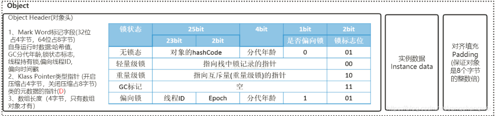
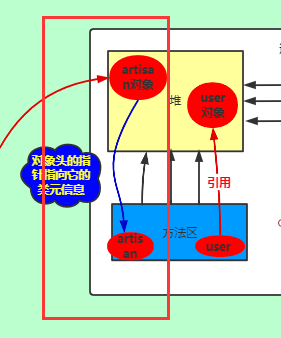
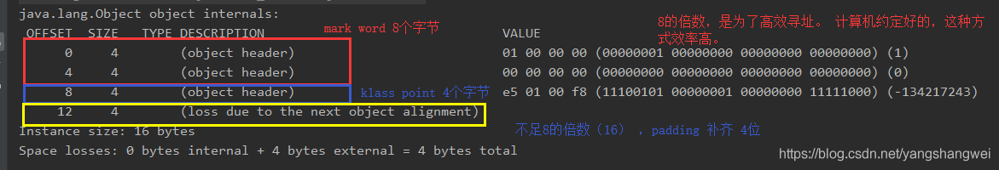
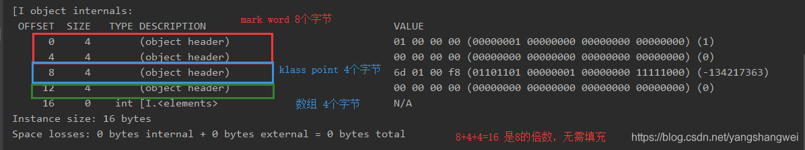
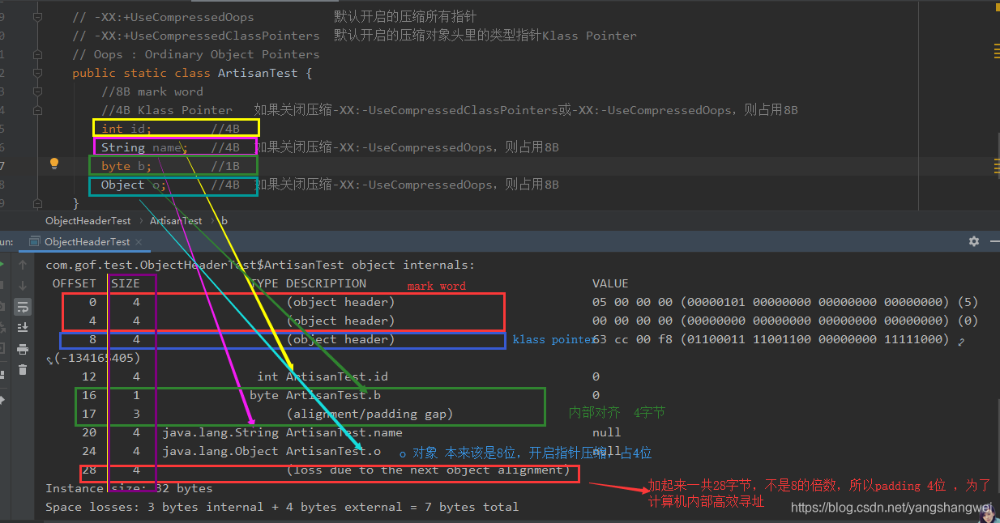

# Java对象头

## Pre

写了这么多年代码，你知不道new对象背后的逻辑？中大体介绍了Java中 new 对象背后的主要流程，其中对象头的部分，我们仅仅是点到为止，这里我们深入剖一下Object Header的奥秘 。

## 总览

初始化默认值以后，JVM要对对象进行必要的设置，例如这个对象是哪个类的实例、如何才能找到类的元数据信息、对象的哈希码、对象的GC分代年龄等信息。这些信息存放在对象的对象头Object Header之中。 这部分数据的长度在32位和64位的虚拟机中分别为32个和64个bits，官方称它为“Mark Word”。

在HotSpot虚拟机中，对象在内存中存储的布局可以分为3块区域：对象头（Header）、 实例数据（Instance Data)和和对齐填充（Padding）


HotSpot虚拟机的对象头包括两部分信息

- 第一部分用于**存储对象自身的运行时数据**， 如哈希码（HashCode）、GC分代年龄、锁状态标志、线程持有的锁、偏向线程ID、偏向时 间戳等。

我们以32位操作系统的组成来看一下，下面这个图也是从网上找的，感觉很清晰



- 对象头的另外一部分是**类型指针**，即对象指向它的类元数据的指针，虚拟机通过这个指针来确定这个对象是哪个类的实例。

如下红色框框中的示意图



## 对象头剖析


### 查看对象内存的占用情况

推荐openjdk的jol工具， 可以查看对象内存的占用情况。

添加依赖

```java
<dependency>
 <groupId>org.openjdk.jol</groupId>
    <artifactId>jol-core</artifactId>
     <version>0.10</version     
</dependency>
```

示例

```java
import org.openjdk.jol.info.ClassLayout;

/**
 * @author 小工匠
 * @version v1.0
 * @create 2020-06-25 16:21
 * @motto show me the code ,change the word
 * @blog https://artisan.blog.csdn.net/
 * @description
 **/

public class ObjectHeaderTest {

    public static void main(String[] args) {
        ClassLayout layout = ClassLayout.parseInstance(new Object());
        System.out.println(layout.toPrintable());

        System.out.println();
        ClassLayout layout1 = ClassLayout.parseInstance(new int[]{});
        System.out.println(layout1.toPrintable());

        System.out.println();
        ClassLayout layout2 = ClassLayout.parseInstance(new ArtisanTest());
        System.out.println(layout2.toPrintable());
    }

    // -XX:+UseCompressedOops           默认开启的压缩所有指针
    // -XX:+UseCompressedClassPointers  默认开启的压缩对象头里的类型指针Klass Pointer
    // Oops : Ordinary Object Pointers
    public static class ArtisanTest {
        //8B mark word
        //4B Klass Pointer   如果关闭压缩-XX:-UseCompressedClassPointers或-XX:-UseCompressedOops，则占用8B
        int id;        //4B
        String name;   //4B  如果关闭压缩-XX:-UseCompressedOops，则占用8B
        byte b;        //1B
        Object o;      //4B  如果关闭压缩-XX:-UseCompressedOops，则占用8B
    }
}
```

【输出结果 】

```java
java.lang.Object object internals:
 OFFSET  SIZE   TYPE DESCRIPTION                               VALUE
      0     4        (object header)                           01 00 00 00 (00000001 00000000 00000000 00000000) (1)
      4     4        (object header)                           00 00 00 00 (00000000 00000000 00000000 00000000) (0)
      8     4        (object header)                           e5 01 00 f8 (11100101 00000001 00000000 11111000) (-134217243)
     12     4        (loss due to the next object alignment)
Instance size: 16 bytes
Space losses: 0 bytes internal + 4 bytes external = 4 bytes total


[I object internals:
 OFFSET  SIZE   TYPE DESCRIPTION                               VALUE
      0     4        (object header)                           01 00 00 00 (00000001 00000000 00000000 00000000) (1)
      4     4        (object header)                           00 00 00 00 (00000000 00000000 00000000 00000000) (0)
      8     4        (object header)                           6d 01 00 f8 (01101101 00000001 00000000 11111000) (-134217363)
     12     4        (object header)                           00 00 00 00 (00000000 00000000 00000000 00000000) (0)
     16     0    int [I.<elements>                             N/A
Instance size: 16 bytes
Space losses: 0 bytes internal + 0 bytes external = 0 bytes total


com.gof.test.ObjectHeaderTest$ArtisanTest object internals:
 OFFSET  SIZE               TYPE DESCRIPTION                               VALUE
      0     4                    (object header)                           05 00 00 00 (00000101 00000000 00000000 00000000) (5)
      4     4                    (object header)                           00 00 00 00 (00000000 00000000 00000000 00000000) (0)
      8     4                    (object header)                           63 cc 00 f8 (01100011 11001100 00000000 11111000) (-134165405)
     12     4                int ArtisanTest.id                            0
     16     1               byte ArtisanTest.b                             0
     17     3                    (alignment/padding gap)                  
     20     4   java.lang.String ArtisanTest.name                          null
     24     4   java.lang.Object ArtisanTest.o                             null
     28     4                    (loss due to the next object alignment)
Instance size: 32 bytes
Space losses: 3 bytes internal + 4 bytes external = 7 bytes total


Process finished with exit code 0
```

【结果说明】

3中类型 ： new Object() | new int[]{}数组 | new ArtisanTest()

我这个电脑是64位的操作系统，所以 mark word 占 8个字节。JDK8 klass point 默认开启了指针压缩，所以是4个字节 , 不足8的倍数的，使用padding对齐填充，其目的是为了计算机高效寻址。





最后一个，对于包含多个变量的对象的对象头



## 对象头C++源码 注释

```c++
Bit‐format of an object header (most significant first, big endian layout below):
//
// 32 bits:
// ‐‐‐‐‐‐‐‐
// hash:25 ‐‐‐‐‐‐‐‐‐‐‐‐>| age:4 biased_lock:1 lock:2 (normal object)
// JavaThread*:23 epoch:2 age:4 biased_lock:1 lock:2 (biased object)
// size:32 ‐‐‐‐‐‐‐‐‐‐‐‐‐‐‐‐‐‐‐‐‐‐‐‐‐‐‐‐‐‐‐‐‐‐‐‐‐‐‐‐‐‐>| (CMS free block)
// PromotedObject*:29 ‐‐‐‐‐‐‐‐‐‐>| promo_bits:3 ‐‐‐‐‐>| (CMS promoted object)
//
// 64 bits:
// ‐‐‐‐‐‐‐‐
// unused:25 hash:31 ‐‐>| unused:1 age:4 biased_lock:1 lock:2 (normal object)
// JavaThread*:54 epoch:2 unused:1 age:4 biased_lock:1 lock:2 (biased object)
// PromotedObject*:61 ‐‐‐‐‐‐‐‐‐‐‐‐‐‐‐‐‐‐‐‐‐>| promo_bits:3 ‐‐‐‐‐>| (CMS promoted object)
// size:64 ‐‐‐‐‐‐‐‐‐‐‐‐‐‐‐‐‐‐‐‐‐‐‐‐‐‐‐‐‐‐‐‐‐‐‐‐‐‐‐‐‐‐‐‐‐‐‐‐‐‐‐‐‐>| (CMS free block)
//
// unused:25 hash:31 ‐‐>| cms_free:1 age:4 biased_lock:1 lock:2 (COOPs && normal object)
// JavaThread*:54 epoch:2 cms_free:1 age:4 biased_lock:1 lock:2 (COOPs && biased object)
// narrowOop:32 unused:24 cms_free:1 unused:4 promo_bits:3 ‐‐‐‐‐>| (COOPs && CMS promoted object)
// unused:21 size:35 ‐‐>| cms_free:1 unused:7 ‐‐‐‐‐‐‐‐‐‐‐‐‐‐‐‐‐‐>| (COOPs && CMS free block)
```

