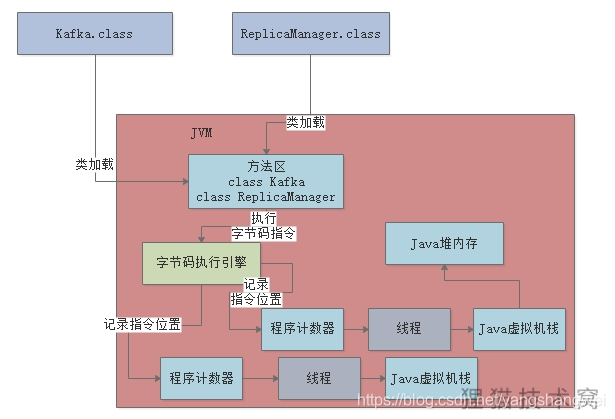

# 垃圾回收机制

## Pre

上一篇文章给大家分析了JVM中的几块内存区域分别都是干什么的，今天的文章就给大家初步介绍一下垃圾回收的概念。

先来看一下昨天的一张图，回顾一下JVM中几块内存区域的作用。

大家脑子里一定要有一个会动的图，你的代码在运行的时候，起码有一个main线程会去执行所有的代码，当然也可能是你启动的别的线程。

然后线程执行时必须通过自己的程序计数器来记录执行到哪一个代码指令了

另外线程在执行方法时，为每个方法都得创建一个栈帧放入自己的Java虚拟机栈里去，里面有方法的局部变量。

最后就是代码运行过程中创建的各种对象，都是放在Java堆内存里的。

结合上面的大图看一看，相信大家一定就明白是怎么回事了，大家对JVM的运行原理也应该都有了一个初步的理解和把握。

## 对象的分配与引用

现在我们假设有下面一段代码，大概意思你可以理解为通过“loadReplicasFromDisk”方法的执行，去磁盘上加载需要的副本数据

然后通过“ReplicaManager”对象实例完成了这个操作。

代码如下所示：

 结合我们之前理解过的JVM运行原理，一起通过动态的图来拆解一下上述代码的运行流程。

首先一个main线程肯定会来执行main()方法里的代码

main线程自己是有一个Java虚拟机栈的，他会把main()方法的栈帧压入Java虚拟机栈，如下图

接着main()方法里调用了loadReplicasFromDisk()方法

那么就会创建loadReplicasFromDisk()方法的栈帧，压入main线程的Java虚拟机栈里去

这个过程如下图：

此时发现在loadReplicasFromDisk()方法里，有一个“repliaManager”变量，那么就会在loadReplicasFromDisk()方法对应的栈帧里，放入一个“repliaManager”变量。

接着发现在代码里创建了一个“ReplicaManager”类的实例对象，此时就会在Java堆内存中分配这个实例对象的内存空间。

同时，让loadReplicasFromDisk()方法的栈帧内的“replicaManager”局部变量去指向那个Java堆内存里的ReplicaManager实例对象，大家看下图：

 接下来，就会执行通过“replicaManager”局部变量引用的“ReplicaManager”实例对象去执行他的load()方法，去完成我们实现的业务逻辑。

好，到这里为止，其实都是上篇文章讲解过的知识，我们就是重新串联了一遍 ~

------

## 一个方法执行完毕之后会怎么样？

接着大家来回顾一下上面的代码。

其实目前的图我们已经表述到了“replicaManager.load()”这行代码这里

那么现在有个问题，如果这行代码执行结束了，此时会怎么样？ 一旦方法里的代码执行完毕，那么方法就执行完毕了，也就是说loadReplicasFromDisk()方法就执行完毕了。

一旦你的loadReplicasFromDisk()方法执行完毕，此时就会把loadReplicasFromDisk()方法对应的栈帧从main线程的Java虚拟机栈里出栈

此时一旦loadReplicasFromDisk()方法的栈帧出栈，那么大家会发现那个栈帧里的局部变量，“replicaManager”，也就没有了。

也就是说，没有任何一个变量指向Java堆内存里的“ReplicaManager”实例对象了。

核心点来了，此时大家发现了，Java堆内存里的那个“ReplicaManager”实例对象已经没有人引用他了

这个对象实际上已经没用了，该干的事儿都干完了，现在你还让他留在内存里干啥呢？

大家要知道，内存资源是有限的。

一般来说，我们会在一台机器上启动一个Java系统，机器的内存资源是有限的，比如就4个G的内存

然后我们启动的Java系统本质就是一个JVM进程，他负责运行我们的系统的代码 。

那么这个JVM进程本身也是会占用机器上的部分内存资源，比如占用2G的内存资源。

那么我们在JVM的Java堆内存中创建的对象，其实本质也是会占用JVM的内存资源的，比如“ReplicaManager”实例对象，会占用500字节的内存。

所以大家看到这里，心中应该无比明白的一个核心点：我们在Java堆内存里创建的对象，都是占用内存资源的，而且内存资源有限。

## 不再需要的那些对象应该怎么处理？–GC

继续思考上面的图，既然“ReplicaManager”对象实例是不需要使用的，已经没有任何方法的局部变量在引用这个实例对象了，而且他还空占着内存资源，那么我们应该怎么处理呢？

JVM的垃圾回收机制

JVM本身是有垃圾回收机制的，他是一个后台自动运行的线程

你只要启动一个JVM进程，他就会自带这么一个垃圾回收的后台线程。

这个线程会在后台不断检查JVM堆内存中的各个实例对象

还是给大家画一张图，来看看这个过程：

 如果某个实例对象没有任何一个方法的局部变量指向他，也没有任何一个类的静态变量，包括常量等地方在指向他。

那么这个垃圾回收线程，就会把这个没人指向的“ReplicaManager”实例对象给回收掉，从内存里清除掉，让他不再占用任何内存资源。

这样的话，这些不再被人指向的对象实例，即JVM中的“垃圾”，就会定期的被后台垃圾回收线程清理掉，不断释放内存资源

 到此为止，相信大家跟上文章思路一路看下来，就很清晰明了。到底什么是JVM中的“垃圾”？什么又是JVM的“垃圾回收”！

------

## 思考题

既然今天提到了Java堆内存里的对象会被回收掉，那么加载到方法区的类会被垃圾回收吗？什么时候被回收？为什么呢？

-  首先该类的所有实例对象都已经从Java堆内存里被回收 
-  其次加载这个类的ClassLoader已经被回收 
-  最后，对该类的Class对象没有任何引用 

满足上面三个条件就可以回收该类了