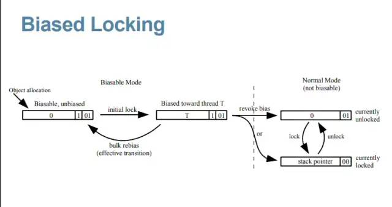
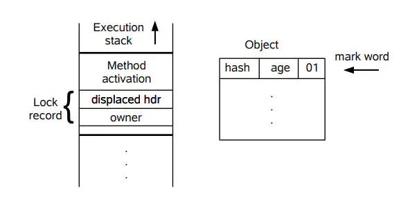

每一个刚接触多线程并发编程的同学，当被问到，如果多个线程同时访问一段代码，发生并发的时候，应该怎么处理？

我相信闪现在脑海中的第一个解决方案就是用**synchronized**，用锁，让这段代码同一时间只能被一个线程执行。 我们也知道，synchronized关键字可以用在方法上，也可以用在代码块上，如果要使用synchronized，我们一般就会如下使用：

代码语言：javascript

复制

```javascript
public synchronized void doSomething() {
    //do something here
}
```

或者

代码语言：javascript

复制

```javascript
synchronized(LockObject) {
    //do something here
}
```

那么实际上，synchronized关键字到底是**怎么加锁的？锁又长什么样子的呢？**关于锁，还有一些什么样的概念需要我们去认识，去学习，去理解的呢？

以前在学习synchronized的时候，就有文章说, synchronized是一个很重的操作，开销很大，不要轻易使用，我们接受了这样的观点，但是为什么说是重的操作呢，为什么开销就大呢？

到**java1.6**之后，java的开发人员又针对锁机制实现了一些优化，又有文章告诉我们现在经过优化后，使用synchronized并没有什么太大的问题了，那这又是因为什么原因呢？到底是做了什么优化？

那今天我们就尝试着从锁机制实现的角度，来讲述一下synchronized在java虚拟机上面的适应场景是怎么样的。

由于java在1.6之后，引入了一些优化的方案，所以我们讲述synchronized，也会基于java1.6之后的版本。

####   1 **锁对象**

首先，我们要知道**锁其实就是一个对象**，java中每一个对象都能够作为锁。

所以我们在使用synchronized的时候，

1. 对于**同步代码块**，就得指定锁对象。
2. 对于**修饰方法**的synchronized，默认的锁对象就是当前方法的对象。
3. 对于**修饰静态方法**的synchronized，其锁对象就是此方法所对应的类Class对象。

我们知道，所谓的对象，无非也就是内存上的一段地址，上面存放着对应的数据，那么我们就要想，作为锁，它跟其它的对象有什么不一样呢？怎么知道这个对象就是锁呢？怎么知道它跟哪个线程关联呢？它又怎么能够控制线程对于同步代码块的访问呢？

####   2 **Markword**

可以了解到在虚拟机中，对象在内存中的存储分为三部分：

1. 对象头
2. 实例数据
3. 对齐填充

其中，对象头填充的是该对象的一些运行时数据，虚拟机一般用2到3个字宽来存储对象头。

1. 数组对象，会用3个字宽来存储。
2. 非数据对象，则用2个字宽来存储。

其结构简单如下：

| 长度     | 内容                   | 说明                         |
| :------- | :--------------------- | :--------------------------- |
| 32/64bit | Markword               | hashCode，GC分代年龄，锁信息 |
| 32/64bit | Class Metadata Address | 指向对象类型数据的指针       |
| 32/64bit | Array Length           | 数组的长度（当对象为数组时） |

从上表中，我们可以看到，锁相关的信息，是存在称之为Markword中的内存域中。

拿以下的代码作为例子，

代码语言：javascript

复制

```javascript
synchonized(LockObject) {
    //do something here
}
```

在对象LockObject的对象头中，当其被创建的时候，其Markword的结构如下：

| bit fields |      | 是否偏向锁 | 锁标志位 |
| :--------- | :--- | :--------- | :------- |
| hash       | age  | 0          | 01       |

从上面Markword的结构中，可以看出

**所有新创建的对象，都是可偏向的（锁标志位为01），但都是未偏向的（是否偏向锁标志位为0）**

####   3 **偏向锁**

当线程执行到临界区（critical section）时，此时会利用CAS(Compare and Swap)操作，将线程ID插入到Markword中，同时修改偏向锁的标志位。

这说明此对象就要被当做一个锁来使用，那么其Markword的内容就要发生变化了。 其结构其会变成如下：

| bit fields |       |      | 是否偏向锁 | 锁标志位 |
| :--------- | :---- | :--- | :--------- | :------- |
| threadId   | epoch | age  | 1          | 01       |

可以看到，

1. 锁的标志位还是01
2. “是否偏向锁”这个字段变成了1
3. hash值变成了线程ID和epoch值

也就是说，这个锁将自己偏向了当前线程，心里默默地藏着线程id， 在这里，我们就引入了“偏向锁”的概念。

在此线程之后的执行过程中，如果再次进入或者退出同一段同步块代码，并不再需要去进行加锁或者解锁操作，而是会做以下的步骤：

1. Load-and-test，也就是简单判断一下当前线程id是否与Markword当中的线程id是否一致.
2. 如果一致，则说明此线程已经成功获得了锁，继续执行下面的代码
3. 如果不一致，则要检查一下对象是否还是可偏向，即“是否偏向锁”标志位的值。
4. 如果还未偏向，则利用CAS操作来竞争锁，也即是第一次获取锁时的操作。
5. 如果此对象已经偏向了，并且不是偏向自己，则说明存在了竞争。此时可能就要根据另外线程的情况，可能是重新偏向，也有可能是做偏向撤销，但大部分情况下就是升级成轻量级锁了。

以下是Java开发人员提供的一张图：



**“偏向锁”是Java在1.6引入的一种优化机制，其核心思想在于，可以让同一个线程一直拥有同一个锁，直到出现竞争，才去释放锁。**

因为经过虚拟机开发人员的调查研究，在大多数情况下，总是同一个线程去访问同步块代码，基于这样一个假设，引入了偏向锁，只需要用一个CAS操作和简单地判断比较，就可以让一个线程持续地拥有一个锁。

也正因为此假设，在Jdk1.6中，偏向锁的开关是默认开启的，适用于只有一个线程访问同步块的场景。

####   4 **锁膨胀**

在上面，我们说到，一旦出现竞争，也即有另外一个线程也要来访问这一段代码，偏向锁就不适用于这种场景了。

如果两个线程都是活跃的，会发生竞争，此时偏向锁就会发生升级，也就是我们常常听到的锁膨胀。

**偏向锁会膨胀成轻量级锁(lightweight locking)。**

####   5 **锁撤销**

偏向锁有一个不好的点就是，一旦出现多线程竞争，需要升级成轻量级锁，是有可能需要先做出销撤销的操作。

而销撤销的操作，相对来说，开销就会比较大，其步骤如下：

1. 在一个安全点停止拥有锁的线程，就跟开始做GC操作一样。
2. 遍历线程栈，如果存在锁记录的话，需要修复锁记录和Markword，使其变成无锁状态。
3. 唤醒当前线程，将当前锁升级成轻量级锁。

####   6 **轻量级锁**

而本质上呢，其实就是锁对象头中的Markword内容又要发生变化了。

下面先简单地描述 其膨胀的步骤：

1. 线程在自己的栈桢中创建锁记录 LockRecord
2. 将锁对象的对象头中的MarkWord复制到线程的刚刚创建的锁记录中
3. 将锁记录中的Owner指针指向锁对象
4. 将锁对象的对象头的MarkWord替换为指向锁记录的指针。

同样，我们还是利用Java开发人员提供的一张图来描述此步骤：



可以根据上面两图来印证上面几个步骤，但在这里，其实对象的Markword其实也是发生了变化的，其现在的内容结构如下：

| bit fields           | 锁标志位 |
| :------------------- | :------- |
| 指向LockRecord的指针 | 00       |

说到这里，我们又通过偏向锁引入了轻量级锁的概念，那么轻量级锁是怎么个轻量级法，它具体的实现又是怎么样的呢？

就像偏向锁的前提，是同步代码块在大多数情况下只有同一个线程访问的时候。 而轻量级锁的前提则是，线程在同步代码块里面的操作非常快，获取锁之后，很快就结束操作，然后将锁释放出来。

但是不管再怎么快，一旦一个线程获得锁了，那么另一个线程同时也来访问这段代码时，怎么办呢？这就涉及到我们下面所说的锁自旋的概念了。

####   7 **自旋锁/自适应自旋锁**

来到轻量级锁，其实轻量级的叙述就来自于自旋的概念。 因为前提是线程在临界区的操作非常快，所以它会非常快速地释放锁，所以只要让另外一个线程在那里地循环等待，然后当锁被释放时，它马上就能够获得锁，然后进入临界区执行，然后马上又释放锁，让给另外一个线程。 所谓自旋，就是线程在原地空循环地等待，不阻塞，但它是消耗CPU的。

所以对于轻量级锁，它也有其限制所在：

1. 因为消耗CPU，所以自旋的次数是有限的，如果自旋到达一定的次数之后，还获取不到锁，那这种自旋也就无意义。但在上述的前提下，这种自旋的次数还是比较少的（经验数据）。 当然，一开始的自旋次数都是固定的，但是在经验代码中，获得锁的线程通常能够马上再获得锁，所以又引入了自适应的自旋，即根据上次获得锁的情况和当前的线程状态，动态地修改当前线程自旋的次数。
2. 当另一个线程释放锁之后，当前线程要能够马上获得锁，所以如果有超过两个的线程同时访问这段代码，就算另外一个线程释放锁之后，当前线程也可能获取不到锁，还是要继续等待，空耗CPU。

从以上两点可看出，当线程通过自旋获取不到锁了，比如临界区的操作太花时间了，或者有超过2个以上的线程在竞争锁了，轻量级锁的前提又不成立了。当虚拟机检查到这种情况时，又开始了膨胀的脚步。

####   8 **互斥锁（重量级锁）**

相比起轻量级锁，再膨胀的锁，一般称之为**重量级锁**，因为是依赖于每个对象内部都有的monitor锁来实现的，而monitor又依赖于操作系统的MutexLock(互斥锁)来实现，所以一般重量级锁也叫互斥锁。

由于需要在操作系统的内核态和用户态之间切换的，需要将线程阻塞挂起，切换线程的上下文，再恢复等操作，所以当synchronized升级成互斥锁，依赖monitor的时候，开销就比较大了，而这也是之前为什么说synchronized是一个很重的操作的原因了。

当然，升级成互斥锁之后，锁对象头的Markword内容也是会变化的，其内容如下：

| bit fields      | 锁标志位 |
| :-------------- | :------- |
| 指向Mutex的指针 | 10       |

每次检查当前线程是否获得锁，其实就是检查Mutex的值是否为0，不为0，说明其为其线程所占有，此时操作系统就会介入，将线程阻塞，挂起，释放CPU时间，等待下一次的线程调度。

好了，到这里，对于synchronized所修改的同步方法或者同步代码块，虚拟机是如何操作的，大家应该也有一个简单的印象了。

当使用synchronized关键字的时候，在java1.6之后，根据不同的条件和场景，虚拟机是一步一步地将偏向锁升级成轻量级锁，再最终升级成重量级锁的，而这个过程是不可逆的，因为一旦升级成重量级锁，则说明偏向锁和轻量级锁是不适用于当前的应用场景的，那再降级回去也没什么意义。

从这一点，也可以看出，如果我们的应用场景本身就不适用于偏向锁和轻量级锁，那么我们在程序一开始，就应该禁用掉偏向锁和轻量级锁，直接使用重量级锁，省去无谓的开销。

####   **9** **总结**

在这里总结一下，在使用synchronized关键字的时候，本质上是否获得锁，是通过修改锁对象头中的markword的内容来标记是否获得锁，并由虚拟机来根据具体的应用场景来锁进行升级。

简单地将上述几个零散的markword变化合在一起，展示在下面：

| 锁状态   | bits                 | 1bit是否是偏向锁 | 2bit锁标志位 |
| :------- | :------------------- | :--------------- | :----------- |
| 无锁状态 | 对象的hashCode       | 0                | 01           |
| 偏向锁   | 线程ID               | 1                | 01           |
| 轻量级锁 | 指向栈中锁记录的指针 | 0                | 00           |
| 重量级锁 | 指向互斥量的指针     | 0                | 10           |