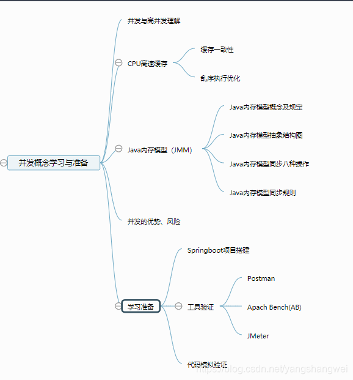
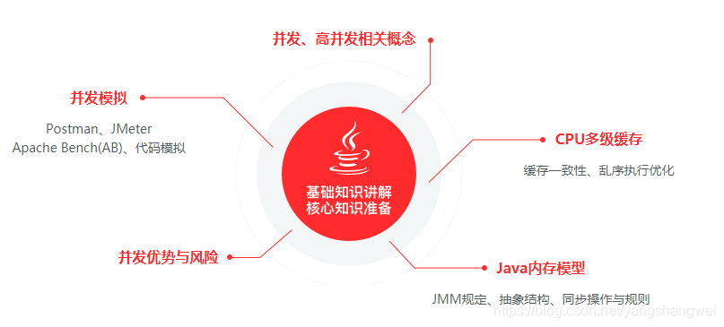
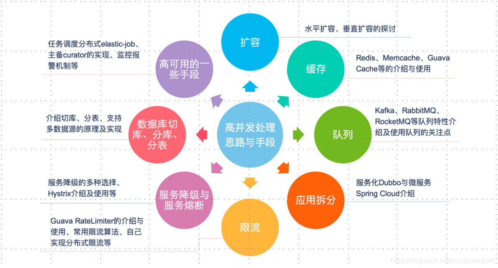
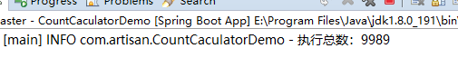

## 引言

说来惭愧，一直没有系统的梳理过并发编程的知识，这次借着学习_Jimin_老师的《Java并发编程与高并发解决方案》课程的机会，结合以往工作中的使用，好好的梳理下并发编程与高并发的知识，形成一个较为完善的并发编程知识体系。


## 思维导图



## 基础知识构建



## 涉及的知识点一览


## 高并发处理思路与手段一览



## 并发初窥

### 概念

并发： 同时拥有两个或者多个线程，如果程序在单核处理器上运行多个线程将交替地换入或者换出内存，这些线程是 同时“存在”的，每个线程都处于执行过程中的某个状态，如果**运行在多核处理器上，此时，程序中的每个线程都 将分配到一个处理器核上，因此可以同时运行。**

高并发( High Concurrency)： 是互联网分布式系统架构设计中必须考虑的因素之一，它通常是指**通过设计保证系统能够"同时并行处理"很多请求**

- 并发：多个线程操作相同的资源，保证线程安全，合理使用资源
- 高并发：服务能同时处理很多请求，提高程序性能

------

### 并发问题模拟

**首先说明如下代码是存在并发问题的，这里是为了抛出问题，后续给出解决办法.**

其中用到的ExecutorService、Semaphore和CountDownLatch等先有个印象，后续深入探讨，更多说明见注释

Spring Boot搭建的工程,详见[github ConcurrencyMaster](https://cloud.tencent.com/developer/tools/blog-entry?target=https%3A%2F%2Fgithub.com%2Fyangshangwei%2FConcurrencyMaster&objectId=1863176&objectType=1&isNewArticle=undefined)


```javascript
package com.artisan;

import java.util.concurrent.CountDownLatch;
import java.util.concurrent.ExecutorService;
import java.util.concurrent.Executors;
import java.util.concurrent.Semaphore;

import lombok.extern.slf4j.Slf4j;

/**
 * 首先说明如下代码是存在并发问题的，这里是为了抛出问题，后续给出解决办法
 * 
 * 要求： 10000个请求，同一时间允许500个请求同时执行 即每次允许500个请求同时执行
 * 
 * 实现：使用线程池和信号量和countDownLatch模拟客户端总共发出了1万个请求，每次允许500个请求同时执行，观察一共执行了个多少个请求
 * 
 * @author yangshangwei
 *
 */
@Slf4j
public class CountCaculatorDemo {

	// 请求总数
	private static int clientTotal = 10000;
	// 同一时间执行的请求数
	private static int threadTotal = 1;
	
	// 计数标识
	private static int count = 0;

	public static void main(String[] args) throws InterruptedException {
		// 创建一个可缓存线程池，如果线程池长度超过实际需要，可灵活回收空闲线程，若无可回收的线程，则新建线程。
		ExecutorService executorService = Executors.newCachedThreadPool();

		// 信号量 同一时间允许threadTotal个请求同时执行 即初始化threadTotal个信号量
		final Semaphore semaphore = new Semaphore(threadTotal);
		
		// CountDownLatch是一个同步工具类，它允许一个或多个线程一直等待，直到其他线程的操作执行完后再执行
		// 定义clientTotal个线程需要执行完，主线程才能继续执行
		final CountDownLatch countDownLatch = new CountDownLatch(clientTotal);
		// 创建clientTotal个线程，模拟clientTotal个请求
		for (int i = 0; i < clientTotal; i++) {
			// 执行一个线程 ，count加1
			executorService.execute(() -> {
				try {
					// 获取许可，获取许可后执行add方法, 在获得许可之前，一直将线程阻塞
					semaphore.acquire();
					add();
					// 释放许可，并将其返回给信号量
					semaphore.release();
				} catch (InterruptedException e) {
					e.printStackTrace();
				}
				// 【在循环内】每当一个线程完成了自己的任务后，计数器的值就会减1，这里指的是初始化CountDownLatch给定的clientTotal减一
				countDownLatch.countDown();
			});
			
		}
		
		// 主线程必须在启动其他线程后立即调用CountDownLatch.await()方法。
		// 这样主线程的操作就会在这个方法上阻塞，直到其他线程完成各自的任务。
		// 当全部线程都调用了countDown方法，count的值等于0，然后主线程就能通过await()方法，恢复执行自己的任务。
		countDownLatch.await();
		
		// 关闭线程池
		executorService.shutdown();
		// 打印总数
		log.info("执行总数：{}", count);
	}
	
	private static void add() {
		count++;
	}

}
```

执行多次，可以发现绝大部分情况下结果都不为1万，当然了也有可能为1万。



如果将threadTotal 改为1 ，即同一时刻只允许一个线程执行，再次运行，无论如何运行多少次，结果都是10000。

说明多线程确实影响到了执行结果，后面继续将结合Java内存模型分析多线程是如何影响执行结果的。

------

## 代码

https://github.com/yangshangwei/ConcurrencyMaster