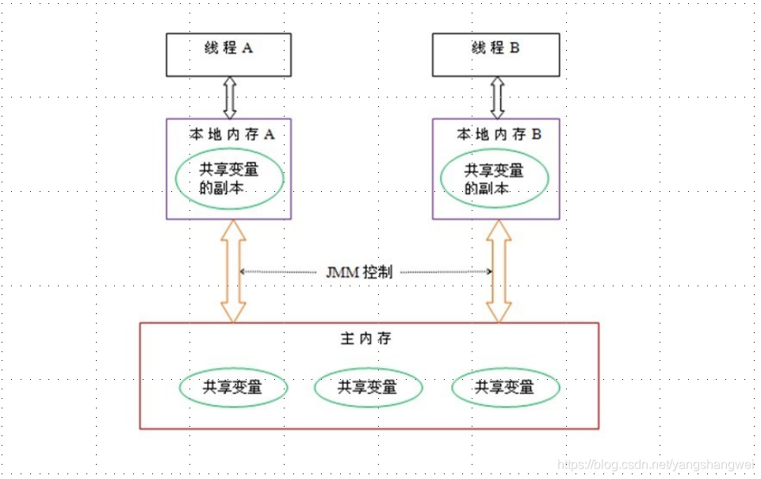
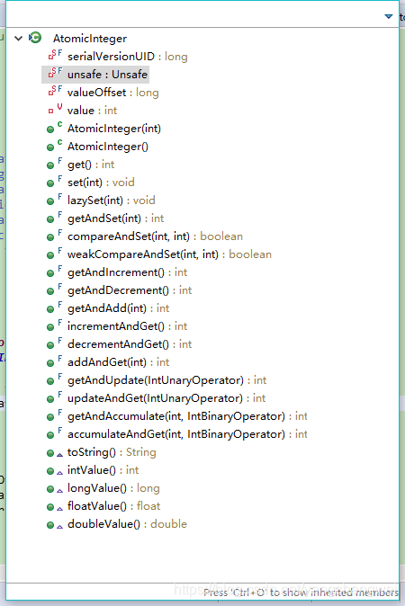
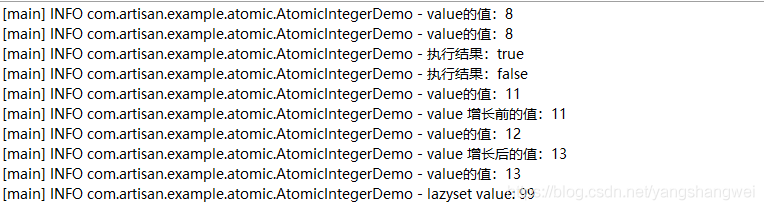
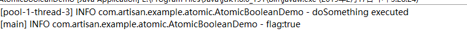
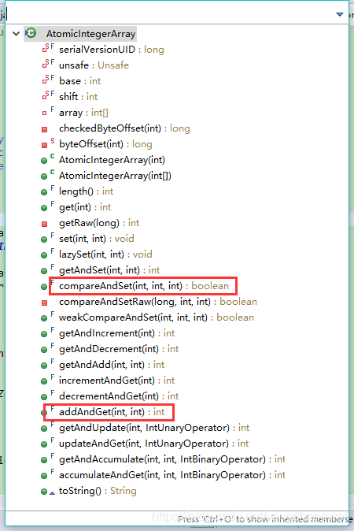
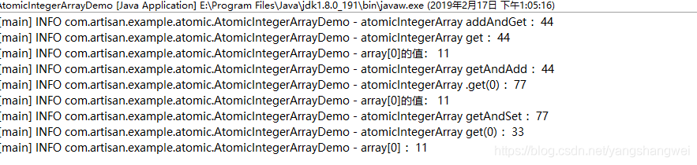
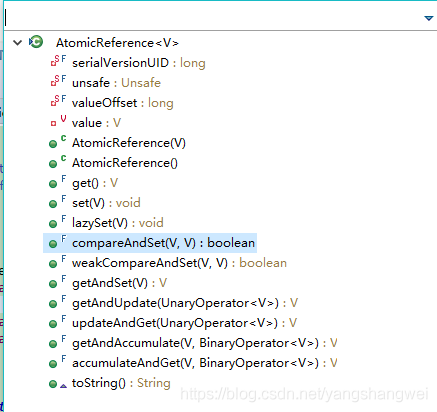
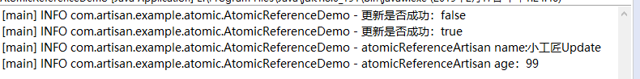
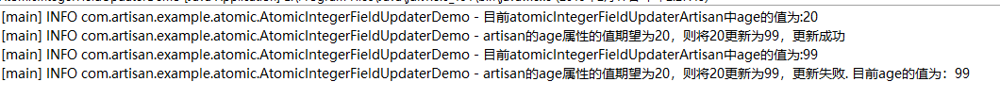

## 概述

在实际应用中，当我们更新一个变量时，在并发环境下，如果多个线程同时去更新这个变量，更新后的值可能不是我们期望的值。

如果理解Java内存模型 JMM的原理的话，上面这个结论就很容易理解了。可参考下前面写的这篇文章

 [并发编程-02并发基础CPU多级缓存和Java内存模型JMM](https://cloud.tencent.com/developer/tools/blog-entry?target=https%3A%2F%2Fblog.csdn.net%2Fyangshangwei%2Farticle%2Fdetails%2F87437146%23JAVA_JMM_78&objectId=1863185&objectType=1&isNewArticle=undefined)




举个例子：

 【**多线程场景**】假设有个变量a在主内存中的初始值为1，线程A和线程B同时从主内存中获取到了a的值，线程A更新a+1，线程B也更新a+1，经过线程AB更新之后可能a不等于3，而是等于2。因为A和B线程在更新变量a的时候从主内存中拿到的a都是1，而不是等A更新完刷新到主内存后，线程B再从主内存中取a的值去更新a，所以这就是线程不安全的更新操作.

解决办法

- **使用锁** 1. 使用**synchronized**关键字synchronized会保证同一时刻只有一个线程去更新变量. 2、**Lock**接口【篇幅原因先不讨论synchronized和lock，另开篇介绍】
- 使用JDK1.5开始提供的java.util.concurrent.**atomic**包，该包中的原子操作类提供了一种用法简单、性能高效、**线程安全地更新一个变量**的方式。

------

这里我们使用的JDK版本JDK8

------

## 原子更新基本类型

使用原子的方式更新基本类型，Atomic包提供了以下3个类。

- AtomicBoolean：原子更新布尔类型
- AtomicInteger：原子更新整型
- AtomicLong：原子更新长整型

以AtomicInteger为例看下JDK8源码中提供的方法




列举几个常用的方法：

- int addAndGet（int delta）：以原子方式将输入的数值与实例中的值（AtomicInteger里的 value）相加，并返回结果
- boolean compareAndSet（int expect，int update）：如果输入的数值等于预期值，则以原子方式将该值设置为输入的值
- int getAndIncrement()：以原子方式将当前值加1，注意，这里返回的是自增前的值
- int incrementAndGet()：以原子方式将当前值加1，注意，这里返回的是自增后的值
- void lazySet（int newValue）：最终会设置成newValue，使用lazySet设置值后，可能导致其他线程在之后的一小段时间内还是可以读到旧的值

### Demo


```javascript
package com.artisan.example.atomic;

import java.util.concurrent.atomic.AtomicInteger;

import lombok.extern.slf4j.Slf4j;

@Slf4j
public class AtomicIntegerDemo {
	
	// 实例化一个初始值为5的AtomicInteger
	private static AtomicInteger value = new AtomicInteger(5);
	
	public static void main(String[] args) {
		// 以原子方式将输入的数值与value 相加，并返回结果 
		log.info("value的值：{}" ,value.addAndGet(3));
		
		// 获取value的值
		log.info("value的值：{}",value.get());

		// 如果输入的数值等于预期值，则以原子方式将该值设置为输入的值
		log.info("执行结果：{}" ,value.compareAndSet(8, 11)); // 因为经过了addAndGet，操作之前value的值为8，这里会将value更新成11，返回true
		log.info("执行结果：{}" ,value.compareAndSet(5, 11)); // 因为经过了addAndGet，操作之前value的值为8，并不等于5，因此不会更新为11，返回false
		
		
		log.info("value的值：{}" ,value.get());
		
		
		log.info("value 增长前的值：{}",value.getAndIncrement());
		log.info("value的值：{}" ,value.get());
		
		log.info("value 增长后的值：{}",value.incrementAndGet());
		log.info("value的值：{}" ,value.get());
		
		
		//  最终会设置成newValue，使用lazySet设置值后，可能导致其他线程在之后的一小段时间内还是可以读到旧的值
		value.lazySet(99);
		log.info("lazyset value: {}",value.get());
		
	}
}
```

执行结果：




### AtomicBoolean 场景举例

假设流程中的某个方法只能执行一次初始化操作， 我们可以设置个flag, 使用AtomicBoolean去更新flag的值，执行方法前调用compareAndSet方法来判断如果该值为flase，更新为true，并执行该方法。 因为是线程安全的，所以后续的访问flag均为true,不满足if条件，所以均不会执行该方法

```java
package com.artisan.example.atomic;

import java.util.concurrent.CountDownLatch;
import java.util.concurrent.ExecutorService;
import java.util.concurrent.Executors;
import java.util.concurrent.Semaphore;
import java.util.concurrent.atomic.AtomicBoolean;

import lombok.extern.slf4j.Slf4j;

@Slf4j
public class AtomicBooleanDemo {
	
	//总请求数
	private static int clientTotal = 5000;
	// 同一时间允许执行的线程数
	private static int threadTotal = 200;
	
	// 标识  ，使用原子包中的AtomicBoolean  初始化为false
	private static AtomicBoolean atomicBooleanFlag = new AtomicBoolean(false);
	
	public static void main(String[] args) throws Exception {
		
		// 线程池
		ExecutorService executorService = Executors.newCachedThreadPool();
		
		// 信号量 同一时间允许threadTotal个请求同时执行 即初始化threadTotal个信号量
		Semaphore semaphore = new Semaphore(threadTotal);
		
		//定义clientTotal个线程需要执行完，主线程才能继续执行
		CountDownLatch countDownLatch = new CountDownLatch(clientTotal);
		
		// 循环
		for (int i = 0; i < clientTotal; i++) {
			executorService.execute(() ->{
				try {
					semaphore.acquire();
					doSomething();
					semaphore.release();
				} catch (InterruptedException e) {
					e.printStackTrace();
				}
				// 减一
				countDownLatch.countDown();
			});
		}
		
		// 当全部线程都调用了countDown方法，count的值等于0，然后主线程就能通过await()方法，恢复执行自己的任务。
		countDownLatch.await();
		// 关闭线程池
		executorService.shutdown();
		
		log.info("flag:{}" ,atomicBooleanFlag.get());
		
	}

	
	private static void doSomething() {
		// 如果flag为flase就将其设置为true
		if (atomicBooleanFlag.compareAndSet(false, true)) {
			log.info("doSomething executed");
		}
	}

}
```




## 原子更新数组

通过原子的方式更新数组里的某个元素，Atomic包提供了以下3个类。

- AtomicIntegerArray : 原子更新整型数组里的元素
- AtomicLongArray : 原子更新长整型数组里的元素
- AtomicReferenceArray : 原子更新引用类型数组里的元素

我们以AtomicIntegerArray为例来演示下用法




常用方法

- int addAndGet（int i，int delta）：以原子方式将输入值与数组中索引i的元素相加
- boolean compareAndSet（int i，int expect，int update）：如果当前值等于预期值，则以原子方式将数组位置i的元素设置成update值

### Demo


```javascript
package com.artisan.example.atomic;

import java.util.concurrent.atomic.AtomicIntegerArray;

import lombok.extern.slf4j.Slf4j;

@Slf4j
public class AtomicIntegerArrayDemo {

	private static int[] array = new int[] { 11, 22 };

	private static AtomicIntegerArray atomicIntegerArray = new AtomicIntegerArray(array);

	public static void main(String[] args) {

		// 给array[0]的值增加33 ，然后返回增长后的值 44
		log.info("atomicIntegerArray addAndGet ：{}", atomicIntegerArray.addAndGet(0, 33)); // 44
		// 输出 atomicIntegerArray中
		log.info("atomicIntegerArray get ：{}", atomicIntegerArray.get(0)); // 44

		// 数组value通过构造方法传递进去，然后AtomicIntegerArray会将当前数组 复制一份，
		// 所以当AtomicIntegerArray对内部的数组元素进行修改时，不会影响传入的数组
		log.info("array[0]的值： {}", array[0]); // 11

		// 先get 然后再add ,返回add之前的值
		log.info("atomicIntegerArray getAndAdd ：{}", atomicIntegerArray.getAndAdd(0, 33)); // 44
		log.info("atomicIntegerArray .get(0) ：{}", atomicIntegerArray.get(0)); // 44+33
		log.info("array[0]的值： {}", array[0]); // 11

		// 先get ,然后再set,返回set之前的数据
		log.info("atomicIntegerArray getAndSet ：{}", atomicIntegerArray.getAndSet(0, 33));// 77
		log.info("atomicIntegerArray get(0) ：{}", atomicIntegerArray.get(0)); // 33
		log.info("array[0] ：{}", array[0]); // 11 

	}

}
```



**数组value通过构造方法传递进去，然后AtomicIntegerArray会将当前数组复制一份，所以当AtomicIntegerArray对内部的数组元素进行修改时，不会影响传入的数组**

------

## 原子更新引用类型

原子更新基本类型的AtomicInteger，只能更新一个变量，如果要原子更新多个变量，就需要使用这个原子更新引用类型提供的类.

Atomic包提供了以下3个类

- AtomicReference：原子更新引用类型
- AtomicReferenceFieldUpdater：原子更新引用类型里的字段
- AtomicMarkableReference：原子更新带有标记位的引用类型。可以原子更新一个布尔类型的标记位和引用类型

以AtomicReference为例，来看下用法



### Demo


```javascript
package com.artisan.example.atomic;

import java.util.concurrent.atomic.AtomicReference;

import lombok.extern.slf4j.Slf4j;

@Slf4j
public class AtomicReferenceDemo {

	private static AtomicReference<Artisan> atomicReferenceArtisan = new AtomicReference<Artisan>();

	public static void main(String[] args) {

		Artisan expectedArtisan = new Artisan();
		expectedArtisan.setName("小工匠");
		expectedArtisan.setAge(20);

		// 将expectedArtisan设置到atomicReferenceArtisan
		atomicReferenceArtisan.set(expectedArtisan);

		Artisan updateArtisan = new Artisan();
		updateArtisan.setName("小工匠Update");
		updateArtisan.setAge(99);

		// compareAndSet方法进行原子更新操作,如果是expectedArtisan，则更新为updateArtisan

		boolean mark2 = atomicReferenceArtisan.compareAndSet(new Artisan(), updateArtisan);
		log.info("更新是否成功：{}", mark2);// false

		boolean mark = atomicReferenceArtisan.compareAndSet(expectedArtisan, updateArtisan);
		log.info("更新是否成功：{}", mark); // true

		log.info("atomicReferenceArtisan name:{}", atomicReferenceArtisan.get().getName());
		log.info("atomicReferenceArtisan age：{}", atomicReferenceArtisan.get().getAge());

	}

}
```

结果



## 原子更新字段类型

如果需原子地更新某个类里的某个字段时，就需要使用原子更新字段类.

Atomic包提供 了以下3个类进行原子字段更新

- AtomicIntegerFieldUpdater：原子更新整型的字段的更新器。
- AtomicLongFieldUpdater：原子更新长整型字段的更新器。
- AtomicStampedReference：原子更新带有版本号的引用类型。该类将整数值与引用关联起来，可用于原子的更新数据和数据的版本号，可以解决使用CAS进行原子更新时可能出现的ABA问题。

### 使用注意事项：

1. 第一：因为原子更新字段类都是抽象类，每次使用的时候必须使用静态方法newUpdater()创建一个更新器，并且需要设置想要更新的类和属性
2. 第二：更新类的字段（属性）必须使用public volatile修饰符

------

### Demo


```javascript
package com.artisan.example.atomic;

import java.util.concurrent.atomic.AtomicIntegerFieldUpdater;

import lombok.extern.slf4j.Slf4j;

@Slf4j
public class AtomicIntegerFieldUpdaterDemo {

	// 创建原子更新器，并设置需要更新的对象类和对象的属性
	private static AtomicIntegerFieldUpdater<Artisan2> atomicIntegerFieldUpdaterArtisan = AtomicIntegerFieldUpdater
			.newUpdater(Artisan2.class, "age");

	public static void main(String[] args) {
		Artisan2 artisan = new Artisan2();
		artisan.setAge(20);
		
		log.info("目前atomicIntegerFieldUpdaterArtisan中age的值为:{}",atomicIntegerFieldUpdaterArtisan.get(artisan));
		
		if (atomicIntegerFieldUpdaterArtisan.compareAndSet(artisan, 20, 99)) {
			log.info("artisan的age属性的值期望为20，则将20更新为99，更新成功");
		}
		
		// 获取artisan更新后的age的值
		log.info("目前atomicIntegerFieldUpdaterArtisan中age的值为:{}",atomicIntegerFieldUpdaterArtisan.get(artisan));
		
		
		if (atomicIntegerFieldUpdaterArtisan.compareAndSet(artisan, 20, 99)) {
			log.info("artisan的age属性的值期望为20，则将20更新为99，更新成功");
		}else {
			log.info("artisan的age属性的值期望为20，则将20更新为99，更新失败. 目前age的值为：{}",atomicIntegerFieldUpdaterArtisan.get(artisan));
		}
		
		
	}
}
```


```javascript
package com.artisan.example.atomic;

import lombok.Data;

@Data
public class Artisan2 {
	String name;
	public volatile int age;
}
```

结果：




## 原子类线程安全的原理

请参考上篇博客，主要是UnSafe 以及compareAndSwapInt ( CAS). 【**JDK8和8以前的实现方式略有不同**】

 [https://blog.csdn.net/yangshangwei/article/details/87489745#incrementAndGetUnSafe__compareAndSwapInt_CAS_54](https://cloud.tencent.com/developer/tools/blog-entry?target=https%3A%2F%2Fblog.csdn.net%2Fyangshangwei%2Farticle%2Fdetails%2F87489745%23incrementAndGetUnSafe%5C_%5C_compareAndSwapInt%5C_CAS%5C_54&objectId=1863185&objectType=1&isNewArticle=undefined)

------


## 代码

[https://github.com/yangshangwei/ConcurrencyMaster](https://cloud.tencent.com/developer/tools/blog-entry?target=https%3A%2F%2Fgithub.com%2Fyangshangwei%2FConcurrencyMaster&objectId=1863185&objectType=1&isNewArticle=undefined)