## 概述

举个例子：

 【多线程场景】假设有个变量a在主内存中的初始值为1，线程A和线程B同时从主内存中获取到了a的值，线程A更新a+1，线程B也更新a+1，经过线程AB更新之后可能a不等于3，而是等于2。因为A和B线程在更新变量a的时候从主内存中拿到的a都是1，而不是等A更新完刷新到主内存后，线程B再从主内存中取a的值去更新a，所以这就是线程不安全的更新操作.

解决办法

- **使用锁** 1. 使用**synchronized**关键字synchronized会保证同一时刻只有一个线程去更新变量. 2、Lock接口 【篇幅原因先不讨论lock，另开篇介绍】。
- 使用JDK1.5开始提供的java.util.concurrent.atomic包，见 [并发编程-04线程安全性之原子性Atomic包详解](https://cloud.tencent.com/developer/article/1863185?from_column=20421&from=20421)

------

先简单说下synchronized和lock

- synchronized 依赖jvm
- lock 依赖特殊的cpu指令，代码实现，比如ReentranLock

这里我们重点来看下synchronized关键字是如何确保线程安全的原子性的。

------

## 原子性synchronized 修饰的4种对象

- 修饰代码块
- 修饰方法
- 修饰静态方法
- 修饰类

------

### 修饰代码块

#### 作用范围及作用对象

 被修饰的代码被称为同步语句块，作用范围为大括号括起来的代码，**作用于调用的对象**， 如果是不同的对象，则互不影响

#### Demo

##### 多线程下 同一对象的调用


```javascript
package com.artisan.example.sync;

import java.util.concurrent.ExecutorService;
import java.util.concurrent.Executors;

import lombok.extern.slf4j.Slf4j;

@Slf4j
public class SynchronizedDemo {
	
	public void test() {
		// 修饰代码块 ，谁调用该方法synchronized就对谁起作用   即作用于调用的对象 。 如果是不同的对象，则互不影响
		synchronized (this) {
			for (int i = 0; i < 10; i++) {
				log.info("修饰代码块 i = {} ",i);
			}
		}
	}
	
	public static void main(String[] args) {
		// 同一个调用对象
		SynchronizedDemo synchronizedDemo = new SynchronizedDemo();
		ExecutorService executorService = Executors.newCachedThreadPool();
		// 启动两个线程去 【使用同一个对象synchronizedDemo】调用test方法 
		for (int i = 0; i < 2; i++) {
			executorService.execute(() ->{
				synchronizedDemo.test();
			});
		}
		
 //     使用Thread  可以按照下面的方式写	
//		for (int i = 0; i < 2; i++) {
//			new Thread(()-> {
//				synchronizedDemo.test2();
//			}).start();
//		}
		
		
		// 最后 关闭线程池
		executorService.shutdown();
	}
}
```

我们先思考下执行的结果是什么样子的？

上述代码，我们通过线程池，通过循环开启了2个线程去调用含有同步代码块的test方法 , 我们知道 使用synchronized关键字修饰的代码块作用的对象是调用的对象（同一个对象）。 因此这里的两个线程都拥有同一个对象synchronizedDemo的引用，两个线程，我们命名为线程A 线程B。 当线程A调用到了test方法，因为有synchronized关键字的存在，线程B只能等待线程A执行完。 因此A会输出0~9，线程A执行完之后，A释放锁，线程Bh获取到锁后，继续执行。

实际执行结果：

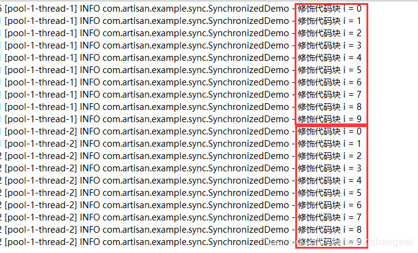

符合我们分析和预测。

如果我们把 test 方法的synchronized关键字去掉会怎样呢？ 来看下

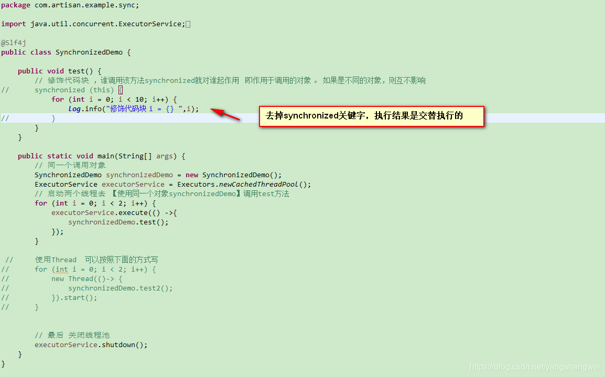

 执行结果

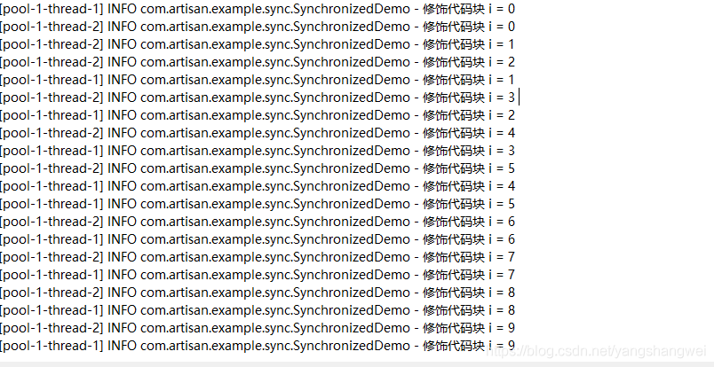


可知，**synchronized关键字修饰的代码块，确保了同一调用对象在多线程的情况下的执行顺序**。

------

##### 多线程下不同对象的调用

为了更好地区分，我们给调用方法加个参数


```javascript
package com.artisan.example.sync;

import java.util.concurrent.ExecutorService;
import java.util.concurrent.Executors;

import lombok.extern.slf4j.Slf4j;

@Slf4j
public class SynchronizedDemo {

	public void test(String flag) {
		// 修饰代码块 ，谁调用该方法synchronized就对谁起作用 即作用于调用的对象 。 如果是不同的对象，则互不影响
		synchronized (this) {
			for (int i = 0; i < 10; i++) {
				log.info("{} 调用 修饰代码块 i = {} ",flag ,i);
			}
		}
	}
	
	public static void main(String[] args) {
		
		ExecutorService executorService = Executors.newCachedThreadPool();

		
		// 对象 synchronizedDemo
		SynchronizedDemo synchronizedDemo = new SynchronizedDemo();
		
		// 对象 synchronizedDemo2
		SynchronizedDemo synchronizedDemo2 = new SynchronizedDemo();

		// synchronizedDemo 调用 test
		executorService.execute(()->{
			synchronizedDemo.test("synchronizedDemo");
		});
		
		// synchronizedDemo2 调用 test
		executorService.execute(()->{
			synchronizedDemo2.test("synchronizedDemo2");
		});
		
		// 最后 关闭线程池
		executorService.shutdown();
	}
}
```

先来猜测下执行结果呢？

  两个不同的对象，调用test方法，应该是互不影响的，所以执行顺序是交替执行的。

运行结果：

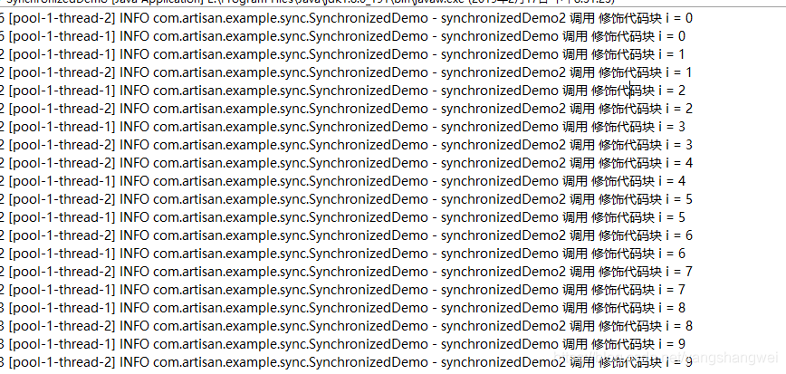


### 修饰方法

 被修饰的方法称为同步方法，作用的范围是整个方法，**作用于调用的对象**， 如果是不同的对象，则互不影响

#### 作用范围及作用对象

同 修饰代码块

#### Demo

增加个方法 test2


```javascript
	// 修饰方法 谁调用该方法synchronized就对谁起作用 即作用于调用的对象 。 如果是不同的对象，则互不影响
	public synchronized void test2() {
		// 修饰代码块 ，
		for (int i = 0; i < 10; i++) {
			log.info("调用 修饰代码块 i = {} ",  i);
		}
	}
```

------

##### 多线程下同一个对象的调用

同 修饰代码块


 结果：

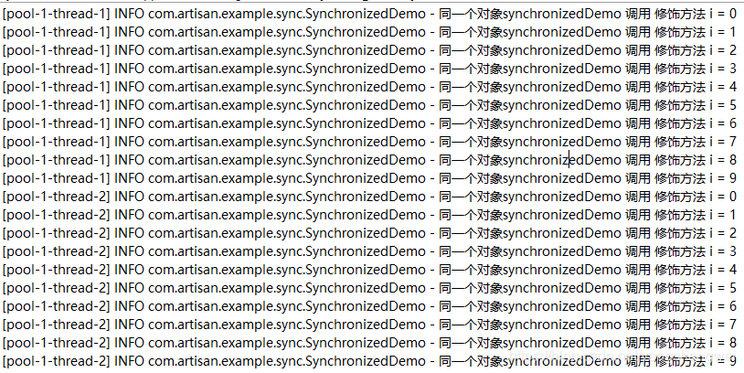


##### 多线程下不同对象的调用

同 修饰代码块

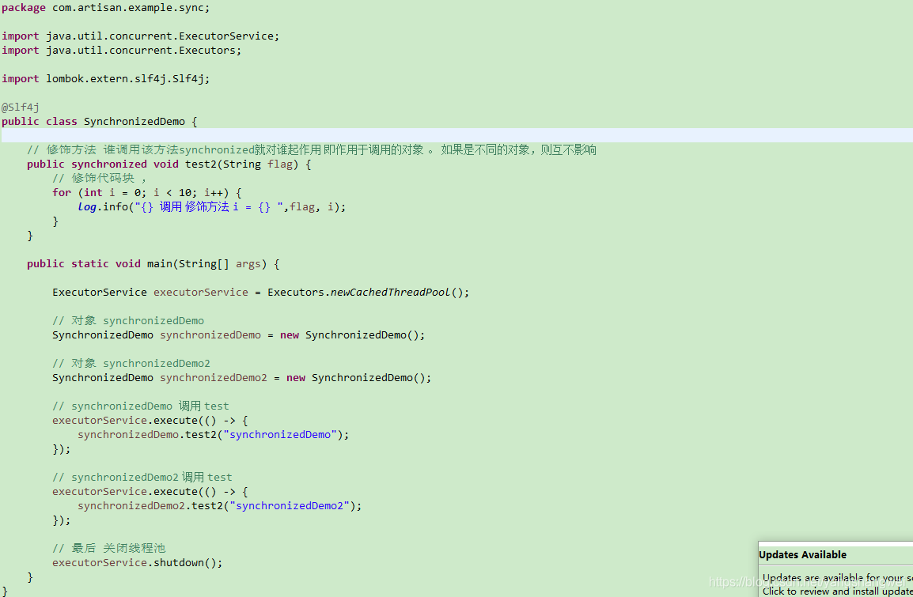

 结果：

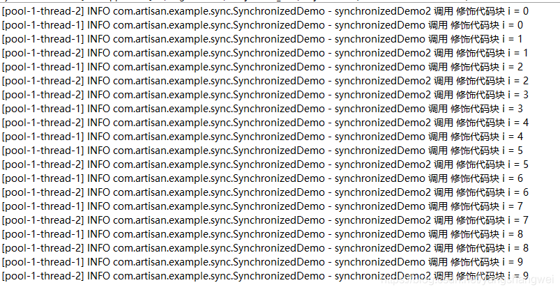


通过上面的测试结论可以知道 修饰代码块和修饰方法

  如果一个方法内部是一个**完整的synchronized代码**块，那么效果和synchronized修饰的方法效果是等同的 。

 还有一点需要注意的是，如果父类的某个方法是synchronized修饰的，子类再调用该方法时，是不包含synchronized. 因为synchronized不属于方法声明的一部分。 如果子类想使用synchronized的话，需要在方法上显示的声明其方法为synchronized

------

### 修饰静态方法

#### 作用范围及作用对象

 整个静态方法， **作用于所有对象**

------

#### Demo

##### 多线程同一个对象的调用


```javascript
package com.artisan.example.sync;

import java.util.concurrent.ExecutorService;
import java.util.concurrent.Executors;

import lombok.extern.slf4j.Slf4j;

@Slf4j
public class SynchronizedStaticMethodDemo {

	// 修饰静态方法
	public synchronized static void test() {
		for (int i = 0; i < 10; i++) {
			log.info("调用 修饰方法 i = {} ", i);
		}
	}

	public static void main(String[] args) {

		ExecutorService executorService = Executors.newCachedThreadPool();
		
		for (int i = 0; i < 2; i++) {
			executorService.execute(() ->{
				test();
			});
		}
	

		// 最后 关闭线程池
		executorService.shutdown();
	}
}
```

结果：

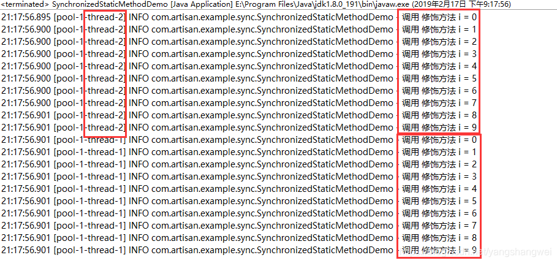


##### 多线程下不同对象的调用


```javascript
package com.artisan.example.sync;

import java.util.concurrent.ExecutorService;
import java.util.concurrent.Executors;

import lombok.extern.slf4j.Slf4j;

@Slf4j
public class SynchronizedStaticMethodDemo {

	// 修饰静态方法
	public synchronized static void test() {
		for (int i = 0; i < 10; i++) {
			log.info("调用 修饰方法 i = {} ", i);
		}
	}

	public static void main(String[] args) {

		ExecutorService executorService = Executors.newCachedThreadPool();
		
		SynchronizedStaticMethodDemo demo1 = new SynchronizedStaticMethodDemo();
		SynchronizedStaticMethodDemo demo2 = new SynchronizedStaticMethodDemo();
		
		// demo1调用
		executorService.execute(() ->{
			// 其实直接调用test方法即可，这里仅仅是为了演示不同对象调用 静态同步方法
			demo1.test();
		});
		
		// demo2调用
		executorService.execute(() ->{
			// 其实直接调用test方法即可，这里仅仅是为了演示不同对象调用 静态同步方法
			demo2.test();
		});
		
		// 最后 关闭线程池
		executorService.shutdown();
	}
}
```

结果：

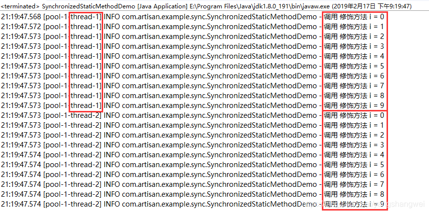


### 修饰类

#### 作用范围及作用对象

修饰范围是synchronized括号括起来的部分，**作用于所有对象**

------

#### Demo

##### 多线程下同一对象的调用


```javascript
package com.artisan.example.sync;

import java.util.concurrent.ExecutorService;
import java.util.concurrent.Executors;

import lombok.extern.slf4j.Slf4j;

@Slf4j
public class SynchronizedStaticClassDemo2 {

	// 修饰一个类
	public  void test() {
		synchronized (SynchronizedStaticClassDemo2.class) {
			for (int i = 0; i < 10; i++) {
				log.info("调用 修饰方法 i = {} ", i);
			}
		}
	}

	public static void main(String[] args) {

		ExecutorService executorService = Executors.newCachedThreadPool();
		
		SynchronizedStaticClassDemo2 demo = new SynchronizedStaticClassDemo2();
		
		// demo调用
		executorService.execute(() ->{
			demo.test();
		});
		
		// demo调用
		executorService.execute(() ->{
			demo.test();
		});
		
		// 最后 关闭线程池
		executorService.shutdown();
	}
}
```

结果

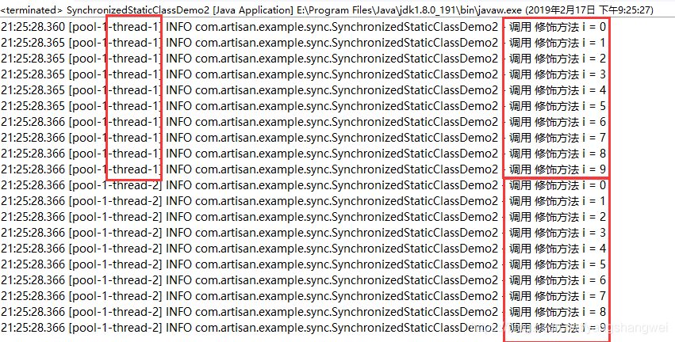


##### 多线程下不同对象的调用


```javascript
package com.artisan.example.sync;

import java.util.concurrent.ExecutorService;
import java.util.concurrent.Executors;

import lombok.extern.slf4j.Slf4j;

@Slf4j
public class SynchronizedStaticClassDemo2 {

	// 修饰一个类
	public  void test() {
		synchronized (SynchronizedStaticClassDemo2.class) {
			for (int i = 0; i < 10; i++) {
				log.info("调用 修饰方法 i = {} ", i);
			}
		}
	}

	public static void main(String[] args) {

		ExecutorService executorService = Executors.newCachedThreadPool();
		
		SynchronizedStaticClassDemo2 demo1 = new SynchronizedStaticClassDemo2();
		SynchronizedStaticClassDemo2 demo2 = new SynchronizedStaticClassDemo2();
		
		// demo1调用
		executorService.execute(() ->{
			demo1.test();
		});
		
		// demo2调用
		executorService.execute(() ->{
			demo2.test();
		});
		
		// 最后 关闭线程池
		executorService.shutdown();
	}
}
```

结果

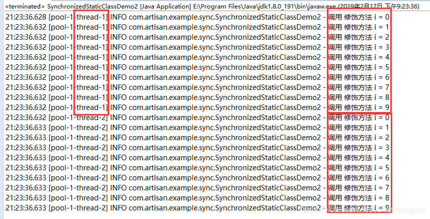

## 使用Synchronized来保证线程安全

先回顾下 线程不安全的写法

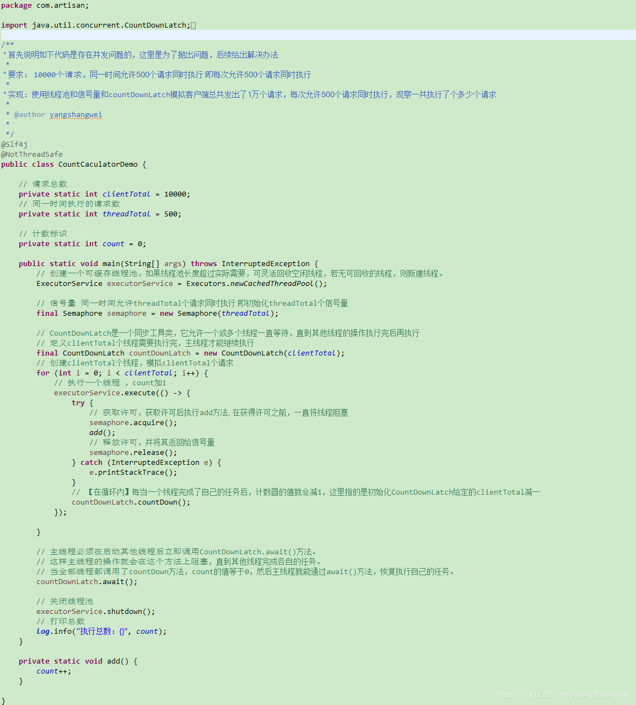

### 方法一

下面用Synchronized来改造下

 我们知道synchronized修饰静态方法，作用的对象是所有对象 ， 因此 仅需要将 静态add方法 修改为同步静态方法即可。

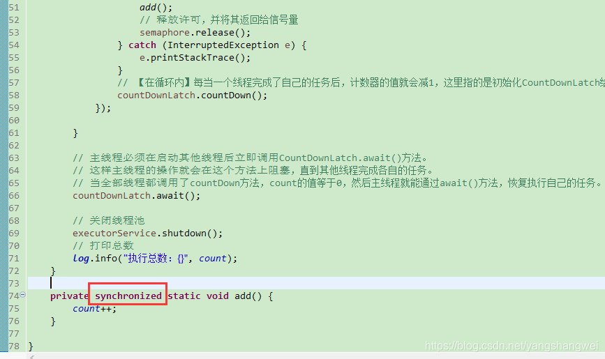

多次运算

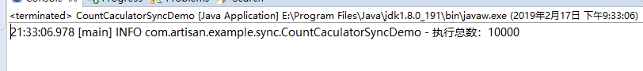

### 方法二

假设 add方法不是静态方法呢？ 我们知道 当synchronized修饰普通方法，只要是同一个对象，也能保证其原子性

假设 add方法为普通方法


改造如下：

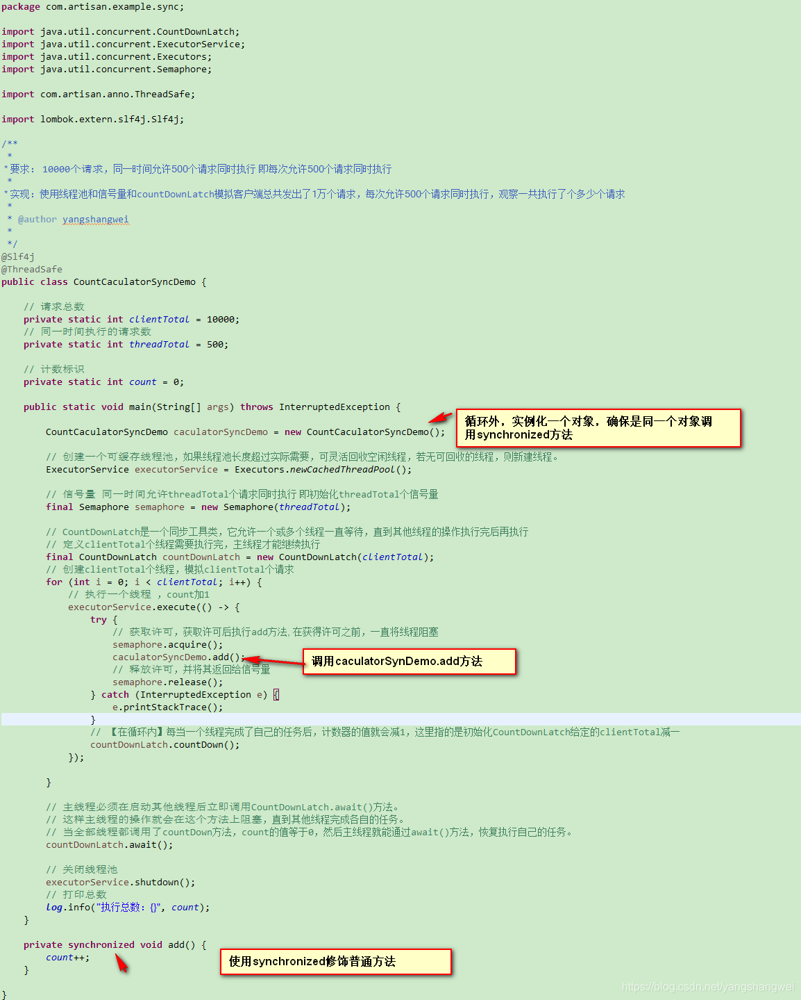

多次运行，结果总是10000


## 原子性的实现方式小结

- synchronized 不可中断锁，适合不激烈的竞争，可读性较好
- atomic包 竞争激烈时能维持常态，比Lock性能好，但只能同步一个值
- lock 可中断锁，多样化同步，竞争激烈时能维持常态。后面针对lock单独展开。

------

## 代码

[https://github.com/yangshangwei/ConcurrencyMaster](https://cloud.tencent.com/developer/tools/blog-entry?target=https%3A%2F%2Fgithub.com%2Fyangshangwei%2FConcurrencyMaster&objectId=1863188&objectType=1&isNewArticle=undefined)