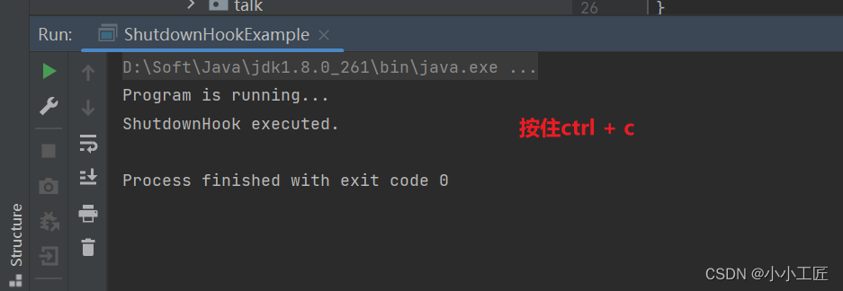
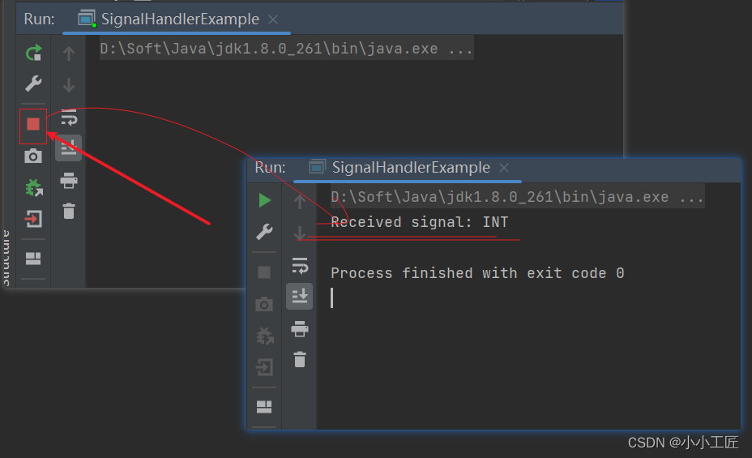

# 探究Java优雅退出的两种机制

## 概述

在Linux上通过`kill -9 pid`方式强制终止进程的副作用，这种方式虽然简单高效，但也会带来一些问题，特别是对于应用软件而言。这些问题包括但不限于：

1.  数据丢失：由于缓存中的数据尚未持久化到磁盘中，强制终止进程可能导致数据丢失，尤其是对于[数据库](https://cloud.tencent.com/product/tencentdb-catalog?from_column=20065&from=20065)等需要持久化数据的应用。 
2.  文件损坏：如果进程正在进行文件写操作，但尚未完成，突然退出可能导致文件损坏，进而影响数据完整性。 
3.  请求丢失：如果线程的[消息队列](https://cloud.tencent.com/product/message-queue-catalog?from_column=20065&from=20065)中有未处理的请求消息，强制终止进程可能导致请求消息丢失，进而影响系统的正常运行。 
4.  应答消息未返回：如果数据库操作已经完成，但应答消息尚未返回给客户端，强制终止进程可能导致客户端等待超时，带来重复更新等问题。 
5.  句柄资源未释放：强制终止进程可能导致句柄资源没有及时释放，从而影响系统的性能和稳定性。

综上所述，虽然强制终止进程是一种简单高效的方式，但在实际应用中需要谨慎使用，尤其是对于需要保证数据完整性和系统稳定性的应用场景，建议使用更加安全可靠的方式来终止进程，比如通过正常的关闭流程来释放资源和保证数据一致性。

### Java优雅停机_ ShutdownHook 机制

Java的优雅停机通常通过注册JDK的`ShutdownHook`来实现，当系统接收到退出指令时，首先标记系统处于退出状态，不再接收新的消息，然后将积压的消息处理完，最后调用资源回收接口将资源销毁，各线程退出执行。

Java的`ShutdownHook`（关闭钩子）是一种机制，允许开发人员在Java虚拟机（JVM）即将关闭时执行一些特定的代码。

这些代码通常用于释放资源、保存状态或执行清理操作，以确保应用程序在退出时能够完成一些必要的步骤。

`ShutdownHook`提供了一种优雅退出的机制，使得应用程序可以在正常关闭时执行一些清理工作，而不会因为突然的中断而丢失数据或状态。

#### 步骤

1.  **注册ShutdownHook：** 在Java中，可以通过`Runtime`类的`addShutdownHook(Thread hook)`方法来注册`ShutdownHook`。注册的`ShutdownHook`是一个线程对象，当JVM即将关闭时，会依次执行这些线程对象的代码。 

2. 执行时机：

   ```
   ShutdownHook
   ```

   在以下情况下会被执行： 

   - 程序正常退出（调用`System.exit(int status)`方法）
   - 用户按下Ctrl+C终止程序
   - 操作系统关闭
   - JVM崩溃

3.  **执行顺序：** 注册的`ShutdownHook`会按照注册的顺序依次执行。但是不能保证所有的`ShutdownHook`都会被执行，因为在某些情况下，比如JVM崩溃，`kill -9`可能无法正常执行`ShutdownHook`。 

4. 注意事项：

   - `ShutdownHook`应该尽量保持简单和快速执行，不应该执行过多的操作或者占用太多的时间。
   - 不建议在`ShutdownHook`中执行一些需要等待的操作，比如等待网络连接、等待I/O操作完成等，因为在JVM关闭时时间是有限的，不能保证这些操作能够正常完成。

#### Code

```java
package com.artisan.nettycase.a01exist;

/**
 * @author 小工匠
 * @version 1.0
 * @mark: show me the code , change the world
 */
public class ShutdownHookExample {

    public static void main(String[] args) {
        Runtime.getRuntime().addShutdownHook(new Thread(() -> {
            System.out.println("ShutdownHook executed.");
            // 在这里执行清理操作或者释放资源的代码
        }));

        // 程序正常执行
        System.out.println("Program is running...");

        // 模拟程序执行
        try {
            Thread.sleep(5000);
        } catch (InterruptedException e) {
            e.printStackTrace();
        }

        System.exit(-1);
    }
}
```

当程序执行到`System.exit(int status)`或者不写`System.exit(int status)`手工按下Ctrl+C终止程序时，注册的`ShutdownHook`会被执行，输出"ShutdownHook executed."的信息。



### Java优雅停机_ 信号量机制

除了注册ShutdownHook，还可以通过监听信号量并注册SignalHandler 的方式实现优雅退出。

这种方式通常用于在Unix/Linux系统上，通过捕获特定的信号来执行一些清理操作。Java提供了`sun.misc.Signal`和`sun.misc.SignalHandler`类来支持这种方式。

#### SignalHandler 工作原理

SignalHandler的工作原理是通过Java的本地方法接口（JNI）与底层操作系统交互来实现的。具体来说，SignalHandler在Java中是一个接口，它由`sun.misc`包下的Java类提供。当注册了SignalHandler之后，Java程序会通过JNI调用底层操作系统提供的信号处理函数，将Java程序的信号处理器与操作系统的信号处理机制关联起来。

具体步骤如下：

1.  **注册SignalHandler：** Java程序调用`sun.misc.Signal.handle(Signal signal, SignalHandler handler)`方法注册SignalHandler，将信号对象和信号处理器对象关联起来。 
2.  **JNI调用：** JVM通过JNI调用底层操作系统提供的信号处理函数，将Java程序中注册的SignalHandler传递给操作系统。 
3.  **信号处理函数：** 底层操作系统收到相应的信号（比如Ctrl+C中断信号），会调用注册的信号处理函数。 
4.  **调用Java程序中的信号处理器：** 信号处理函数在收到信号后会调用Java程序中注册的信号处理器，执行相应的处理逻辑。 
5.  **执行清理操作：** Java程序中的信号处理器执行相应的清理操作或释放资源的代码。 

总的来说，SignalHandler的工作原理是通过JNI接口与底层操作系统交互，将Java程序中的信号处理器与操作系统的信号处理机制连接起来，实现了对特定信号的监听和处理。

#### 使用步骤

通过监听信号量并注册SignalHandler的方式实现优雅退出的步骤如下：

1.  **创建SignalHandler对象：** 首先，需要创建一个实现了`sun.misc.SignalHandler`接口的信号处理器对象。这个对象将负责处理接收到的信号。 
2.  **实现handle方法：** 在SignalHandler对象中实现`handle(Signal signal)`方法，该方法定义了接收到信号时需要执行的操作。在这个方法中，你可以执行一些清理操作、释放资源等。 
3.  **创建Signal对象：** 使用`sun.misc.Signal`类创建信号对象，指定要监听的信号名称。 
4.  **注册SignalHandler：** 调用`sun.misc.Signal`的`handle(Signal signal, SignalHandler handler)`方法注册信号处理器，将信号对象和信号处理器对象关联起来。 
5.  **监听信号：** 通过监听信号对象，等待接收信号。 

#### Linux支持的信号量

| 信号名称 | 作用                                   |
| :------- | :------------------------------------- |
| SIGKILL  | 终止进程，强制杀死进程                 |
| SIGTERM  | 终止进程，软件终止信号                 |
| SIGTSTP  | 停止进程，终端来的停止信号             |
| SIGUSR1  | 终止进程，用户定义信号1                |
| SIGUSR2  | 终止进程，用户定义信号2                |
| SIGINT   | 终止进程，中断进程                     |
| SIGQUIT  | 建立core文件终止进程，并且生成core文件 |

#### 根据操作系统选择信号量

```java
String signalName = System.getProperties().getProperty("os.name")
        .toLowerCase().startsWith("win") ? "INT" : "TERM";

// 使用signalName来处理信号
if (signalName.equals("INT")) {
    // Windows操作系统，选择SIGINT信号
    // 执行SIGINT信号的处理逻辑
} else {
    // 非Windows操作系统，选择SIGTERM信号
    // 执行SIGTERM信号的处理逻辑
}
```

根据这段代码，如果是Windows操作系统，则选择`SIGINT`信号，用于接收`Ctrl+C`中断的指令；如果不是Windows操作系统，则选择`SIGTERM`信号，用于接收`kill pid`指令。

#### Code

演示如何通过监听信号量并注册SignalHandler实现优雅退出 。

```java
 package com.artisan.nettycase.a01exist;

import sun.misc.Signal;
import sun.misc.SignalHandler;

/**
 * @author 小工匠
 * @version 1.0
 * @mark: show me the code , change the world
 */

public class SignalHandlerExample {
    public static void main(String[] args) {
        SignalHandler handler = new SignalHandler() {
            @Override
            public void handle(Signal signal) {
                System.out.println("Received signal: " + signal.getName());
                // 在这里执行清理操作或者释放资源的代码
                // 正常退出程序
                System.exit(0); 
            }
        };

        String sig = System.getProperties().getProperty("os.name").toLowerCase().startsWith("win") ? "INT" : "TERM";

        // 注册SIGINT信号处理器
        Signal.handle(new Signal(sig), handler);


        // 模拟程序执行
        while (true) {
            // 在这里执行业务逻辑
            try {
                Thread.sleep(1000); // 模拟程序执行
            } catch (InterruptedException e) {
                e.printStackTrace();
            }
        }
    }
}
```

在上述示例中，创建了一个SignalHandler对象来处理`SIGINT`或者`SIGTERM`信号，当接收到这些信号时，会执行`handle(Signal signal)`方法中的清理操作，并正常退出程序。通过调用`Signal.handle(Signal signal, SignalHandler handler)`方法来注册信号处理器。



### 注意事项

使用Java的ShutdownHook（注册在JVM层面的钩子）进行应用的优雅退出时，有几个重要的注意事项：

1.  **ShutdownHook的执行不确定性**：ShutdownHook并非在所有情况下都会被JVM执行。例如，如果JVM因为某种错误而崩溃，或者接收到某些信号量（如`SIGKILL`），又或者尝试去杀掉一个不存在的进程（`kill -9 pid`），ShutdownHook可能不会被执行。因此，不应依赖ShutdownHook来确保某些资源的绝对释放，特别是对于那些对系统稳定性至关重要的资源。 
2.  **ShutdownHook的执行顺序**：JVM不保证ShutdownHook的执行顺序，如果在一个应用中注册了多个ShutdownHook，它们可能不会按照添加的顺序执行，因此不应该在ShutdownHook中依赖于这个顺序来处理资源。 
3.  **动态添加或移除ShutdownHook的限制**：在JVM关闭期间，不能再动态地添加或移除ShutdownHook。因此，所有的Hook必须在JVM启动时就已经设置好。 
4.  **避免在ShutdownHook中调用`System.exit()`**：如果在ShutdownHook中调用`System.exit()`，会导致当前的JVM进程卡住，无法正常退出。这是因为`System.exit()`会触发终结器（Terminator）进程，这是一个操作系统级别的操作，它会等待当前进程中的所有线程都结束之后，才会释放资源并退出进程。因此，如果在ShutdownHook中调用`System.exit()`，会导致资源无法正确释放，从而可能引发资源泄漏。 
5.  对于采用注册SignalHandler实现优雅退出的程序，在handle接口中一定要避免阻塞操作，否则它会导致已经注册的ShutdownHook无法执行，系统也无法退出 。 

综上所述，ShutdownHook是一个很有用的特性，但是使用时需要谨慎，主要是为了确保资源的正确释放和应用程序的优雅退出。不过，对于那些特别关键的资源，最好还是有其他更可靠的机制来确保它们在JVM终止之前被正确释放。