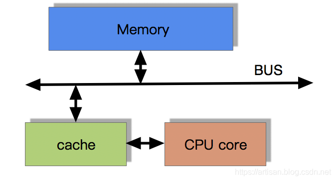
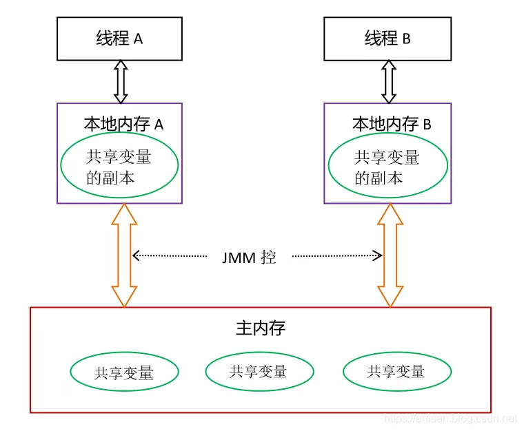
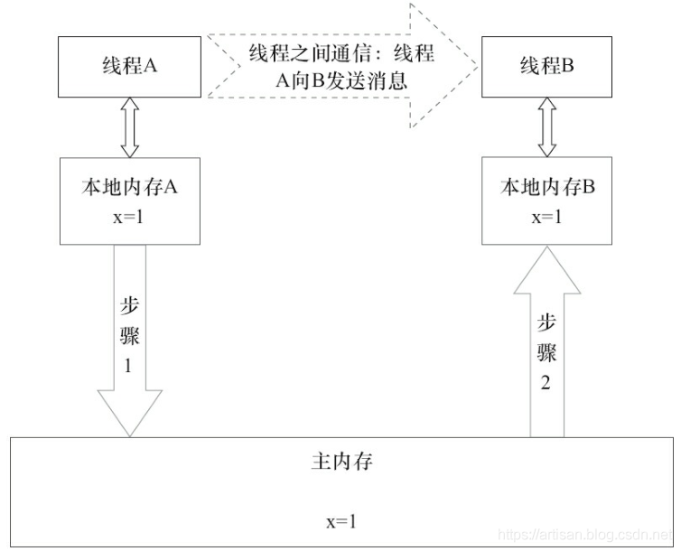
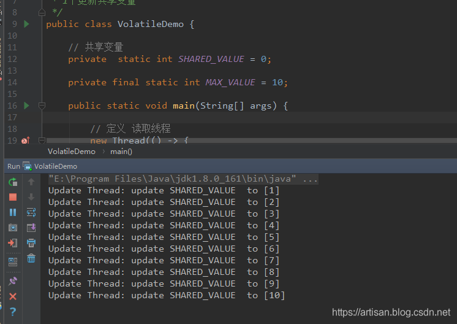

## 概述

在多线程并发编程中synchronized和volatile都扮演着重要的角色。 volatile是轻量级的 synchronized，它在高并发中保证了共享变量的“**可见性**”。

那什么是可见性呢？

**可见性** 我们可以理解为：**当一个线修改一个共享变量时，另外一个线程能读到这个修改的值。**

如果volatile变量修饰符使用恰的话，它比synchronized的使用和执行成本更低，因为volatile不会引起线程上下文的切换和调度

------

## volatile定义

Java规范第3版中对volatile的定义如下：Java允许线程访问共享变量，为了确保共享变量能被准确和一致地更新，线程应该确保通过排他锁单独获得这个变量。

Java提供了volatile关键字，在某些场景下volatile比锁synchronized要更加方便。如果一个字段被声明成volatile，Java线程内存模型(JMM)确保所有线程看到这个变量的值是一致的 .

------

## CPU缓存

### 相关CPU术语

了解volatile实现原理之前，先了解下与其实现原理相关的CPU术语

| 术语       | 英文                 | 说明                                                         |
| :--------- | :------------------- | :----------------------------------------------------------- |
| 内存屏障   | memory barriers      | 一组处理器指令，用于实现对内存操作的顺序限制                 |
| 缓冲行     | cache line           | 缓存中可以分配的最小存储单位。处理器填写缓存线时会加载整个缓存线，需要使用多个主内存读周期； |
| 原子操作   | atomic operations    | 不可中断的一个或一系列的操作                                 |
| 缓存行填充 | cache line fill      | 当处理器识别到从内存中读取操作数是可缓存的，处理器读取整个缓存行到适当的缓存； |
| 缓存命中   | cache hit            | 如果进行高速缓存行填充操作的内存位置仍然是下次处理器访问的地址时，处理器从缓存中读取操作数，而不是从内存中读取； |
| 写命中     | write hit            | 当处理器操作数写回到一个内存缓存的区域时，它首先会检查这个缓存的内存地址是否在缓存行中，如果存在一个有效的缓存行，则处理器将这个操作数写回到缓存，而不是写回到内存，这个操作被称为写命中； |
| 写缺失     | write miss the cache | 一个有效的缓存行被写入到不存在的内存区域。                   |

------

### [CPU缓存一致性协议MESI](https://cloud.tencent.com/developer/tools/blog-entry?target=https%3A%2F%2Fwww.cnblogs.com%2Fyanlong300%2Fp%2F8986041.html&objectId=1862628&objectType=1&isNewArticle=undefined)

CPU缓存一致性协议MESI 请参考： [CPU缓存一致性协议MESI](https://cloud.tencent.com/developer/tools/blog-entry?target=https%3A%2F%2Fwww.cnblogs.com%2Fyanlong300%2Fp%2F8986041.html&objectId=1862628&objectType=1&isNewArticle=undefined)

【M 修改 (Modified) E 独享、互斥 (Exclusive) S 共享 (Shared) I 无效 (Invalid) 】

------

CPU的发展速度非常快，而内存和硬盘的发展速度远远不及CPU。这就造成了高性能能的内存和硬盘价格及其昂贵。然而CPU的高度运算需要高速的数据。为了解决这个问题，CPU厂商在CPU中内置了少量的高速缓存以解决I\O速度和CPU运算速度之间的不匹配问题


为了提高效率，CPU不直接和内存进行通信，而是先将系统内存的数据读取到内部缓存（L1、L2或其他）后再进行操作。

但是有个问题： 当操作完成后，被修改的数据何时回写到主内存呢？

假设某个共享变量声明了volatile关键字进行**写操作** ，JVM就会向处理器发送一条Lock前缀指令，将这个变量所在缓存行的数据写回到系统内存。

OK，就算写回到内存，如果其他处理器缓存的值还是旧的，再执行计算操作就会有问题。

所以，在多处理器下，为了保证各个处理器的缓存是一致的，就要实现**缓存一致性协议** ，每个处理器通过嗅探在总线（BUS）上传播的数据来检查自己缓存的值是不是过期了

- 当处理器发现自己缓存行对应的内存地址被修改，就会将当前处理器的缓存行设置成无效状态，
- 当处理器对这个数据进行修改操作的时候，会重新从系统内存中把数据读到处理器缓存

------

### 带有高速缓存的CPU执行计算的流程

1. 程序以及数据被加载到主内存
2. 指令和数据被加载到CPU的高速缓存
3. CPU执行指令，把结果写到高速缓存
4. 高速缓存中的数据写回主内存



### CPU 多级的缓存结构

由于CPU的运算速度超越了1级缓存的数据I\O能力，CPU厂商又引入了多级的缓存结构。


L1/L2/L3 Cache速度差别

>  L1 cache: 3 cycles L2 cache: 11 cycles L3 cache: 25 cycles Main Memory: 100 cycles 

通常L1 Cache离CPU核心需要数据的地方更近，而L2 Cache则处于边缓位置，访问数据时，L2 Cache需要通过更远的铜线，甚至更多的电路，从而增加了延时。

参见： [细说Cache-L1/L2/L3/TLB](https://cloud.tencent.com/developer/tools/blog-entry?target=https%3A%2F%2Fzhuanlan.zhihu.com%2Fp%2F31875174&objectId=1862628&objectType=1&isNewArticle=undefined)

------

## Java 内存模型 （JMM）

### 线程通信的两种方式

我们知道 线程间的通信，主要分为两种方式

1. 共享内存 (线程之间**共享程序的公共状态**，通过写-读内存中的公共状态进行隐式通信)
2. 消息传递 (线程之间必须通过发送消息来显式进行通信)

------

### 哪些变量可以共享

Java的并发采用的是共享内存模型 ， 在Java中，**所有实例域、静态域和数组元素都存储在堆内存中，堆内存在线程之间共享** ，我们使用”共享变量”这个术语代指实例域，静态域和数组元素

局部变量，方法定义参数和异常处理器参数不会在线程之间共享，它们不会有内存可见性问题，也不受内存模型的影响。

------

### JMM概述

Java线程之间的通信由Java内存模型JMM）控制，JMM决定一个线程对共享变量的写入何时对另一个线程可见 .

JMM定义了线程和主内存之间抽象关系：**线程之间的共享变量存储在主内存（Main Memory）中，每个线程都有一个私有的本地内存（Local Memory），本地内存中存储了该线程以读/写共享变量的副本**。

注： 本地内存是JMM的一个抽象概念，并不真实存在。它涵盖了缓存、写缓冲区、寄存器以及其他的硬件和编译器化

------

### Java内存模型的抽象结构示意图

如下：



根据上述的描述，如果线程A和线程B要通信的话，步骤如下

1.  线程A把本地内存A中更新过的共享变量刷新到主内存中去
2.  线程B到主内存中去读取线程A之前已更新过的共享变

线程A和线程B通信示意图如下所示



本地内存A和本地内存B由主内存中共享变量x的副本。

1. 假设初始时，这3个内存（本地内存A、本地内存B、主内存）中的x值都为0。
2. 线程A在执行时，把更新后的x值（假设值为1）临时存放在自己的本地内A中。
3. 当线程A和线程B需要通信时，线程A首先会把自己本地内存中修改后的x值刷新到主内存中，此时主内存中的x值变为了1。
4. 随后，线程B到主内存中去读取线程A更新后的x值，此时线程B的本地内存的x值也变为了1。

从整体来看，这两个步骤实质上是线程A在向线程B发送消息，而且这个通信过程必须要经过主内存。**JMM通过控制主内存与每个线程的本地内存之间的交互，来保证内存可见性保证**。

------

## volatile 小demo

先来个例子 感受下volatile的作用

俩线程 1个读取共享变量 另外1个更新共享变量.

代码语言：javascript

复制

```javascript
package com.artisan.test;

/**
 * 俩线程
 * 
 * 1个读取共享变量
 * 1个更新共享变量
 */
public class VolatileDemo {

    // 共享变量
    private volatile static int SHARED_VALUE = 0;

    private final static int MAX_VALUE = 10;

    public static void main(String[] args) {

        // 定义 读取线程
        new Thread(() -> {
            int localValue = SHARED_VALUE;
            // 循环， 如果localValue ！= SHARED_VALUE 输出信息
            while (SHARED_VALUE < MAX_VALUE){
                if (localValue != SHARED_VALUE){
                    System.out.printf(Thread.currentThread().getName() + ": the SHARED_VALUE value has been updated to [%d]  \n" , SHARED_VALUE);
                    localValue = SHARED_VALUE;
                }
            }
        }, "Reader Thread").start();


        // 定义 更新线程
        new Thread(() -> {
            int localValue = SHARED_VALUE;
            // 循环 如果小于最大值，则更新localValue
            while (SHARED_VALUE < MAX_VALUE){
                System.out.printf(Thread.currentThread().getName() + ": update SHARED_VALUE  to [%d] \n" , ++localValue);
                SHARED_VALUE = localValue;

                try {
                    // 为了演示效果，休眠一下
                    Thread.sleep(500);
                } catch (InterruptedException e) {
                    e.printStackTrace();
                }
            }
        }, "Update Thread").start();
    }
}
```

輸出：

代码语言：javascript

复制

```javascript
Update Thread: update SHARED_VALUE  to [1] 
Reader Thread: the SHARED_VALUE value has been updated to [1]  
Update Thread: update SHARED_VALUE  to [2] 
Reader Thread: the SHARED_VALUE value has been updated to [2]  
Update Thread: update SHARED_VALUE  to [3] 
Reader Thread: the SHARED_VALUE value has been updated to [3]  
Update Thread: update SHARED_VALUE  to [4] 
Reader Thread: the SHARED_VALUE value has been updated to [4]  
Update Thread: update SHARED_VALUE  to [5] 
Reader Thread: the SHARED_VALUE value has been updated to [5]  
Update Thread: update SHARED_VALUE  to [6] 
Reader Thread: the SHARED_VALUE value has been updated to [6]  
Update Thread: update SHARED_VALUE  to [7] 
Reader Thread: the SHARED_VALUE value has been updated to [7]  
Update Thread: update SHARED_VALUE  to [8] 
Reader Thread: the SHARED_VALUE value has been updated to [8]  
Update Thread: update SHARED_VALUE  to [9] 
Reader Thread: the SHARED_VALUE value has been updated to [9]  
Update Thread: update SHARED_VALUE  to [10] 

Process finished with exit code 0
```

------

如果 去掉volatile关键字呢 ？ 测试如下



由此可见 volatile关键字在高并发中保证了共享变量的“**可见性**”。

------

## 总结：volatile的两条实现原则

总结一下

- Lock前缀指令会引起处理器缓存回写到内存
- 一个处理器的缓存回写到内存会导致其他处理器的缓存无效