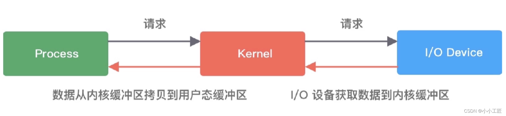
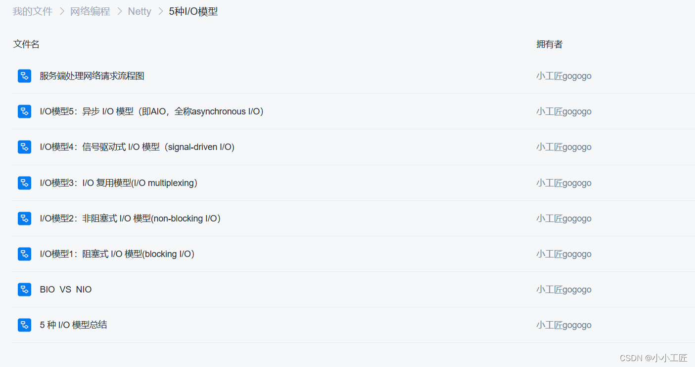
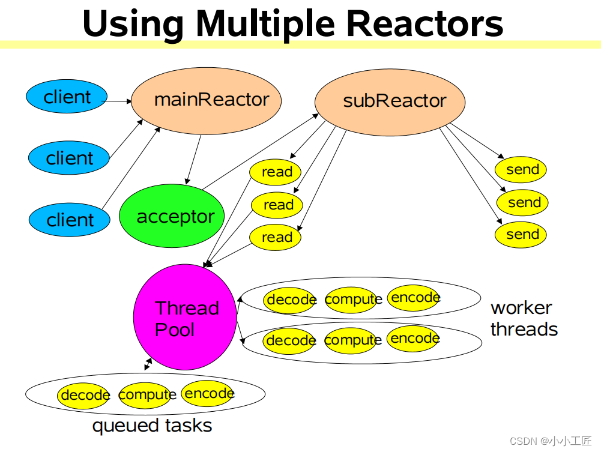
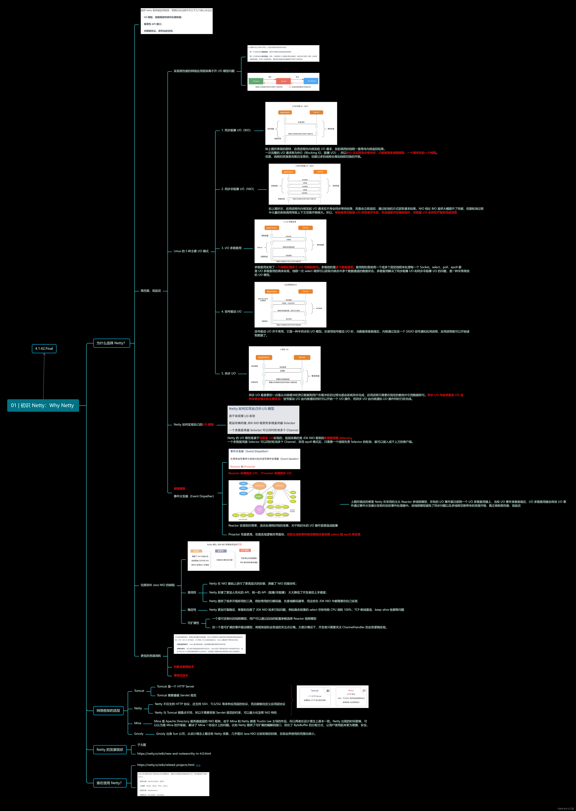

# Why Netty

1.  **I/O 模型、线程模型和事件处理机制优化：** Netty 提供了多种 I/O 模型，包括 NIO、Epoll、Kqueue 等，可以根据具体需求选择最适合的模型。其线程模型灵活，支持多种线程池模式，可以有效地利用多核处理器资源。事件处理机制采用了 Reactor 模式，使得并发处理变得简单高效。 
2.  **易用性** **API** **接口：** Netty 的 API 设计简洁清晰，提供了丰富的功能组件和工具类，使得开发者可以轻松地构建复杂的网络应用。同时，Netty 提供了良好的文档和示例，降低了学习成本，提高了开发效率。 
3.  **对数据协议、序列化的支持：** Netty 提供了丰富的编解码器和扩展点，支持各种常用的数据协议（如 `HTTP、WebSocket、SSL/TLS` 等）和序列化框架（如 `Protobuf、JSON、MessagePack` 等），可以方便地实现自定义的数据格式和处理逻辑。 
4.  **健壮性、性能、可扩展性：** Netty 经过了长时间的发展和优化，已经在大规模生产环境中得到了广泛应用和验证。其底层的网络组件经过精心设计和优化，具有出色的性能和稳定性。同时，Netty 提供了丰富的扩展机制和插件系统，可以方便地定制和扩展功能。 

综上所述，Netty 在 I/O 模型、线程模型、事件处理机制、易用性 API 接口以及对数据协议、序列化的支持等方面表现优异，因此成为了开发高性能网络应用的首选框架。

### I/O 请求的两个阶段

实现高性能的网络应用框架离不开 I/O 模型问题， 理解 I/O 模型的基本知识对于理解 Netty 的高性能原理至关重要。在网络编程中，I/O 请求通常分为两个阶段：调用阶段和执行阶段。

1.  **调用阶段：** 在调用阶段，用户进程向内核发起系统调用，请求进行 I/O 操作，例如读取数据或写入数据。 

2. 执行阶段：

    在执行阶段，内核等待 I/O 请求的处理完成，并返回结果给用户进程。执行阶段又可分为两个过程： 

   -  **等待数据就绪并写入内核缓冲区：** 在这个阶段，内核等待数据准备就绪，例如等待网络数据到达或磁盘数据就绪，并将数据写入内核缓冲区，以便用户进程可以访问。 
   -  **将内核缓冲区数据拷贝至用户态缓冲区：** 一旦数据就绪并写入内核缓冲区，内核将数据从内核缓冲区拷贝到用户态缓冲区，以便用户进程可以处理数据。

在传统的阻塞 I/O 模型中，用户进程在执行阶段会被阻塞，直到所有 I/O 操作完成。而在异步 I/O 模型中，用户进程可以继续执行其他任务，而不必等待 I/O 操作完成，从而提高了系统的并发性和吞吐量。

Netty 通过采用异步、事件驱动的模型，并结合高效的 I/O 多路复用机制（如 epoll、kqueue 等），在处理大量并发连接时表现出色，从而实现了高性能和低延迟的网络应用。

### I/O 模型

1. 同步阻塞 I/O（BIO）：
   - **特点：** 在进行 I/O 操作时，调用线程会被阻塞，直到操作完成。
   - **优点：** 编程模型简单。
   - **缺点：** 需要为每个连接创建一个线程，资源消耗较大。
2. 同步非阻塞 I/O（NIO）：
   - **特点：** 调用线程不会阻塞，但需要轮询来检查 I/O 是否完成。
   - **优点：** 节省了线程资源，提高了并发性。
   - **缺点：** 轮询过程中可能出现大量系统调用，导致性能浪费。
3. I/O 多路复用（select/poll/epoll）：
   - **特点：** 使用一个线程同时监听多个 I/O 事件，当其中一个事件就绪时，唤醒对应的线程进行处理。
   - **优点：** 解决了同步阻塞和同步非阻塞模型中资源消耗和性能浪费的问题，提高了并发性能。
   - **缺点：** 在连接数较多时，系统调用开销较大。
4. 信号驱动 I/O：
   - **特点：** 内核通过发送信号通知应用进程何时可以开始一个 I/O 操作。
   - **优点：** 操作相对异步，不会阻塞调用线程。
   - **缺点：** 使用较少，且在信号处理方面有一定复杂性。
5. 异步 I/O：
   - **特点：** I/O 操作的完整过程（包括将数据从内核缓冲区拷贝到用户态缓冲区）都由系统异步完成，应用进程只需等待通知即可。
   - **优点：** 最大程度上减少了系统调用和上下文切换的开销，提高了性能。
   - **缺点：** 实现较复杂，且对操作系统的支持要求较高。

### Netty 如何实现自己的 I/O 模型

Netty 构建在 JDK 的 NIO 框架之上，利用了其提供的非阻塞 I/O 特性，并通过多路复用器 `Selector` 实现了自己的高效 I/O 模型。

1.  **基于非阻塞 I/O：** Netty采用了非阻塞 I/O，即在进行网络通信时，不会阻塞当前线程，而是通过异步方式处理 I/O 事件。 
2.  **使用 Selector 实现多路复用：** Netty的核心是多路复用器 `Selector`。一个 `Selector` 实例可以同时轮询多个 Channel，以检查是否有 I/O 事件发生。这样，Netty 可以在一个线程中管理多个连接，而无需为每个连接创建一个线程，从而减少了线程资源的开销。 
3.  **采用 epoll 模式：** Netty 在 Linux 系统下会优先使用 `epoll` 作为底层的多路复用技术。`epoll` 是一种高效的事件通知机制，能够有效地处理大量并发连接。在 `epoll` 模式下，Netty 只需要一个线程负责调用 `epoll_wait()` 系统调用来轮询注册在 `Selector` 上的事件，从而可以接入成千上万的客户端而不会出现性能瓶颈。 
4.  **适配不同操作系统：** Netty 不仅仅在 Linux 下使用 epoll，还会根据不同的操作系统选择合适的多路复用技术，如在 Windows 平台下会使用 IOCP（Input/Output Completion Port），以达到最佳的性能表现。 

综上所述，Netty 的 I/O 模型基于 JDK NIO 框架，利用了非阻塞 I/O 和多路复用器 `Selector`，并根据不同的操作系统选择合适的底层多路复用技术，从而实现了高性能、低延迟的网络通信。

------

### 线程模型 - 事件分发器（Event Dispather）

在 Netty 中采用的是主从 Reactor 多线程模型，这是一种高效的事件驱动模型，有助于实现高性能、低延迟的网络通信。

1.  **主从 Reactor 多线程模型：** 在该模型中，有两类线程，即主线程和从线程。主线程负责接收客户端的连接，并将连接注册到 I/O 多路复用器（如 `Selector`）上。从线程则负责处理 I/O 事件，当有 I/O 事件就绪时，从线程从 I/O 多路复用器中获取事件，并将事件分发给对应的事件处理器进行处理。 
2.  **事件分发器：** 在 Netty 中，事件分发器的角色由从线程扮演。从线程负责从 I/O 多路复用器中获取就绪的事件，并将事件分发给对应的事件处理器进行处理。这种设计避免了同步问题和多线程切换带来的资源开销，从而提高了系统的性能和并发处理能力。 
3.  **简化处理逻辑：** 主从 Reactor 多线程模型将接收连接和处理 I/O 事件的工作分开，使得系统的处理逻辑更加清晰和简单。主线程只负责接收连接，而从线程则专注于处理 I/O 事件，降低了系统的复杂度和维护成本。 
4.  **高性能、低延迟：** 通过主从 Reactor 多线程模型，Netty 实现了高性能、低延迟的网络通信。主线程和从线程之间的工作分配清晰，避免了线程间的竞争和同步问题，同时有效利用了多核处理器的性能优势，从而实现了高效的事件驱动和并发处理。 

综上所述，Netty 的主从 Reactor 多线程模型结合了 Reactor 模式和多线程技术，通过合理分配工作任务和减少同步开销，实现了高性能、低延迟的网络通信。

------

### 弥补 Java NIO 的缺陷

Netty 相对于 JDK 的 NIO 框架有着几个显著的优势，这些优势使得 Netty 成为了许多开发者选择的首选框架：

1.  **易用性：** Netty对 JDK NIO 进行了更高层次的封装，屏蔽了底层 NIO 的复杂性。它提供了更加人性化的 API，使得开发者无需深入理解 NIO 的底层概念（如 Channels、Selectors、Sockets、Buffers），就能够快速上手进行网络编程。此外，Netty还提供了大量开箱即用的工具和组件，如编解码器、长度域解码器等，极大地简化了开发过程。 
2.  **稳定性：** Netty 对 JDK NIO 存在的一些已知问题进行了修复和优化，提高了系统的稳定性和可靠性。例如，修复了 select 空转导致 CPU 消耗高的问题，改进了 TCP 断线重连和 keep-alive 检测等方面的功能。 
3.  **可扩展性：** Netty 提供了强大的可扩展性，使得开发者可以根据自身需求定制化线程模型和事件驱动模型。对于线程模型，Netty允许用户通过启动配置参数选择 Reactor 线程模型，以满足不同的性能和并发需求；而在事件驱动模型方面，Netty实现了框架层和业务层的关注点分离，使得开发者只需专注于业务逻辑的实现，而不必过多关注底层的网络处理细节。 

------

### 更低的资源消耗

Netty 通过采用对象池复用技术和零拷贝技术，有效降低了 JVM 垃圾回收的压力，从而实现了更低的资源消耗。

1.  **对象池复用技术：** Netty 使用对象池来复用对象，避免频繁创建和销毁对象所带来的开销。在网络通信过程中，需要处理大量的网络数据对象，如果每次都新建对象，将会增加垃圾回收的压力。通过使用对象池，Netty 可以重复利用已经创建的对象，减少了对象创建和销毁的次数，从而降低了垃圾回收的频率，提高了系统的性能和稳定性。 
2.  **零拷贝技术：** Netty 在 I/O 读写过程中采用了零拷贝技术，避免了数据在不同内存区域之间的拷贝操作。例如，在进行网络数据传输时，Netty 直接使用 DirectBuffer，这样数据可以直接从操作系统内核缓冲区复制到用户空间的 DirectBuffer 中，而无需经过堆内存，从而避免了数据在堆内存和堆外内存之间的拷贝。这种零拷贝的技术不仅提高了数据传输的效率，还减少了内存的使用，降低了垃圾回收的压力，提高了系统的性能。 

>  Netty 通过对象池复用技术和零拷贝技术的应用，有效降低了 JVM 垃圾回收的压力，减少了资源的消耗，从而实现了更低的资源消耗，在网络编程中得到了广泛的应用和青睐。 

------

### 网络框架的选型

在选择网络框架时，需要根据项目的需求和特点来决定使用哪种框架。

1. 通信协议支持：
   - Tomcat 主要解决 HTTP 协议层的传输，适合构建 Web 应用。
   - Netty 不仅支持 HTTP 协议，还支持 SSH、TLS/SSL 等多种应用层的协议，同时具有自定义应用层协议的能力。适用于需要定制协议或多种协议支持的场景。
2. 性能和并发能力：
   - Tomcat 在 Servlet 3.0 之后支持了 NIO，但仍然受到 Servlet 规范的限制，适用于低并发或者传统的 Web 应用。
   - Netty 的设计不受 Servlet 规范的限制，能够最大化发挥 NIO 特性，适用于高并发、大规模网络通信的场景。
3. 易用性和稳定性：
   - Tomcat 在 Web 开发领域有着较长时间的应用和成熟的生态系统，易于上手且稳定可靠。
   - Netty 在面向 TCP 的网络应用开发方面有着丰富的经验和灵活的设计，提供了丰富的功能和易于扩展的接口，但相对而言可能需要更多的学习和适应时间。
4. 其他选择：
   - Mina 和 Grizzly 是其他可选的网络框架，但相对于 Netty，它们在设计和功能上可能不如 Netty 灵活和优雅。

------

### Netty 发展现状

Netty在过去几年里取得了显著的发展，并且得到了广泛的应用和认可。

1.  **社区活跃度高：** Netty拥有一个活跃的社区，迭代周期短，文档齐全。开发者可以通过官方社区、GitHub等平台获取学习资料和技术支持。 
2.  **稳定版本推荐：** Netty官方提供了稳定的3.x和4.x版本。3.x到4.x的升级带来了较大的变化，但主流推荐使用4.x版本，因为它提供了更多的优化和新特性。 
3.  **项目结构调整：** Netty从3.x到4.x版本进行了项目结构的调整，模块化程度更高，包名也从org.jboss.netty更新为io.netty。 
4.  **API改进和优化：** Netty 4.x版本中引入了流式风格的API，并对Buffer相关功能进行了优化和调整，提高了性能和健壮性。 
5.  **内存管理****优化：** Netty 4.1版本开始使用jemalloc作为默认的内存分配方式，提高了内存管理的效率，减少了GC压力。 
6.  **线程模型优化：** Netty 4.x提供了更严谨的线程模型控制，降低了用户编写ChannelHandler时的线程安全问题，使得编程更加简洁和高效。 
7.  **其他新特性：** Netty 4.x还引入了一些其他新特性，如内存泄漏检测功能、通用工具类等，进一步提升了框架的性能和易用性。 

------

### Netty 的使用

[https://netty.io/wiki/related-projects.html](https://cloud.tencent.com/developer/tools/blog-entry?target=https%3A%2F%2Fnetty.io%2Fwiki%2Frelated-projects.html&objectId=2421820&objectType=1&isNewArticle=undefined)

使用Netty的知名公司和项目：

-  **服务治理：** Apache Dubbo和gRPC等服务治理框架都采用了Netty作为底层通信框架，用于实现高效的远程服务调用和通信。 
-  [**大数据**](https://cloud.tencent.com/product/bigdata-class?from_column=20065&from=20065)**：** Hbase、Spark、Flink和Storm等大数据处理框架也使用了Netty作为底层通信框架，用于实现大规模数据处理和分布式计算。 
-  **搜索引擎：** Elasticsearch作为一款流行的搜索引擎，同样选择了Netty作为其底层通信框架，用于处理搜索请求和响应。 
-  [**消息队列**](https://cloud.tencent.com/product/message-queue-catalog?from_column=20065&from=20065)**：** RocketMQ等消息队列系统也采用了Netty作为底层通信框架，用于实现高性能的消息传输和处理。

### 思维导图

