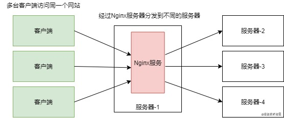
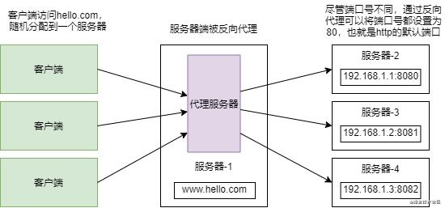

### 1. 什么是Nginx

Nginx (engine x) 是一个高性能的HTTP和反向代理web服务器，同时也提供了IMAP/POP3/SMTP服务。

其特点是占有内存少，并发能力强，事实上nginx的并发能力在同类型的网页服务器中表现较好。

### 2. 为什么要使用Nginx？

随着当今互联网的迅速发展，单点服务器早已无法承载上万个乃至数十万个用户的持续访问。比如一台Tomcat服务器在理想状态下只能够可以承受住2000个左右的并发量，为了解决这个问题，就需要多台Tomcat服务器来进行负载均衡。

那么，应该如何实现负载均衡？Nginx就是其中的一种解决方案，当用户访问网站时，Nginx拦截到这个访问请求，并将其通过轮询的方式均匀地分配到不同的服务器上。

### 3.  什么是正向代理？

正向代理，就是客户端将自己的请求率先发给代理服务器，通过代理服务器将请求转发给服务器。我们常用的VPN就是一种代理服务器，为了可以连上国外的网站，客户端需要使用一个可以连接外网的服务器作为代理，并且客户端能够连接上该代理服务器。

### 4.  什么是反向代理？

反向代理与正向代理不同，正向代理是代理了客户端，而反向代理则是代理服务器端。在有多台服务器分布的情况下，为了能让客户端访问到的IP地址都为同一个网站，就需要使用反向代理。

明白了反向代理的工作机制后，接下来就可以进入Nginx的学习！