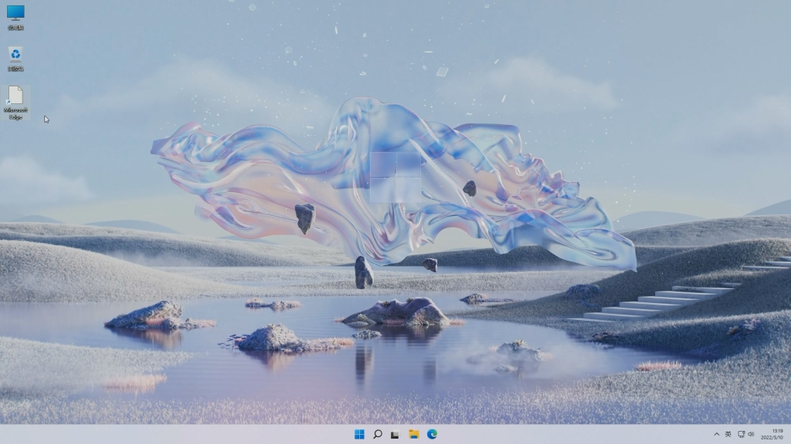
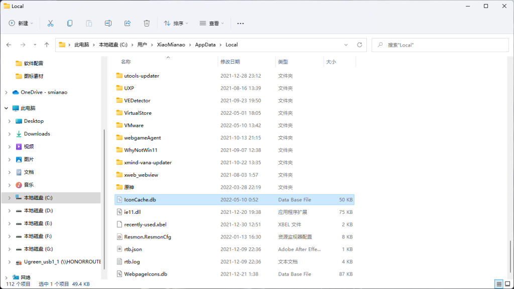

# 桌面图标变白色异常

当你打开电脑，发现桌面图标变成了白色，但是却不影响使用，强迫症的你却如鲠在喉！来来来，小棉袄教你两个方法，简单快速修复桌面异常图标！



其实，桌面图标变白色，一般情况下，是系统图标缓存文件异常造成的，知道原因，我们处理起来就简单了！




桌面右键新建文本文档，在文本文档种输入如下代码

```bash
@echo off  
  
taskkill /f /im explorer.exe  
  
CD %userprofile%\AppData\Local  
  
DEL IconCache.db  
  
start explorer.exe
```

然后左上角文件-另存为，保存类型选择所有文件，文件名随意，后缀一定要是.bat，接着，找到保存好的bat批处理文件，右键管理员运行，电脑屏幕闪一下后，你会惊奇的发现，白色图标就已经恢复了！