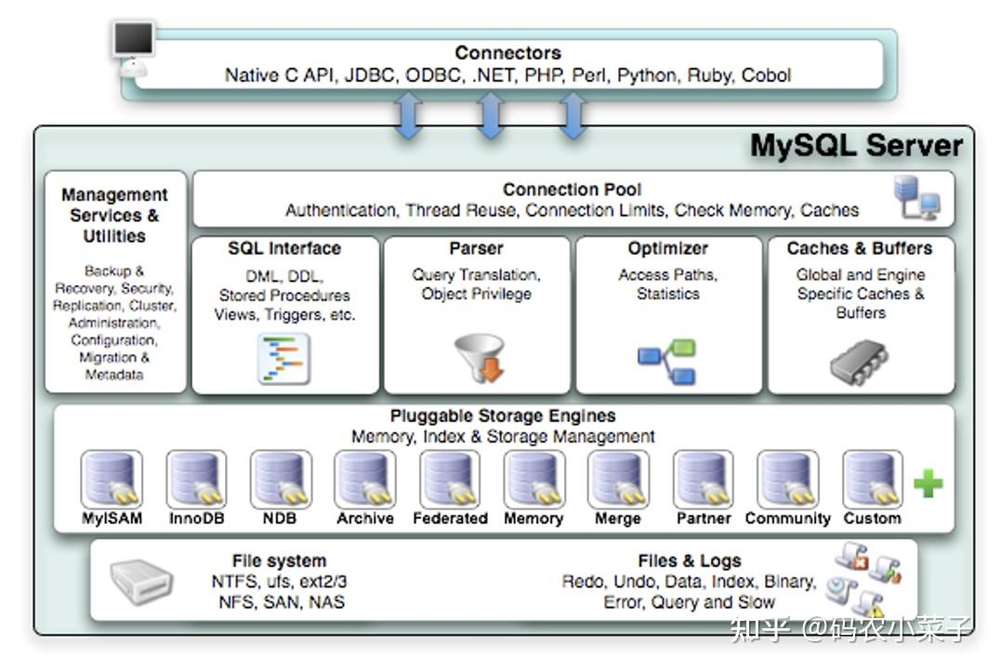

### 一、MySQL 架构分层模型

MySQL 采用 **分层设计**，主要分为 **连接层**、**服务层** 和 **存储引擎层**，实现逻辑与物理存储的分离：

* **连接层**

  处理客户端连接，包括身份认证、权限控制等

* **服务层**

  SQL解析、优化、缓存、内置函数/存储过程

* **存储引擎层**

  负责数据的存储与读取、索引管理、事务支持，不同存储引擎提供不同的功能

* 存储层

  管理磁盘文件存储，包括数据文件、日志文件、索引等

### 二、核心模块详解

#### 1. **连接层（Connector Layer）**

- **功能**：处理客户端连接请求（如JDBC、ODBC、Python Connector等）。
- **关键机制**：
  - **线程池**：复用线程降低频繁创建销毁的开销（需手动开启 `thread_handling=pool-of-threads`）。
  - **连接池**：管理长连接，避免频繁建立TCP握手（如HikariCP、DBCP）。
  - **认证**：基于用户名、密码、IP的权限验证（权限表存储在 `mysql.user`）。

#### 2. **服务层（Server Layer）**

- **SQL接口**：
  - **解析器**：将SQL语句转换为**抽象语法树（AST）**，检查语法错误。
  - **预处理器**：验证表名、列名是否存在，解析`*`为具体列。
  - **优化器**：
    - 生成**执行计划**（通过 `EXPLAIN` 查看）。
    - 优化策略：索引选择、JOIN顺序优化、子查询优化等。
  - **执行器**：调用存储引擎接口，执行查询并返回结果。
- **查询缓存**（MySQL 8.0已移除）：
  - 缓存完整查询结果，但锁粒度粗，易因表更新失效，高并发下性能差。

#### 3. **存储引擎层（Storage Engine Layer）**

- **核心引擎对比**：

  | **特性**     | InnoDB                    | MyISAM          | Memory      |
  | :----------- | :------------------------ | :-------------- | :---------- |
  | **事务支持** | ACID（通过Redo/Undo Log） | ❌               | ❌           |
  | **锁粒度**   | 行级锁（支持MVCC）        | 表级锁          | 表级锁      |
  | **外键**     | ✔️                         | ❌               | ❌           |
  | **崩溃恢复** | 支持（通过Redo Log）      | ❌（需修复表）   | 数据丢失    |
  | **适用场景** | 高并发写、事务型应用      | 只读/低频写报表 | 临时表/缓存 |

- **InnoDB 核心机制**：

  - **缓冲池（Buffer Pool）**：缓存热数据页，减少磁盘I/O（通过 `innodb_buffer_pool_size` 配置）。
  - **Redo Log**：保证事务持久性，记录物理变更（顺序写，崩溃恢复时重放）。
  - **Undo Log**：实现事务回滚和多版本控制（MVCC）。
  - **Double Write Buffer**：防止页断裂（Partial Write）导致数据损坏。

#### 4. **存储层**

主要包括：

- **数据文件**（.ibd, .frm, .MYD, .MYI等）。
- **日志文件**（redo log、binlog、undo log、error log）。
  - **Binary Log**：逻辑日志，记录所有数据变更（用于主从复制、数据恢复）。
  - **Redo Log**：物理日志，确保事务持久性（InnoDB特有）。
  - **Undo Log**：记录事务前的数据镜像，支持回滚和MVCC。
  - **Error Log**：记录启动、运行、停止时的错误信息。
  - **Slow Query Log**：记录执行时间超过阈值的SQL（用于性能优化）。
- **索引文件**（B+树索引、哈希索引等）。

