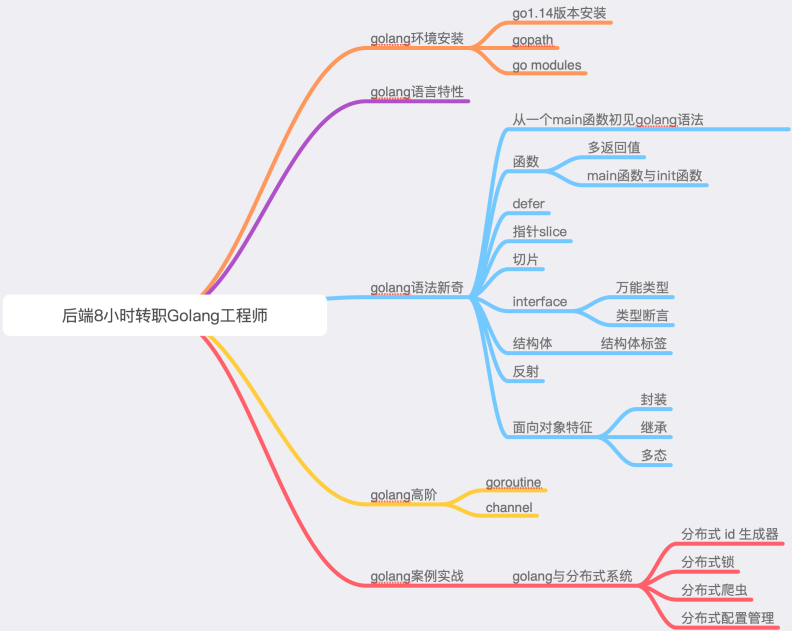
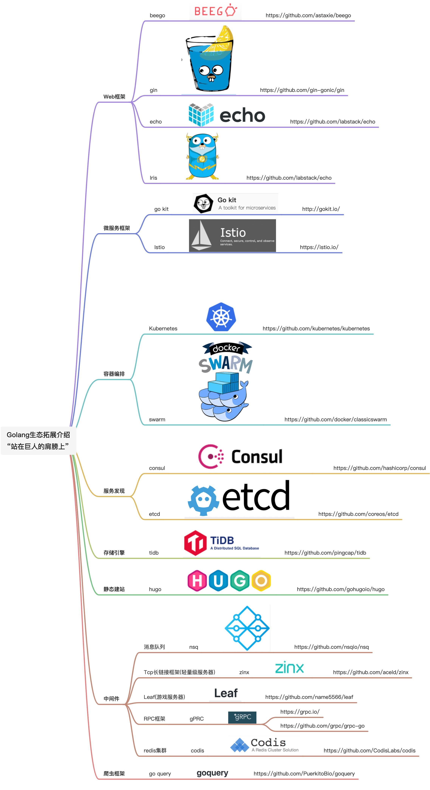

**学习前置要求**

1、具备1种后端编程语言开发经验(C/C++/Java/Python/PHP等) 

2、具备基本的网络编程能力和并发思想 

3、了解计算机基本体系结构

4、了解Linux基础知识

**课程说明**

本课程主要是针对其他 非0基础 后端工程师快速了解Golang而设计。建立快速了解Golang语言及特点的**捷径**学习路线，可以通过几个小时的时间快速的跨过Golang语言的门槛。之后在Golang要走多远，还是要自己后续的工作经验和实战来支撑！

注意：本课程非全知识点覆盖，而是快速了解Golang捷径。

**课程提纲**

**Golang生态拓展介绍“站在巨人的肩膀上”**

