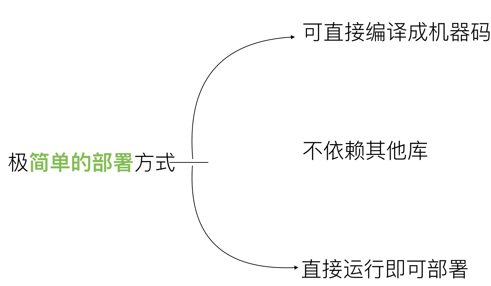
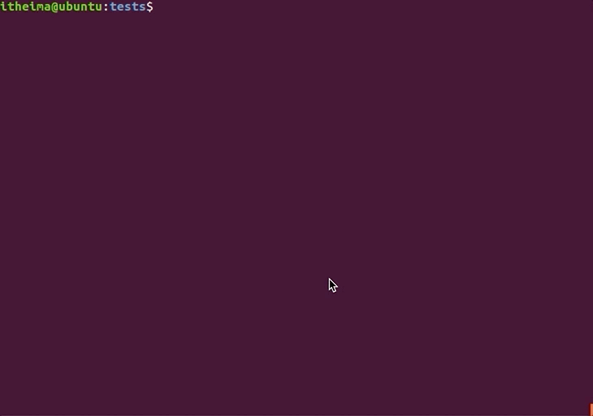
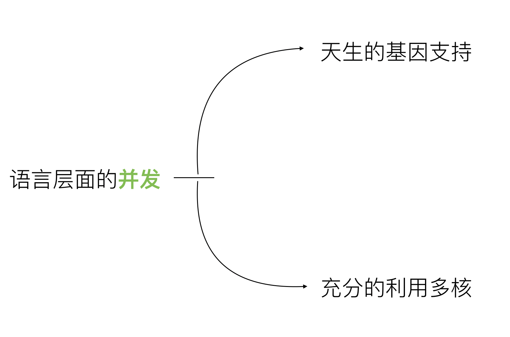
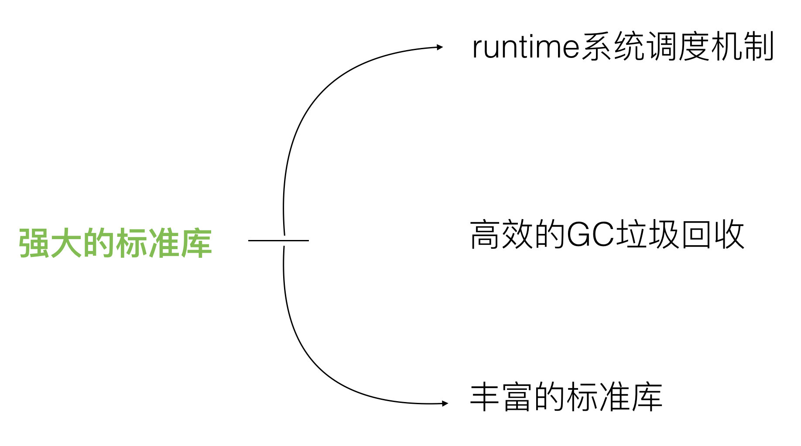
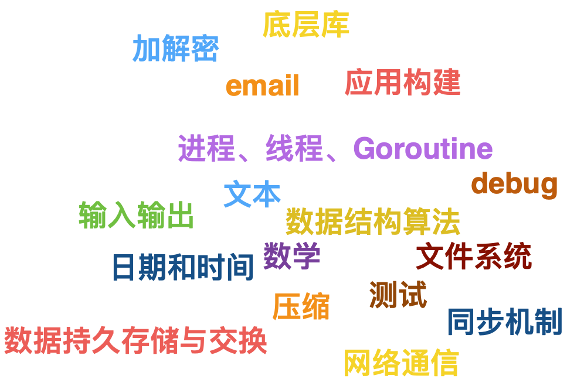
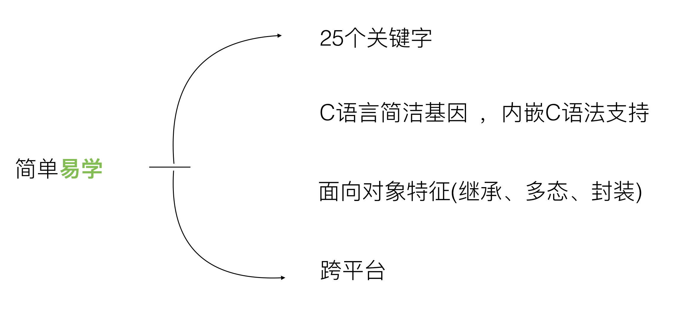
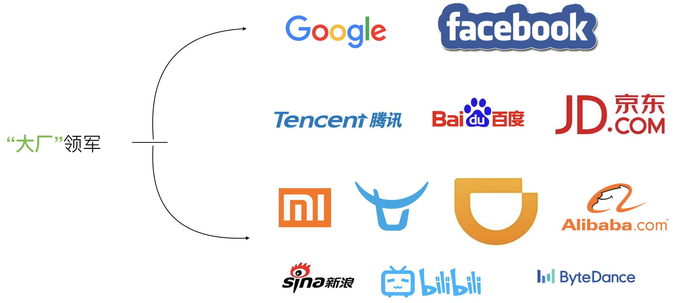
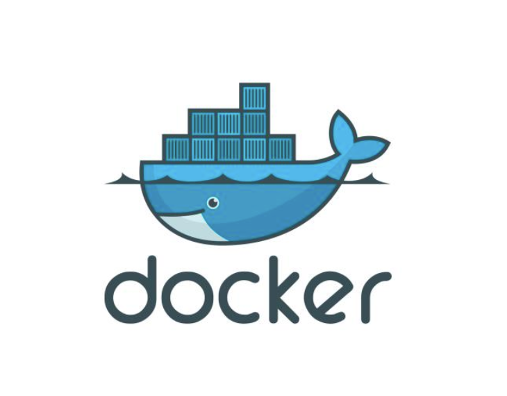
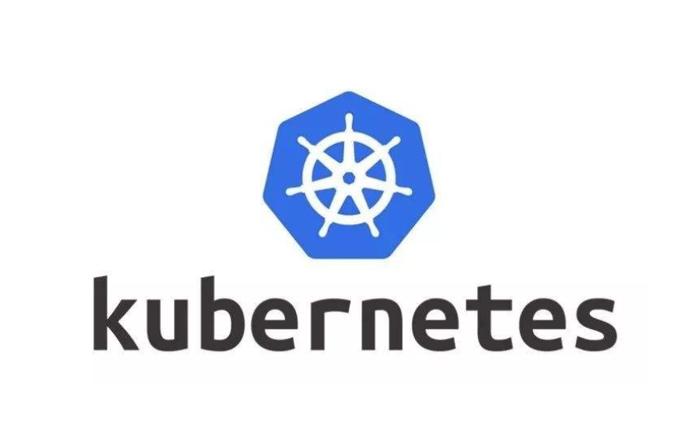
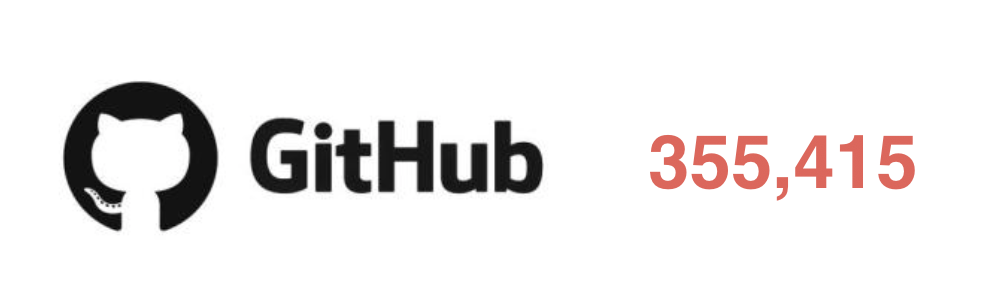

## 三、Golang语言特性


### 1、Golang的优势





------




------




```go
package main
  
import (
    "fmt"
    "time"
)

func goFunc(i int) {
    fmt.Println("goroutine ", i, " ...")
}

func main() {
    for i := 0; i < 10000; i++ {
        go goFunc(i) //开启一个并发协程
    }

    time.Sleep(time.Second)
}
```


------






------



------




### 2、Golang适合做什么


**(1)、云计算基础设施领域**


代表项目：docker、kubernetes、etcd、consul、cloudflare CDN、七牛云存储等。


**(2)、基础后端软件**


代表项目：tidb、influxdb、cockroachdb等。


**(3)、微服务**


代表项目：go-kit、micro、monzo bank的typhon、bilibili等。


**(4)、互联网基础设施**


代表项目：以太坊、hyperledger等。

------

### 3、Golang明星作品











### 4、Golang的不足


1、包管理，大部分包都在**github**上


2、无泛化类型

(Golang 1.18+已经支持泛型)


3、所有**Excepiton**都用**Error**来处理(比较有争议)。


4、对**C**的降级处理，并非无缝，没有**C**降级到**asm**那么完美(序列化问题)