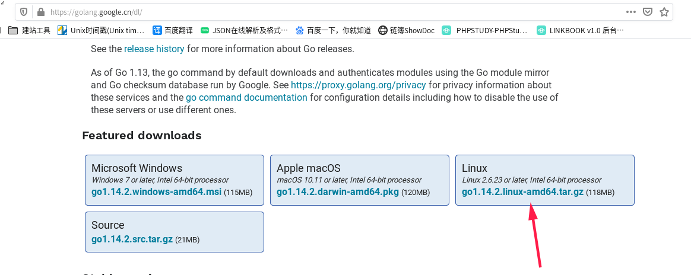
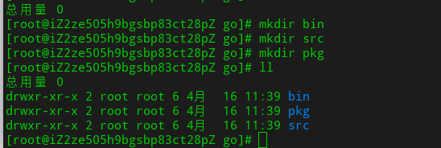
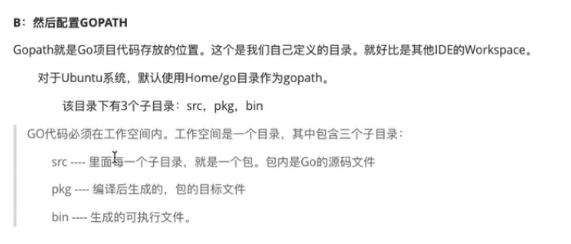
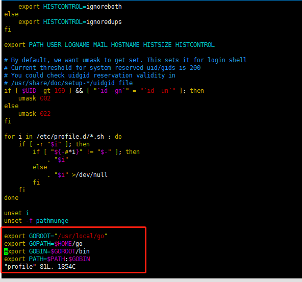

本文基于go version go1.14.2 linux/amd64

### **1.下载安装包**

Go官网下载地址：https://golang.org/dl/

Go官方镜像站（推荐）：https://golang.google.cn/dl/

根据自己系统，自行选择安装。

如果是window系统 推荐下载可执行文件版,一路 Next

这里以linux为例。

复制tar包连接,然后下载

### **2.解压安装包**

Linux 从 https://golang.org/dl/ 下载tar⽂件，并将其解压到 /usr/local。

将/usr/local/go/bin添加到PATH环境变量中。

### **3. 在/home下新建go文件夹**

在/home/go目录里新建下面三个文件夹：

bin / src / pkg

### **4.配置GOROOT**

把/usr/local/go/bin目录配置GOROOT 到环境变量里

如果系统变量还是不能生效 每次新打开一个命令窗口都要重新输入 source /etc/profile 才能使go env 等配置文件生效： 那就加到用户变量,当前用户一登录就会加载到 解决方法：

在 ~/.bashrc 中添加语句（在root账号和子账号里都加一次）

保存退出

### **5.GOPROXY**

Go1.14版本之后，都推荐使用go mod模式来管理依赖了，也不再强制我们把代码必须写在GOPATH下面的src目录了，你可以在你电脑的任意位置编写go代码。

默认GoPROXY配置是：GOPROXY=https://proxy.golang.org,direct， 由于国内访问不到 https://proxy.golang.org 所以我们需要换一个PROXY，这里推荐使用https://goproxy.io 或 https://goproxy.cn。

可以执行下面的命令修改GOPROXY：

### **6. 开发工具**

vscode

Goland

本教程非入门级别教程，故开发者可以用自己喜好的IDE进行配置，这里不再梳理IDE的安装和配置，详细请参考其他教学资料

