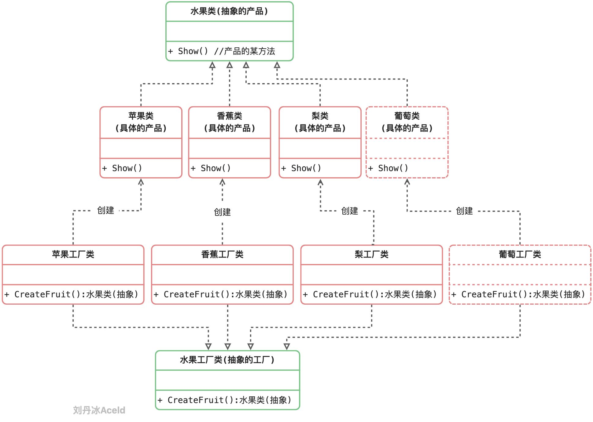
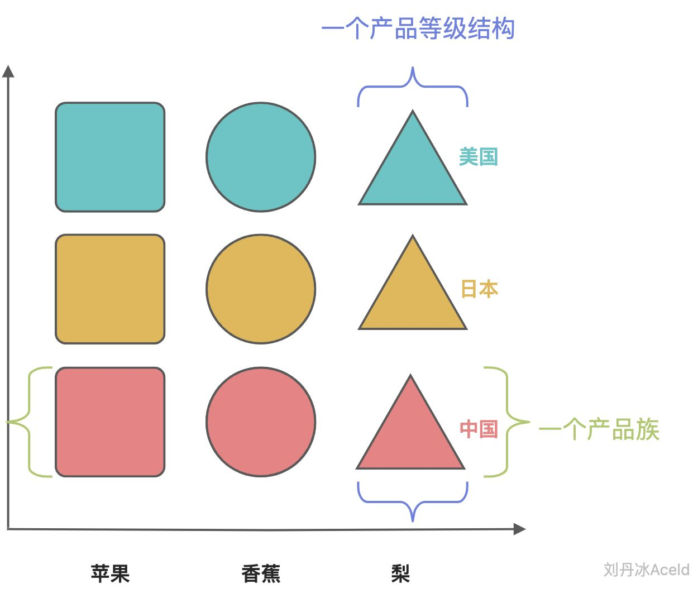
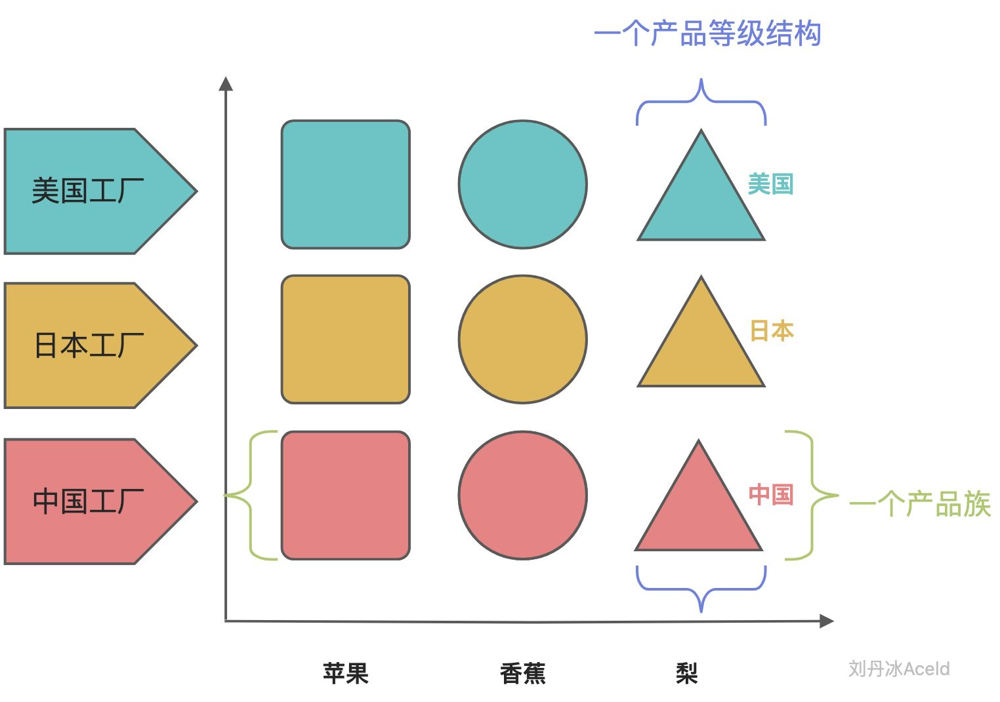
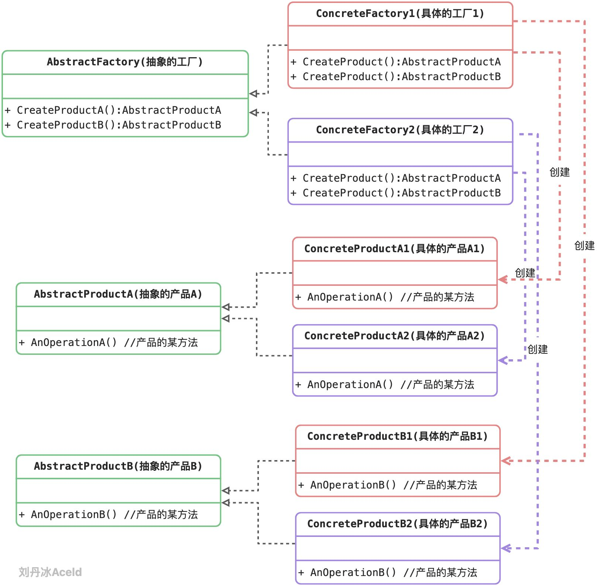
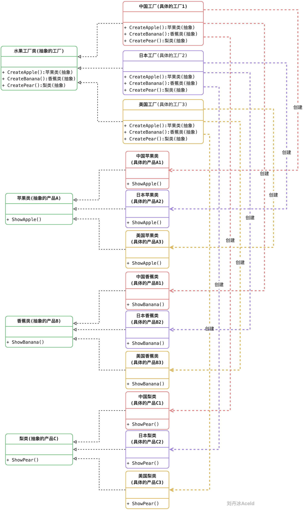

工厂方法模式通过引入工厂等级结构，解决了简单工厂模式中工厂类职责太重的问题，但由于工厂方法模式中的每个工厂只生产一类产品，可能会导致系统中存在大量的工厂类，势必会增加系统的开销。因此，可以考虑将一些相关的产品组成一个“产品族”，由同一个工厂来统一生产，这就是本文将要学习的抽象工厂模式的基本思想。




从工厂方法模式可以看出来：

（1）当添加一个新产品的时候，比如葡萄，虽然不用修改代码，但是需要添加大量的类，而且还需要添加相对的工厂。（系统开销，维护成本）

（2）如果使用同一地域的水果（日本苹果，日本香蕉，日本梨），那么需要分别创建具体的工厂，如果选择出现失误，将会造成混乱，虽然可以加一些约束，但是代码实现变得复杂。

所以“抽象工厂方法模式”引出了“产品族”和“产品等级结构”概念，其目的是为了更加高效的生产同一个产品组产品。


### 3.3.1 产品族与产品等级结构





上图表示“产品族”和“产品登记结构”的关系。

产品族：具有同一个地区、同一个厂商、同一个开发包、同一个组织模块等，但是具备不同特点或功能的产品集合，称之为是一个产品族。

产品等级结构：具有相同特点或功能，但是来自不同的地区、不同的厂商、不同的开发包、不同的组织模块等的产品集合，称之为是一个产品等级结构。

当程序中的对象可以被划分为产品族和产品等级结构之后，那么“抽象工厂方法模式”才可以被适用。

“抽象工厂方法模式”是针对“产品族”进行生产产品，具体如下图所示。




### 3.3.2 抽象工厂模式的角色和职责

抽象工厂（Abstract Factory）角色：它声明了一组用于创建一族产品的方法，每一个方法对应一种产品。

具体工厂（Concrete Factory）角色：它实现了在抽象工厂中声明的创建产品的方法，生成一组具体产品，这些产品构成了一个产品族，每一个产品都位于某个产品等级结构中。

抽象产品（Abstract Product）角色：它为每种产品声明接口，在抽象产品中声明了产品所具有的业务方法。

具体产品（Concrete Product）角色：它定义具体工厂生产的具体产品对象，实现抽象产品接口中声明的业务方法。




可以看出来具体的工厂1，只负责生成具体的产品A1和B1，具体的工厂2，只负责生成具体的产品A2和B2。

“工厂1、A1、B1”为一组，是一个产品族， “工厂2、A2、B2”为一组，也是一个产品族。

### 3.3.3 抽象工厂方法模式的实现

抽象工厂方法模式按照本章节的案例，可以得到类图如下：



代码如下：

```go
package main

import "fmt"

// ======= 抽象层 =========
type AbstractApple interface {
	ShowApple()
}

type AbstractBanana interface {
	ShowBanana()
}

type AbstractPear interface {
	ShowPear()
}

//抽象工厂
type AbstractFactory interface {
	CreateApple() AbstractApple
	CreateBanana() AbstractBanana
	CreatePear() AbstractPear
}

// ======== 实现层 =========
/*  中国产品族 */
type ChinaApple struct {}

func (ca *ChinaApple) ShowApple() {
	fmt.Println("中国苹果")
}

type ChinaBanana struct {}

func (cb *ChinaBanana) ShowBanana() {
	fmt.Println("中国香蕉")
}

type ChinaPear struct {}

func (cp *ChinaPear) ShowPear() {
	fmt.Println("中国梨")
}

type ChinaFactory struct {}

func (cf *ChinaFactory) CreateApple() AbstractApple {
	var apple AbstractApple

	apple = new(ChinaApple)

	return apple
}

func (cf *ChinaFactory) CreateBanana() AbstractBanana {
	var banana AbstractBanana

	banana = new(ChinaBanana)

	return banana
}

func (cf *ChinaFactory) CreatePear() AbstractPear {
	var pear AbstractPear

	pear = new(ChinaPear)

	return pear
}

/*  日本产品族 */
type JapanApple struct {}

func (ja *JapanApple) ShowApple() {
	fmt.Println("日本苹果")
}

type JapanBanana struct {}

func (jb *JapanBanana) ShowBanana() {
	fmt.Println("日本香蕉")
}

type JapanPear struct {}

func (cp *JapanPear) ShowPear() {
	fmt.Println("日本梨")
}

type JapanFactory struct {}

func (jf *JapanFactory) CreateApple() AbstractApple {
	var apple AbstractApple

	apple = new(JapanApple)

	return apple
}

func (jf *JapanFactory) CreateBanana() AbstractBanana {
	var banana AbstractBanana

	banana = new(JapanBanana)

	return banana
}

func (cf *JapanFactory) CreatePear() AbstractPear {
	var pear AbstractPear

	pear = new(JapanPear)

	return pear
}

/*  美国产品族 */
type AmericanApple struct {}

func (aa *AmericanApple) ShowApple() {
	fmt.Println("美国苹果")
}

type AmericanBanana struct {}

func (ab *AmericanBanana) ShowBanana() {
	fmt.Println("美国香蕉")
}

type AmericanPear struct {}

func (ap *AmericanPear) ShowPear() {
	fmt.Println("美国梨")
}

type AmericanFactory struct {}

func (af *AmericanFactory) CreateApple() AbstractApple {
	var apple AbstractApple

	apple = new(AmericanApple)

	return apple
}

func (af *AmericanFactory) CreateBanana() AbstractBanana {
	var banana AbstractBanana

	banana = new(AmericanBanana)

	return banana
}

func (af *AmericanFactory) CreatePear() AbstractPear {
	var pear AbstractPear

	pear = new(AmericanPear)

	return pear
}

// ======== 业务逻辑层 =======
func main() {
	//需求1: 需要美国的苹果、香蕉、梨 等对象
	//1-创建一个美国工厂
	var aFac AbstractFactory
	aFac = new(AmericanFactory)

	//2-生产美国苹果
	var aApple AbstractApple
	aApple = aFac.CreateApple()
	aApple.ShowApple()

	//3-生产美国香蕉
	var aBanana AbstractBanana
	aBanana = aFac.CreateBanana()
	aBanana.ShowBanana()

	//4-生产美国梨
	var aPear AbstractPear
	aPear = aFac.CreatePear()
	aPear.ShowPear()

	//需求2: 需要中国的苹果、香蕉
	//1-创建一个中国工厂
	cFac := new(ChinaFactory)

	//2-生产中国苹果
	cApple := cFac.CreateApple()
	cApple.ShowApple()

	//3-生产中国香蕉
	cBanana := cFac.CreateBanana()
	cBanana.ShowBanana()
}
```


思考：抽象工厂模式是否符合“开闭原则”？


### 3.3.4 抽象工厂模式的优缺点

优点：

1. 拥有工厂方法模式的优点
2. 当一个产品族中的多个对象被设计成一起工作时，它能够保证客户端始终只使用同一个产品族中的对象。

3  增加新的产品族很方便，无须修改已有系统，符合“开闭原则”。


缺点：

1. 增加新的产品等级结构麻烦，需要对原有系统进行较大的修改，甚至需要修改抽象层代码，这显然会带来较大的不便，违背了“开闭原则”。


### 3.3.5 适用场景

(1) 系统中有多于一个的产品族。而每次只使用其中某一产品族。可以通过配置文件等方式来使得用户可以动态改变产品族，也可以很方便地增加新的产品族。

(2) 产品等级结构稳定。设计完成之后，不会向系统中增加新的产品等级结构或者删除已有的产品等级结构。


练习：

​	设计一个电脑主板架构，电脑包括（显卡，内存，CPU）3个固定的插口，显卡具有显示功能（display，功能实现只要打印出意义即可），内存具有存储功能（storage），cpu具有计算功能（calculate）。

​	现有Intel厂商，nvidia厂商，Kingston厂商，均会生产以上三种硬件。

​	要求组装两台电脑， 

​			    1台（Intel的CPU，Intel的显卡，Intel的内存）

​			    1台（Intel的CPU， nvidia的显卡，Kingston的内存）

​	用抽象工厂模式实现。