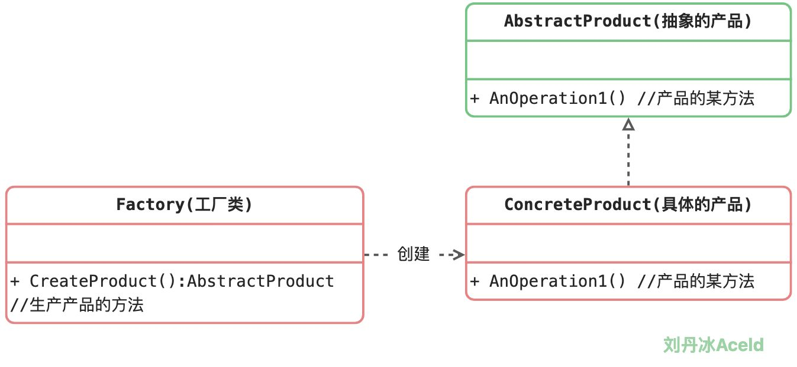
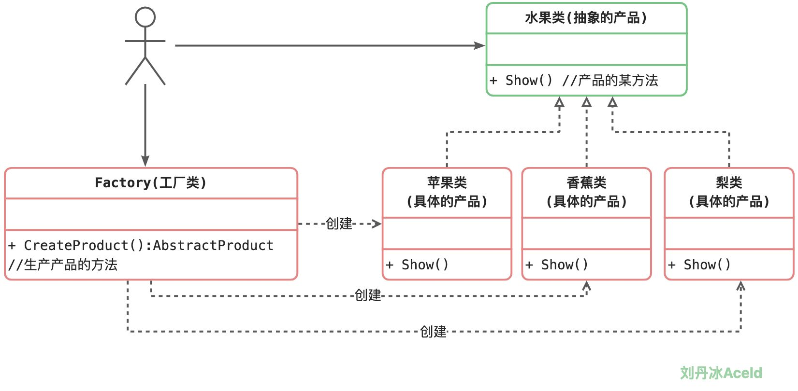

### 3.1.1 为什么需要工厂模式

首先来看，如果没有工厂模式，在开发者创建一个类的对象时，如果有很多不同种类的对象将会如何实现，代码如下：

```go
package main

import "fmt"

//水果类
type Fruit struct {
	//...
	//...
	//...
}

func (f *Fruit) Show(name string) {
	if name == "apple" {
		fmt.Println("我是苹果")
	} else if name == "banana" {
		fmt.Println("我是香蕉")
	} else if name == "pear" {
		fmt.Println("我是梨")
	}
}

//创建一个Fruit对象
func NewFruit(name string) *Fruit {
	fruit := new(Fruit)

	if name == "apple" {
		//创建apple逻辑
	} else if name == "banana" {
		//创建banana逻辑
	} else if name == "pear" {
		//创建pear逻辑
	}

	return fruit
}

func main() {
	apple := NewFruit("apple")
	apple.Show("apple")

	banana := NewFruit("banana")
	banana.Show("banana")

	pear := NewFruit("pear")
	pear.Show("pear")
}
```


不难看出，Fruit类是一个“巨大的”类，在该类的设计中存在如下几个问题：

​	(1) 在Fruit类中包含很多“if…else…”代码块，整个类的代码相当冗长，代码越长，阅读难度、维护难度和测试难度也越大；而且大量条件语句的存在还将影响系统的性能，程序在执行过程中需要做大量的条件判断。

​	(2) Fruit类的职责过重，它负责初始化和显示所有的水果对象，将各种水果对象的初始化代码和显示代码集中在一个类中实现，违反了“单一职责原则”，不利于类的重用和维护；   

(3) 当需要增加新类型的水果时，必须修改Fruit类的构造函数NewFruit()和其他相关方法源代码，违反了“开闭原则”。

关键是来观察main()函数，main()函数与Fruit类是两个模块。当业务层希望创建一个对象的时候，将直接依赖Fruit类型的构造方法NewFruit()，这样随着Fruit的越来越复杂，那么业务层的开发逻辑也需要依赖Fruit模块的更新，且随之改变，这样将导致业务层开发需要观察Fruit模块做改动，影响业务层的开发效率和稳定性。整体的依赖关系为。


```bash
业务逻辑层 ---> 基础类模块
```

那么如何将业务层创建对象与基础类模块做解耦呢，这里即可以在中间加一层工厂模块层，来降低业务逻辑层对基础模块层的直接依赖和耦合关联。

```bash
业务逻辑层 ---> 工厂模块 ---> 基础类模块
```

这样就引出了需要对工厂模块的一些设计和加工生成基础模块对象的模式。


### 3.1.2 简单工厂模式角色和职责

​	简单工厂模式并不属于GoF的23种设计模式。他是开发者自发认为的一种非常简易的设计模式，其角色和职责如下：

​	**工厂（Factory）角色**：简单工厂模式的核心，它负责实现创建所有实例的内部逻辑。工厂类可以被外界直接调用，创建所需的产品对象。

​	**抽象产品（AbstractProduct）角色**：简单工厂模式所创建的所有对象的父类，它负责描述所有实例所共有的公共接口。

​	**具体产品（Concrete Product）角色**：简单工厂模式所创建的具体实例对象。

其标准的设计模式类图如下：




### 3.1.3 简单工厂模式实现

​       根据本章节的案例可以将标准的“简单工厂模式”类图改进如下：




简单工厂方法模式的实现代码如下：

```go
package main

import "fmt"

// ======= 抽象层 =========

//水果类(抽象接口)
type Fruit interface {
    Show()	 //接口的某方法
}
// ======= 基础类模块 =========

type Apple struct {
    Fruit  //为了易于理解显示继承(此行可以省略)
}

func (apple *Apple) Show() {
    fmt.Println("我是苹果")
}

type Banana struct {
    Fruit
}

func (banana *Banana) Show() {
    fmt.Println("我是香蕉")
}

type Pear struct {
    Fruit
}

func (pear *Pear) Show() {
    fmt.Println("我是梨")
}

// ========= 工厂模块  =========
//一个工厂， 有一个生产水果的机器，返回一个抽象水果的指针
type Factory struct {}

func (fac *Factory) CreateFruit(kind string) Fruit {
    var fruit Fruit

    if kind == "apple" {
        fruit = new(Apple)
    } else if kind == "banana" {
        fruit = new(Banana)
    } else if kind == "pear" {
        fruit = new(Pear)
    }

    return fruit
}


// ==========业务逻辑层==============
func main() {
    factory := new(Factory)

    apple := factory.CreateFruit("apple")
    apple.Show()

    banana := factory.CreateFruit("banana")
    banana.Show()

    pear := factory.CreateFruit("pear")
    pear.Show()
}
```


上述代码可以看出，业务逻辑层只会和工厂模块进行依赖，这样业务逻辑层将不再关心Fruit类是具体怎么创建基础对象的。


### 3.1.4 简单工厂方法模式的优缺点

优点：

1. 实现了对象创建和使用的分离。
2. 不需要记住具体类名，记住参数即可，减少使用者记忆量。


缺点：

1. 对工厂类职责过重，一旦不能工作，系统受到影响。
2. 增加系统中类的个数，复杂度和理解度增加。
3. 违反“开闭原则”，添加新产品需要修改工厂逻辑，工厂越来越复杂。


适用场景：

1. 工厂类负责创建的对象比较少，由于创建的对象较少，不会造成工厂方法中的业务逻辑太过复杂。
2. 客户端只知道传入工厂类的参数，对于如何创建对象并不关心。