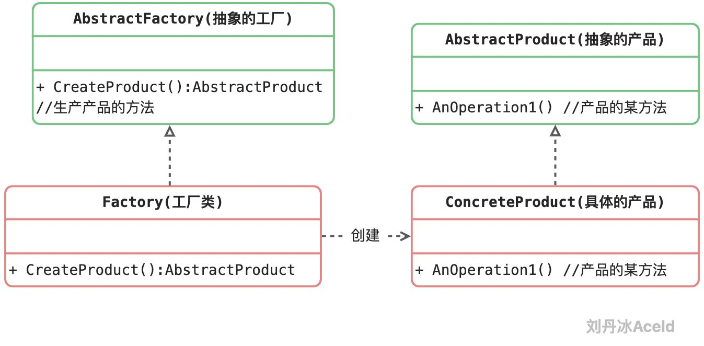
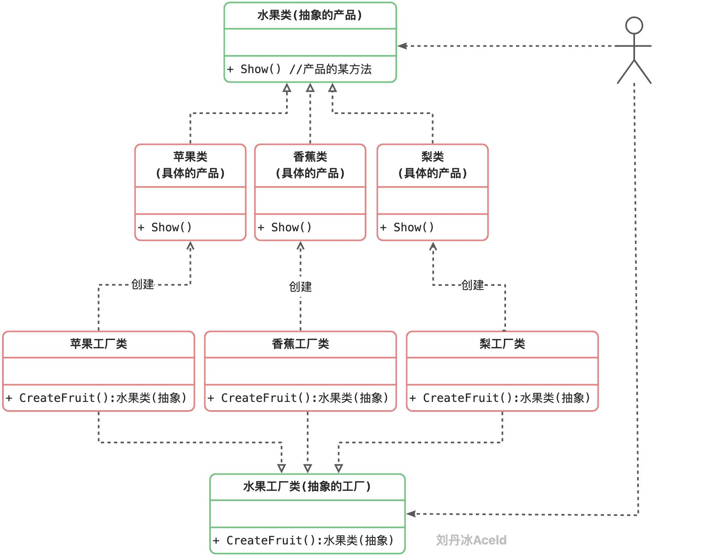

## 3.2.1 工厂方法模式中的角色和职责

**抽象工厂（Abstract Factory）角色**：工厂方法模式的核心，任何工厂类都必须实现这个接口。

**工厂（Concrete Factory）角色**：具体工厂类是抽象工厂的一个实现，负责实例化产品对象。

**抽象产品（Abstract Product）角色**：工厂方法模式所创建的所有对象的父类，它负责描述所有实例所共有的公共接口。	

**具体产品（Concrete Product）角色**：工厂方法模式所创建的具体实例对象。


```bash
简单工厂模式  + “开闭原则” =    工厂方法模式
```


工厂方法模式的标准类图如下：

其标准的设计模式类图如下：




## 3.2.2 工厂方法模式的实现

​       根据本章节的案例可以将标准的“工厂方法模式”类图改进如下：




实现的代码如下：

```go
package main

import "fmt"

// ======= 抽象层 =========

//水果类(抽象接口)
type Fruit interface {
	Show()	 //接口的某方法
}

//工厂类(抽象接口)
type AbstractFactory interface {
	CreateFruit() Fruit //生产水果类(抽象)的生产器方法
}

// ======= 基础类模块 =========
type Apple struct {
	Fruit  //为了易于理解显示继承(此行可以省略)
}

func (apple *Apple) Show() {
	fmt.Println("我是苹果")
}

type Banana struct {
	Fruit
}

func (banana *Banana) Show() {
	fmt.Println("我是香蕉")
}

type Pear struct {
	Fruit
}

func (pear *Pear) Show() {
	fmt.Println("我是梨")
}

// ========= 工厂模块  =========
//具体的苹果工厂
type AppleFactory struct {
	AbstractFactory
}

func (fac *AppleFactory) CreateFruit() Fruit {
	var fruit Fruit

	//生产一个具体的苹果
	fruit = new(Apple)

	return fruit
}

//具体的香蕉工厂
type BananaFactory struct {
	AbstractFactory
}

func (fac *BananaFactory) CreateFruit() Fruit {
	var fruit Fruit

	//生产一个具体的香蕉
	fruit = new(Banana)

	return fruit
}


//具体的梨工厂
type PearFactory struct {
	AbstractFactory
}

func (fac *PearFactory) CreateFruit() Fruit {
	var fruit Fruit

	//生产一个具体的梨
	fruit = new(Pear)

	return fruit
}

//======= 业务逻辑层 =======
func main() {
	/*
		本案例为了突出根据依赖倒转原则与面向接口编程特性。
	    一些变量的定义将使用显示类型声明方式
	*/

	//需求1：需要一个具体的苹果对象
	//1-先要一个具体的苹果工厂
	var appleFac AbstractFactory
	appleFac = new(AppleFactory)
	//2-生产相对应的具体水果
	var apple Fruit
	apple = appleFac.CreateFruit()

	apple.Show()


	//需求2：需要一个具体的香蕉对象
	//1-先要一个具体的香蕉工厂
	var bananaFac AbstractFactory
	bananaFac = new(BananaFactory)
	//2-生产相对应的具体水果
	var banana Fruit
	banana = bananaFac.CreateFruit()

	banana.Show()

	//需求3：需要一个具体的梨对象
	//1-先要一个具体的梨工厂
	var pearFac AbstractFactory
	pearFac = new(PearFactory)
	//2-生产相对应的具体水果
	var pear Fruit
	pear = pearFac.CreateFruit()

	pear.Show()

	//需求4：需要一个日本的苹果？
}
```

上述代码是通过面向抽象层开发，业务逻辑层的main()函数逻辑，依然是只与工厂耦合，且只与抽象的工厂和抽象的水果类耦合，这样就遵循了面向抽象层接口编程的原则。

那么抽象的工厂方法模式如何体现“开闭原则”的。接下来可以尝试在原有的代码上添加一种新产品的生产，如“日本苹果”，具体的代码如下：

```go
package main

import "fmt"

// ======= 抽象层 =========

//水果类(抽象接口)
type Fruit interface {
	Show()	 //接口的某方法
}

//工厂类(抽象接口)
type AbstractFactory interface {
	CreateFruit() Fruit //生产水果类(抽象)的生产器方法
}

// ======= 基础类模块 =========
type Apple struct {
	Fruit  //为了易于理解显示继承(此行可以省略)
}

func (apple *Apple) Show() {
	fmt.Println("我是苹果")
}

type Banana struct {
	Fruit
}

func (banana *Banana) Show() {
	fmt.Println("我是香蕉")
}

type Pear struct {
	Fruit
}

func (pear *Pear) Show() {
	fmt.Println("我是梨")
}

//(+) 新增一个"日本苹果"
type JapanApple struct {
	Fruit
}

func (jp *JapanApple) Show() {
	fmt.Println("我是日本苹果")
}

// ========= 工厂模块  =========
//具体的苹果工厂
type AppleFactory struct {
	AbstractFactory
}

func (fac *AppleFactory) CreateFruit() Fruit {
	var fruit Fruit

	//生产一个具体的苹果
	fruit = new(Apple)

	return fruit
}

//具体的香蕉工厂
type BananaFactory struct {
	AbstractFactory
}

func (fac *BananaFactory) CreateFruit() Fruit {
	var fruit Fruit

	//生产一个具体的香蕉
	fruit = new(Banana)

	return fruit
}


//具体的梨工厂
type PearFactory struct {
	AbstractFactory
}

func (fac *PearFactory) CreateFruit() Fruit {
	var fruit Fruit

	//生产一个具体的梨
	fruit = new(Pear)

	return fruit
}

//具体的日本工厂
type JapanAppleFactory struct {
	AbstractFactory
}

func (fac *JapanAppleFactory) CreateFruit() Fruit {
	var fruit Fruit

	//生产一个具体的日本苹果
	fruit = new(JapanApple)

	return fruit
}

// ========= 业务逻辑层  =========
func main() {
	/*
		本案例为了突出根据依赖倒转原则与面向接口编程特性。
	    一些变量的定义将使用显示类型声明方式
	*/

	//需求1：需要一个具体的苹果对象
	//1-先要一个具体的苹果工厂
	var appleFac AbstractFactory
	appleFac = new(AppleFactory)
	//2-生产相对应的具体水果
	var apple Fruit
	apple = appleFac.CreateFruit()

	apple.Show()


	//需求2：需要一个具体的香蕉对象
	//1-先要一个具体的香蕉工厂
	var bananaFac AbstractFactory
	bananaFac = new(BananaFactory)
	//2-生产相对应的具体水果
	var banana Fruit
	banana = bananaFac.CreateFruit()

	banana.Show()

	//需求3：需要一个具体的梨对象
	//1-先要一个具体的梨工厂
	var pearFac AbstractFactory
	pearFac = new(PearFactory)
	//2-生产相对应的具体水果
	var pear Fruit
	pear = pearFac.CreateFruit()

	pear.Show()

	//需求4：需要一个日本的苹果？
	//1-先要一个具体的日本评估工厂
	var japanAppleFac AbstractFactory
	japanAppleFac = new(JapanAppleFactory)
	//2-生产相对应的具体水果
	var japanApple Fruit
	japanApple = japanAppleFac.CreateFruit()

	japanApple.Show()
}
```

   可以看见，新增的基本类“日本苹果”，和“具体的工厂” 均没有改动之前的任何代码。完全符合开闭原则思想。新增的功能不会影响到之前的已有的系统稳定性。

## 3.2.3 工厂方法模式的优缺点

优点：

1. 不需要记住具体类名，甚至连具体参数都不用记忆。
2. 实现了对象创建和使用的分离。
3. 系统的可扩展性也就变得非常好，无需修改接口和原类。

4.对于新产品的创建，符合开闭原则。


缺点：

1. 增加系统中类的个数，复杂度和理解度增加。
2. 增加了系统的抽象性和理解难度。


适用场景：

1. 客户端不知道它所需要的对象的类。
2. 抽象工厂类通过其子类来指定创建哪个对象。