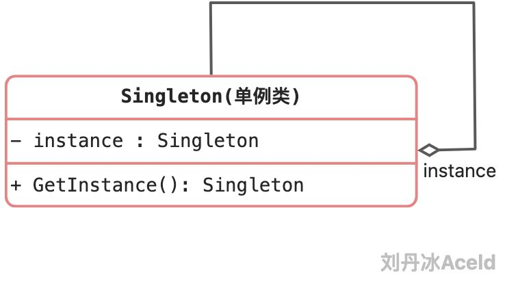

保证一个类、只有一个实例存在，同时提供能对该实例加以访问的全局访问方法。

是GoF给出单例模式的定义。


### 3.4.1 单例模式中的角色和职责

单例模式的标准类图如下：



**Singleton（单例）**：在单例类的内部实现只生成一个实例，同时它提供一个静态的getInstance()工厂方法，让客户可以访问它的唯一实例；为了防止在外部对其实例化，将其构造函数设计为私有；在单例类内部定义了一个Singleton类型的静态对象，作为外部共享的唯一实例。


单例模式要解决的问题是：

保证一个类永远只能有一个对象，且该对象的功能依然能被其他模块使用。


### 3.4.2 单例模式逻辑推演实现

```go
package main

import "fmt"

/*
三个要点：
		一是某个类只能有一个实例；
		二是它必须自行创建这个实例；
		三是它必须自行向整个系统提供这个实例。
*/

/*
	保证一个类永远只能有一个对象
*/


//1、保证这个类非公有化，外界不能通过这个类直接创建一个对象
//   那么这个类就应该变得非公有访问 类名称首字母要小写
type singelton struct {}

//2、但是还要有一个指针可以指向这个唯一对象，但是这个指针永远不能改变方向
//   Golang中没有常指针概念，所以只能通过将这个指针私有化不让外部模块访问
var instance *singelton = new(singelton)

//3、如果全部为私有化，那么外部模块将永远无法访问到这个类和对象，
//   所以需要对外提供一个方法来获取这个唯一实例对象
//   注意：这个方法是否可以定义为singelton的一个成员方法呢？
//       答案是不能，因为如果为成员方法就必须要先访问对象、再访问函数
//        但是类和对象目前都已经私有化，外界无法访问，所以这个方法一定是一个全局普通函数
func GetInstance() *singelton {
	return instance
}

func (s *singelton) SomeThing() {
	fmt.Println("单例对象的某方法")
}

func main() {
	s := GetInstance()
	s.SomeThing()
}
```

上面代码推演了一个单例的创建和逻辑过程，上述是单例模式中的一种，属于“饿汉式”。含义是，在初始化单例唯一指针的时候，就已经提前开辟好了一个对象，申请了内存。饿汉式的好处是，不会出现线程并发创建，导致多个单例的出现，但是缺点是如果这个单例对象在业务逻辑没有被使用，也会客观的创建一块内存对象。那么与之对应的模式叫“懒汉式”，代码如下：

```go
package main

import "fmt"

type singelton struct {}

var instance *singelton

func GetInstance() *singelton {
	//只有首次GetInstance()方法被调用，才会生成这个单例的实例
	if instance == nil {
		instance = new(singelton)
		return instance
	}

	//接下来的GetInstance直接返回已经申请的实例即可
	return instance
}

func (s *singelton) SomeThing() {
	fmt.Println("单例对象的某方法")
}

func main() {
	s := GetInstance()
	s.SomeThing()
}
```


### 3.4.3 线程安全的单例模式实现

上面的“懒汉式”实现是非线程安全的设计方式，也就是如果多个线程或者协程同时首次调用GetInstance()方法有概率导致多个实例被创建，则违背了单例的设计初衷。那么在上面的基础上进行修改，可以利用Sync.Mutex进行加锁，保证线程安全。这种线程安全的写法，有个最大的缺点就是每次调用该方法时都需要进行锁操作，在性能上相对不高效，具体的实现改进如下：

```go
package main

import (
	"fmt"
	"sync"
)

//定义锁
var lock sync.Mutex

type singelton struct {}

var instance *singelton

func GetInstance() *singelton {
	//为了线程安全，增加互斥
	lock.Lock()
	defer lock.Unlock()

	if instance == nil {
		return new(singelton)
	} else {
		return instance
	}
}

func (s *singelton) SomeThing() {
	fmt.Println("单例对象的某方法")
}


func main() {
	s := GetInstance()
	s.SomeThing()
}
```

上面代码虽然解决了线程安全，但是每次调用GetInstance()都要加锁会极大影响性能。所以接下来可以借助"sync/atomic"来进行内存的状态存留来做互斥。atomic就可以自动加载和设置标记，代码如下：

```go
package main

import (
	"fmt"
	"sync"
	"sync/atomic"
)

//标记
var initialized uint32
var lock sync.Mutex

type singelton struct {}

var instance *singelton

func GetInstance() *singelton {
	//如果标记为被设置，直接返回，不加锁
	if atomic.LoadUint32(&initialized) == 1 {
		return instance
	}

	//如果没有，则加锁申请
	lock.Lock()
	defer lock.Unlock()

	if initialized == 0 {
		instance = new(singelton)
		//设置标记位
		atomic.StoreUint32(&initialized, 1)
	}

	return instance
}

func (s *singelton) SomeThing() {
	fmt.Println("单例对象的某方法")
}

func main() {
	s := GetInstance()
	s.SomeThing()
}
```

上述的实现其实Golang有个方法已经帮助开发者实现完成，就是Once模块，来看下Once.Do()方法的源代码：

```go
func (o *Once) Do(f func()) {　　　//判断是否执行过该方法，如果执行过则不执行
    if atomic.LoadUint32(&o.done) == 1 {
        return
    }
    // Slow-path.
    o.m.Lock()
    defer o.m.Unlock()　　
    if o.done == 0 {
        defer atomic.StoreUint32(&o.done, 1)
        f()
    }
}
```

所以完全可以借助Once来实现单例模式的实现，优化的代码如下：

```go
package main

import (
	"fmt"
	"sync"
)

var once sync.Once

type singelton struct {}

var instance *singelton

func GetInstance() *singelton {

	once.Do(func(){
		instance = new(singelton)
	})

	return instance
}

func (s *singelton) SomeThing() {
	fmt.Println("单例对象的某方法")
}

func main() {
	s := GetInstance()
	s.SomeThing()
}
```


### 3.4.4 单例模式的优缺点

优点：

(1) 单例模式提供了对唯一实例的受控访问。

(2) 节约系统资源。由于在系统内存中只存在一个对象。    


缺点：

(1) 扩展略难。单例模式中没有抽象层。

(2) 单例类的职责过重。   


### 3.4.5 适用场景

(1) 系统只需要一个实例对象，如系统要求提供一个唯一的序列号生成器或资源管理器，或者需要考虑资源消耗太大而只允许创建一个对象。

(2) 客户调用类的单个实例只允许使用一个公共访问点，除了该公共访问点，不能通过其他途径访问该实例。